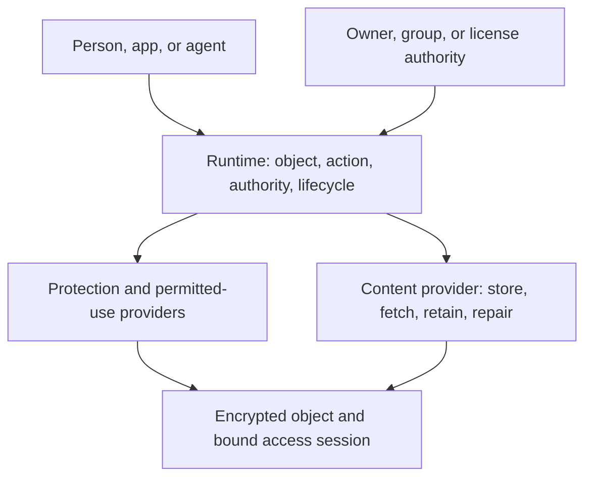

# Storage, ownership, and access

Status: target architecture and product contract. This document records the
storage direction. Product support requires implementation and acceptance.
Current verified behavior belongs in [state.md](../state.md), and open work
belongs in [TASKS.md](../TASKS.md). The
[implementation guide](OBJECT_PROTECTION_IMPLEMENTATION.md) defines the staged
provider boundary and acceptance tests.

## The product people should experience

ElastOS gives people familiar files and folders whose ownership and permissions
continue to work across devices, apps, groups, and services. A person can save a
document, share it, remove access, and recover it after losing a device. The
system handles encryption, location, and delivery.

User-controlled encrypted storage is the default for private objects. The owner
chooses where data is kept, how access is granted, and how recovery works.
Protected sharing grants specific uses; export and redistribution require
separate permission. Open publishing and permanent transfers remain deliberate
owner choices. Users should see ordinary actions such as Open, Share, Manage
access, Export, and Restore.

## One object model, four responsibilities

| Responsibility | Meaning | Owner of the behavior |
|---|---|---|
| Identity | The object, its publisher or workspace, and the exact revision being used | Existing object, identity, and signed-head contracts |
| Authority | Who may perform which action, under which terms | Runtime verifies authority from the object or workspace's accepted policy source |
| Protection | Encryption, key custody, and permitted use of readable content | Runtime-selected protection and execution providers |
| Availability | Storage, retrieval, retention, replication, and repair | Content and availability providers under the owner's storage agreement |

Runtime owns permission checks, provider selection, lifecycle, and audit.
Providers implement their protocols. Carrier handles Runtime-selected peer
communication. These roles follow [PRINCIPLES.md](../PRINCIPLES.md) and the
[content-provider contract](CONTENT_AVAILABILITY.md).

A provider that stores encrypted blocks gains storage responsibility, not
permission to read them. A valid grant establishes authority, not availability.
A content hash verifies bytes, not the latest ownership or permission state.

## What an object contains

An object has a stable identity and immutable revisions. A signed mutable head
selects the current revision. Names and folders resolve that identity; moving
an object between storage providers should preserve its identity and rights.
Moving it into another workspace is an authority change that needs an explicit
audience and history decision.

The object model binds its encrypted content, integrity information, protection
format, and authority reference. Private metadata includes names, thumbnails,
search indexes, and other revealing details. Keep that metadata encrypted or
inside an explicitly trusted execution boundary. Public distribution exposes
only the metadata needed for the selected publication policy.

Each object needs verifiable identity. External registration, an NFT, or a
separate on-chain DID is needed only when the selected workflow requires it.
Identity resolution and key updates remain behind existing identity contracts.
Private keys, custody shares, bearer access secrets, and provider routes belong
inside their private boundaries rather than public manifests.

## The everyday object journey

| Action | Required behavior |
|---|---|
| Create or import | Assign the owner or workspace, encrypt stored data, and establish a recoverable protection descriptor. Import authority permits the operation and its destination. |
| Save | Commit a revision safely. Preserve useful history, detect conflicting updates, and reuse unchanged encrypted blocks where safe. Report whether the revision is saved locally and whether promised remote retention is complete. |
| Open | Bind the exact revision, person, device, app or agent, and permitted action. Choose a consumer that can enforce the required protection policy. |
| Use another device | Authorise that device with separate credentials. Retrieve encrypted data and obtain access under the same object policy. Recovery and device enrolment are explicit authority operations. |
| Share | Grant rights to the object or workspace, including any duration and delegation limit. Shared references preserve the same policy. Guest links declare whether possession of the link grants access. |
| Work in a group | Use workspace membership and management rules. Define who can change them, how concurrent changes are ordered, and which history a new member receives. |
| Use an agent | Grant a bounded task and objects. Apply policy to outputs, memory, logs, embeddings, and external service use. Instructions inside a document carry content, not authority. |
| Remove access | Revoke affected grants and dependent sessions. Propagate the change, enforce freshness limits, and change keys for future data where required. |
| Recover | Restore content and its usable keys through an authorised device or recovery arrangement. Prove recovery after loss of the original device or provider. |
| Delete | Distinguish removal of a reference, trash, retained revision deletion, replica deletion requests, and retirement of keys. State the applicable retention limits. |

Apps, games, models, and media use the same content foundation. Installing or
executing an app is a separate permission from storing its signed package.
Permission to use a model through an approved inference provider is separate
from permission to export its weights. Marketplace licensing adds rights and
payment evidence to this object journey.

## Copying storage and granting a copy are different actions

ElastOS copies encrypted blocks for delivery, caching, backup, and repair under
the storage policy. These copies can retain the object's protection and
authority requirements. An independently usable export, redistribution to a
new audience, or release of reusable decryption material is a separate action.

An owner's private files remain under that owner's control. Protected sharing
can grant View or Use while retaining separate rights for Edit, Export, and
Manage access. These are product meanings, not a requirement to add a separate
public API or capability token type for every button.

Protected use requires control over readable content from decryption through
processing to output. An app with permission to read a protected source and
write an unrestricted destination can reproduce the source without invoking a
Copy command. Such a combination requires an authorised export or a controlled
execution context whose outputs remain subject to the source policy.

For the first protected-use path, use an approved viewer with narrow outputs.
Clipboard, printing, screen capture APIs, accessibility integrations, previews,
temporary files, crash dumps, and network effects need an explicit treatment
appropriate to that path. Preserve accessible use through approved channels.
General editing and AI processing require a separate demonstration that data
and derived results stay within the permitted destinations.

The trusted boundary includes every component that receives readable content,
including the decoder, viewer, model service, and relevant host environment.
Key confinement and protected output require separate evidence. Ordinary
process isolation protects against some apps; a
recipient who controls the host OS presents a stronger threat. Policies that
require protection against host tampering need a supported execution boundary
and evidence for it. The recipient can choose a compatible environment; a
provider's unsupported claim is insufficient to satisfy the policy.

Runtime should prevent unauthorised copies inside the enforced boundary. The
limit is information that has already escaped that boundary or was deliberately
exported. Removing a grant cannot recover such information, including external
recordings. Ordinary export paths still require full permission enforcement.

## Availability and revocation

Availability is specific to an operation. Data, keys, a permitted execution
provider, and sufficiently current authority may be available locally, through
nearby peers, or through remote services. Runtime hides routing details while
reporting useful states: Ready, Retrieving content, Permission check
unavailable, Access removed, or Required protection unavailable.

The owner's own files remain usable when their local content, keys, and
authority suffice. A recipient's saved permission proves a grant at a point in
time. It cannot reveal a later revocation that has not reached that recipient.
Shared access therefore needs a policy for freshness: check authority for each
new session or permit bounded use before another check. Renewal and active
operations obey that policy. Unavailable evidence remains distinguishable from
an authoritative denial.

For revocable sharing, the required sequence is:

1. The authorised owner or group manager records the permission change through
   the accepted authority mechanism.
2. Runtime identifies grants and sessions that depend on that permission,
   including delegated app, device, and agent access.
3. Reachable enforcement points reject new affected operations and settle
   active sessions at the defined cancellation boundary.
4. Other enforcement points stop at the agreed refresh deadline if they cannot
   establish current permission. Clock changes, restarts, and replayed state
   must not silently extend that deadline.
5. Future protected revisions use fresh keys when former recipients retain
   material that would otherwise decrypt those revisions. Wrapping the same
   old data key differently does not remove a previously disclosed key.
6. Audit records distinguish local completion, remote acknowledgement, and
   outstanding expiry or cleanup. The UI reports the actual result.

This gives a defined bound on continued controlled use under the supported
execution and time assumptions. It does not promise instant global revocation
across unreachable systems. Queued group edits stay protected by the workspace
policy and enter shared history only after current write authority is checked.

## Groups, devices, and recovery

A workspace can belong to a group with an explicit management policy. Its
continuity should survive the departure of the person who created it. Joining
and leaving affect membership, devices, delegated grants, and future keys.
Define whether new members receive old revisions; possession of an old group
key must not grant access to future protected revisions after removal.

Each device has revocable credentials and the minimum key material required for
its authorised work. Keep a recovery root separate from routine device use.
Loss of a device is different from compromise of a root or recovery authority:
the latter can require wider credential and data-key changes. Identity recovery
alone is insufficient when object keys or encrypted data are missing.

Recovery can use the owner's other devices or explicitly selected people or
services. Explain which parties or threshold can restore access, what they
could recover together, and what remains possible if they disappear. Test the
chosen arrangement before describing the data as recoverable.

## Retention, cost, and portability

A storage agreement states capacity, retention, failure tolerance, repair
responsibility, and cost. Local devices, community providers, and paid services
can implement it through the same content interface. Availability receipts and
storage proofs establish only the facts their verified mechanisms cover.
Reliable retention also needs monitoring, repair capacity, and a way to fund it.

Start with explicit replication and retrieval checks. Introduce erasure coding
or stronger storage proofs when measured cost, scale, or trust requirements
justify them. Test failures across independent failure domains, including
corruption and loss during repair. Synchronisation aligns state; backups also
preserve recoverable history after mistakes or compromise.

Provider migration must preserve encrypted content, required metadata, keys,
rights, and identity continuity. Keep export and recovery formats documented.
Deletion follows retention rules across replicas and backups; key retirement
only makes retained ciphertext unusable when every usable copy of the relevant
key is retired. Public encrypted records and long-lived metadata require a
privacy and cryptographic-lifetime decision before publication.

## dKMS, dDRM, and blockchain

dKMS supplies a key-management mechanism. dDRM supplies a rights-and-use model.
Neither is the general definition of storage. Their current work should remain
usable behind Runtime-owned contracts while other mechanisms can replace or
supplement the responsibilities they actually implement.

A ledger can supply shared rights history, transfer ordering, or payment
evidence where a workflow requires it. Private saving and ordinary sharing
have a path based on their own accepted authority. This architecture leaves the
future roles of EID, other chains, and ELA open to explicit decisions rather
than making them prerequisites for every file operation. Governance of shared
infrastructure does not itself grant access to personal plaintext.

Revocable sharing, subscriptions, and lasting purchases have distinct terms.
A seller's retained powers must match the terms accepted by the buyer. An
unconditional creator recall would contradict a sale of lasting rights.

## Delivery and references

Implement the smallest compatible boundary first, retain current dKMS checks,
and prove one complete journey before adding more backends. The
[implementation guide](OBJECT_PROTECTION_IMPLEMENTATION.md) gives the source
entry points, staged extraction, migration rules, and failure tests.

Useful external references cover separate parts of this design:

- [Peergos sharing](https://book.peergos.org/features/sharing.html): capabilities
  and lazy re-encryption for shared files. Study the mechanism and its limits;
  it does not prove this Runtime's enforcement or integration.
- [MLS](https://www.rfc-editor.org/rfc/rfc9420.html): asynchronous group key
  establishment and membership changes. Application identity, history,
  storage, and revocation policy still need an explicit design.
- [Protected Media Path](https://learn.microsoft.com/en-us/windows/win32/medfound/protected-media-path):
  a concrete example of separating application controls from trusted content
  processing and approved outputs. Its platform trust choices are an example,
  not an adopted ElastOS dependency.

Reuse reviewed primitives and existing boundaries. Any port needs compatibility,
license, maintenance, and security review. Research proposals, including witness
encryption and new post-quantum ledgers, remain candidates until their relevant
guarantees are demonstrated.
