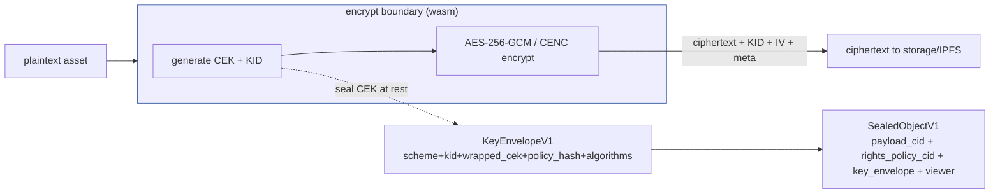
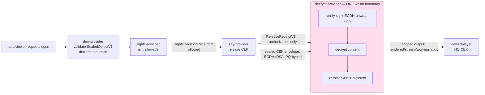

# dDRM Security Model — the clear picture

**Audience:** Irzhy, Anders, anyone touching the dDRM chain.
**Status:** Boundaries + contracts proven and tested. The live key-transport rail
is the one open item (awaiting Anders; see §8).
**Date:** 2026-06-08
**Read this top-to-bottom and you'll understand the whole trust model.**
**Grounded in:** `elastos-common/src/protected_content.rs`,
`capsules/{drm,rights,key,decrypt}-provider/`, PC2 `ddrm-decrypt`/`wasm-renderer`.
Cross-refs: `DDRM_DECRYPT_RAIL.md`, `PC2_PLAYER_ALIGNMENT.md`, `DDRM_STATUS.md`.

## 1. One-paragraph mental model

dDRM is a **fail-closed, capability-gated provider chain** that lets an app/viewer
*see* protected content while never letting it *hold* the keys. Authority is passed
between stages as signed **receipts**, not as keys. The Content Encryption Key
(CEK) is the only true secret; it travels **sealed** and is unwrapped, used, and
zeroized **inside one boundary** (decrypt-provider). The trusted core does not need
to know dDRM exists — it is entirely a capsule-tier concern.

## 2. The two invariants (binding rules)

These come from Irzhy and are adopted as the governing rules:

1. **Encrypt:** the CEK and KID are generated **inside** the wasm boundary; only
   ciphertext + non-secret relatives (KID, IV, metadata) leave.
2. **Decrypt:** the CEK is **never** passed in plaintext to any other component.
   CEK recovery **and** content decryption happen **colocated in one wasm
   boundary**, with zeroization at the end.

Everything below exists to make these two true by construction.

## 3. Actors & boundaries

| Boundary | Capsule | Holds (authority) | Must never expose |
|---|---|---|---|
| `drm/open` front door | `drm-provider` | sequence orchestration | keys, chain/wallet authority |
| Rights | `rights-provider` | policy/chain access eval | chain RPC, wallet RPC, contracts |
| Key release | `key-provider` | dKMS/threshold creds, kid→key | raw CEK, kms_node_credentials |
| Decrypt/render | `decrypt-provider` | decrypt+render backend, **session keypair** | raw_cek, raw_plaintext, fs |
| Player | `elacity-player` / `ddrm-viewer` (viewer) | rendering only | — (never receives the CEK) |

Each provider advertises a `blocked_authority` list (`raw_cek`, `raw_plaintext`,
`filesystem`, `kms_node_credentials`, `chain_rpc`, `wallet_rpc`,
`provider_credentials`). The viewer only ever receives one of three output kinds:
`rendered`, `stream`, `working_copy` (`protected_content.rs:17`).

## 4. Encrypt path (creator/packaging)

Invariant #1 holds: CEK/KID are born inside the wasm boundary; only ciphertext +
non-secret relatives leave. The CEK is sealed at rest as `KeyEnvelopeV1.wrapped_cek`
inside `SealedObjectV1`. *(PC2 precedent: `wasm-renderer` `encrypt_only`.)*

## 5. Decrypt path (consumption)

Step by step:
1. **drm-provider** validates the `SealedObjectV1` and declares the canonical
   sequence `content → rights → key → decrypt → render → release_receipt → audit`.
2. **rights-provider** evaluates policy → `RightsDecisionReceiptV1 { allowed, … }`
   bound to principal/session/content/right.
3. **key-provider** verifies that receipt, then releases the CEK — but the
   `ReleaseReceiptV1` it emits is **authorization only** (no key material; see
   `protected_content.rs` — the struct has no CEK field).
4. **decrypt-provider** receives the session request (+ the sealed CEK via the
   rail, §6), **unwraps the CEK in-boundary**, decrypts, **zeroizes**, and returns
   **scoped output**. Invariant #2 holds.
5. **player** receives `rendered`/`stream`/`working_copy` — never the CEK.

## 6. Inter-stage CEK transport — the rail (Irzhy's question, resolved by design)

**Problem (today):** `ReleaseReceiptV1` carries no key material and
`DecryptSessionRequestV1` only references that receipt — so there is no defined
channel for the CEK to reach decrypt-provider. This is the one gap.

**Decision:** keep key-provider and decrypt-provider as **separate boxes** (do not
merge — that would widen the authority blast radius), and **secure the channel**:

- decrypt-provider mints a **per-session keypair** and publishes its session
  public key (PC2 precedent: `ddrm-decrypt/session.rs` `create_session`).
- the key authority **seals the CEK to that session pubkey** (KEM/ECDH) and
  **signs** the sealed envelope (DSA).
- decrypt-provider **verifies the signature → unwraps → decrypts → zeroizes**,
  all in one boundary.
- **Strongest variant:** the dKMS seals **directly** to the decrypt session key, so
  key-provider is a pure broker and never holds a raw CEK.

This gives the "one box" benefit Irzhy wants (CEK recovery + decrypt colocated,
never crossing a wire in plaintext) **without** collapsing the authority
separation. PC2 runs exactly this shape today.

**Crypto reconciliation (important):** PC2's envelope is *classical* P-256 ECDH +
ECDSA (vendored as a tested spec at `decrypt-provider/src/envelope.rs`). Runtime's
profile mandates **PQ-hybrid** — so the shipped rail must use the runtime KEM/sig
(§7), keeping PC2's envelope *structure + discipline* but upgrading the crypto.

## 7. Crypto profile (from `protected_content.rs`)

Post-quantum hybrid by default; weaker is rejected at validation:

| Property | Value |
|---|---|
| Cipher | `aes-256-gcm` or `chacha20-poly1305` (aes-128-gcm rejected) |
| KEM | hybrid **`x25519 + ml-kem-768`** required (classical-only rejected) |
| Signatures | `ed25519` + `ml-dsa-65` (PQ sig required) |
| Key sharing | `shamir-t-of-n` threshold |
| Envelope scheme | `elastos-pq-hybrid-threshold-v0` |

**Wasm viability (de-risked Day 15):** the PQ halves build inside the wasm
boundary — `ml-kem 0.2.3` (ML-KEM-768) and `ml-dsa 0.0.4` (ML-DSA-65) both compile
to `wasm32-wasip1` under the pinned `1.89.0` toolchain (classical `x25519-dalek` /
`aes-gcm` already wasm-proven in tree). So sealing + unwrap can live in
decrypt-provider's wasm boundary without surprise. Caveat: `ml-dsa` is `0.0.x`
(pre-1.0) — pin exact versions and keep the sig behind the envelope abstraction.
Evidence + go/no-go: `DDRM_STATUS.md` § PQ-hybrid-in-wasm viability.

## 8. Threat model (what an attacker reaches at each boundary)

| Attacker position | Can reach | Cannot reach (by design) |
|---|---|---|
| Compromised app/viewer/player | scoped output (rendered pixels / stream / working copy) | CEK, IV, raw plaintext, fs, chain/wallet RPC |
| On the wire between providers | sealed+signed envelope, authorization receipts | plaintext CEK (sealed); forged receipts (signed/validated) |
| Compromised rights-provider | can deny/allow policy decisions | the CEK (never held), key release without a valid receipt chain |
| Compromised key-provider (broker variant) | sealed envelopes, kid metadata | raw CEK (dKMS seals direct to decrypt session key) |
| Compromised decrypt-provider | raw CEK + plaintext **transiently**, in-boundary, zeroized | persistence (zeroized); other principals' sessions (per-session keys) |

The blast radius is deliberately smallest at the highest-authority point: the raw
CEK exists in plaintext **only** inside decrypt-provider, **only** for the duration
of a decrypt, and is zeroized.

## 9. Invariant → enforcement (every claim cites a passing test)

| Rule | Enforced by | Test (all green) |
|---|---|---|
| CEK never in the sealed envelope cleartext | `envelope.rs` | `envelope::tests::sealed_envelope_does_not_contain_raw_cek` |
| CEK recovery fails closed on wrong session key | `envelope.rs` | `envelope::tests::wrong_session_key_fails_closed` |
| Envelope unwrap is byte-exact (v2/v3) | `envelope.rs` | `round_trip_v3_random_iv`, `round_trip_v2_fixed_iv` |
| Recovered material held in `Zeroizing` | `envelope.rs` / `cenc` | type-level (`Zeroizing<Vec<u8>>` return types) |
| Decrypt recovers plaintext; bad CEK fails closed | `cenc` + `main.rs` | `decrypt_session_segment_recovers_plaintext`, `..._fails_closed_on_bad_cek` |
| Scoped response is metadata-only (both players) | `main.rs` | `media_player_scoped_response_is_metadata_only`, `non_media_player_..._metadata_only` |
| No CEK/plaintext reaches the player boundary | `main.rs` | `scoped_session_response_leaks_neither_cek_nor_plaintext`, `media_segment_decrypt_keeps_cek_and_plaintext_off_the_player_boundary` |
| key-provider requires an `allowed` rights receipt bound to principal/session/object/action | `key-provider` | `release_rejects_denied_rights_receipt`, `release_rejects_rights_receipt_bound_to_other_principal`, `..._for_other_object`, `..._for_other_action` |
| Object IDs are opaque (path-traversal rejected) | `decrypt-provider` | `open_session_rejects_path_like_object_ids`, `..._dot_segment_object_ids` |
| Apps cannot request raw output | `decrypt-provider` | `open_session_rejects_unsupported_output_kind` |
| Whole chain fails closed until backend exists | all providers | `*_fails_closed_until_backend_exists`, `status_advertises_blocked_raw_authority` |

**Encrypt side (invariant #1), in `encrypt-provider`:**

| Rule | Enforced by | Test |
|---|---|---|
| Caller cannot supply a CEK (key minted in-boundary) | `encrypt-provider` | `seal_request_cannot_carry_a_cek_on_the_wire` (green) |
| Sealed output carries only ciphertext + wrapped CEK (no raw CEK) | `encrypt-provider` | `sealed_output_never_carries_raw_cek` (green) |
| Raw CEK zeroized after use | `encrypt-provider` | `cek_is_zeroized_after_use` (green) |
| Boundary blocks raw_cek + plaintext authority | `encrypt-provider` | `status_blocks_raw_cek_and_plaintext_authority` (green) |
| **CEK+KID generated in-boundary (no host)** | `encrypt-provider` | `cek_and_kid_generated_inside_boundary` (green, Day 19) |
| Engine emits only ciphertext + KID + IVs (no CEK) | `encrypt-provider` | `seal_engine_emits_no_key_material` (green, Day 19) |

Full analysis + the (now-closed) PC2 host-keygen gap + reconciliation plan:
`DDRM_ENCRYPT_INVARIANT.md`.

**PQ-hybrid rail + full data path (de-risked pre-rail, feature-gated):**

| Rule | Enforced by | Test |
|---|---|---|
| PQ-hybrid (x25519+ml-kem-768) unwrap recovers CEK in `Zeroizing` | `pq_envelope.rs` | `pq_hybrid_round_trip_recovers_cek` (`--features pq-envelope`) |
| Wrong session secret / tampered blob / bad signature fail closed | `pq_envelope.rs` | `wrong_session_secret_fails_closed`, `tampered_signature_fails_closed` |
| CEK never in the sealed PQ envelope cleartext | `pq_envelope.rs` | `sealed_envelope_has_no_raw_cek` |
| **Full PQ path: sealed CEK → unwrap → cenc decrypt → scoped output, CEK off boundary** | `pq_envelope.rs` | `pq_sealed_segment_decrypts_end_to_end_and_keeps_cek_off_the_boundary` (`--features pq-rail-prep`) |
| Full PQ path fails closed on wrong session | `pq_envelope.rs` | `pq_sealed_segment_wrong_session_fails_closed` |

Run the unified proof: `scripts/ddrm-chain-smoke.sh` (all four chain providers
under wasmtime).

## 10. The open items

1. **The live decrypt rail wiring** (§6): provisioning the decrypt session key +
   having the key authority seal the CEK to it with the **PQ-hybrid**
   KEM/signature, then composing the unwrap + `cenc::process` inside
   decrypt-provider. Pending Anders' confirmation of (a) Option A and (b)
   dKMS-direct-seal vs key-provider re-seal, and (c) sig scheme during transition
   (ml-dsa-65 vs hybrid). **De-risked:** the byte contract, both chain ends, the
   PQ-hybrid envelope, AND the full composed path (`decrypt_pq_sealed_segment`,
   feature `pq-rail-prep`) are all pinned + wasm-built, so this is now a small
   transport shim once confirmed.
2. **The full `seal` on the encrypt side** (invariant #1): the in-boundary CEK+KID
   generation gap is **closed** (Day 19 — `cek_and_kid_generated_inside_boundary`
   green); what remains is sealing the minted CEK via the PQ-hybrid envelope + fMP4
   packaging + ciphertext availability, which shares the decrypt rail dependency.
   See `DDRM_ENCRYPT_INVARIANT.md`.

## 11. Glossary

- **CEK** — Content Encryption Key (the per-asset secret).
- **KID** — Key ID (non-secret identifier of which key).
- **Sealing** — wrapping the CEK to a recipient's public key (KEM/ECDH) so only
  that recipient can unwrap it.
- **Receipt** — a signed authorization proof passed between stages (carries no
  key material).
- **Scoped output** — `rendered` / `stream` / `working_copy`; what the player gets.
