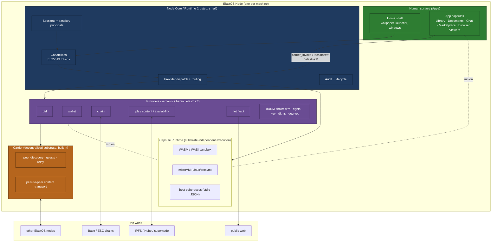
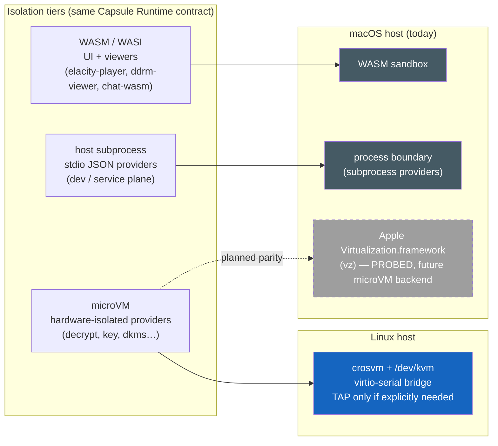
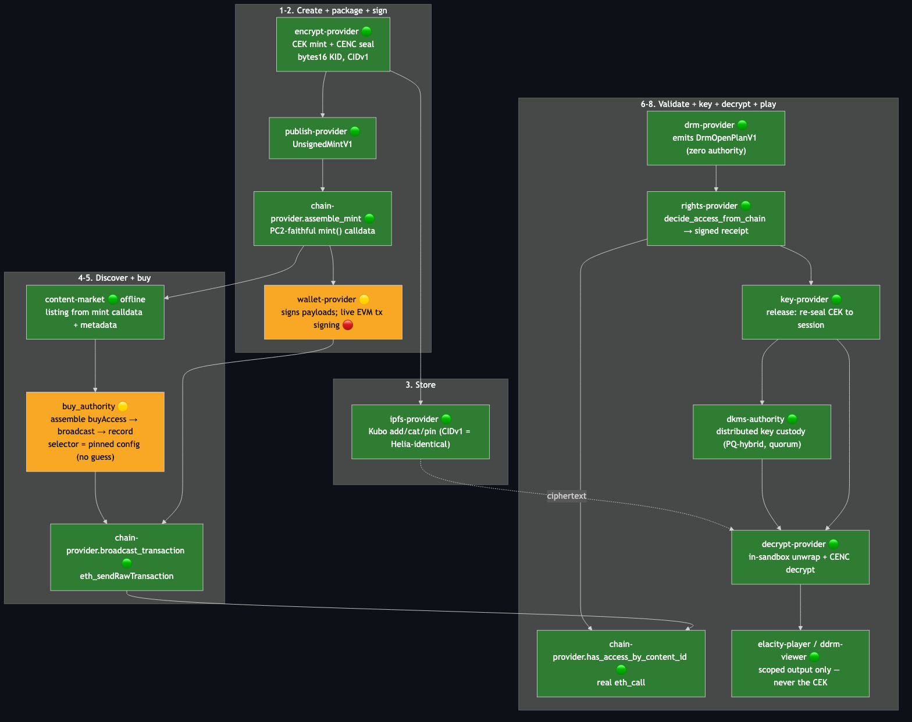
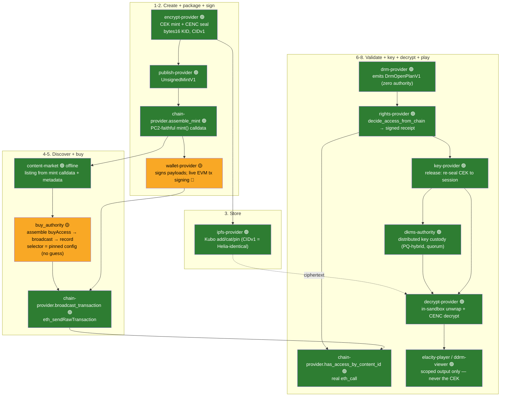
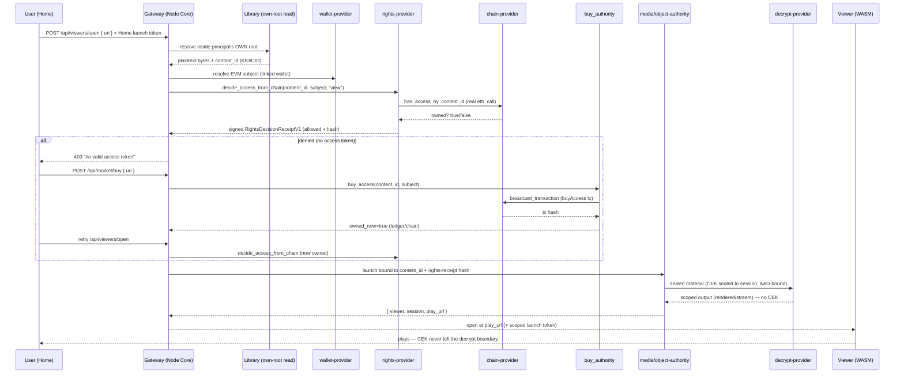

# ElastOS Runtime — Visual Architecture Map

> **Audience:** the team. A birds-eye, digestible picture of the whole ElastOS node,
> then a granular zoom into the dDRM system, how the pieces talk, and how it all
> conforms to the runtime principles. Diagrams are Mermaid (render on GitHub / most
> Markdown viewers).
>
> **Companion docs:** [`PRINCIPLES.md`](../../PRINCIPLES.md) ·
> [`CARRIER.md`](../CARRIER.md) · [`CAPSULE_MODEL.md`](../CAPSULE_MODEL.md) ·
> the dense, line-referenced [`SYSTEM_ARCHITECTURE_MAP.md`](SYSTEM_ARCHITECTURE_MAP.md)
> and [`CONVERGENCE_AUDIT.md`](CONVERGENCE_AUDIT.md). This file is the *visual index* on
> top of those.

---

## 0. The one-paragraph mental model

ElastOS is a **capability-secure node**: a small trusted **Node Core** hosts everything,
**capsules** are sandboxed software roles (apps, viewers, providers) that never hold
ambient authority, and they reach each other and the world through one
**Carrier-shaped capability plane** — not raw sockets or host routes. Objects are named
by **stable identity** (`localhost://…`, `elastos://…`, CIDs), not transport. The dDRM
vertical is the flagship: an owned video/asset travels creator → chain → IPFS → buyer,
and only a capability-checked **provider chain** (`drm → rights → key/dKMS → decrypt`)
can turn ciphertext into pixels — the key never reaches the app.

---

## 1. Birds-eye: the whole ElastOS node


<details>
<summary>Mermaid source (edit here, then re-render — see "Regenerating the images" at the bottom)</summary>



</details>

**Reading it:** an App never talks to the chain, IPFS, or another capsule directly. It
emits *intent* (a `carrier_invoke` call or a `localhost://` / `elastos://` URI). The
Node Core checks the capability, routes to the right **provider**, and the provider uses
**Carrier** (peer/content) or a backend (chain RPC, IPFS) underneath. Moving a target
from same-process to LAN to a remote peer changes **none** of the capsule code.

---

## 2. The four planes (keep these distinct)

| Plane | What it is | In code |
|---|---|---|
| **Node Core / Runtime** | trusted control plane: capabilities, sessions, dispatch, audit, lifecycle | `elastos-server`, `elastos-runtime`, `elastos-identity` |
| **Carrier** | decentralized peer + content substrate (iroh today; Boson/Carrier-Native later) | `elastos-server/src/carrier.rs` |
| **Capsule Runtime** | substrate-independent execution surface (one capsule, many backends) | `elastos-guest`, `elastos-compute` (WASM), `elastos-crosvm` (microVM) |
| **Digital Capsule** | the portable, signed software/content package | `capsules/*` |

The golden rule (Principle 4 + `CAPSULE_MODEL.md`): **capsules know only Carrier-shaped
capability calls.** Loopback HTTP, stdio, `postMessage`, vsock, in-process calls — all of
those are *host adapters below* the capsule contract, not the contract itself.

---

## 3. Capsule isolation substrates — and the macOS-vz vs Linux-crosvm story

A capsule's *behavior, wire format, and capability semantics are identical across
substrates* (Principle: "capsule behavior should converge across substrates"). Only the
**host isolation primitive** differs. There are three tiers today:


<details>
<summary>Mermaid source</summary>



</details>

### Same function, different primitive

| Concern | **Linux** | **macOS (today)** | Why it's still the same contract |
|---|---|---|---|
| Hardware-isolated provider | `crosvm` microVM on `/dev/kvm` | **not available** — `crosvm::is_supported()` is `false`, microVM launch **fails closed** (Principle 11) | the runtime never silently downgrades; it picks WASM/subprocess explicitly |
| dDRM providers (decrypt, chain, rights, media-authority) | microVM capsules over the runtime provider rail | spawned as **host subprocesses over stdio JSON** (a legitimate host adapter) | the *contract* — typed request → typed receipt, CEK never escapes — is identical |
| UI / viewers | WASM | WASM | identical |
| Guest networking | Linux TAP (host-only), opt-in | n/a (subprocess uses no guest NIC) | Carrier-only-by-default holds on both |
| Future | crosvm stays canonical | **`vz`** (Apple Virtualization.framework) becomes the macOS microVM backend — same role as crosvm | `scripts/dev/mac-vz-feature-check` is the feasibility probe |

**Bottom line:** Linux gives the strongest isolation (microVM) *now*; macOS reaches the
same security invariants through the WASM sandbox + a process boundary *today*, and the
`vz` work is the path to microVM parity. Because the Capsule Runtime contract is
substrate-independent, **the dDRM decrypt invariant (CEK stays in the sandbox) holds on
both** — the box around the key just has a different wall material.

> **Honest conformance note (worth team awareness):** on macOS the Home gateway currently
> *spawns provider binaries directly* (`chain-provider`, `rights-provider`,
> `ddrm-media-authority`, `decrypt-provider`) rather than routing through the full
> microVM provider rail. Per `CARRIER.md` this is an allowed host adapter, and the typed
> request/receipt contract is preserved — but the **production target** is provider
> dispatch through the capability plane (Linux microVM). This is a transport gap, not a
> contract gap.

---

## 4. The dDRM system — full pipeline, color-coded by reality

This is the whole "own a video/asset and play it" journey, capsule by capsule. 🟢 done ·
🟡 partial / orchestration-wired · 🔴 gap.



<details>
<summary>Mermaid source</summary>



</details>

**The crown-jewel invariant:** the CEK only ever exists in clear *inside* the decrypt
sandbox; the app/viewer receives `rendered`, `stream`, or `working_copy` output — never
`raw_cek`, `raw_plaintext`, wallet RPC, or chain RPC. Both `key-provider` and
`decrypt-provider` advertise a `blocked_authority` list enforcing this.

### Where the two real gaps are
- 🔴 **Live EVM tx signing** — the *one* seam shared by live buy and live mint broadcast
  (no EIP-1559 signer in-repo yet). `chain` mode broadcasts an externally-signed tx today.
- 🟡 **buyAccess ABI** — the real Elacity `AuthorityGateway.buyAccess` signature isn't
  in-repo/public, so it's an operator-pinned config selector (never guessed). Everything
  around it (assemble → broadcast → record → re-check) is wired and proven offline.

---

## 5. How an owned asset opens (and the buy loop)


<details>
<summary>Mermaid source</summary>



</details>

The Home shell does the dashed `denied → buy → retry` block **automatically**: a click on
a not-yet-owned asset buys access and re-opens. Each call **re-authorizes** from scratch
(re-resolves object, subject, rights) — the UI is an orchestration request, never an
authority (Principle 16).

---

## 6. dDRM capsule inventory

| Capsule / crate | Role | Tier | Status |
|---|---|---|---|
| `encrypt-provider` | CEK mint + CENC seal → `SealedObjectV1` | microVM/subproc | 🟢 |
| `publish-provider` | `UnsignedMintV1` (mint intent) | microVM/subproc | 🟢 |
| `chain-provider` | typed EVM reads (`has_access`), `assemble_mint`, `broadcast_transaction` | microVM/subproc | 🟢 |
| `content-market` | listing from mint calldata + metadata | microVM/subproc | 🟢 offline |
| `wallet-provider` | accounts, proofs, payload signing | microVM/subproc | 🟡 (no EVM tx signer) |
| `buy_authority` *(gateway module)* | buyAccess orchestration: assemble → broadcast → record → re-check | Node Core | 🟡 |
| `drm-provider` | emits `DrmOpenPlanV1` (zero authority) | microVM/subproc | 🟢 |
| `rights-provider` | `decide_access_from_chain` → signed receipt | microVM/subproc | 🟢 |
| `key-provider` | `release`: re-seal CEK to decrypt session | microVM/subproc | 🟢 |
| `dkms-authority` | distributed key custody (PQ-hybrid, quorum, authenticated channel) | microVM/subproc | 🟢 built |
| `decrypt-provider` | in-sandbox unwrap + CENC decrypt, multi-segment + threshold rails | **microVM** | 🟢 |
| `ddrm-media` *(crate)* | shared dDRM media prep / seal | lib | 🟢 |
| `ddrm-envelope` *(crate)* | shared crypto envelope + transcript AAD binding | lib | 🟢 |
| `ddrm-plan-runner` *(runtime core)* | walks `DrmOpenPlanV1`, threads binding edges, fail-closed | Node Core | 🟢 |
| `elacity-player` | media viewer (MSE) | WASM | 🟢 playing |
| `ddrm-viewer` | non-media viewer (docs/images/3D) | WASM | 🟢 |
| `ipfs-provider` / `availability-provider` | content add/cat/pin + availability | microVM/subproc | 🟢 / 🟡 |

---

## 7. Principle conformance — the dDRM + buy slice

| Principle | How the current wiring conforms |
|---|---|
| **3. No ambient authority** | buy + open require a Home launch token; object resolved inside the principal's *own* root; chain modes fail closed with no linked wallet |
| **4. Carrier plane** | capsules speak typed request/receipt; macOS subprocess/stdio is a host adapter *below* the contract (production = provider rail) |
| **5. Small trusted core** | the *decision* lives in `rights-provider`, the *broadcast* in `chain-provider`, the *key* in `key-provider`/`dkms` — gateway only orchestrates |
| **10. One canonical path** | buy reuses the *exact* object-resolve + subject + rights path as open, so a purchase is keyed on the identifier the gate reads back |
| **11. Fail closed, then explain** | denied → 403; no wallet → 403; live buy w/o signer → 409 + the unsigned tx; missing binaries → explicit error |
| **15. Trust travels with signed content** | rights-receipt hash welded into the decrypt AAD; `content_id` = bytes16 KID; buyAccess selector pinned (never guessed) |
| **16. UI is not authority** | Home `denied → buy → retry` is an orchestration request; every call re-authorizes from scratch |

### vs PC2 — where we're superior
- PC2 buys via the **web app** (`app.js` `handleBuy`) holding wallet/contract logic.
  Ours puts buy orchestration in the **runtime control plane** with re-authorization on
  every call — *UI is not authority* (Principle 16).
- PC2's key delivery depends on **Lit Protocol** (P-256/ECDSA TEE). Ours is an
  ElastOS-native **PQ-hybrid threshold dKMS**; Lit is reduced to one *optional backend
  adapter* behind `key-provider`, not the contract.
- Same on-chain semantics preserved (`contentId = KID`, `subject = wallet`,
  `hasAccessByContentId` readback) so we stay interoperable with the live Base contracts.

---

## 8. Where we are, one line each

- **Decrypt boundary** (the hardest, most security-critical) — 🟢 done, transcript-bound,
  in-sandbox key, multi-segment + threshold + quorum rails.
- **Rights gate** — 🟢 real `chain-provider` ownership read behind the Home open.
- **Buy flow** — 🟡 orchestration wired; offline `denied → buy → owned → plays` proven.
- **Creator/mint** — 🟢 calldata assembled; 🔴 live broadcast waits on tx signing.
- **The single unlock** — 🔴 **live EVM tx signing** turns both buy and mint fully live.

---

## Regenerating the images

The PNGs in [`diagrams/`](diagrams/) are rendered from the `.mmd` sources next to them
(the same Mermaid embedded above). After editing a diagram, re-render:

```bash
cd docs/convergence/diagrams
for f in 01-birdseye 02-substrates 03-ddrm-pipeline 04-open-buy-sequence; do
  npx -y @mermaid-js/mermaid-cli@latest -i "$f.mmd" -o "$f.png" -t dark -b "#0d1117" -s 2 -p puppeteer.json
done
```

(GitHub and Cursor's Markdown preview also render the inline ```mermaid``` blocks
natively — the PNGs are for viewers/exports that don't.)

---

*Living document. Update as slices land, the `vz` macOS backend matures, and the live
chain / dKMS deployment / Lit adapter come online. For line-referenced detail see
[`SYSTEM_ARCHITECTURE_MAP.md`](SYSTEM_ARCHITECTURE_MAP.md) and
[`CONVERGENCE_AUDIT.md`](CONVERGENCE_AUDIT.md).*
