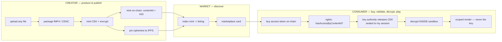
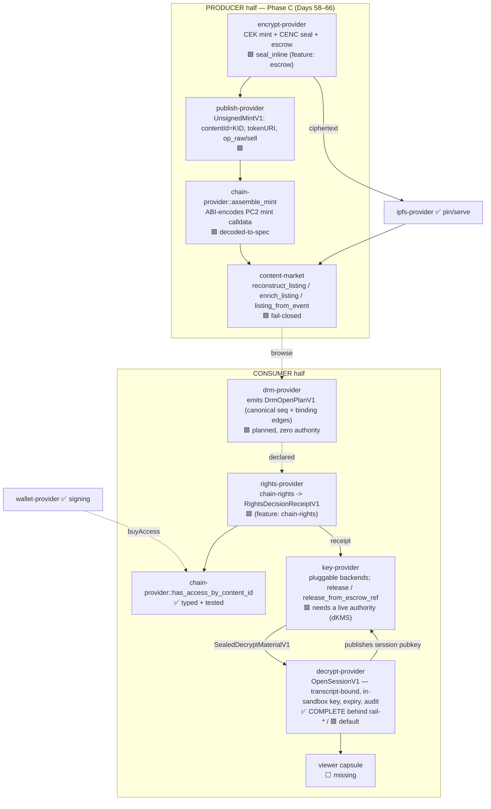

# dDRM Convergence — New Agent Brief (give this to a fresh agent first)

**Purpose.** This single document onboards a brand-new agent with **zero blind spots**:
the mission and *why it matters*, where everything lives (this repo **and** the PC2
reference repo), the whole system as visual maps, exactly what we've built (Days 45–66),
what's next, the runtime principles we never violate, and the **daily working format**
(propose a 10/10 prompt → user says `continue` → execute → propose the next day's 10/10).

> **How to use this file:** read it top to bottom once. Then read the four companion docs
> in order (§7). Then run the verification commands (§8) to confirm the tree is green.
> Then propose the next day's 10/10 prompt (§9) and wait for `continue`.

---

## 0. The Ultimate Mandate (why this matters — keep this in view always)

**Short term — what dDRM actually is.** Today, when you "own" a movie, a song, a
document — you don't. A company holds the keys and lets you look. They can revoke it,
change the terms, mine your behavior, or disappear and take your library with them.
That's not ownership; it's a rental with extra steps.

We're building the first system where you can be **shown** something without anyone —
including the app showing it — ever **holding the key**. The key is sealed,
post-quantum, to one moment, one person, one device, and it self-destructs. The
**blockchain** — not a company — decides if you're allowed in. The creator gets paid
directly by a contract, not a platform taking 30%.

We've already proven the hard half end-to-end: a real key reaches a sealed sandbox,
decrypts real content, and never leaks — and we can check your **actual wallet** against
the **actual chain** to unlock it.

**The big vision — what the runtime is doing for humanity.** The deeper thing is a new
kind of computer: software runs in tiny, sealed, capability-scoped capsules that can do
**exactly** what you granted and nothing else. No ambient power. Fail-closed by default.
The modern internet is built backwards — you hand your data, keys, and trust to servers
you'll never see. ElastOS flips it: trust becomes **local, provable, and minimal**; your
device holds your keys; capabilities are explicit and revocable; cryptography — not
corporate policy — enforces the rules, and it's already quantum-ready. **dDRM is the
first, hardest proof that this model works on something real and valuable.** Once you can
protect a creator's movie this way, you can protect a medical record, a citizen's
identity, an AI agent's permissions — anything.

We're not rebuilding Netflix. We're rebuilding **the trust layer of computing** so
ordinary people actually own their digital lives — proven on the one use case concrete
enough to ship and important enough to matter.

Every task must visibly serve this. If a shortcut would leak a key, add ambient
authority, or let an app bypass a provider, it is wrong even if it "works."

---

## 1. Mission & the non-negotiables (the decision rules)

Re-platform the Elacity / PC2 web product onto the capability-secure **ElastOS Runtime**,
with **dDRM the crown jewel**: package, buy/trade, and decrypt protected content entirely
through the provider plane, with keys **never** exposed to apps.

**Order of authority:** `PRINCIPLES.md` (the constitution) → `CONVERGENCE_PLAYBOOK.md`
(how we apply it) → the per-boundary docs in `docs/convergence/`. If anything contradicts
`PRINCIPLES.md`, `PRINCIPLES.md` wins.

The rules we never break (from `CONVERGENCE_PLAYBOOK.md` §2–§5):
1. **No ambient authority.** Capsules start at zero authority and request capabilities;
   missing authority **fails closed**.
2. **Everything through the provider plane.** Capsules never touch raw sockets, IPFS/Kubo,
   chain RPC, or keys directly — they request a capability and the provider does the
   dangerous thing behind the boundary, returning **scoped output**.
3. **Small trusted core.** Trusted logic in the runtime; app logic in capsules; service
   logic in providers.
4. **Fail closed, then explain.** No silent downgrade, no half-feature pretending to work.
5. **Docs, code, tests, ops agree.** Drift is a bug (enforced by `ddrm-drift-check.sh`).
6. **One canonical path per operation.**
7. **Trust travels with signed content** (DID/CID/hash/signature), not gateway location.
   Decryption/policy live in a provider, never in apps.
8. **CEK-containment (the security invariant).** The CEK exists in clear **only inside the
   decrypt boundary**, is **zeroized** after use, and is **never** returned/logged/surfaced.

**Convergence laws:** contract-first; characterization (golden) tests before engines;
translate PC2 algorithms as **provider internals**, don't copy its iframe/broad-session/
app-visible-wallet/direct-IPFS patterns; carry PC2's hardening **forward**, never regress.

---

## 2. Where everything lives

### This repo — `/Users/sash/code/elastos-runtime`
- **Branch:** `feat/decrypt-provider-cenc` (based on `origin/0.4.0`). **Do not push** (the
  account is suspended); work locally, keep rebasing onto `0.4.0` as Anders releases.
- **dDRM capsules:** `capsules/{encrypt-provider, publish-provider, content-market,
  rights-provider, key-provider, decrypt-provider, chain-provider, drm-provider,
  ipfs-provider, wallet-provider, availability-provider}`.
- **Shared crypto crate:** `capsules/ddrm-envelope` (PQ-hybrid seal, transcript→AAD,
  release-receipt-hash — the single source of truth both decrypt + key providers reuse).
- **Dev orchestrators (NOT capsules, never shipped):** `scripts/dev/ddrm-*-smoke/` driven
  by the wrappers `scripts/ddrm-*-smoke.sh`.
- **Gates:** `scripts/ddrm-drift-check.sh` (contract surface), `scripts/ddrm-ladder-check.sh`
  (pinned test counts + wasm builds).
- **Convergence docs:** `docs/convergence/` (see §7).

### PC2 reference — `/Users/sash/Documents/Cursor/pc2.net/pc2-node`
**Audit PC2 FIRST, every day, and cite exact file:line.** We replicate its *patterns and
shapes*, never copy its architecture. Key files:
- `data/test-apps/elacity-creator/app.js` — the producer/mint truth: `kidToContentId`
  (~1568), `mint(string,uint16,bytes,bytes)` (~4948), `encodeOpRawData` (~1583),
  `encodeSellRawData` (~1633), `OP_TYPES` / role types (~55), `ELACITY_ROYALTY_PERCENT`.
- `src/services/ContentIndexerService.ts` — the discovery truth: event topics (59–63),
  `DigitalAssetRegistered` (857–896, carries `bytes16 contentId`), `AssetCreated` (922–967,
  no on-chain contentId), `metadata.json` schema + `content_id = metadata.kid` (1102–1128),
  `extractCid` (1140), `classifyAssetType` (114), AuthorityGateway price query.
- `src/services/media/dashPackager.ts`, `src/api/storage.ts` — encode/CENC + storage path.
- `crates/cenc-decrypt`, `ddrm-decrypt`, `ddrm-renderer` — the decrypt/render engines we
  translate into `decrypt-provider`.
- Lit Action `universal-decrypt-chipotle.js` — the PKP key-release/ECDH-seal pattern that
  `key-provider` generalizes (Lit becomes one backend, not the root).

---

## 3. The whole system — visual maps

### 3.1 The full content journey (PC2 → what we replicate)



### 3.2 Where we are today (status per boundary)

**Legend:** ✅ done · 🟩 built cross-binary (offline-proven) · 🟦 partial · 🟥 fail-closed skeleton · ⬜ missing



**Headline.** The **hardest boundary — decrypt — is COMPLETE** (transcript-bound,
in-sandbox-minted session key, short-expiry, CEK-free audit, suite-tagged
`SealedDecryptMaterialV1`, all fail-closed, wasm-clean). The **producer→chain→discovery
spine is built and proven cross-binary offline**: one identity (the KID) flows
`encrypt → publish → chain calldata → market listing`, and the chain's own event log,
the calldata, and the IPFS metadata **all agree** on that identity. What remains is **live
wiring** (real RPC/IPFS), a **key authority** (PQ-hybrid dKMS or a Lit-compat backend), the
**drm-provider orchestration**, and a **viewer**.

---

## 4. What we've built — the day ledger (Days 45–66)

Each day is one isolated, reversible commit gated by drift PASS + ladder INTACT + smokes
green + clippy clean. Commits are on `feat/decrypt-provider-cenc`.

| Day | Phase | What landed |
|---|---|---|
| 45–49 | **A — decrypt boundary** | Anders' full decrypt-side spec: Option-A push-in (`rail-live`), full-transcript binding (`rail-bind`), in-sandbox session-key mint+publish (`rail-mint`), short-expiry + scoped CEK-free audit (`rail-audit`), consolidated **suite-tagged `SealedDecryptMaterialV1`** drop-in (`rail-material`=65). **Decrypt boundary COMPLETE.** |
| 50 | A.2 | `key-provider` pluggable `KeyAuthorityBackend` model (Lit / native dKMS / third-party as backends behind one authority boundary). |
| 51 | A.2 | Shared **`ddrm-envelope`** crate + reference key-authority seal engine; cross-boundary golden. |
| 52–53 | A.3 | `decrypt-provider` migrated onto `ddrm-envelope` (equivalence-guarded), dedup completed, pruned `x25519-dalek`/`aes-gcm` — PQ crypto single-sourced. |
| 54–55 | A.4 | Shared `transcript::to_aad` + `release_receipt_hash` (byte-identical reuse); **cross-binary consumer-half smoke** (`ddrm-consumer-smoke.sh`). |
| 56 | **B — rights/chain** | `rights-provider` `chain-rights` → typed `RightsDecisionReceiptV1`; consumer smoke gated by `rights(allowed)`. |
| 57 | B | `chain-provider::has_access_by_content_id` golden tests (owned/unowned/malformed) + attestation-shape guard + opt-in live smoke. Architecture maps + PC2 audit. |
| 58 | **C — producer/discovery** | Pin **KID-as-`bytes16` contentId** identity join + fail-closed **CEK-escrow seam** in `encrypt-provider`. |
| 59 | C | Escrow **engine**: authority recipient key + producer seal + full fresh-CEK crypto proof. |
| 60 | C | **Cross-binary `ddrm-producer-smoke`**: `encrypt seal_inline` → `key release_from_escrow_ref` → `decrypt` opens a CEK sealed *now*. |
| 61 | C | **`publish-provider`**: `UnsignedMintV1` (contentId=KID, `tokenURI={metaCid}/metadata.json`), capability-clean (no RPC/keys). |
| 62 | C | **`chain-provider::assemble_mint`**: ABI-encodes the PC2 `mint(string,uint16,bytes,bytes)` calldata (free+paid), decoded-back-to-spec in tests. |
| 63 | C | **publish→chain wired**: structured `op_raw`/`sell` (PC2 payee/royalty arrays) drop straight into `assemble_mint`; `ddrm-publish-smoke.sh`. |
| 64 | C | **`content-market::reconstruct_listing`**: a `ContentListingV1` PURELY from the self-describing mint calldata; `ddrm-market-smoke.sh`. |
| 65 | C | **`content-market::enrich_listing`**: fuses `metadata.json` fail-closed — **rejects any metadata whose `kid != contentId`** (a hardening over PC2, which trusts `metadata.kid`). |
| 66 | C | **`content-market::listing_from_event`**: decodes real `DigitalAssetRegistered`/`AssetCreated` logs; the event path agrees with the calldata path cross-binary. |
| 68 | C | **`encrypt-provider` content-addresses the ciphertext → real `payload_cid`** (CIDv1 raw/sha2-256 of the sealed segment, derived in-boundary exactly as PC2's Helia `unixfs.addBytes`; pure, no `kubo_api`/network, fail-closed > 1 MiB). `seal_inline` emits it (no more `bafybeig…` placeholder); golden pins 3 inputs to the EXACT CIDs PC2's `ipfs-unixfs-importer` produces. `ddrm-producer-smoke.sh` recomputes via the canonical `cid` crate and demands a byte-for-byte cross-binary match. payload_cid ≠ KID/contentId. encrypt-provider 17→20 / 19→22. |
| 67 | **A wiring** | **`drm-provider::open` → executable `DrmOpenPlanV1`** (status `planned`, never `opened`): the capsule-owned canonical `drm/open` sequence + inter-step **binding edges** (rights⇒`RightsDecisionReceiptV1`→`key.rights_receipt`; key⇒`ReleaseReceiptV1`→`decrypt.release_receipt`; content identity==KID under both `content_id`/`object_cid`), zero authority. Consumer smoke now FOLLOWS the plan instead of hardcoding the order (PRINCIPLES #10). drm-provider=15. |

**Blocked / upstream-only:** fold `SealedDecryptMaterialV1` into the shared `elastos-common`
contract (needs push access); dKMS-direct sealing producer (needs Anders).

---

## 5. What's next (unblocked candidates, pick the highest-value)

1. **Real `plaintext_ref`→bytes in the non-inline `seal`** — Day 68 made the producer
   content-address its ciphertext (`payload_cid` is real, IPFS-faithful, verified
   cross-binary). The remaining gap is resolving `seal`'s `plaintext_ref` to handed-in bytes
   (via `content`/`ipfs-provider`) so the production `seal` path content-addresses too (and,
   separately/later, the actual IPFS **pin** — a distinct capability from the CID).
2. **Live-Base read-only round trip** — real `eth_getLogs` → `listing_from_event` →
   `enrich_listing`, behind an opt-in env flag (like the existing live `has_access` smoke).
3. **Key authority backend** — make one `key-provider` backend *actually release* (the
   PQ-hybrid dKMS reference, or a Lit-compat backend) so the consumer half runs without the
   dev escrow shim.
4. **Runtime-core plan execution** — Day 67 landed `drm-provider::open → DrmOpenPlanV1`
   (the capsule-owned canonical sequence + binding edges, `planned`), and the consumer
   smoke now FOLLOWS it. The remaining step is the **runtime core** (not the dev
   orchestrator) executing that plan default-on — blocked on the core's provider→provider
   rail being available to drive it; until then the dev orchestrator stands in.
5. **Viewer capsule** — consume `decrypt-provider` scoped output → rendered pixels.

---

## 6. The daily working format (how we operate — follow exactly)

We work in **days**. Each day is one thin, demoable, reversible increment. The rhythm:

1. **Agent proposes the next day's task as a single "10/10 prompt"** (structure below).
2. **User replies `continue`.**
3. **Agent executes the whole day autonomously**, then reports what landed and
   **presents the next day's 10/10 prompt**, ending with a question like *"Want me to
   continue with Day N?"*.
4. User replies `continue`. Repeat. (The user has granted standing autonomy to keep
   choosing the highest-value unblocked task — don't wait to be told which one.)

**Hard constraints:**
- **Never delegate / never use Composer / never spawn subagents for this work.** Do the
  audit and the implementation directly, with your own tool calls. (The user has been
  explicit and emphatic about this.)
- **Audit PC2 first, every day, and cite file:line** before writing the Rust.
- **No push.** Commit locally only.
- Keep `docs/convergence/{DDRM_STATUS.md, HANDOVER.md, SYSTEM_ARCHITECTURE_MAP.md}` updated
  every day (header + a dated entry).

**The shape of a 10/10 prompt** (what the agent proposes each day):
- **One bold sentence** naming the day's outcome and *why it matters to the spine*.
- **Step 1 — Audit PC2 first:** the exact files/lines to re-confirm, cited.
- **Step 2 — Pin the contract:** the typed request/response/data shape, fail-closed rules,
  and the characterization (golden) tests that prove PC2 fidelity.
- **Step 3 — Stay capability-clean:** what the capsule must NOT hold; which providers it
  names but does not invoke.
- **Step 4 — Cross-binary proof:** the smoke that drives real binaries end to end.
- **Step 5 — Gate:** ladder INTACT (+ bumped count), drift PASS, all smokes green, docs
  updated; then present the next day's prompt.

**Definition of done (every slice):** contract written; golden fixtures pass; fail-closed
paths tested; the security invariant proven by test (CEK never returned/logged); no ambient
authority added; PC2 source cited; docs/code/tests agree; isolated reversible commit.

---

## 7. Companion docs — read in this order

1. `CONVERGENCE_PLAYBOOK.md` — the north star (principles applied to convergence).
2. `SYSTEM_ARCHITECTURE_MAP.md` — the whole-system view + phased road + PC2 pattern table.
3. `DDRM_STATUS.md` — the per-day chain status; the **header** is the freshest snapshot,
   each `> **Day N**` block is the detailed log.
4. `HANDOVER.md` — the day-log entry point and branch/topology state.

Also: `DDRM_DECRYPT_RAIL.md` (the decrypt boundary + Anders' confirmed rail), `PUSH_PLAN.md`
(rebase surface vs `v0.4.0`), `DDRM_SECURITY_MODEL.md`, `DDRM_ENCRYPT_INVARIANT.md`,
`PRODUCT_VISION.md`, `PC2_PLAYER_ALIGNMENT.md`, `V040_COORDINATION.md`. Top-level
`PRINCIPLES.md` is the constitution.

---

## 8. Verify the tree is green (run these before proposing the next day)

```bash
# 1. Contract surface intact (cheap, run first) — expect: PASS
scripts/ddrm-drift-check.sh

# 2. Pinned test counts + wasm builds — expect: INTACT
#    (one chain-provider lifecycle test is env-flaky; the mint* rung is filtered around it.
#     a transient rail-shim 0/0 under heavy parallel build = re-run; verify in isolation.)
scripts/ddrm-ladder-check.sh

# 3. Cross-binary smokes — each expect: PASS
scripts/ddrm-consumer-smoke.sh   # rights -> key -> decrypt (consumer half)
scripts/ddrm-producer-smoke.sh   # encrypt(seal_inline) -> key(release_from_escrow_ref) -> decrypt
scripts/ddrm-publish-smoke.sh    # publish(prepare) -> chain(assemble_mint)
scripts/ddrm-market-smoke.sh     # publish -> chain -> content-market (reconstruct + enrich + event)
```

Current key ladder counts (update in lockstep when you add tests): `content-market`=29,
`publish-provider`=16, `encrypt-provider [escrow]`=19, `key-provider [key-authority-ref]`=27,
`decrypt-provider [rail-material]`=65, `chain-provider mint*` rung=10, `drm-provider`=15,
`encrypt-provider`=20 (default) / 22 (`escrow`).

---

## 9. Your first actions as the new agent

1. Read this brief + the four companion docs (§7); skim `PRINCIPLES.md`.
2. Run the four verification commands (§8); confirm green.
3. Re-confirm the branch tip: `git log --oneline -1` (should be the latest `ddrm(DayN/...)`).
4. Pick the highest-value **unblocked** task from §5, **audit PC2 first** for it, and
   propose it as a **10/10 prompt** (§6 shape). End by asking the user to type `continue`.

---

*Living document. Keep it honest — it is only useful if it describes how we actually work.
Update §4 (ledger) and §5 (next) at the end of each day alongside the other status docs.*
