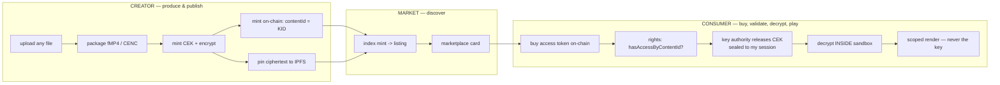
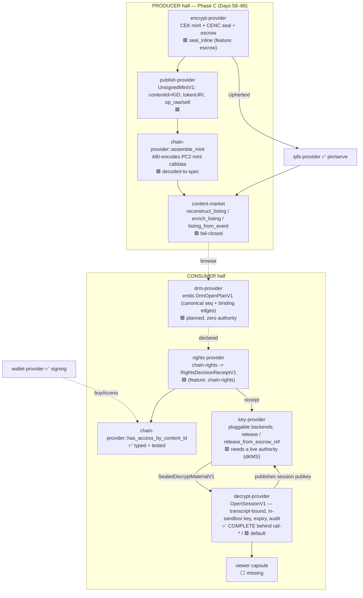

# dDRM Convergence — New Agent Brief (give this to a fresh agent first)

**Purpose.** This single document onboards a brand-new agent with **zero blind spots**:
the mission and *why it matters*, where everything lives (this repo **and** the PC2
reference repo), the whole system as visual maps, exactly what we've built (Days 45–66),
what's next, the runtime principles we never violate, and the **daily working format**
(propose a 10/10 prompt → user says `continue` → execute → propose the next day's 10/10).

> **How to use this file:** read it top to bottom once. Then read the four companion docs
> in order (§7). Then run the verification commands (§8) to confirm the tree is green.
> Then propose the next day's 10/10 prompt (§9) and wait for `continue`.

---

## 0. The Ultimate Mandate (why this matters — keep this in view always)

**Short term — what dDRM actually is.** Today, when you "own" a movie, a song, a
document — you don't. A company holds the keys and lets you look. They can revoke it,
change the terms, mine your behavior, or disappear and take your library with them.
That's not ownership; it's a rental with extra steps.

We're building the first system where you can be **shown** something without anyone —
including the app showing it — ever **holding the key**. The key is sealed,
post-quantum, to one moment, one person, one device, and it self-destructs. The
**blockchain** — not a company — decides if you're allowed in. The creator gets paid
directly by a contract, not a platform taking 30%.

We've already proven the hard half end-to-end: a real key reaches a sealed sandbox,
decrypts real content, and never leaks — and we can check your **actual wallet** against
the **actual chain** to unlock it.

**The big vision — what the runtime is doing for humanity.** The deeper thing is a new
kind of computer: software runs in tiny, sealed, capability-scoped capsules that can do
**exactly** what you granted and nothing else. No ambient power. Fail-closed by default.
The modern internet is built backwards — you hand your data, keys, and trust to servers
you'll never see. ElastOS flips it: trust becomes **local, provable, and minimal**; your
device holds your keys; capabilities are explicit and revocable; cryptography — not
corporate policy — enforces the rules, and it's already quantum-ready. **dDRM is the
first, hardest proof that this model works on something real and valuable.** Once you can
protect a creator's movie this way, you can protect a medical record, a citizen's
identity, an AI agent's permissions — anything.

We're not rebuilding Netflix. We're rebuilding **the trust layer of computing** so
ordinary people actually own their digital lives — proven on the one use case concrete
enough to ship and important enough to matter.

Every task must visibly serve this. If a shortcut would leak a key, add ambient
authority, or let an app bypass a provider, it is wrong even if it "works."

---

## 1. Mission & the non-negotiables (the decision rules)

Re-platform the Elacity / PC2 web product onto the capability-secure **ElastOS Runtime**,
with **dDRM the crown jewel**: package, buy/trade, and decrypt protected content entirely
through the provider plane, with keys **never** exposed to apps.

**Order of authority:** `PRINCIPLES.md` (the constitution) → `CONVERGENCE_PLAYBOOK.md`
(how we apply it) → the per-boundary docs in `docs/convergence/`. If anything contradicts
`PRINCIPLES.md`, `PRINCIPLES.md` wins.

The rules we never break (from `CONVERGENCE_PLAYBOOK.md` §2–§5):
1. **No ambient authority.** Capsules start at zero authority and request capabilities;
   missing authority **fails closed**.
2. **Everything through the provider plane.** Capsules never touch raw sockets, IPFS/Kubo,
   chain RPC, or keys directly — they request a capability and the provider does the
   dangerous thing behind the boundary, returning **scoped output**.
3. **Small trusted core.** Trusted logic in the runtime; app logic in capsules; service
   logic in providers.
4. **Fail closed, then explain.** No silent downgrade, no half-feature pretending to work.
5. **Docs, code, tests, ops agree.** Drift is a bug (enforced by `ddrm-drift-check.sh`).
6. **One canonical path per operation.**
7. **Trust travels with signed content** (DID/CID/hash/signature), not gateway location.
   Decryption/policy live in a provider, never in apps.
8. **CEK-containment (the security invariant).** The CEK exists in clear **only inside the
   decrypt boundary**, is **zeroized** after use, and is **never** returned/logged/surfaced.

**Convergence laws:** contract-first; characterization (golden) tests before engines;
translate PC2 algorithms as **provider internals**, don't copy its iframe/broad-session/
app-visible-wallet/direct-IPFS patterns; carry PC2's hardening **forward**, never regress.

---

## 2. Where everything lives

### This repo — `/Users/sash/code/elastos-runtime`
- **Branch:** `feat/decrypt-provider-cenc` (based on `origin/0.4.0`). **Do not push** (the
  account is suspended); work locally, keep rebasing onto `0.4.0` as Anders releases.
- **dDRM capsules:** `capsules/{encrypt-provider, publish-provider, content-market,
  rights-provider, key-provider, decrypt-provider, chain-provider, drm-provider,
  ipfs-provider, wallet-provider, availability-provider}`.
- **Shared crypto crate:** `capsules/ddrm-envelope` (PQ-hybrid seal, transcript→AAD,
  release-receipt-hash — the single source of truth both decrypt + key providers reuse).
- **Dev orchestrators (NOT capsules, never shipped):** `scripts/dev/ddrm-*-smoke/` driven
  by the wrappers `scripts/ddrm-*-smoke.sh`.
- **Gates:** `scripts/ddrm-drift-check.sh` (contract surface), `scripts/ddrm-ladder-check.sh`
  (pinned test counts + wasm builds).
- **Convergence docs:** `docs/convergence/` (see §7).

### PC2 reference — `/Users/sash/Documents/Cursor/pc2.net/pc2-node`
**Audit PC2 FIRST, every day, and cite exact file:line.** We replicate its *patterns and
shapes*, never copy its architecture. Key files:
- `data/test-apps/elacity-creator/app.js` — the producer/mint truth: `kidToContentId`
  (~1568), `mint(string,uint16,bytes,bytes)` (~4948), `encodeOpRawData` (~1583),
  `encodeSellRawData` (~1633), `OP_TYPES` / role types (~55), `ELACITY_ROYALTY_PERCENT`.
- `src/services/ContentIndexerService.ts` — the discovery truth: event topics (59–63),
  `DigitalAssetRegistered` (857–896, carries `bytes16 contentId`), `AssetCreated` (922–967,
  no on-chain contentId), `metadata.json` schema + `content_id = metadata.kid` (1102–1128),
  `extractCid` (1140), `classifyAssetType` (114), AuthorityGateway price query.
- `src/services/media/dashPackager.ts`, `src/api/storage.ts` — encode/CENC + storage path.
- `crates/cenc-decrypt`, `ddrm-decrypt`, `ddrm-renderer` — the decrypt/render engines we
  translate into `decrypt-provider`.
- Lit Action `universal-decrypt-chipotle.js` — the PKP key-release/ECDH-seal pattern that
  `key-provider` generalizes (Lit becomes one backend, not the root).

---

## 3. The whole system — visual maps

### 3.1 The full content journey (PC2 → what we replicate)



### 3.2 Where we are today (status per boundary)

**Legend:** ✅ done · 🟩 built cross-binary (offline-proven) · 🟦 partial · 🟥 fail-closed skeleton · ⬜ missing



**Headline.** The **hardest boundary — decrypt — is COMPLETE** (transcript-bound,
in-sandbox-minted session key, short-expiry, CEK-free audit, suite-tagged
`SealedDecryptMaterialV1`, all fail-closed, wasm-clean). The **producer→chain→discovery
spine is built and proven cross-binary offline**: one identity (the KID) flows
`encrypt → publish → chain calldata → market listing`, and the chain's own event log,
the calldata, and the IPFS metadata **all agree** on that identity. What remains is **live
wiring** (real RPC/IPFS), a **key authority** (PQ-hybrid dKMS or a Lit-compat backend), the
**drm-provider orchestration**, and a **viewer**.

---

## 4. What we've built — the day ledger (Days 45–66)

Each day is one isolated, reversible commit gated by drift PASS + ladder INTACT + smokes
green + clippy clean. Commits are on `feat/decrypt-provider-cenc`.

| Day | Phase | What landed |
|---|---|---|
| 45–49 | **A — decrypt boundary** | Anders' full decrypt-side spec: Option-A push-in (`rail-live`), full-transcript binding (`rail-bind`), in-sandbox session-key mint+publish (`rail-mint`), short-expiry + scoped CEK-free audit (`rail-audit`), consolidated **suite-tagged `SealedDecryptMaterialV1`** drop-in (`rail-material`=65). **Decrypt boundary COMPLETE.** |
| 50 | A.2 | `key-provider` pluggable `KeyAuthorityBackend` model (Lit / native dKMS / third-party as backends behind one authority boundary). |
| 51 | A.2 | Shared **`ddrm-envelope`** crate + reference key-authority seal engine; cross-boundary golden. |
| 52–53 | A.3 | `decrypt-provider` migrated onto `ddrm-envelope` (equivalence-guarded), dedup completed, pruned `x25519-dalek`/`aes-gcm` — PQ crypto single-sourced. |
| 54–55 | A.4 | Shared `transcript::to_aad` + `release_receipt_hash` (byte-identical reuse); **cross-binary consumer-half smoke** (`ddrm-consumer-smoke.sh`). |
| 56 | **B — rights/chain** | `rights-provider` `chain-rights` → typed `RightsDecisionReceiptV1`; consumer smoke gated by `rights(allowed)`. |
| 57 | B | `chain-provider::has_access_by_content_id` golden tests (owned/unowned/malformed) + attestation-shape guard + opt-in live smoke. Architecture maps + PC2 audit. |
| 58 | **C — producer/discovery** | Pin **KID-as-`bytes16` contentId** identity join + fail-closed **CEK-escrow seam** in `encrypt-provider`. |
| 59 | C | Escrow **engine**: authority recipient key + producer seal + full fresh-CEK crypto proof. |
| 60 | C | **Cross-binary `ddrm-producer-smoke`**: `encrypt seal_inline` → `key release_from_escrow_ref` → `decrypt` opens a CEK sealed *now*. |
| 61 | C | **`publish-provider`**: `UnsignedMintV1` (contentId=KID, `tokenURI={metaCid}/metadata.json`), capability-clean (no RPC/keys). |
| 62 | C | **`chain-provider::assemble_mint`**: ABI-encodes the PC2 `mint(string,uint16,bytes,bytes)` calldata (free+paid), decoded-back-to-spec in tests. |
| 63 | C | **publish→chain wired**: structured `op_raw`/`sell` (PC2 payee/royalty arrays) drop straight into `assemble_mint`; `ddrm-publish-smoke.sh`. |
| 64 | C | **`content-market::reconstruct_listing`**: a `ContentListingV1` PURELY from the self-describing mint calldata; `ddrm-market-smoke.sh`. |
| 65 | C | **`content-market::enrich_listing`**: fuses `metadata.json` fail-closed — **rejects any metadata whose `kid != contentId`** (a hardening over PC2, which trusts `metadata.kid`). |
| 66 | C | **`content-market::listing_from_event`**: decodes real `DigitalAssetRegistered`/`AssetCreated` logs; the event path agrees with the calldata path cross-binary. |
| 68 | C | **`encrypt-provider` content-addresses the ciphertext → real `payload_cid`** (CIDv1 raw/sha2-256 of the sealed segment, derived in-boundary exactly as PC2's Helia `unixfs.addBytes`; pure, no `kubo_api`/network, fail-closed > 1 MiB). `seal_inline` emits it (no more `bafybeig…` placeholder); golden pins 3 inputs to the EXACT CIDs PC2's `ipfs-unixfs-importer` produces. `ddrm-producer-smoke.sh` recomputes via the canonical `cid` crate and demands a byte-for-byte cross-binary match. payload_cid ≠ KID/contentId. encrypt-provider 17→20 / 19→22. |
| 67 | **A wiring** | **`drm-provider::open` → executable `DrmOpenPlanV1`** (status `planned`, never `opened`): the capsule-owned canonical `drm/open` sequence + inter-step **binding edges** (rights⇒`RightsDecisionReceiptV1`→`key.rights_receipt`; key⇒`ReleaseReceiptV1`→`decrypt.release_receipt`; content identity==KID under both `content_id`/`object_cid`), zero authority. Consumer smoke now FOLLOWS the plan instead of hardcoding the order (PRINCIPLES #10). drm-provider=15. |
| 70 | **A** | **the canonical `key-provider::release` actually releases (reference backend)** — recover the producer-escrowed CEK from the rights-bound `key_envelope` → re-seal to the runtime-injected decrypt session as `SealedDecryptMaterialV1`. Audited PC2's Lit authority (`universal-decrypt-chipotle.js`: access-check `:560–568` → recover `:570–575` → CEK↔KID↔authority bind `:577–590` → seal-to-session `:602–608`). The wrapped CEK rides INSIDE the validated request; per-session material is a capsule-local `session` context (shared `KeyReleaseRequestV1` byte-identical, drift untouched). Fail-closed: no backend/no session/denied/expired/kid-swap/scheme-mismatch/forged-producer. The op `drm-provider`'s `DrmOpenPlanV1` names is now real. key-provider 27→33; `ddrm-consumer-smoke.sh` escrows the golden CEK + drives the canonical `release` (recover→reseal), removing the raw-CEK `release_ref` shim. |
| 69 | C | **`encrypt-provider::seal` runs the full production pipeline on HANDED-IN bytes → complete `SealedObjectV1`** (closes the dev `seal_inline` ↔ production `seal` gap). Audited PC2's input path (`dashPackager.ts`: host `readFileSync`:504 → `executeCENCEncrypt(.., seg.data)`:432 — the WASM fetches nothing). `seal` gained `content_b64`/`recipient_pub_b64`/`availability_receipt_cid` (`deny_unknown_fields` kept); given bytes+recipient it runs the ONE shared `run_seal_pipeline` (mint→CENC→content-address→escrow; `seal_inline` delegates too, PRINCIPLES #10) → `SealedObjectV1` with real `payload_cid`, bytes16-KID envelope, `policy_hash=sha256(rights_policy_cid)`, chain-validated PQ-hybrid suite. NO fetch authority; fail-closed without bytes+recipient. `ddrm-producer-smoke.sh` drives the real `seal`, deserializes into the SHARED `SealedObjectV1` + runs the SAME validator `key-provider` runs. encrypt-provider escrow 22→25. |
| 71 | **A wiring** | **runtime-core plan EXECUTOR (`capsules/ddrm-plan-runner`)** — the `DrmOpenPlanV1` is no longer hand-walked by the smoke; a fail-closed core walks it. Audited PC2's open sequencer (each stage gated on the prior: `secureViewSession.ts:61` resurrect-session → `media.ts:1163` `hasAccessByContentId` access gate → `:1196`/`:1216` recover+unwrap CEK in-boundary). The executor `parse`s the plan (schema, `planned`, the `rights<key<decrypt` canonical order, every binding names real steps/identities), seeds the `drm_open` identities, then walks the steps **threading each binding edge** into the next step's request and **failing closed** when a step needs an artifact not yet produced (out-of-order/silent failure) or runs without emitting its declared artifact. It holds **no authority**: the only thing that touches a provider is the injected `StepRunner`. `ddrm-consumer-smoke.sh` now drives the REAL drm→rights→key→decrypt binaries THROUGH the core (the smoke is just the injected transport), with a new fail-closed gate: a TAMPERED binding edge is rejected by the real key-provider (`deny_unknown_fields` over required `rights_receipt`). ddrm-plan-runner=14 (new rung). |
| 74 | **A wiring** | **runtime-OWNED capability registry (`RuntimeCapabilityTable` in `ddrm-plan-runner`)** — the concrete `CapabilityTable` the core owns: a registry of runtime-owned `ProviderTransport`s. The runtime `register`s one transport per provider (at startup); `open_drm_plan` → `resolve(provider)` OPENS a fresh handle over the registered transport, or `None` for an unregistered provider (→ fail closed). Audited PC2's transport ownership (the runtime owns the factory as a process-lifetime singleton `export const sessionService = new BackendSessionService(...)` `BackendSessionService.ts:495`; `getSessionView` dispatches on `stored.backend` to construct the per-backend transport it owns the means to build `:368`–`:377`, `null` for unknown `:370`). New `ProviderTransport` (owned, registered once) vs `ProviderHandle` (fresh per-open, the analogue of a `BackendSessionView` minted per request); `register` rejects a duplicate provider, `resolve` opens or `None`. `ddrm-consumer-smoke.sh` REGISTERS three capsule-backed transports (`Rights`/`Key`/`Decrypt`Transport) into the SAME registry the core uses — no second code path. ddrm-plan-runner 25→29. |
| 99–100 | **A wiring** | **the 2-of-2 threshold now runs through the PRODUCTION `DrmHost` run-path (not just the verify probe): the happy open provisions TWO nodes, dual-recovers BOTH, reconstructs the CEK ONLY in the decrypt boundary (`ddrm-runtime-open` / `key-provider` / smoke)** — Day 97–98 landed the threshold crypto + a self-contained probe, but the production happy path still provisioned ONE node + escrowed the WHOLE CEK. Audited PC2 first: PC2's run-path delegates with ONE RPC (`recoverCEKEnvelope`, `chipotle-client.ts:1438`) and NEVER collects shares from multiple nodes in its own code — `decryptAndCombine` is the LEGACY Datil threshold inside Lit's opaque network (`chipotle-client.ts:1297`), the current Chipotle path is single-node TEE decrypt; **PC2 STOPS at one opaque RPC, the runtime is SUPERIOR** (two owned, inspectable nodes end to end). (1) `OpenConfig.authority.threshold` (bool, dkms-only, fail-closed otherwise; +2 bin tests 8→10). (2) `publish_escrow` provisions node A + node B (distinct stores/sockets/allow-lists), `split_cek_xor`s the CEK (share-1→A, share-2→B), publishes a `threshold` descriptor (`t:2`, both nodes); the fixture carries `wrapped_cek_share2_b64` + node B's `vk2_b64`. (3) the `DrmHost` starts BOTH daemons, binds share-2, passes node B's vk to the decrypt boundary (`authority_vk2_b64`), and `KeyHandle` supplies `wrapped_cek_share2_b64` in the release session — `host.open()` drives the full dual-recover + in-VM XOR combine; a threshold↔descriptor desync fails closed. (4) INTEGRATION FIX: `merge_threshold_material` welds node B's share into node A's NESTED `material.sealed_cek_share2_b64` (the Day 97–98 merge read a top-level field the real node never emits — never exercised end-to-end until now; key-provider[key-authority-ref] stays 43). (5) verify gates 21–22 (threshold-only): the live rail refuses a one-share release; a 3-of-N descriptor fails closed at init. NEW `ddrm-consumer-dkms-threshold-smoke.sh` (+ `--threshold` flag) drives the whole 2-of-2 open cross-binary; reference + single-node dkms stay green. Drift untouched. Gate: ladder INTACT (ddrm-envelope=23, key-provider[key-authority-ref]=43, decrypt-provider rail-material=68), drift PASS, all dDRM smokes green (reference + dkms + 2-of-2), clippy clean. |
| 97–98 | **A wiring** | **the threshold is REAL: the CEK is XOR-split 2-of-2 across TWO secret-holding dKMS nodes; no single node holds the whole key, reconstruction happens ONLY in the decrypt boundary (`ddrm-envelope` / `decrypt-provider` / `key-provider` / `ddrm-runtime-open`)** — Day 95–96 left a fail-closed threshold STUB; this cycle makes 2-of-2 real end to end. Audited PC2 first: PC2's threshold is the OPAQUE Lit `decryptAndCombine` (`non-media-decrypt.js:76`) — share set + node membership + combine live INSIDE Lit's proprietary network, uninspectable. **Runtime is SUPERIOR:** an EXPLICIT, owned, inspectable 2-node split with the combine in our OWN sandbox. Mirrored: (1) `ddrm-envelope` gained pure `split_cek_xor(cek, mask)` (producer: `share1=mask`, `share2=cek⊕mask`) + `combine_cek_xor → Zeroizing` (decrypt boundary; fail-closed on length mismatch); 22→23. (2) `decrypt-provider` reconstructs IN-VM — `SealedDecryptMaterialV1` gained optional `sealed_cek_share2_b64`, the boundary an optional `authority_vk2_b64`; `rail_shim::decrypt_from_carrier_threshold` unwraps BOTH sealed shares (each under ITS node's vk, same transcript), XOR-combines in `Zeroizing`, then decrypts — the whole CEK exists ONLY in the sandbox; single-share path unchanged; rail-material 65→68. (3) `key-provider` REPLACED the stub: `build_dkms_client` resolves a 2-of-2 `threshold` descriptor into TWO public clients (3-of-N/identical/malformed fail closed); `release` dual-recovers BOTH nodes (per-node connection, known-caller, fresh `recover_seq`, possession proof) and `merge_threshold_material` welds two re-sealed shares into one material WITHOUT XOR-combining (second escrow rides in `wrapped_cek_share2_b64`); 42→43. `ddrm-runtime-open` verify mode adds a 2-of-2 probe (steps 18–20): TWO real daemons (distinct stores/sockets/allow-lists), share-1→node A + share-2→node B, recover from EACH, reconstruct the EXACT CEK in-boundary — single share USELESS, FORGED second share fails closed under node B's vk. Drift untouched (second share + second vk are capsule-local). Escape hatch (2-day prompt): the production `DrmHost` run-path dual-recover wiring + its dedicated smoke is the Day 99–100 finisher. Gate: ladder INTACT (ddrm-envelope=23, key-provider[key-authority-ref]=43, decrypt-provider rail-material=68), drift PASS, all dDRM smokes green (incl. the dkms 2-of-2 probe), clippy clean. |
| 95–96 | **A wiring** | **the dkms node serves only a KNOWN, ALLOW-LISTED caller + every recover is FRESH (anti-replay) + a THRESHOLD descriptor fails closed (`ddrm-envelope` / `dkms-authority` / `key-provider` / `ddrm-runtime-open`)** — Day 93–94 made the bearer session non-replayable across callers, but the caller was still ANONYMOUS and a captured recover frame could be replayed within a session. Audited PC2 first: the secure-view session is OWNER-BOUND to a registered wallet (`ownerAddress` == authenticated wallet, re-checked in the TEE via `ecrecover(delegationSig)`, `secureViewSession.ts:87`–`:100`), and carries a revocable per-delegation `nonce` the node reads back + refuses if revoked (`:108`–`:112`). Mirrored: (1) `ddrm-envelope`'s recover possession-proof now binds a per-recover `recover_seq` (`sign_recover_proof`/`verify_recover_proof` length-prefix the seq, so it is authenticated; a swapped seq fails — 22 tests). (2) `dkms-authority` gained a KNOWN-caller ALLOW-LIST (`DKMS_AUTHORITY_ALLOWED_CALLERS`, operator-provisioned at daemon start, never client-overridable) — `hello` refuses an unknown caller (`caller_not_authorized`) before minting a token — and an anti-replay counter: `recover` tracks the highest `recover_seq` consumed in the session, refusing any that does not strictly advance (commit-on-success); 11→13. (3) `key-provider` derives a STABLE caller identity from a runtime-provisioned `dkms_caller_seed_b64` (so the node's allow-list knows it; absent → ephemeral/anonymous), stamps + signs a strictly-increasing `recover_seq` per recover, and RECOGNIZES a `threshold` descriptor (`t>1`/multi-node) failing closed (a single-node `t==1`/absent descriptor still resolves); 41→42. `ddrm-runtime-open` provisions a per-run KNOWN caller into the daemon allow-list, hands the seed to BOTH the rail + the adversarial probe, and adds two gates against the REAL daemon (an UNKNOWN caller's hello refused; a REPLAYED recover frame refused after three strictly-advancing successful recovers); the reference path stays green. Drift untouched (allow-list + freshness counter are capsule-local protocol). Next: REAL 2-of-N threshold (split the CEK across multiple secret-holding nodes; key-provider orchestrates, the decrypt boundary reconstructs). Gate: ladder INTACT (ddrm-envelope=22, dkms-authority=13, key-provider[key-authority-ref]=42), drift PASS, all dDRM smokes green, clippy clean. |
| 93–94 | **A wiring** | **the long-lived dkms node gets a REAL transport boundary (framed Unix-domain socket) + the bearer session becomes NON-REPLAYABLE across callers (possession proof) (`ddrm-envelope` / `dkms-authority` / `key-provider` / `ddrm-runtime-open`)** — Day 91–92 made the node long-lived but it was still a stdin/stdout CHILD `key-provider` spawned, and the token was a pure BEARER credential. Audited PC2 first: the secure-view session is OWNER-BOUND — the stored `ownerAddress` must equal the authenticated wallet or `403 session_owner_mismatch`, re-checked in the TEE via `ecrecover(delegationSig) === del.ownerAddress` (`secureViewSession.ts:87`–`:100`); the Boson proxy FRAMES every packet `[2-byte length][1-byte type][body]` + `MAX_PACKET_SIZE`/`PACKET_HEADER_SIZE` (`ProxyProtocol.ts:13`/`:251`/`:256`/`:371`). Mirrored: (1) a NEW shared `ddrm-envelope` FRAME module (`frame::write_frame`/`read_frame`, `[4-byte BE len][payload]`, `MAX_FRAME_BYTES=1 MiB`, fail-closed on torn/oversized/zero) + a caller-bound session token (`sign/verify_session_token` over `challenge‖caller_pub‖expires_at`) + a recover possession-proof (`sign/verify_recover_proof`); 20→22. (2) the `dkms-authority` node serves a SOCKET mode (`DKMS_AUTHORITY_LISTEN=<path>` → bind+listen+framed connections sequentially, one session per connection; torn/oversized/half-closed frame drops THAT connection only without wedging the daemon) keeping the SAME JSON ops; `hello` binds the token to the caller pubkey + `recover` REQUIRES/verifies a possession proof against it before re-auth + key material; 9→11. (3) `key-provider` CONNECTS over the framed socket instead of spawning, mints an EPHEMERAL keypair per connection (pubkey at hello), and SIGNS every recover under it (`DkmsNodeConn` wraps the framed socket + signer, boxed; socket code `unix`-gated so wasm32-wasip1 stays clean); key-provider[key-authority-ref]=41. `ddrm-runtime-open` starts the node DAEMON listening + connects over the socket; verify mode proves steps 13–17 cross-binary against the REAL daemon (identity over socket + caller-bound token; NO/EXPIRED/FORGED/tampered token, NO proof, WRONG-KEY proof refused; re-auth; ONE socket connection+session → THREE recovers; a torn AND an oversized frame each fail closed without wedging the daemon). Drift untouched (frame + possession proof are capsule-local protocol). Gate: ladder INTACT (ddrm-envelope=22, dkms-authority=11, key-provider[key-authority-ref]=41), drift PASS, all dDRM smokes green (incl. dkms), clippy clean. |
| 91–92 | **A wiring** | **the dkms node becomes a LONG-LIVED CONNECTION the client opens ONCE + the handshake mints a node-bound SESSION the node REQUIRES on every recover (`ddrm-envelope` / `dkms-authority` / `key-provider` / `ddrm-runtime-open`)** — Day 89–90 authenticated the channel but `key-provider` still SPAWNED a fresh node + re-handshook EVERY release, and the verified handshake gated nothing beyond that one call. Audited PC2 first: the per-view session is ESTABLISHED ONCE (`begin-session`) + only RESURRECTED per request to gate recovery — `getSessionByToken(token)` → `session_token_invalid` on unknown/expired (`secureViewSession.ts:81`–`:85`), missing → `session_token_required` (`:72`–`:79`), `getSessionView(token)` resurrects the live view (`:124`–`:128`) handed downstream directly (handlers must NOT re-load by token `:12`–`:14`); recovery refused without a live session. Mirrored: (1) a NEW domain-separated `ddrm-envelope` session-token primitive `sign_session_token`/`verify_session_token` over `DKMS_SESSION_DOMAIN ‖ challenge ‖ expires_at` (single source of truth, separated from the hello attestation + CEK seals); 18→20. (2) the `dkms-authority` node's `hello` now also mints a node-SIGNED SESSION TOKEN (binds the challenge + `now+300s`) and `recover` REQUIRES one — verified under the node's OWN vk + unexpired against the caller's clock, fail-closed on missing (a hard parse error) / expired / forged / tampered, BEFORE re-auth + key material; 6→9. (3) `key-provider`'s `dkms` client holds a long-lived `DkmsNodeConn` — OPENS-ONCE (spawn + init + handshake + capture token), REUSES the connection + session across releases, re-establishes fail-closed only on expiry (`dkms_session_live` gate); the per-release spawn/shutdown is gone; 40→41. `ddrm-runtime-open` verify mode proves it cross-binary against the REAL node (step 13: identity pinned + a session token minted; step 14: recover with NO/EXPIRED/FORGED/tampered token refused; step 15: even WITH a live session a DENIED/wrong-content receipt refused; step 16: ONE session → THREE successful recovers, raw CEK never present), and the genuine open now flows through the persistent connection; reference path green. Drift untouched (the node CONSUMES the existing `RightsDecisionReceiptV1`; the session token is a capsule-local protocol message). Gate: ladder INTACT (ddrm-envelope=20, dkms-authority=9, key-provider[key-authority-ref]=41), drift PASS, all dDRM smokes green (incl. dkms), clippy clean. |
| 89–90 | **A wiring** | **the delegation becomes an AUTHENTICATED CHANNEL with a per-recover AUTHORIZATION the node re-checks in its own boundary (`ddrm-envelope` / `dkms-authority` / `key-provider` / `ddrm-runtime-open`)** — Day 87–88 delegated recovery but `key-provider` SPAWNED the node + trusted it implicitly, and the node recovered for whatever the caller sent. Audited PC2 first: (a) the Lit action PINS the authority — recomputes `sha256(cek‖kid‖authority)` in the TEE + DENIES `kid_authority_mismatch` on a swapped authority/KID (`universal-decrypt-chipotle.js:577`–`:590`); (b) the node RE-RUNS the access check in its own boundary — `hasAccessByContentId(addr, normalizedKid)`, denying `access_denied` rather than trusting the caller (`:560`–`:568`). Mirrored: (1) a NEW domain-separated `ddrm-envelope` attestation primitive `attest_challenge`/`verify_attestation` over `DKMS_HELLO_DOMAIN ‖ challenge` (single source of truth, separated from CEK-seal sigs); 16→18. (2) the `dkms-authority` node gained a `hello` op (signs the client's fresh challenge with its master-derived key, proving possession of the key behind the published vk) + RE-AUTHORIZES every `recover` in its own boundary (the request carries the `RightsDecisionReceiptV1` + content/principal/session/right binding; refuses unless `allowed`, a protected-content action, and bound to the SAME identity the recover declares); 4→6. (3) `key-provider`'s `dkms` client runs the IDENTITY HANDSHAKE before delegating — requires the node to advertise EXACTLY the pinned vk + a valid attestation over the challenge (fail-closed on a forged/mismatched node) — then threads the receipt + binding into `recover`; 39→40. `ddrm-runtime-open` verify mode proves it cross-binary against the REAL node (step 13: attestation verifies under the descriptor vk, a flipped vk + replayed challenge rejected; step 14: the node refuses a DENIED / wrong-content receipt), master never on the wire; reference path green. Drift untouched (the node CONSUMES the existing `RightsDecisionReceiptV1`). Gate: ladder INTACT (ddrm-envelope=18, dkms-authority=6, key-provider[key-authority-ref]=40), drift PASS, all dDRM smokes green (incl. dkms), clippy clean. |
| 87–88 | **A wiring** | **the `dkms` authority SPLITS into a SECRET-HOLDING NODE + a PUBLIC-ONLY runtime; recovery is DELEGATED across the process boundary (`dkms-authority` capsule / `key-provider` / `ddrm-runtime-open`)** — Day 85–86 ran `dkms` end-to-end but the runtime was still HANDED the master seed; a true external authority NEVER gives the runtime its secret. Audited PC2 first: (a) the Lit/dKMS node recovers the CEK INSIDE the TEE (`Lit.Actions.Decrypt`, `universal-decrypt-chipotle.js:572`), rebinds CEK↔KID↔authority (`:577`–`:590`), seals to the session (`envelopeCEK` `:602`–`:608`), and `setResponse` returns ONLY the sealed envelope (`:610`–`:613`) — never the raw CEK / PKP secret; (b) the client holds only the PUBLIC identity and RPCs the node — `recoverCEKEnvelope` takes public LIT params + a session view and returns a sealed `Buffer` (`chipotle-client.ts:1438`–`:1453`), the recovery secret stays in the node. Mirrored: (1) NEW `dkms-authority` capsule (the node) OWNS the master (its own node-local store) + exposes ONLY a `recover` op (recover in-boundary, fail-closed on forged producer / KID-swap / scheme-mismatch / tamper, re-seal to session, return `SealedDecryptMaterialV1` — never the CEK/master); dkms-authority=4. (2) `key-provider` `dkms` holds a PUBLIC-ONLY descriptor (schema v2: vk + recipient + `authority_endpoint`, NO secret; a master-seed-bearing descriptor REJECTED) and on `release` DELEGATES recovery to the node (spawn + JSON-RPC the endpoint) instead of deriving locally — the runtime holds NO recovery secret; +1 (38→39). (3) `ddrm-runtime-open` PROVISIONS the node at publish (master stays in the node's store; runtime gets only the public descriptor) + ASSERTS the descriptor is PUBLIC-ONLY (no master seed) — the master NEVER crosses into the runtime; `authority.dkms_authority_bin` required for dkms; +1 (7→8). The dkms smoke decrypts the segment with the master never entering the runtime; the reference path stays green. Gate: ladder INTACT (+dkms-authority=4, +key-provider[key-authority-ref]=39), drift PASS, all dDRM smokes green (incl. dkms), clippy clean. |
| 85–86 | **A wiring** | **the `dkms` EXTERNAL authority runs the open END-TO-END + a backend SWAP is invisible (`ddrm-runtime-open` / `key-provider`)** — Day 83–84 made `dkms` a fail-closed external seam but unit-tested it only; now it runs the live rail. Audited PC2 first: (a) PC2 selects the backend PER STORED SESSION without changing the open path — `getSessionView(token)` dispatches on `stored.backend` to `WasmSessionView.fromStoredSession` vs `BackendSessionView.fromStoredSession` (`BackendSessionService.ts:368`–`:377`), the downstream handler agnostic; (b) PC2 treats the provisioned authority descriptor as IMMUTABLE published data — written ONCE to a cache (`writeFileSync(PROVISION_CACHE_PATH, …, mode 0600)`, `chipotle-client.ts:935`) then only READ (`ensureProvisioned` `:950`–`:951`, `resolvePkpId` `:963`–`:967`). (1) `OpenConfig` gained a typed `authority.backend` (`reference | dkms`; fail-closed on an unknown/non-object authority, +2 bin tests); `KeyLauncher` carries only a backend-specific `init_config` and the publish → launch → open → recover/re-seal flow is BYTE-IDENTICAL — switching is a ONE-FIELD change. (2) The publish phase PROVISIONS the selected authority — for `dkms` it generates the key material via the reference authority on a durable store, then publishes an IMMUTABLE descriptor (master seed + published-identity pins), the dKMS-node analogue. (3) `key-provider` now REQUIRES the dkms descriptor's pins (`verifying_key_b64` AND `recipient_pub_b64`) — a pinless descriptor fails closed; +1 test (37→38). (4) The bin PROVES the descriptor was READ-ONLY across the open (snapshot before launch, byte-compare after shutdown). New sibling smoke `ddrm-consumer-dkms-smoke.sh` drives dkms end-to-end (and `ddrm-consumer-smoke.sh [--backend reference|dkms]` runs either); the reference path stays green. Gate: ladder INTACT (+key-provider[key-authority-ref]=38), drift PASS, all dDRM smokes green (incl. the new dkms variant), clippy clean. |
| 83–84 | **A wiring** | **config-driven runtime-open `bin` (NO smoke in the loop) + `dkms` EXTERNAL-authority seam (`ddrm-runtime-open` / `key-provider`)** — the host bootstrap stopped being smoke-owned, and `dkms` stopped being a bare `not_configured`. Audited PC2 first: PC2 boots `sessionService` as a PROCESS-LIFETIME SINGLETON FROM CONFIG (`new BackendSessionService(new FileSessionStore(SESSION_STORE_DIR))` once, `BackendSessionService.ts:491`–`:497`), and resolves an EXTERNAL authority's key from a DESCRIPTOR not minted (`resolvePkpId(config)` → `config.pkpId`/auto-provisioned/`DEFAULT_PKP_ID`, `chipotle-client.ts:963`–`:967`/`:77`/`:938`; the `authority` address bound into the CEK hash `:1318`/`:1346`–`:1350`). (1) NEW default-on entrypoint `scripts/dev/ddrm-runtime-open` (a `bin`, relocated from `ddrm-consumer-smoke`): reads a TYPED JSON CONFIG (`OpenConfig`: provider binaries, work dir, viewer, content id, `mode`; fail-closed on missing/unreadable/malformed config / missing required binary / unknown mode, +5 config-parse tests), builds the trusted `DrmHost` from `ProviderLauncher`s + a `DurableEventStore` via `DrmHost::launch`, runs the publish-time escrow fixture, drives the open — `mode:"open"` operator path, `mode:"verify"` adds the two adversarial fail-closed gates. (2) `key-provider` `dkms`: `init.config.dkms_authority_descriptor` (a path) RESOLVES the authority's stable signer + KEM recipient from a HANDED-IN descriptor (the dKMS-provisioned key material, READ never minted/persisted), VERIFIES it against the descriptor's published `verifying_key_b64`/`recipient_pub_b64` pins (fail-closed on mismatch), recovers/re-seals through the SAME `SealedDecryptMaterialV1` contract; no descriptor → "no dKMS node provisioned"; corrupt/wrong-schema/mismatched → init fails closed; 35→37. `ddrm-consumer-smoke.sh` now WRITES an `OpenConfig` JSON + INVOKES `ddrm-runtime-open` (no inline host assembly). Gate: ladder INTACT (+key-provider[key-authority-ref]=37), drift PASS, 4 smokes green, clippy clean. |
| 81–82 | **A wiring** | **STABLE durable-key-store authority + escrow-at-publish + `DrmHost::launch` (`ddrm-envelope` / `key-provider` / `ddrm-plan-runner`)** — the reference key authority no longer mints a fresh recipient per `init`; the producer escrows the CEK at PUBLISH time to a STABLE recipient any later launch re-derives, collapsing the Day-79/80 "launch → publish → escrow → bind" dance. (1) `ddrm-envelope` DETERMINISTIC derivation: `mint_session_from_seed(seed)` (ML-KEM-768 `generate_deterministic(d,z)` + x25519 from-seed via domain-separated SHA-256 sub-seeds, NO RNG, byte-identical), `derive_seed(master,label)`, `random_seed()`; 14→16. (2) `key-provider` reference authority DURABLE KEY STORE: `init.config.authority_key_store` (a path) loads-or-creates + atomically persists (`*.tmp`→`rename`, 0600) ONE 32-byte master seed and re-derives BOTH the signer + KEM recipient from it (STABLE across processes; FAIL-CLOSED on a corrupt store — never a silent re-mint; the dev default with no store still mints fresh per init); 33→35. (3) `ddrm-plan-runner` `DrmHost::launch(plan_source, launchers, events)`: the trusted-core composition helper bringing up its OWN rail (`from_launchers`) + wiring the sink in one call; 43→45. Audited PC2 first: PC2's authority is a STABLE long-lived identity — `DEFAULT_AUTHORITY` baked into every video's PSSH at encode time, kept in lock-step across `storage.ts`/`chipotle-client.ts`/`dashPackager.ts:44` — vs the per-open `WasmSessionView` session key; PC2 escrows the CEK to that stable authority at encode time (`encryptMediaCEK(cek,kid) → authority: DEFAULT_AUTHORITY`, `dashPackager.ts:131`–`:140`). `ddrm-consumer-smoke.sh` now runs a PUBLISH phase (escrow → durable fixture) then an OPEN phase via `DrmHost::launch` that RELAUNCHES the authority from the SAME store, PROVES the recipient is byte-identical across the relaunch, READS the fixture (never re-escrows), binds only the per-open session AAD. |
| 79–80 | **A wiring** | **host LAUNCHES the rail + persists through a PRODUCTION-SHAPED durable store (`ddrm-plan-runner`)** — two seams closing the two "still dev-shaped" gaps. (1) `ProviderLauncher` (`launch(self) -> Box<dyn ProviderTransport>`) + `RuntimeCapabilityTable::from_launchers(launchers)`: the HOST brings the rail up by LAUNCHING each provider (spawn → init → the provider PUBLISHES its material) in caller-supplied dependency order, registering each transport, fail-closed tearing down a partially-launched rail if any launch fails. (2) `DurableEventStore` (impl `EventStore`): ATOMIC write (`*.tmp`→`rename`), stable layout keyed by `content_id/event`, idempotent re-persist, fail-closed on I/O error, and `DurableEventStore::load(dir)` read-back across a FRESH instance (skips corrupt). Audited PC2 first: PC2's runtime LAUNCHES + auto-provisions each backend connection (`BackendSessionService.createSession` `:307` launches a view; `WasmSessionView.createNew()` `chipotle-client.ts:603`–`:613` mints + publishes the session key inside the runtime, secret never crossing FFI), and persists durably via `FileSessionStore` (one file per id, mode 0600, `loadAll` across a restart skipping corrupt, `BackendSessionService.ts:107`/`:140`–`:196`). `ddrm-consumer-smoke.sh` shrinks again: it hands the host three `ProviderLauncher`s (each owning a capsule BINARY) instead of pre-provisioned capsules, and reads the durable records back through a FRESH `DurableEventStore::load` (a brand-new reader) asserting no CEK/secret leak. ddrm-plan-runner 38→43. |
| 77–78 | **A wiring** | **host OWNS THE RAIL + PERSISTS the open (`DrmHost` in `ddrm-plan-runner`)** — two seams on the trusted host. (1) Host-owned TEARDOWN: `ProviderTransport::shutdown` + `RuntimeCapabilityTable::shutdown` (tears down ALL transports, best-effort then surfaces the first error) + `DrmHost::shutdown(self)` (consumes the host) — the runtime that OWNS the transports owns their teardown, fail-closed. (2) PERSISTING sink: an `EventStore` seam (`persist(key, record)`) + `PersistingEventSink` that builds a CEK-FREE record via `open_event_record` (event + open identity + `steps_run` + `decrypt_session_opened` + artifact NAMES, NEVER artifact VALUES) and writes one per runtime event; a store that cannot persist a declared event fails the open. Audited PC2 (the per-view transport OWNS a resource + tears it down on `dispose()` → `requestDrop` `chipotle-client.ts:694`–`:698`/`:231`/`:603`/`:621`; PC2 persists the open as a lifetime-managed session `mediaSessionManager.create` `sessionManager.ts:50`–`:123`, CEK server-side + out of the record `:5`–`:18`). `ddrm-consumer-smoke.sh` shrinks further: the transports OWN their capsules and `host.shutdown()` tears down the whole rail (no manual per-capsule shutdown), and the sink is `PersistingEventSink` over a `FileEventStore` writing durable CEK-free records the smoke reads back (asserting no CEK/ciphertext/key leak). ddrm-plan-runner 34→38. |
| 75–76 | **A wiring** | **runtime-core TRUSTED HOST (`DrmHost` in `ddrm-plan-runner`)** — the single owned entrypoint that composes the WHOLE open. `DrmHost` owns a `PlanSource` (the seam to ask `drm-provider` for the plan), the Day-74 `RuntimeCapabilityTable`, and a `RuntimeEventSink`. `host.open(content_id, viewer)` FETCHES the plan, drives it through the registry (`open_drm_plan`'s parse→resolve→execute), then EMITS the plan's runtime-OWNED post-steps (`release_receipt` + the open `audit`) in order. Audited PC2's server-owned composition (the Express `/init` route owns the whole open: `router.post('/init', authenticate, requireSecureViewSession, handler)` `media.ts:133` → read resolved handle `:481` + drive recovery `:482` → CREATE the session `:489` `mediaSessionManager.create` → fail-closed `catch`→500 `:528`). New `PlanStep.event` + `is_runtime_event()` (no provider, carries an `event`) lets the host emit the steps the executor only walks for ordering. Fail-closed at every seam: a bad plan never resolves a capability, a missing transport fails closed, a runtime event the sink cannot emit fails the open. `ddrm-consumer-smoke.sh` is now a THIN caller — registers the three transports + a `SmokePlanSource` (real `drm-provider`) + a `SmokeEventSink` into a `DrmHost` and calls `host.open`; the tampered-edge gate flips the plan source into tamper mode and re-opens through the SAME host. ddrm-plan-runner 29→34. |
| 73 | **A wiring** | **runtime-core COMPOSITION ROOT (`open_drm_plan` in `ddrm-plan-runner`)** — a single entrypoint the trusted runtime calls to open a plan: it parses the plan, RESOLVES each required provider's handle from a runtime-supplied `CapabilityTable` (the analogue of PC2's backend-keyed session factory) at ONE point via `RuntimeStepRunner::resolve_from`, builds the runner, and executes. Audited PC2's composition root (`sessionService.getSessionView(token)` dispatches on `stored.backend` `BackendSessionService.ts:368`; the middleware resolves the handle once `secureViewSession.ts:124`→`:129` and the handler reads it from request state, never re-resolving `media.ts:481`→`:482`, doc forbids re-loading by token `:13`). New `CapabilityTable` trait + `open_drm_plan` (parse → resolve → execute). Fail-closed: parses BEFORE touching the table (a bad plan never reaches the runtime's capabilities), fails closed on a withheld required provider (zero step invocations), rejects a misrouting table. `ddrm-consumer-smoke.sh` supplies a `SmokeCapabilityTable` + calls `open_drm_plan` for BOTH the canonical open and the tampered-edge re-run — same entrypoint, no second code path. ddrm-plan-runner 21→25. |
| 72 | **A wiring** | **runtime-core INJECTED capability handles (`RuntimeStepRunner` in `ddrm-plan-runner`)** — the Day-71 executor gained a runtime-core `StepRunner` that resolves each step through INJECTED per-provider handles instead of one monolithic runner. Audited PC2's per-stage injection (the middleware resurrects a `BackendSessionView` once per request — `secureViewSession.ts:124` — and threads it into the downstream stage — `media.ts:1207` `recoverMediaCEK`/`recoverCEKEnvelope`, `:541` `/segment` reuses the same view; a stage uses the handle it's given). New `ProviderHandle` trait (the injected capability) + `RuntimeStepRunner` over a `BTreeMap<provider, handle>` routing each step to the handle for its `provider`, holding **no authority** itself. Fail-closed construction: refuses to build without a handle for every provider the plan's `next_required_providers` names (no ambient default) and rejects a STRAY handle for an un-named provider (the `blocked_authority` set is unreachable from the runner type). `ddrm-consumer-smoke.sh`'s monolithic `SmokeRunner` is replaced by three per-provider handles (`RightsHandle`/`KeyHandle`/`DecryptHandle`, each wrapping ONE real capsule binary) injected into the SAME runner the trusted core will use — no second code path. ddrm-plan-runner 14→21. |

**Blocked / upstream-only:** fold `SealedDecryptMaterialV1` into the shared `elastos-common`
contract (needs push access); dKMS-direct sealing producer (needs Anders).

---

## 5. What's next (unblocked candidates, pick the highest-value)

1. **Runtime-core plan execution — a production key authority + a default-on, non-smoke entrypoint.**
   Day 67 landed `drm-provider::open → DrmOpenPlanV1`, Day 70 made `key-provider::release` actually
   release, **Day 71 landed the core executor** (`ddrm-plan-runner`), **Day 72 the injected-handle
   seam** (`RuntimeStepRunner`), **Day 73 the composition root** (`open_drm_plan`), **Day 74 the
   runtime-owned registry** (`RuntimeCapabilityTable`), **Day 75–76 the trusted host** (`DrmHost::open`),
   **Day 77–78 host-owned teardown + a persisting CEK-free event sink** (`ProviderTransport::shutdown`
   /`RuntimeCapabilityTable::shutdown`/`DrmHost::shutdown`; `EventStore` + `PersistingEventSink` +
   `open_event_record`), and **Day 79–80 the host LAUNCHES the rail + a production-shaped durable store**
   (`ProviderLauncher` + `RuntimeCapabilityTable::from_launchers`; `DurableEventStore` with atomic write +
   read-back across a fresh process), and **Day 81–82 a STABLE durable-key-store authority + escrow-at-publish
   + `DrmHost::launch`** (`ddrm-envelope` `mint_session_from_seed`/`derive_seed`/`random_seed`; `key-provider`
   `init.config.authority_key_store` persists ONE master seed and re-derives the signer + KEM recipient
   deterministically → a STABLE published recipient; `DrmHost::launch` composes the rail in the core). The
   producer now escrows the CEK at PUBLISH time to that stable recipient (a durable fixture the open reads),
   so the escrow PRECEDES launch and the "bind material after launch" shortcut is gone. **Day 83–84 then
   folded the launchers + durable store + `DrmHost::launch` into a default-on runtime-core `bin`**
   (`scripts/dev/ddrm-runtime-open`): it reads a TYPED JSON `OpenConfig` and drives the open with NO smoke
   assembling the host (`ddrm-consumer-smoke.sh` shrinks to WRITING a config + INVOKING the binary), AND
   promoted `key-provider`'s `dkms` from `not_configured` to a fail-closed EXTERNAL-authority seam that
   RESOLVES a STABLE signer + recipient from a HANDED-IN `dkms_authority_descriptor` (verified against the
   descriptor's published-identity pins) and re-seals via the SAME contract — so the durable-store stability
   pattern now carries to a NON-reference authority. **Day 85–86 then drove `dkms` END-TO-END through the live
   rail and proved a backend swap is invisible to the open:** `OpenConfig` gained a typed `authority.backend`
   (`reference | dkms`), `KeyLauncher` carries only a backend-specific `init_config` so the publish → open flow
   is BYTE-IDENTICAL (a one-field change — PC2's `getSessionView` backend dispatch); the publish phase PROVISIONS
   the selected authority (for `dkms`: generate the key material then publish an IMMUTABLE descriptor = master +
   published-identity pins); `key-provider` now REQUIRES those pins (a pinless descriptor fails closed); and the
   bin PROVES the descriptor was READ-ONLY across the open. A new sibling smoke `ddrm-consumer-dkms-smoke.sh`
   drives dkms end-to-end; the reference path stays green. The remaining step is a true REMOTE production
   authority (today `dkms` is a PROVISIONED-DESCRIPTOR seam holding the key material; a real remote dKMS would
   resolve PUBLIC-only keys + DELEGATE recovery to the external node / threshold-HSM, never holding the secret).
   `DrmHost::launch` + `PlanSource` + `ProviderLauncher` + `EventStore` is exactly the seam the core wires its
   real transports/store into (the bin proves it; no second code path).
2. **Live-Base read-only round trip** — real `eth_getLogs` → `listing_from_event` →
   `enrich_listing`, behind an opt-in env flag (like the existing live `has_access` smoke).
3. **Producer IPFS pin + multi-block `payload_cid`** — Day 68/69 made the producer
   content-address (and seal) its ciphertext IN-BOUNDARY; the availability receipt is handed
   in today. The remaining producer-side work is the actual IPFS **pin** (a distinct
   capability from the CID, via `ipfs-provider`) and a multi-block (>1 MiB) `payload_cid` for
   large assets (today fail-closed above one chunk).
4. **Production key authority** — a true REMOTE `dkms` (native) or `lit` (compat) `key-provider`
   backend so the dev-only reference backend drops out. Day 83–84 made `dkms` a fail-closed
   external-descriptor seam; Day 85–86 drove it END-TO-END (the live smoke runs `authority.backend:"dkms"`,
   pins now required, descriptor proven read-only). A real remote dKMS would resolve PUBLIC-only keys +
   DELEGATE recovery to the external node / threshold-HSM, never holding the key material the descriptor
   carries today. `lit` is still `not_configured`.
5. **Viewer capsule** — consume `decrypt-provider` scoped output → rendered pixels.

---

## 6. The daily working format (how we operate — follow exactly)

We work in **days**. Each day is one thin, demoable, reversible increment. The rhythm:

1. **Agent proposes the next day's task as a single "10/10 prompt"** (structure below).
2. **User replies `continue`.**
3. **Agent executes the whole day autonomously**, then reports what landed and
   **presents the next day's 10/10 prompt**, ending with a question like *"Want me to
   continue with Day N?"*.
4. User replies `continue`. Repeat. (The user has granted standing autonomy to keep
   choosing the highest-value unblocked task — don't wait to be told which one.)

**Hard constraints:**
- **Never delegate / never use Composer / never spawn subagents for this work.** Do the
  audit and the implementation directly, with your own tool calls. (The user has been
  explicit and emphatic about this.)
- **Audit PC2 first, every day, and cite file:line** before writing the Rust.
- **No push.** Commit locally only.
- Keep `docs/convergence/{DDRM_STATUS.md, HANDOVER.md, SYSTEM_ARCHITECTURE_MAP.md}` updated
  every day (header + a dated entry).

**The shape of a 10/10 prompt** (what the agent proposes each day):
- **One bold sentence** naming the day's outcome and *why it matters to the spine*.
- **Step 1 — Audit PC2 first:** the exact files/lines to re-confirm, cited.
- **Step 2 — Pin the contract:** the typed request/response/data shape, fail-closed rules,
  and the characterization (golden) tests that prove PC2 fidelity.
- **Step 3 — Stay capability-clean:** what the capsule must NOT hold; which providers it
  names but does not invoke.
- **Step 4 — Cross-binary proof:** the smoke that drives real binaries end to end.
- **Step 5 — Gate:** ladder INTACT (+ bumped count), drift PASS, all smokes green, docs
  updated; then present the next day's prompt.

**Definition of done (every slice):** contract written; golden fixtures pass; fail-closed
paths tested; the security invariant proven by test (CEK never returned/logged); no ambient
authority added; PC2 source cited; docs/code/tests agree; isolated reversible commit.

---

## 7. Companion docs — read in this order

1. `CONVERGENCE_PLAYBOOK.md` — the north star (principles applied to convergence).
2. `SYSTEM_ARCHITECTURE_MAP.md` — the whole-system view + phased road + PC2 pattern table.
3. `DDRM_STATUS.md` — the per-day chain status; the **header** is the freshest snapshot,
   each `> **Day N**` block is the detailed log.
4. `HANDOVER.md` — the day-log entry point and branch/topology state.

Also: `DDRM_DECRYPT_RAIL.md` (the decrypt boundary + Anders' confirmed rail), `PUSH_PLAN.md`
(rebase surface vs `v0.4.0`), `DDRM_SECURITY_MODEL.md`, `DDRM_ENCRYPT_INVARIANT.md`,
`PRODUCT_VISION.md`, `PC2_PLAYER_ALIGNMENT.md`, `V040_COORDINATION.md`. Top-level
`PRINCIPLES.md` is the constitution.

---

## 8. Verify the tree is green (run these before proposing the next day)

```bash
# 1. Contract surface intact (cheap, run first) — expect: PASS
scripts/ddrm-drift-check.sh

# 2. Pinned test counts + wasm builds — expect: INTACT
#    (one chain-provider lifecycle test is env-flaky; the mint* rung is filtered around it.
#     a transient rail-shim 0/0 under heavy parallel build = re-run; verify in isolation.)
scripts/ddrm-ladder-check.sh

# 3. Cross-binary smokes — each expect: PASS
scripts/ddrm-consumer-smoke.sh   # [--backend reference|dkms] writes a typed OpenConfig JSON + INVOKES the default-on runtime-core entrypoint scripts/dev/ddrm-runtime-open (mode=verify); the BIN owns it: PUBLISH phase escrows the CEK to the STABLE recipient (+ for dkms PROVISIONS an immutable external descriptor) -> durable fixture; OPEN phase DrmHost::launch (ProviderLauncher x3, key authority RELAUNCHED from the same store/descriptor -> SAME recipient) -> PlanSource(drm) -> registry(rights->key->decrypt) -> PersistingEventSink over DurableEventStore (atomic CEK-free receipt+audit, read back fresh) + the two adversarial fail-closed gates; host.shutdown tears down the rail. NO smoke assembles the host.
scripts/ddrm-consumer-dkms-smoke.sh  # sibling: the SAME open with authority.backend=dkms (provision descriptor -> resolve external identity -> recover+decrypt + descriptor-immutability proof); proves the backend swap is a one-field change
scripts/ddrm-producer-smoke.sh   # encrypt(seal_inline) -> key(release_from_escrow_ref) -> decrypt
scripts/ddrm-publish-smoke.sh    # publish(prepare) -> chain(assemble_mint)
scripts/ddrm-market-smoke.sh     # publish -> chain -> content-market (reconstruct + enrich + event)
```

Current key ladder counts (update in lockstep when you add tests): `content-market`=29,
`publish-provider`=16, `key-provider [key-authority-ref]`=43,
`dkms-authority`=13 (the EXTERNAL secret-holding authority NODE — owns the master, exposes only `hello` + `recover`; BINDS+LISTENS on a FRAMED Unix-domain socket, PINS-verified handshake, a node-signed SESSION TOKEN minted at `hello` + bound to the caller's ephemeral pubkey, REQUIRED + a POSSESSION PROOF verified on every `recover`, per-recover re-authorization, and now (Day 95–96) a KNOWN-caller ALLOW-LIST enforced at `hello` + a per-recover FRESHNESS counter (`recover_seq`) that refuses a replayed recover),
`decrypt-provider [rail-material]`=68, `chain-provider mint*` rung=10, `drm-provider`=15,
`encrypt-provider`=20 (default) / 25 (`escrow`), `key-provider`=18 (default), `ddrm-envelope`=23
(the shared PQ-hybrid seal/unwrap crate — DETERMINISTIC from-seed key derivation
`mint_session_from_seed`/`derive_seed`/`random_seed` + the domain-separated dKMS-node identity
attestation `attest_challenge`/`verify_attestation` + the CALLER-BOUND dKMS-node SESSION TOKEN
`sign_session_token`/`verify_session_token` (now over `challenge‖caller_pub‖expires_at`) + the recover
POSSESSION PROOF `sign_recover_proof`/`verify_recover_proof` + the length-prefixed socket FRAME module
`frame::write_frame`/`read_frame` (`[4-byte BE len][payload]`, `MAX_FRAME_BYTES=1 MiB`, fail-closed on torn/oversized)),
`ddrm-plan-runner`=45 (the runtime-core plan executor + `RuntimeStepRunner` + `open_drm_plan` composition root + `RuntimeCapabilityTable` runtime-owned registry + `DrmHost` trusted host entrypoint that LAUNCHES the rail via `ProviderLauncher`/`from_launchers` (or `DrmHost::launch` composing the rail in one call), owns the rail's teardown, and persists CEK-free open records through the production-shaped `DurableEventStore`).

---

## 9. Your first actions as the new agent

1. Read this brief + the four companion docs (§7); skim `PRINCIPLES.md`.
2. Run the four verification commands (§8); confirm green.
3. Re-confirm the branch tip: `git log --oneline -1` (should be the latest `ddrm(DayN/...)`).
4. Pick the highest-value **unblocked** task from §5, **audit PC2 first** for it, and
   propose it as a **10/10 prompt** (§6 shape). End by asking the user to type `continue`.

---

*Living document. Keep it honest — it is only useful if it describes how we actually work.
Update §4 (ledger) and §5 (next) at the end of each day alongside the other status docs.*
