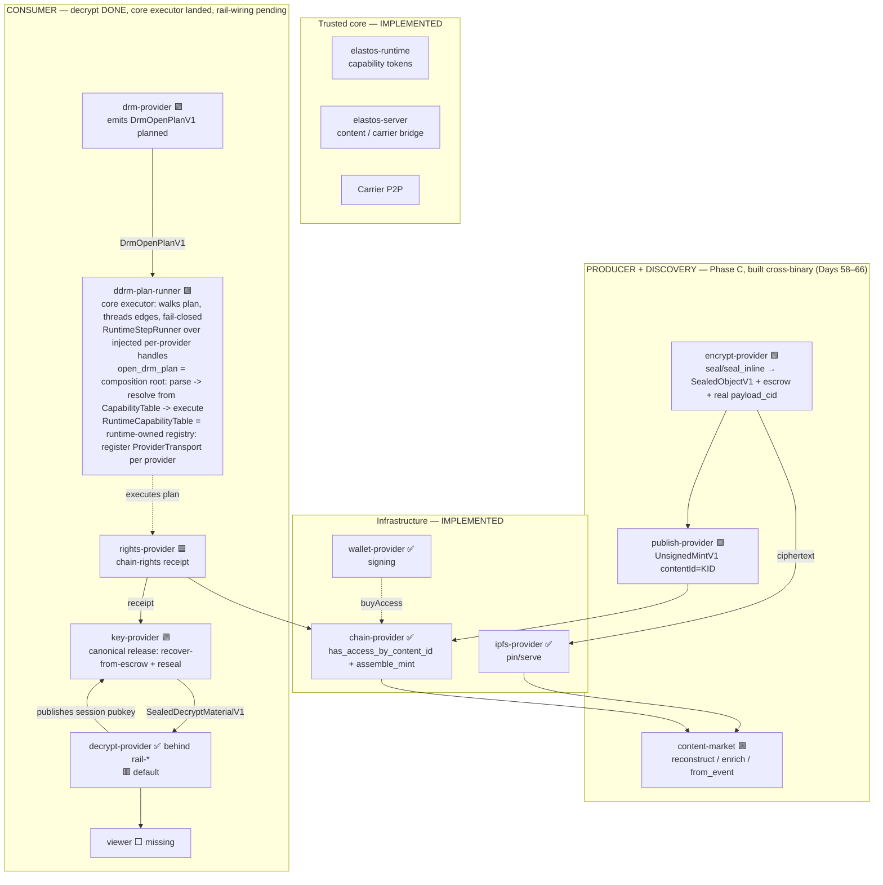
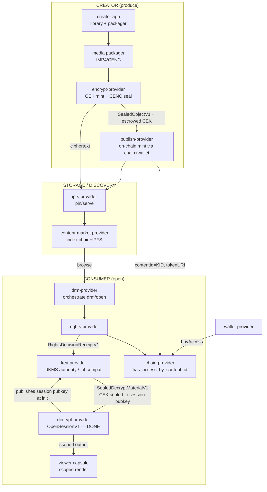

# dDRM System Architecture Map — where we are, where we're going

**Purpose.** A whole-system view: the full PC2/Elacity content journey (creator →
publish → market → purchase → download → validate → key → decrypt → playback),
mapped against what exists in the ElastOS runtime today, with a target architecture
and a phased, testable road to "buy a video, validate on-chain with my wallet,
receive the key, decrypt and play it" — entirely on capability-secure runtime
patterns, conforming to Anders' principles.

**Companion docs:** `CONVERGENCE_PLAYBOOK.md` (north star), `DDRM_STATUS.md` (chain
status), `DDRM_DECRYPT_RAIL.md` (the decrypt boundary, now complete behind flags),
`HANDOVER.md` (day log). This file is the *system* view; those are the *boundary* views.

---

## 1. The PC2 reference journey (what we are replicating the PATTERNS of)

PC2 is a Node/TypeScript app on **Base mainnet (EVM 8453)**, Elacity **dDRM V3**
contracts, with **Lit Protocol PKP ("Chipotle")** as the key-custody authority.

| # | Stage | PC2 implementation (pattern) | Trust anchor |
|---|---|---|---|
| 1 | **Creator upload + process** | `elacity-creator` app → `media.ts` encode pipeline (FFmpeg → Bento4 fMP4/CMAF) → **CEK = 16 random bytes** → `cenc-encrypt` WASM (AES-128-CTR, clear-leader) → MPD/PSSH | CEK minted locally, authority deferred to Lit + chain |
| 2 | **Sign + publish on-chain** | Channel contract `mint()`; operative sub-contract holds role tokens (`ACCESS_TOKEN_ID=1`); `contentId = KID` as `bytes16`; `tokenURI → ipfs://…/metadata.json` | Channel contract + AuthorityGateway |
| 3 | **IPFS storage + pin** | Helia + `@helia/unixfs`; supernode Kubo + cluster pin; `ipfs.ela.city` gateway | Content-addressed = untrusted transport (ciphertext safe anywhere) |
| 4 | **Market discovery** | `elacity-market` app; `ContentIndexerService` scans Base events → SQLite `content_catalog`; `/api/catalog` | Eventually-consistent index; chain is source of truth |
| 5 | **Purchase access token** | `AuthorityGateway.buyAccess(...)` (USDC/USDT/ETH); buys operative **Access Token (role 1)** | On-chain token ownership = access root |
| 6 | **Download to user node** | `ContentSeedingService.seedContent()`; writes `.ddrm` capsule descriptor; re-pins/serves | Encrypted blob; pin = availability not secrecy |
| 7 | **Validate + key release** | **Lit Action** (`universal-decrypt-chipotle.js`): checks `hasAccessByContentId(holder,kid)` on-chain → PKP decrypts CEK in TEE → **ECDH-seals CEK to viewer's ephemeral P-256 session** | Lit PKP + AuthorityGateway eth_call |
| 8 | **Decrypt + playback** | `ddrm-decrypt` WASM unwraps envelope → CENC segment decrypt → cleared fMP4 to dash.js / rendered pixels (`wasm-renderer`) | Decrypt runs in WASM on the node; client gets scoped output only |

**Binding invariant (the crown jewel):** `SHA256(cek ‖ kid ‖ authority)` at both
encrypt and decrypt; the CEK exists in clear only inside Lit TEE → ECDH envelope →
WASM memory, never on the wire, never to the app.

---

## 2. The runtime today (what we actually have)

The runtime is capability-secure: an Ed25519 capability-token core, WASM/WASI +
microVM (crosvm) transports, a `carrier_invoke` app→provider rail and a
runtime-mediated provider→provider rail, and honest fail-closed providers with
shared `protected_content` contracts.

**Legend:** ✅ implemented · 🟦 partial · 🟥 fail-closed skeleton · ⬜ missing

| PC2 stage | Runtime counterpart | Status | Evidence |
|---|---|---|---|
| 1 Creator upload | `library` + `object-provider` + `content` publish | 🟦 plain upload works; encrypted publish disabled | `capsules/library`, `elastos-server/src/content.rs` |
| 1 Process/encrypt | `encrypt-provider` (`seal`/`seal_inline`) | 🟩 **`seal` runs the full production pipeline on HANDED-IN bytes → complete `SealedObjectV1` (real `payload_cid`, bytes16-KID envelope, chain-validated suite; Day 69)**; CEK mint + CENC engine proven; `seal_inline` shares the same pipeline; both content-address the segment (CIDv1 raw/sha256, Day 68); fail-closed without handed-in bytes + recipient | `capsules/encrypt-provider` |
| 2 Publish on-chain | `publish-provider` → `chain-provider::assemble_mint` | 🟩 mint assembled + ABI-encoded + wired cross-binary (Days 61–63); live broadcast pending | `capsules/publish-provider`, `chain-provider` |
| 3 IPFS pin | `ipfs-provider` + `content` | ✅ Kubo-backed add/cat/pin; publish with pin | `capsules/ipfs-provider` |
| 4 Market discovery | `content-market` (mint→listing + metadata enrich) + `marketplace` (app catalog) | 🟩 listing reconstructed from mint calldata + metadata.json fused fail-closed (Days 64–65); live event-scan pending | `capsules/content-market` |
| 5 Purchase | `wallet-provider` + `chain-provider` | 🟦 signing + tx exist; **buyAccess not orchestrated by a content flow** | `capsules/wallet-provider`, `chain-provider` |
| 6 Download | `content` fetch + `ipfs-provider` + `availability-provider` | 🟦 fetch/pin work | `elastos-server/src/content.rs` |
| 7 Validate ownership | `rights-provider` → `chain-provider::has_access_by_content_id` | 🟦 **chain read is typed + tested**; rights-provider not yet calling it | `capsules/chain-provider`, `capsules/rights-provider` |
| 7 Key release | `key-provider` (`release`) | 🟩 **canonical `release` ACTUALLY releases (reference backend, Day 70)**: validates the rights receipt → recovers the producer-escrowed CEK from the rights-bound `key_envelope` → re-seals to the runtime-injected decrypt session as `SealedDecryptMaterialV1`; fail-closed on denied/expired/kid-swap/forged-producer; `dkms`/`lit` backends still `not_configured` | `capsules/key-provider` |
| 8 Decrypt | `decrypt-provider` | 🟥 default fail-closed; ✅ **crypto + rail COMPLETE behind `rail-*` flags (Days 45–49)** | `capsules/decrypt-provider` |
| 8 Playback/render | (viewer) | ⬜ no in-runtime decrypt→viewer path | — |
| — Orchestrator | `drm-provider` (`open`) | 🟩 emits executable `DrmOpenPlanV1` (`planned`): canonical sequence + binding edges, zero authority (Day 67) | `capsules/drm-provider` |
| — Plan executor | `ddrm-plan-runner` (runtime core) | 🟩 **fail-closed core that WALKS the `DrmOpenPlanV1`** — validates order + binding edges, threads each edge into the next step, fails closed on a broken/out-of-order edge; holds no authority (only the injected `StepRunner` touches a provider). `RuntimeStepRunner` resolves each step through INJECTED per-provider `ProviderHandle`s, refusing to build without a handle for every `next_required_providers` entry and rejecting a stray handle. **`open_drm_plan(plan, &mut CapabilityTable)`** is the single composition root: parse → resolve each handle from the runtime table → build → execute. **`RuntimeCapabilityTable`** is the runtime-owned registry: `register` a `ProviderTransport` per provider, `resolve` opens a fresh handle over it (`None` → fail-closed) (Day 71→74) | `capsules/ddrm-plan-runner` |

**Headline:** the **hardest, most security-critical boundary — decrypt — is done**
(transcript-bound, in-sandbox minted key, expiry+audit, suite-tagged material, all
fail-closed, wasm-clean). The surrounding **infrastructure largely exists** (IPFS,
chain reads incl. `has_access_by_content_id`, wallet/signing, content publish/fetch).
What's missing is the **live orchestration wiring**, the **producer side** (encrypt
seal + on-chain publish + content market), a **key authority** (the ElastOS-native
PQ-hybrid dKMS, or a Lit-compat backend), and a **viewer**.

---

## 2.1 Where to verify against PC2 (check-against index)

Every runtime stage must be validated against the **real** PC2 behaviour, not a guess.
PC2 repo root: `/Users/sash/Documents/Cursor/pc2.net/pc2-node`. When building a stage,
read the corresponding PC2 path(s) first and mirror the *pattern* (not the
web/Lit-specific plumbing — see §5).

| Stage | Runtime path | PC2 check-against path(s) |
|---|---|---|
| Creator upload | `capsules/library`, `elastos-server/src/content.rs` | `data/test-apps/elacity-creator/app.js`, `src/api/media.ts` |
| Process / encrypt (CENC) | `capsules/encrypt-provider` | `src/services/media/dashPackager.ts` (`generateCEK`), `crates/cenc-encrypt/`, `src/api/storage.ts` (`/lit/encrypt`) |
| Publish on-chain | `capsules/chain-provider`, (future `publish-provider`) | `data/test-apps/elacity-creator/app.js` (`mint`, `encodeOpRawData`), `src/api/drafts.ts` |
| IPFS pin/serve | `capsules/ipfs-provider`, `elastos-server/src/content.rs` | `src/storage/ipfs.ts`, `src/services/clusterPin.ts`, `src/services/ContentSeedingService.ts` |
| Market discovery | `capsules/content-market` (mint→listing), `capsules/marketplace` (app catalog) | `src/services/ContentIndexerService.ts`, `src/api/index.ts` (catalog), `data/test-apps/elacity-market/` |
| Purchase access token | `capsules/wallet-provider`, `capsules/chain-provider` | `data/test-apps/elacity-market/wallet.js` (`buyAccess`), `app.js` (`handleBuy`) |
| Validate ownership | `capsules/rights-provider` → `chain-provider::has_access_by_content_id` | `data/lit-actions/universal-decrypt-chipotle.js` (`hasAccessByContentId`), `src/services/ContentIndexerService.ts` |
| **Key release** | `capsules/key-provider` | `src/api/chipotle-client.ts` (`recoverCEKEnvelope`, `envelopeCEK`), `data/lit-actions/universal-decrypt-chipotle.js` |
| Decrypt | `capsules/decrypt-provider` | `crates/ddrm-decrypt/src/{lib,envelope}.rs`, `crates/cenc-encrypt/src/cenc.rs` |
| Playback / viewer | (future `viewer`) | `wasm-renderer/src/lib.rs`, `data/test-apps/ddrm-viewer/viewer.js`, `data/test-apps/pc2-media-runtime/player.js` |

**Binding to mirror everywhere:** PC2 binds `SHA256(cek ‖ kid ‖ authority)` at encrypt
and decrypt (`universal-decrypt-chipotle.js` step 8 + `dashPackager.ts`). Our
`DecryptTranscriptV1` binds a *superset* (principal/session/object/receipt/pubkey/
suite/nonce) via AEAD AAD + ML-DSA-65 — so any runtime key authority must produce
material bound to at least that transcript.

## 2.2 The key authority is pluggable (confirmed — Anders)

`key-provider` is the **authority boundary**, not a single key system. Inside it sit
interchangeable **key-delivery backends**, all producing the *same* suite-tagged
`SealedDecryptMaterialV1` the decrypt sandbox already consumes:

| Backend | Suite tag | Role |
|---|---|---|
| **Reference** (dev/native) | `elastos-pq-hybrid-threshold-v0` | In-runtime dev authority — lets us test the whole loop with no external deps |
| **ElastOS dKMS** (product) | `elastos-pq-hybrid-threshold-v0` | Production PQ-hybrid threshold authority (Anders/dKMS team) |
| **Lit / Chipotle** (compat) | `p256-classical-compat` | Migration backend for existing PC2 content; **not** the product root |
| Third parties (future) | (declared per backend) | Same `release → SealedDecryptMaterialV1` contract |

The selected backend is **operator/runtime config** (set at `init`), never an app
input — the shared `KeyReleaseRequestV1` stays byte-identical. Default = no backend
configured = `release` fails closed. This is the structural model Day 50 lands.

---

## 3. Architecture map — current state

**Legend:** ✅ done · 🟩 built cross-binary (offline-proven) · 🟦 partial · 🟥 fail-closed skeleton · ⬜ missing

The **producer→chain→discovery spine is built and proven cross-binary offline** (one
identity — the KID — flows `encrypt → publish → chain calldata → market listing`, and the
chain event, the calldata, and the IPFS metadata all agree). The **decrypt boundary is
COMPLETE** behind `rail-*`. What remains for a real purchase+playback is **live wiring**
(real RPC/IPFS), a **key authority** (dKMS / Lit-compat), the **drm-provider orchestration**,
and a **viewer**. A real end-user purchase+playback today still only works through the
external **ela.city** site in the Browser — evidence for the external path, not proof the
in-repo chain is production-complete.

---

## 4. Architecture map — target state (all ElastOS-native)

Every arrow is a capability-scoped provider invocation; no provider holds ambient
authority; the CEK only ever exists, in clear, inside the decrypt sandbox.

---

## 5. How the PC2 patterns move across (and what is dropped)

| PC2 pattern | ElastOS-native home | Notes / principle |
|---|---|---|
| CEK = 16B random, CENC AES-128-CTR fMP4 | `encrypt-provider` (engine proven) | Mint **inside** the wasm boundary; output has no CEK field (invariant #1) |
| KID as `bytes16` content id | shared `protected_content` + `chain-provider` | Already the rights-read key (`has_access_by_content_id`) |
| `SHA256(cek‖kid‖authority)` binding | `DecryptTranscriptV1` (extended: principal/session/object/receipt/pubkey/suite/nonce) | We bind **more** than PC2 — full transcript, AEAD + ML-DSA-65 sig |
| Lit PKP threshold custody | `key-provider` + **ElastOS-native PQ-hybrid dKMS** | Anders: Lit is a *compat backend behind key-provider*, not the product root |
| Lit ECDH-seal to viewer session | `key-provider` → `SealedDecryptMaterialV1` → `decrypt-provider` | Done both sides (dev-shaped): producer escrows the CEK, authority recovers + re-seals (Day 60 producer smoke) |
| `ddrm-decrypt` WASM unwrap + CENC | `decrypt-provider` rail-* | **Complete** (transcript-bound, in-sandbox key, expiry, audit) |
| AuthorityGateway `hasAccessByContentId` | `chain-provider::has_access_by_content_id` | Implemented + typed; `rights-provider` must call it |
| `buyAccess` / operative tokens | `wallet-provider` + `chain-provider` + a content-purchase flow | Signing exists; orchestration is the gap |
| Helia + cluster pin + `.ddrm` capsule | `ipfs-provider` + `content` + a download/seed flow | Pin/serve exist; the `.ddrm`-style launcher descriptor is missing |
| Channel/operative mint | `publish-provider` (intent) → `chain-provider::assemble_mint` (calldata) → wallet sign → broadcast | Intent DONE (Day 61); ABI calldata DONE (Day 62, decoded-to-spec); publish→chain wiring DONE cross-binary (Day 63, `ddrm-publish-smoke.sh`); live broadcast is the next step |
| SQLite `content_catalog` indexer | `content-market` provider | Listing reconstructed from mint calldata + chain event log + metadata.json enriched fail-closed (Days 64–66); live `eth_getLogs` wiring pending |
| secure-view render-to-pixels | a `viewer` capsule consuming decrypt scoped output | Missing |
| Puter IPC wallet bridge, Chipotle proxy, ela.city upload, supernode topology | **dropped** | PC2-shell / Lit-infra specific; replaced by capability model |

---

## 6. The road to a testable end-to-end (phased)

Goal: **"buy a video → wallet+chain validates ownership → key released sealed to my
decrypt sandbox → decrypt → play",** all on runtime providers. Phased so each phase
is independently testable and each conforms to fail-closed + capability principles.

### Phase A — Consumer half, runtime-native key authority (NO Lit, NO dKMS dependency) ✅ RUNNABLE
The single highest-value unblock. Build a **reference/dev key authority** inside (or
behind) `key-provider` that does what the Lit Action does, but ElastOS-native:
verify a `RightsDecisionReceiptV1`, then emit a `SealedDecryptMaterialV1` (CEK sealed
to the decrypt sandbox's published session key, transcript-bound, ML-DSA-65 signed).
Wire `drm-provider open → rights-provider → (chain has_access) → key-provider →
decrypt-provider OpenSessionV1`.
- **Status (Days 50–55):** A.1 pluggable multi-backend `key-provider`; A.2 reference
  seal engine + shared `ddrm-envelope` crate; A.3/A.3b PQ crypto deduped to one home;
  A.4 shared decrypt-transcript encoder + **the consumer half now RUNS end to end** via
  `scripts/ddrm-consumer-smoke.sh` — the real capsule binaries seal a golden CEK to a
  freshly-minted decrypt session and decrypt a CENC segment, fail-closed, no external deps.
- **Status (Day 67):** the orchestrator is no longer a skeleton — `drm-provider::open`
  emits a typed, executable **`DrmOpenPlanV1`** (status `planned`, never `opened`): the
  capsule-owned canonical `drm/open` sequence + its inter-step binding edges (rights ⇒
  `RightsDecisionReceiptV1` → `key.rights_receipt`; key ⇒ `ReleaseReceiptV1` →
  `decrypt.release_receipt`; one content identity == KID under both `content_id`/`object_cid`),
  holding zero authority (it PLANS, the runtime EXECUTES). `ddrm-consumer-smoke.sh` now drives
  the REAL `drm open` and FOLLOWS the plan (order + binding edges + content identity) instead
  of a hardcoded sequence — one canonical path owned by the capsule (PRINCIPLES #10).
- **Status (Day 70):** the CANONICAL `key-provider::release` (the op the Day-67 plan names)
  ACTUALLY releases for the reference backend. Audited PC2's Lit authority
  (`universal-decrypt-chipotle.js`: access-check `:560–568` → recover `Lit.Actions.Decrypt`
  `:570–575` → CEK↔KID↔authority bind `:577–590` → seal-to-session `envelopeCEK` `:602–608`).
  `release` validates the rights receipt, then for the reference backend RECOVERS the
  producer-escrowed CEK from the rights-bound `key_envelope.wrapped_cek` (recomputing the shared
  `escrow_aad`, verifying the producer vk) and re-seals it to the runtime-injected decrypt session
  as `SealedDecryptMaterialV1`. The per-session material rides in a capsule-local `session`
  context (shared `KeyReleaseRequestV1` byte-identical, drift untouched); fail-closed on
  no-backend/no-session/denied/expired/kid-swap/scheme-mismatch/forged-producer. key-provider
  27→33. `ddrm-consumer-smoke.sh` now escrows the golden CEK + drives the canonical `release`
  (recover→reseal) — removing the raw-CEK shim; the consumer half runs through the op the plan names.
- **Status (Day 71):** the runtime CORE now EXECUTES the plan. New fail-closed library
  `capsules/ddrm-plan-runner` walks the `DrmOpenPlanV1` instead of the smoke hand-walking it.
  Audited PC2's gated open sequencer (`secureViewSession.ts:61` resurrect-session →
  `media.ts:1163` `hasAccessByContentId` access gate → `:1196`/`:1216` recover + unwrap the CEK
  in-boundary — each stage gated on the prior). `DrmOpenPlan::parse` validates schema / `planned`
  status / the `rights<key<decrypt` canonical order / every binding edge; `execute` seeds the
  `drm_open` identities, walks the steps IN ORDER, threads each binding edge into the next step's
  declared field, and FAILS CLOSED on a broken / out-of-order edge or a step that drops its
  declared artifact. It holds NO authority — the only thing that touches a provider is the
  injected `StepRunner` (the runtime's capability seam). `ddrm-consumer-smoke.sh` now drives the
  REAL drm→rights→key→decrypt binaries THROUGH the core (the smoke is just the injected
  transport), and a TAMPERED binding edge is rejected cross-binary by the real key-provider.
  ddrm-plan-runner=14; drift untouched (the executor reads the plan, defines no shared contract).
- **Status (Day 72):** the runtime CORE now INJECTS per-provider capability handles into the
  executor. New `RuntimeStepRunner` (in `ddrm-plan-runner`) IMPLEMENTS the Day-71 `StepRunner` over
  a `BTreeMap<provider, ProviderHandle>` — one handle per provider the plan's
  `next_required_providers` names — routing each step to the handle for that step's `provider`,
  holding NO authority itself. Audited PC2's per-stage injected handle first: the middleware
  resurrects a `BackendSessionView` once per request (`secureViewSession.ts:124`) and threads it
  into the downstream stage (`media.ts:1207` → `recoverMediaCEK`/`recoverCEKEnvelope`; `:541`
  `/segment` reuses the same view) — a stage uses the handle it's given, never opens its own
  connection. Fail-closed construction: refuses to build without a handle for every required
  provider (no ambient default) and rejects a stray handle for an un-named provider, so the
  `blocked_authority` set is structurally unreachable from the runner type. The consumer smoke's
  monolithic `SmokeRunner` is replaced by three per-provider handles
  (`RightsHandle`/`KeyHandle`/`DecryptHandle`, each wrapping ONE real capsule binary) injected into
  the SAME runner the trusted core will use (no second code path). ddrm-plan-runner 14→21; drift
  untouched.
- **Status (Day 73):** the runtime CORE now has a single COMPOSITION ROOT. New `open_drm_plan(plan,
  &mut CapabilityTable)` parses the plan, RESOLVES each provider the plan requires from a
  runtime-supplied `CapabilityTable` (the analogue of PC2's backend-keyed session factory) at ONE
  point via `RuntimeStepRunner::resolve_from`, builds the runner, and executes — the one entrypoint
  the trusted runtime calls. Audited PC2's composition root first: the middleware resolves the
  per-stage handle once from `sessionService.getSessionView(token)` (dispatching on `stored.backend`,
  `BackendSessionService.ts:368`) and attaches it to request state (`secureViewSession.ts:124`→`:129`);
  the handler reads it from state and never re-resolves (`media.ts:481`→`:482`, helper takes `session`
  as a param `:1192`; doc forbids re-loading by token `secureViewSession.ts:13`). Fail-closed: parses
  before touching the table (a bad plan never reaches the runtime's capabilities), fails closed on a
  withheld required provider (zero step invocations), rejects a misrouting table. ddrm-plan-runner
  21→25; drift untouched.
- **Status (Day 74):** the runtime CORE now OWNS the capabilities. New `RuntimeCapabilityTable` is a
  registry of runtime-owned `ProviderTransport`s — the runtime `register`s one transport per provider
  at startup, and `open_drm_plan` → `resolve(provider)` OPENS a fresh handle over the registered
  transport, or `None` for an unregistered provider (→ fail closed). Audited PC2's transport ownership
  first: the runtime owns the factory as a process-lifetime singleton (`export const sessionService =
  new BackendSessionService(...)`, `BackendSessionService.ts:495`) and `getSessionView` constructs the
  per-backend transport it owns the means to build (`:368`–`:377`), `null` for an unknown token. New
  `ProviderTransport` (owned, registered once) vs `ProviderHandle` (fresh per-open) mirrors that.
  ddrm-plan-runner 25→29; drift untouched.
- **Conforms:** key-provider never exposes raw CEK; decrypt stays the only place the
  CEK is clear (proven on both inter-process wires); transcript-mismatch fails closed.
- **Still dev-shaped:** the `RuntimeCapabilityTable` is populated today with transports wrapping the
  smoke's spawned binaries; constructing the registry INSIDE a trusted runtime-core caller whose
  transports drive the runtime's REAL provider→provider rail (the smoke proves the registry; the core
  owns the real transports) so the open runs default-on inside the core is the next step. The
  `reference` backend is dev-only (production uses the `dkms`/`lit` backends, still `not_configured`);
  smoke is native (a `wasm32-wasip1` variant is a follow-up).

### Phase B — Real chain validation (Base) via `chain-provider` 🟦 UNDERWAY
Point `rights-provider` at `chain-provider::has_access_by_content_id` against the real
AuthorityGateway on Base, keyed by the KID. Now "do I own the access token?" is a real
on-chain check with your wallet.
- **Status (Day 56):** the `rights → chain` link is wired behind a `chain-rights` dev
  profile — `rights-provider` consumes the typed `has_access_by_content_id` answer
  (injected by the runtime core; it holds no chain-RPC capability), binds it to the
  request, and emits a `RightsDecisionReceiptV1` (owned → allowed, unowned → denied,
  foreign/stale → fail-closed). The consumer smoke drives this real decision and gates
  the key release on it.
- **Status (Day 57):** the on-chain answer is now **characterized and live-wireable**.
  `chain-provider::has_access_by_content_id` has golden tests over a mocked EVM `eth_call`
  proving owned (`true`), unowned (`false`), and **fail-closed on a malformed word**
  (`upstream_invalid_bool`); a guard test pins `chain-provider`'s output 1:1 onto the
  rights attestation shape (no drift possible without the guard failing). The consumer
  smoke gained an **opt-in live mode**: set `DDRM_SMOKE_CHAIN_RPC` (+ contract / selector /
  subject / contentId) and it builds + drives the **real `chain-provider`** against Base
  (your wallet vs the AuthorityGateway) and feeds the genuine answer into the rights
  decision; **offline default is unchanged** (deterministic mocked-owned, network-free).
- **Testable:** with a funded wallet holding an Elacity access token, run the smoke in
  live mode — the rights step returns allowed for owned content and denies otherwise.
  This is the exact "blockchain validation using my wallet" you described, driven by the
  runtime. **Remaining:** a real KID/contentId↔contract mapping for your content, and the
  runtime core (not the dev orchestrator) sequencing `chain → rights → key → decrypt`.

### Phase C — Producer half (encrypt → publish → IPFS → market) 🟦 UNDERWAY
Wire `encrypt-provider seal` (CENC + escrow CEK to the key authority), a
`publish-provider` (mint contentId=KID + tokenURI via chain+wallet), pin via
`ipfs-provider`, and a `content-market` index.
- **Status (Day 58 — contract pinned, fail-closed):** the producer↔consumer **identity
  join** is locked: re-reading PC2 confirmed the chain keys on `hasAccessByContentId(
  address holder, bytes16 contentId)` — the content identity is the **KID** (16 bytes),
  not the IPFS CID (`payload_cid` is a separate field). `kid_to_content_id_bytes16`
  proves the in-boundary KID is exactly that `bytes16 contentId` the consumer chain
  (`chain content_id → rights → decrypt object_cid → transcript`) keys on. The
  **CEK-escrow seam** (CEK → key authority, SEALED) is in place and **fail-closed** by
  default (`escrow: not_configured`); the producer never ships a raw CEK. In-boundary
  keygen + CENC are already proven (Days 19/31).
- **Status (Day 59 — escrow ENGINE real):** the reference `key-provider` now publishes a
  PQ-hybrid KEM **recipient key** (`seal_recipient_pub_b64`, distinct from its ML-DSA vk)
  and recovers a CEK escrowed to it (`recover_escrowed_cek`, fail-closed on KID-swap /
  forged producer). `encrypt-provider` (feature `escrow`) seals a freshly-minted CEK to
  that recipient via `ddrm-envelope` under the SHARED `escrow_aad`. The FULL spine is
  proven on a fresh CEK (no golden): producer mint → escrow → authority recover →
  re-seal to a decrypt session → decrypt opens the SAME CEK, no raw CEK across any
  boundary.
- **Status (Day 60 — producer half runs ACROSS REAL PROCESSES):** `encrypt-provider`
  (feature `escrow`) publishes a producer verifying key at `init` and gained a `seal_inline`
  wire op — mint a CEK *now*, CENC-encrypt fresh bytes into a decrypt-ready single-sample
  segment, escrow the CEK to the authority's recipient, zeroize, and return only
  `{kid, content_id, segment, wrapped_cek}` (no raw CEK / no plaintext). `key-provider`
  gained `release_from_escrow_ref` — recover the CEK from the escrow blob (+ producer vk +
  KID + scheme) and re-seal it to the decrypt session through the SAME sealing path as
  `release_ref` (tampered/foreign blob fails closed). `scripts/ddrm-producer-smoke.sh`
  drives `encrypt → key[recover+re-seal] → decrypt` over the three REAL binaries — a video
  sealed *now* decrypts *now*, no golden, fail-closed, no key/plaintext leak on any wire.
- **Status (Day 69 — the production `seal` op is real → complete `SealedObjectV1`):**
  `encrypt-provider::seal` (the non-inline op, fail-closed since Day 1) now runs the FULL
  pipeline on HANDED-IN asset bytes and emits a complete shared-contract `SealedObjectV1`.
  Audited PC2's producer input first (`dashPackager.ts`): the host reads each segment off disk
  (`readFileSync` `:504`, `:571–572`) and HANDS the bytes to the CENC WASM
  (`executeCENCEncrypt(.., seg.data)` `:432–434`) — the encoder fetches nothing. Mirrored: `seal`
  gained `content_b64`/`recipient_pub_b64`/`availability_receipt_cid` (optional, `deny_unknown_fields`
  preserved); given bytes + recipient it runs the ONE shared `run_seal_pipeline`
  (mint→CENC→content-address→escrow; `seal_inline` now delegates to it too, PRINCIPLES #10) and
  assembles a `SealedObjectV1` with the real Day-68 `payload_cid`, `key_envelope.kid` == bytes16
  contentId, `policy_hash = sha256(rights_policy_cid)`, and the PQ-hybrid suite the chain validates.
  NO fetch/IPFS/network authority. Fail-closed: no recipient/bytes → `not_configured`; missing
  receipt / empty viewer-interface / empty content → `invalid_request` (encrypt escrow 22→25).
  `ddrm-producer-smoke.sh` drives the REAL `seal`, deserializes the output into the SHARED
  `SealedObjectV1` and runs the SAME `validate_protected_content_key_envelope_algorithms` the
  `key-provider` runs — cross-binary proof the chain accepts the producer's object; no plaintext
  on the wire (the production output carries the sealed object only — no segment).
- **Status (Day 68 — the producer's `payload_cid` is REAL, not a placeholder):**
  `encrypt-provider` now content-addresses the sealed ciphertext IN-BOUNDARY —
  `payload_cid = CIDv1(raw 0x55, sha2-256)` of the segment, byte-for-byte what PC2's Helia
  `unixfs.addBytes` produces for single-chunk content (`@helia/unixfs` `add.ts`: `cidVersion:1,
  rawLeaves:true`, 1 MiB `fixedSize`). Pure function of the bytes, NO `kubo_api`/network (a CID
  is not a pin), fail-closed above one chunk (multi-block dag-pb refused). `seal_inline` returns
  it; the golden pins three inputs to the EXACT strings PC2's real `ipfs-unixfs-importer`
  emits. `ddrm-producer-smoke.sh` independently recomputes the CID via the canonical `cid` crate
  and demands a byte-for-byte cross-binary match. `payload_cid` (the IPFS address) stays a
  SEPARATE identity from the KID/`contentId` (the chain ownership key).
- **Status (Day 61 — `publish-provider` assembles the on-chain mint, fail-closed):** a new
  capsule that takes a sealed asset's KID + IPFS metadata folder and ASSEMBLES the content
  mint — but holds NO chain-RPC and NO wallet key. Audited PC2's real shapes
  (`elacity-creator/app.js`) and mirrored them: `contentId == bytes16 KID` (`kidToContentId`,
  `0x`+32 lowercase hex, no hash), `tokenURI = {metadataCid}/metadata.json`, mint
  `mint(string,uint16,bytes,bytes)` on the Channel, `opType ∈ {free=0,buy_once=1,
  buy_and_resell=2}`. `PreparePublish` emits a typed **`UnsignedMintV1`** (op/sell args left
  STRUCTURED for `chain-provider` to ABI-encode) + a `PublishReceiptV1` status `prepared`
  (never `published`) naming `chain-provider`+`wallet-provider` as the two providers that
  must finish the loop — the "core injects capabilities" pattern. Fail-closed on a
  non-`bytes16` KID, a paid listing without a price, a free listing with sale terms, or a bad
  channel address (publish=13).
- **Status (Day 62 — the mint becomes real EVM calldata):** `chain-provider::assemble_mint`
  (pure, no RPC/keys) ABI-encodes the PC2 `mint(string,uint16,bytes,bytes)` call byte-faithfully
  (FREE `opRawData=abi.encode(bytes16 contentId)` + empty `sellRawData`; PAID payee/royalty
  tuple + `sellRawData=(copies,price,payToken)`, trailing `uint16 resellerCut` iff
  BUY_AND_RESELL). It returns `{to,data,value}` that feeds the EXISTING
  `prepare_transaction → wallet-provider sign → broadcast_transaction (eth_sendRawTransaction)`
  seam — capability split intact. 10 tests DECODE the calldata back against the Solidity ABI
  spec (no ethers); fail-closed on a non-`bytes16` id, bad selector/channel, free-with-terms,
  paid-without-terms, or a mismatched reseller_cut.
- **Status (Day 63 — producer→chain loop closed cross-binary):** `publish-provider`'s
  `UnsignedMintV1` now emits STRUCTURED `op_raw` (`metadata_uri, addresses, role_types,
  amounts[, reseller_cut]`) + `sell` (`copies, price_wei, pay_token`) in the EXACT shape
  `assemble_mint` consumes — PC2-faithful payee arrays (creator ACCESS_TOKEN + ROYALTY_SHARE
  `amount=round(10*royalty)`, default `100−ELACITY_ROYALTY_PERCENT(5)`, BUY_AND_RESELL
  DISTRIBUTION_RIGHT for distributor "C" + `resellerCut` default 900). `ddrm-publish-smoke.sh`
  drives the REAL `publish (prepare) → chain (assemble_mint)` binaries so one identity flows
  KID → contentId → mint calldata (tokenURI + sell terms intact, assembler never signs);
  PAID and FREE both flow (publish=16, 3 new tests).
- **Status (Day 64 — the mint becomes discoverable):** new fail-closed `content-market`
  capsule reconstructs a typed `ContentListingV1` PURELY from the self-describing mint
  calldata (inverse of `assemble_mint`): `content_id` = the `bytes16` leading `opRawData`
  (== KID, no metadata round-trip), `tokenURI`→metadataCID via PC2's `extractCid`, opType,
  and `(copies,price,payToken)` from `sellRawData`. Holds NO chain RPC / NO IPFS / NO keys
  and mints nothing; human-facing enrichment (title/poster/mime, live event scan) is NAMED
  (`ipfs-provider` + `chain-provider`) but delegated. Runtime-superior vs PC2's 4-source
  `ContentIndexerService` (event + tokenURI eth_call + `metadata.kid` + AuthorityGateway
  price). `ddrm-market-smoke.sh` drives the REAL `publish → chain → content-market` so the
  listing's `content_id` IS the producer's KID. Fail-closed on foreign selector, bad
  offsets, non-`bytes16`, op_type/sell mismatch, unknown opType, bad channel.
- **Status (Day 65 — the listing gets its card, fail-closed):** `content-market::
  enrich_listing` fuses a resolved `metadata.json` (name/description/`image`‖`previewURL`
  poster/`media.uri`→contentCID/`contentType`→mime/`classifyAssetType`) onto the
  calldata-derived identity — but re-derives the contentId from the calldata and REJECTS any
  metadata whose `kid != content_id` (`identity_mismatch`), so metadata describes but never
  re-identifies (a hardening over PC2, which trusts `metadata.kid`). Still fetches nothing —
  the JSON is handed in by `ipfs-provider` (named). `ddrm-market-smoke.sh` drives `publish →
  chain → reconstruct → enrich` so a matching kid resolves and a tampered kid is rejected
  (content-market=22, +9 tests).
- **Status (Day 66 — the chain's own log reconstructs the same listing):** `content-market::
  listing_from_event` decodes a PC2 `DigitalAssetRegistered` log (on-chain `bytes16
  contentId` → SAME identity as the calldata path, `unresolved`) or an `AssetCreated` log
  (no contentId → `needs_kid`, identity deferred to `enrich_listing`'s kid-match, not
  guessed) into a `ContentListingV1`. Pure decode — the log bytes are handed in by
  `chain-provider` (no RPC). `ddrm-market-smoke.sh` builds a `DigitalAssetRegistered` log
  carrying our contentId and asserts the event path agrees with the calldata path
  (content-market=29, +7 tests). Fail-closed on unknown topic, missing topics, truncated
  data, bad emitter, unknown opType.
- **Remaining:** a live broadcast path (`assemble_mint → prepare_transaction → wallet sign →
  broadcast`), a live-Base read-only round trip (real `eth_getLogs` → reconstruct → enrich),
  and real `plaintext_ref`→IPFS in the producer op (today inline bytes for the smoke).
- **Testable:** create from `library`, publish, see it in the market, end to end.

### Phase D — Viewer + full loop
A `viewer` capsule that consumes the decrypt scoped output (rendered pixels / cleared
media segments) so the user actually *sees* the asset in-runtime.
- **Testable:** the complete journey you described, in-runtime, no ela.city.

### Upstream (blocked, parallel)
- Fold `SealedDecryptMaterialV1` into the shared `DecryptSessionRequestV1` (needs
  GitHub push access restored).
- Production PQ-hybrid threshold **dKMS** as the real key authority (Anders/dKMS team);
  Lit/Chipotle becomes a *compat backend behind key-provider* for migration.

---

## 7. Principle conformance (non-negotiable, per Anders + Playbook)

- **dDRM is the crown jewel** — every phase serves the protected-content loop.
- **Capability security** — each step is a capability-scoped provider call; no ambient
  authority; the decrypt VM has **no outbound key-fetch**.
- **Fail-closed** — all live wiring lands behind dev/feature profiles; default stays
  `not_configured`; the shared contract stays byte-identical until blessed.
- **CEK containment** — CEK clear only inside the decrypt sandbox, in `Zeroizing`,
  bound to the full transcript; never on the wire, never to the app.
- **ElastOS-native PQ-hybrid is the root; P-256/Lit is compatibility, not product truth.**
- **Contract-first, characterization tests before engines; isolated reversible commits.**

---

## 8. One-line status

The **decrypt boundary is complete**; the **infrastructure exists**; the **missing
middle is the key authority + orchestration wiring + producer/market/viewer**. The
fastest path to a thing you can *test* is **Phase A** (a runtime-native key authority
that feeds our already-proven `OpenSessionV1`), then **Phase B** (real Base validation
with your wallet).
