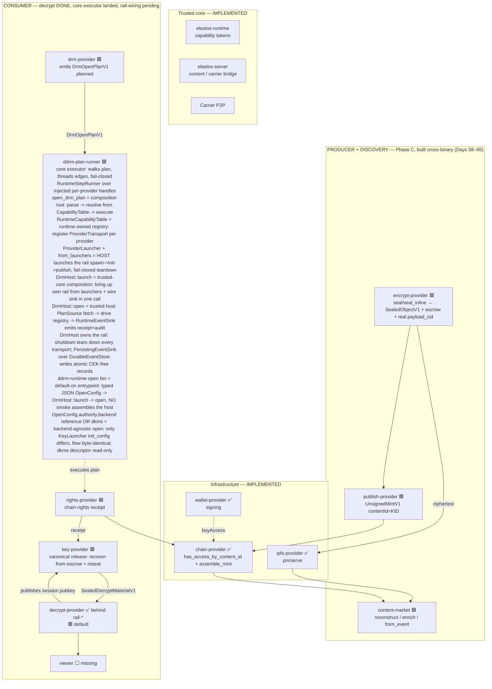

# dDRM System Architecture Map — where we are, where we're going

**Purpose.** A whole-system view: the full PC2/Elacity content journey (creator →
publish → market → purchase → download → validate → key → decrypt → playback),
mapped against what exists in the ElastOS runtime today, with a target architecture
and a phased, testable road to "buy a video, validate on-chain with my wallet,
receive the key, decrypt and play it" — entirely on capability-secure runtime
patterns, conforming to Anders' principles.

**Companion docs:** `CONVERGENCE_PLAYBOOK.md` (north star), `DDRM_STATUS.md` (chain
status), `DDRM_DECRYPT_RAIL.md` (the decrypt boundary, now complete behind flags),
`HANDOVER.md` (day log). This file is the *system* view; those are the *boundary* views.

---

## 1. The PC2 reference journey (what we are replicating the PATTERNS of)

PC2 is a Node/TypeScript app on **Base mainnet (EVM 8453)**, Elacity **dDRM V3**
contracts, with **Lit Protocol PKP ("Chipotle")** as the key-custody authority.

| # | Stage | PC2 implementation (pattern) | Trust anchor |
|---|---|---|---|
| 1 | **Creator upload + process** | `elacity-creator` app → `media.ts` encode pipeline (FFmpeg → Bento4 fMP4/CMAF) → **CEK = 16 random bytes** → `cenc-encrypt` WASM (AES-128-CTR, clear-leader) → MPD/PSSH | CEK minted locally, authority deferred to Lit + chain |
| 2 | **Sign + publish on-chain** | Channel contract `mint()`; operative sub-contract holds role tokens (`ACCESS_TOKEN_ID=1`); `contentId = KID` as `bytes16`; `tokenURI → ipfs://…/metadata.json` | Channel contract + AuthorityGateway |
| 3 | **IPFS storage + pin** | Helia + `@helia/unixfs`; supernode Kubo + cluster pin; `ipfs.ela.city` gateway | Content-addressed = untrusted transport (ciphertext safe anywhere) |
| 4 | **Market discovery** | `elacity-market` app; `ContentIndexerService` scans Base events → SQLite `content_catalog`; `/api/catalog` | Eventually-consistent index; chain is source of truth |
| 5 | **Purchase access token** | `AuthorityGateway.buyAccess(...)` (USDC/USDT/ETH); buys operative **Access Token (role 1)** | On-chain token ownership = access root |
| 6 | **Download to user node** | `ContentSeedingService.seedContent()`; writes `.ddrm` capsule descriptor; re-pins/serves | Encrypted blob; pin = availability not secrecy |
| 7 | **Validate + key release** | **Lit Action** (`universal-decrypt-chipotle.js`): checks `hasAccessByContentId(holder,kid)` on-chain → PKP decrypts CEK in TEE → **ECDH-seals CEK to viewer's ephemeral P-256 session** | Lit PKP + AuthorityGateway eth_call |
| 8 | **Decrypt + playback** | `ddrm-decrypt` WASM unwraps envelope → CENC segment decrypt → cleared fMP4 to dash.js / rendered pixels (`wasm-renderer`) | Decrypt runs in WASM on the node; client gets scoped output only |

**Binding invariant (the crown jewel):** `SHA256(cek ‖ kid ‖ authority)` at both
encrypt and decrypt; the CEK exists in clear only inside Lit TEE → ECDH envelope →
WASM memory, never on the wire, never to the app.

---

## 2. The runtime today (what we actually have)

The runtime is capability-secure: an Ed25519 capability-token core, WASM/WASI +
microVM (crosvm) transports, a `carrier_invoke` app→provider rail and a
runtime-mediated provider→provider rail, and honest fail-closed providers with
shared `protected_content` contracts.

**Legend:** ✅ implemented · 🟦 partial · 🟥 fail-closed skeleton · ⬜ missing

| PC2 stage | Runtime counterpart | Status | Evidence |
|---|---|---|---|
| 1 Creator upload | `library` + `object-provider` + `content` publish | 🟦 plain upload works; encrypted publish disabled | `capsules/library`, `elastos-server/src/content.rs` |
| 1 Process/encrypt | `encrypt-provider` (`seal`/`seal_inline`) | 🟩 **`seal` runs the full production pipeline on HANDED-IN bytes → complete `SealedObjectV1` (real `payload_cid`, bytes16-KID envelope, chain-validated suite; Day 69)**; CEK mint + CENC engine proven; `seal_inline` shares the same pipeline; both content-address the segment (CIDv1 raw/sha256, Day 68); fail-closed without handed-in bytes + recipient | `capsules/encrypt-provider` |
| 2 Publish on-chain | `publish-provider` → `chain-provider::assemble_mint` | 🟩 mint assembled + ABI-encoded + wired cross-binary (Days 61–63); live broadcast pending | `capsules/publish-provider`, `chain-provider` |
| 3 IPFS pin | `ipfs-provider` + `content` | ✅ Kubo-backed add/cat/pin; publish with pin | `capsules/ipfs-provider` |
| 4 Market discovery | `content-market` (mint→listing + metadata enrich) + `marketplace` (app catalog) | 🟩 listing reconstructed from mint calldata + metadata.json fused fail-closed (Days 64–65); live event-scan pending | `capsules/content-market` |
| 5 Purchase | `wallet-provider` + `chain-provider` | 🟦 signing + tx exist; **buyAccess not orchestrated by a content flow** | `capsules/wallet-provider`, `chain-provider` |
| 6 Download | `content` fetch + `ipfs-provider` + `availability-provider` | 🟦 fetch/pin work | `elastos-server/src/content.rs` |
| 7 Validate ownership | `rights-provider` → `chain-provider::has_access_by_content_id` | 🟦 **chain read is typed + tested**; rights-provider not yet calling it | `capsules/chain-provider`, `capsules/rights-provider` |
| 7 Key release | `key-provider` (`release`) | 🟩 **canonical `release` ACTUALLY releases (reference backend, Day 70)**: validates the rights receipt → recovers the producer-escrowed CEK from the rights-bound `key_envelope` → re-seals to the runtime-injected decrypt session as `SealedDecryptMaterialV1`; fail-closed on denied/expired/kid-swap/forged-producer. **Day 83–84:** `dkms` is now a fail-closed EXTERNAL-authority seam (resolves a STABLE signer + recipient from a HANDED-IN `dkms_authority_descriptor`, re-seals via the same contract). **Day 85–86:** `dkms` runs the open END-TO-END (the live smoke drives it) and now REQUIRES the descriptor's published-identity pins (`verifying_key_b64` + `recipient_pub_b64`) — a pinless descriptor fails closed. **Day 87–88:** `dkms` SPLITS into a SECRET-HOLDING NODE (`capsules/dkms-authority`) + a PUBLIC-ONLY runtime — the descriptor carries NO master (schema v2: pins + endpoint), and `release` DELEGATES recovery to the node (spawn + JSON-RPC `recover`); the master/CEK NEVER enter the runtime. **Day 89–90:** the delegation is an AUTHENTICATED CHANNEL — the client PINS the node vk + VERIFIES a `hello` attestation over a fresh challenge before delegating (forged/mismatched node refused at handshake), and the node RE-AUTHORIZES every `recover` in its own boundary (refuses a denied / content-or-principal-mismatched receipt) before touching key material. **Day 91–92:** the node is a LONG-LIVED CONNECTION the client opens ONCE + REUSES across releases, and `hello` mints a node-signed SESSION TOKEN the node REQUIRES on every `recover` (verified under its own vk + unexpired, fail-closed on missing/expired/forged/tampered) before re-auth — so a captured/forged handshake can't drive recovery; `lit` still `not_configured` | `capsules/key-provider`, `capsules/dkms-authority` |
| 8 Decrypt | `decrypt-provider` | 🟥 default fail-closed; ✅ **crypto + rail COMPLETE behind `rail-*` flags (Days 45–49)** | `capsules/decrypt-provider` |
| 8 Playback/render | (viewer) | ⬜ no in-runtime decrypt→viewer path | — |
| — Orchestrator | `drm-provider` (`open`) | 🟩 emits executable `DrmOpenPlanV1` (`planned`): canonical sequence + binding edges, zero authority (Day 67) | `capsules/drm-provider` |
| — Plan executor | `ddrm-plan-runner` (runtime core) | 🟩 **fail-closed core that WALKS the `DrmOpenPlanV1`** — validates order + binding edges, threads each edge into the next step, fails closed on a broken/out-of-order edge; holds no authority (only the injected `StepRunner` touches a provider). `RuntimeStepRunner` resolves each step through INJECTED per-provider `ProviderHandle`s, refusing to build without a handle for every `next_required_providers` entry and rejecting a stray handle. **`open_drm_plan(plan, &mut CapabilityTable)`** is the single composition root: parse → resolve each handle from the runtime table → build → execute. **`RuntimeCapabilityTable`** is the runtime-owned registry: `register` a `ProviderTransport` per provider, `resolve` opens a fresh handle over it (`None` → fail-closed). **`DrmHost::open(content_id, viewer)`** is the single trusted host entrypoint that owns the WHOLE open: a `PlanSource` fetches the plan, the registry drives it (`open_drm_plan`), and a `RuntimeEventSink` emits the plan's runtime-OWNED post-steps (`release_receipt` + `audit`) — fail-closed at every seam. The host OWNS THE RAIL (`DrmHost::shutdown` → `RuntimeCapabilityTable::shutdown` → `ProviderTransport::shutdown` tears down every owned transport) and PERSISTS the open (`PersistingEventSink` over an `EventStore` writes a durable, CEK-FREE `open_event_record` per runtime event). The host LAUNCHES the rail (`ProviderLauncher` + `RuntimeCapabilityTable::from_launchers` spawn → init → publish material per provider, fail-closed teardown of a partial rail) and persists through a production-shaped `DurableEventStore` (atomic `*.tmp`→`rename`, stable layout, idempotent, `load(dir)` read-back across a fresh process) (Day 71→80) | `capsules/ddrm-plan-runner` |

**Headline:** the **hardest, most security-critical boundary — decrypt — is done**
(transcript-bound, in-sandbox minted key, expiry+audit, suite-tagged material, all
fail-closed, wasm-clean). The surrounding **infrastructure largely exists** (IPFS,
chain reads incl. `has_access_by_content_id`, wallet/signing, content publish/fetch).
What's missing is the **live orchestration wiring**, the **producer side** (encrypt
seal + on-chain publish + content market), a **key authority** (the ElastOS-native
PQ-hybrid dKMS, or a Lit-compat backend), and a **viewer**.

---

## 2.1 Where to verify against PC2 (check-against index)

Every runtime stage must be validated against the **real** PC2 behaviour, not a guess.
PC2 repo root: `/Users/sash/Documents/Cursor/pc2.net/pc2-node`. When building a stage,
read the corresponding PC2 path(s) first and mirror the *pattern* (not the
web/Lit-specific plumbing — see §5).

| Stage | Runtime path | PC2 check-against path(s) |
|---|---|---|
| Creator upload | `capsules/library`, `elastos-server/src/content.rs` | `data/test-apps/elacity-creator/app.js`, `src/api/media.ts` |
| Process / encrypt (CENC) | `capsules/encrypt-provider` | `src/services/media/dashPackager.ts` (`generateCEK`), `crates/cenc-encrypt/`, `src/api/storage.ts` (`/lit/encrypt`) |
| Publish on-chain | `capsules/chain-provider`, (future `publish-provider`) | `data/test-apps/elacity-creator/app.js` (`mint`, `encodeOpRawData`), `src/api/drafts.ts` |
| IPFS pin/serve | `capsules/ipfs-provider`, `elastos-server/src/content.rs` | `src/storage/ipfs.ts`, `src/services/clusterPin.ts`, `src/services/ContentSeedingService.ts` |
| Market discovery | `capsules/content-market` (mint→listing), `capsules/marketplace` (app catalog) | `src/services/ContentIndexerService.ts`, `src/api/index.ts` (catalog), `data/test-apps/elacity-market/` |
| Purchase access token | `capsules/wallet-provider`, `capsules/chain-provider` | `data/test-apps/elacity-market/wallet.js` (`buyAccess`), `app.js` (`handleBuy`) |
| Validate ownership | `capsules/rights-provider` → `chain-provider::has_access_by_content_id` | `data/lit-actions/universal-decrypt-chipotle.js` (`hasAccessByContentId`), `src/services/ContentIndexerService.ts` |
| **Key release** | `capsules/key-provider` | `src/api/chipotle-client.ts` (`recoverCEKEnvelope`, `envelopeCEK`), `data/lit-actions/universal-decrypt-chipotle.js` |
| Decrypt | `capsules/decrypt-provider` | `crates/ddrm-decrypt/src/{lib,envelope}.rs`, `crates/cenc-encrypt/src/cenc.rs` |
| Playback / viewer | (future `viewer`) | `wasm-renderer/src/lib.rs`, `data/test-apps/ddrm-viewer/viewer.js`, `data/test-apps/pc2-media-runtime/player.js` |

**Binding to mirror everywhere:** PC2 binds `SHA256(cek ‖ kid ‖ authority)` at encrypt
and decrypt (`universal-decrypt-chipotle.js` step 8 + `dashPackager.ts`). Our
`DecryptTranscriptV1` binds a *superset* (principal/session/object/receipt/pubkey/
suite/nonce) via AEAD AAD + ML-DSA-65 — so any runtime key authority must produce
material bound to at least that transcript.

## 2.2 The key authority is pluggable (confirmed — Anders)

`key-provider` is the **authority boundary**, not a single key system. Inside it sit
interchangeable **key-delivery backends**, all producing the *same* suite-tagged
`SealedDecryptMaterialV1` the decrypt sandbox already consumes:

| Backend | Suite tag | Role |
|---|---|---|
| **Reference** (dev/native) | `elastos-pq-hybrid-threshold-v0` | In-runtime dev authority — lets us test the whole loop with no external deps. **Day 81–82:** with `init.config.authority_key_store` (a path) its signer + KEM recipient are persisted ONCE (one 32-byte master seed, atomic write, 0600) and re-derived deterministically every launch → a STABLE published recipient (escrow-at-publish), fail-closed on a corrupt store |
| **ElastOS dKMS** (product) | `elastos-pq-hybrid-threshold-v0` | Production PQ-hybrid threshold authority (Anders/dKMS team). **Day 83–84:** the seam is real + fail-closed — `init.config.dkms_authority_descriptor` (a path) RESOLVES the authority's stable signer + KEM recipient from a HANDED-IN descriptor (the dKMS-provisioned key material, READ never minted), VERIFIES it against the descriptor's published `verifying_key_b64`/`recipient_pub_b64` pins, and recovers/re-seals through the SAME `SealedDecryptMaterialV1` contract; no descriptor → "no dKMS node provisioned". **Day 85–86:** the pins are now REQUIRED (a pinless descriptor fails closed — a real external authority always publishes its identity) and the open runs against it end-to-end (`authority.backend:"dkms"`). **Day 87–88:** the REMOTE dKMS shape is now REAL — a SECRET-HOLDING NODE capsule (`dkms-authority`) owns the master + exposes only `recover` (recovers + re-seals in its own boundary), and `key-provider` holds a PUBLIC-ONLY descriptor (pins + endpoint, NO master, schema v2) and DELEGATES recovery to the node (spawn + JSON-RPC); a master-bearing descriptor is REJECTED, so the runtime holds NO recovery secret. **Day 89–90:** the delegation is now an AUTHENTICATED CHANNEL — `key-provider` PINS the node's published vk and VERIFIES a `hello` ATTESTATION over a fresh challenge before delegating (forged/mismatched node refused at handshake), and the node RE-AUTHORIZES every `recover` in its own boundary (refuses a denied / content-or-principal-mismatched receipt) before touching key material — the runtime-core analogue of pinning the Lit identity + the Lit action's in-TEE `hasAccessByContentId`. **Day 91–92:** the node is now a LONG-LIVED CONNECTION the client opens ONCE / proves identity ONCE / REUSES across releases (re-establishing fail-closed only on session expiry), and `hello` mints a node-signed SESSION TOKEN (binds the challenge + a bounded expiry) the node REQUIRES + verifies under its own vk on every `recover` — fail-closed on a missing/expired/forged/tampered token — the runtime-core analogue of PC2's per-view session resurrected per request to gate recovery (`secureViewSession.ts:81`–`:128`). **Day 93–94:** the node now has a REAL transport boundary — it BINDS + LISTENS on a Unix-domain socket and serves a length-prefixed FRAMED request/response (SAME JSON ops; one session per connection; torn/oversized/half-closed frame fails closed without wedging the daemon), the runtime CONNECTS rather than spawning, and the bearer session is NON-REPLAYABLE: `hello` binds the token to a caller-minted EPHEMERAL pubkey and every `recover` REQUIRES a signature under the matching private key the node verifies against the token-bound pubkey (a captured token replayed by a different/wrong-key caller is refused) — the runtime-core analogue of PC2's OWNER-BOUND session re-checked in the TEE (`secureViewSession.ts:87`–`:100`) + the Boson proxy's framed packets (`ProxyProtocol.ts:13`/`:251`/`:256`/`:371`). **Day 95–96:** the node now serves only a KNOWN, ALLOW-LISTED caller — an OPERATOR-provisioned `DKMS_AUTHORITY_ALLOWED_CALLERS` (resolved at daemon start, never client-overridable) makes `hello` refuse an unknown caller (`caller_not_authorized`) before minting a token; `key-provider` connects as its OWN stable identity (from a runtime-provisioned `dkms_caller_seed_b64`) which the runtime provisions into the allow-list — the OWNER-BOUND-to-a-registered-identity analogue (`secureViewSession.ts:87`–`:100`). Every `recover` is also FRESH: the possession proof binds a per-recover `recover_seq` and the node refuses any recover that does not strictly advance its session counter (a replayed recover frame is refused — the revocable-`nonce` analogue, `:108`–`:112`). A `threshold` descriptor (`t>1`/multi-node) fails closed at the runtime until the real 2-of-N CEK-share split lands. Next: REAL 2-of-N threshold — split the CEK across multiple secret-holding nodes so no single node holds the whole key |
| **Lit / Chipotle** (compat) | `p256-classical-compat` | Migration/legacy backend (Anders: "different dDRM providers in the capsule"). **Now operator-selectable END-TO-END** (`authority.backend:"lit"` in `ddrm-runtime-open` `OpenConfig`, not just at the `key-provider` contract). Lets LEGACY content whose CEK was escrowed to Lit's network keep being served THROUGH the runtime without a forced migration, while new content uses the owned `dkms` provider. No Lit proxy ships, so selecting it FAILS CLOSED at provision ("no Lit proxy is provisioned") — the seam is honest, never a silent stub. **Not** the product root |
| Third parties (future) | (declared per backend) | Same `release → SealedDecryptMaterialV1` contract |

The selected backend is **operator/runtime config** (set at `init`), never an app
input — the shared `KeyReleaseRequestV1` stays byte-identical. Default = no backend
configured = `release` fails closed. This is the structural model Day 50 lands. The
operator surface is `reference | dkms | lit` (the dev authority, the owned threshold
network, and the Lit/legacy slot) — strangler-fig coexistence: old (Lit) and new
(dKMS) satisfy one contract, routed one content/deployment at a time.

**Principle #4 (Carrier plane) — honest stance.** The dKMS node is reached via an
`endpoint` DESCRIPTOR (a Unix-socket path or `tcp:HOST:PORT`), so moving it
local↔LAN↔remote is a config change with **no capsule code change** — and the socket
is exactly the "host adapter below the capsule contract" #4 explicitly permits
(alongside HTTP/WebSocket/stdio/in-process). So #4 is **largely satisfied**, not the
gap an earlier audit implied. Residual: the inline socket adapter still lives in the
capsule (`#[cfg(unix)]`-gated), so a full Carrier-*capability* handoff (host provides
the call, capsule never names a transport) remains a future step — tracked with the
one-canonical-E2E-path work, not a correctness hole today.

**Content plane (Principle #4 + the content contract) — the canonical open now fetches
by CID.** Per `docs/CARRIER.md` the content contract is `capsule → content capability →
content-addressed backend → signed availability receipt`, with HTTP/Kubo as a *backend*,
never the capsule-facing path. The canonical `run` open (`scripts/dev/ddrm-runtime-open`,
all backends: reference / dkms / 2-of-2 / 2-of-3) **no longer inlines the ciphertext** —
the producer PUBLISHES it to a content-addressed store and the open **FETCHES it back by
its CIDv1** (`payload_cid_v1_raw`, raw + sha2-256, **byte-identical to `encrypt-provider`
and PC2/Helia single-chunk**) through a `content_capability_fetch` seam, verifying an
availability receipt. The capability **fails closed** on an unknown CID *and* on a tampered
backend (served bytes that don't hash back to the requested CID — content-addressing
integrity, so a corrupt/malicious store can never substitute content). No raw HTTP, no
daemon: the backend is in-process, and the production IPFS backend behind the **same
fetch-by-CID contract** is **Kubo** (the `ipfs-provider` capsule), which speaks the identical
CIDv1/dag-pb addressing — a backend change with zero change to the open path. (NB: iroh
Carrier is the runtime's P2P *transport* and uses BLAKE3 blob hashes, **not** IPFS CIDs — it
is the wire under a backend, not itself an IPFS content-addressed store; an earlier note that
listed "iroh Carrier" as a fetch-by-CID backend was imprecise.) Proven by harness unit tests
(CID byte-compat goldens + round-trip + fail-closed) and the live consumer open.

**Content plane — MULTI-MiB media (chunked UnixFS, Helia byte-compatible).** Real media is
multi-MiB, so the content plane now chunks beyond a single block exactly as `@helia/unixfs`
`addBytes` does (the call PC2 uses, `pc2-node/src/storage/ipfs.ts`): **1 MiB fixed-size raw
leaves** under a **dag-pb root** (`bafybei…`), with a single chunk collapsing to its raw leaf
(`bafkrei…`, Helia `reduceSingleLeafToSelf`). `ContentStore::put_chunked` stores the full block
graph (leaves + root); `content_capability_fetch_dag` fetches by the **root CID**, verifies the
root hashes to the requested CID, parses the dag-pb links, fetches + **per-leaf hash-verifies**
each chunk, and reassembles — checking the UnixFS `filesize` + per-leaf `blocksizes`. It **fails
closed** on a missing leaf, a tampered leaf or root (hash mismatch), or any length/structure
mismatch — a corrupt or malicious backend can never substitute, reorder, or truncate content
under a root the runtime trusts. The dag-pb encoding + root CIDs are pinned **byte-for-byte**
against the **real Helia importer** by `scripts/dev/unixfs-oracle` (a Node ground-truth oracle
using `@helia/unixfs` directly) — so a runtime-minted root CID is the SAME identity any IPFS/Helia
peer resolves to the same bytes. Proven by harness unit tests (oracle goldens for single-chunk
collapse + 2-/3-leaf dag-pb roots, round-trip, tampered-leaf / missing-leaf / tampered-root
fail-closed) and a live multi-MiB content-plane gate in the consumer smoke. Remaining: a balanced
**tree** above one root's fan-out (≈174 leaves / ~174 MiB) — fail-closed today, not guessed
without an oracle vector.

**Ownership plane (real-by-default) — the open REALLY asks the chain.** The wallet-ownership
gate is no longer a static `has_access: true`. The canonical open now drives the **real
`chain-provider`** `has_access_by_content_id` path end to end — encode the calldata → JSON-RPC
`eth_call` → decode the 32-byte ABI bool → rights decision — BY DEFAULT, with **no external
network**: `ddrm-runtime-open` stands up an **in-process JSON-RPC mock** (`ChainRpcMock`, an
ephemeral-loopback HTTP endpoint returning the canned ABI bool word) so the answer is
deterministic. Owned → the rights gate allows and the open proceeds; `DDRM_SMOKE_CHAIN_ACCESS=denied`
(or `ddrm-consumer-smoke.sh --deny-ownership`) flips the mock to not-owned and the open **fails
closed** at the rights gate ("the chain says you do not own it"). Point `DDRM_SMOKE_CHAIN_RPC`
at a real endpoint and the SAME path queries Base mainnet (your wallet vs the content's
on-chain `contentId`) — the mock is a drop-in for the RPC node, nothing else changes. Proven by
harness unit tests (mock serves the owned/denied bool word; well-formed 32-byte ABI word) and
the live consumer gates (owned opens; not-owned fails closed), across **all** authority backends.

**Decrypt boundary — MULTI-SEGMENT assets (DASH/fMP4).** Real media is many `moof+mdat`
fragments that share ONE presentation CEK. The decrypt boundary now opens the whole asset as a
SEQUENCE: `decrypt_session_segments` (in `decrypt-provider`) loops the in-VM single-segment
decrypt over N segments under the one CEK (with globally-unique per-sample IVs — the counter
continues across segments, so no IV is reused), summing the `sample_count` and reporting a
`segment_count`. It **fails closed on the first bad segment** (naming its index — never a
partially-decrypted asset) and preserves containment across the whole asset (the scoped response
carries counts, never bytes or the CEK). Proven by the encrypt↔decrypt SEAM golden:
`encrypt-provider`'s real engine emits a multi-segment fMP4 golden (3 fragments, sample counts
2/1/2, one CEK, continuing IVs) and `decrypt-provider` replays it — recovering every segment's
exact bytes, asserting the segment + summed-sample counts, and refusing a truncated segment. The
ladder seam gate now pins **four** round-trip goldens (single + multisample + subsample +
multisegment). Per-segment byte-tampering is caught EARLIER by the content plane's per-segment CID
integrity (above), before bytes reach the boundary.

**Multi-segment through the LIVE rail + transcript.** The multi-segment LIST now travels the full
live path — published, fetched by CID, released ONCE, decrypted in-VM — not just at the seam. The
binding is strictly **additive**: `DecryptTranscriptV1::to_aad_with_segments(Some(digests))` appends
the concatenation of each segment's content digest (the same digest under each segment's raw CIDv1)
AFTER `node_set_id`, so a single-segment open (`None`) is **byte-identical** to before, while a
multi-segment open is welded to the EXACT ordered, content-addressed set. The optional ordered
`extra_segments_b64` (segment 0 stays `ciphertext_b64`) threads key-provider release context →
`SealedDecryptMaterialV1` → the decrypt boundary, which recomputes the digests, rebuilds the
segment-bound AAD, and loops `decrypt_session_segments` under the ONE re-sealed CEK
(`decrypt_from_carrier_bound_segments` / `decrypt_pq_sealed_segments_bound` — CEK unwrapped once,
held in `Zeroizing` across the loop). A reorder/drop/add/**substitute** changes the digests, the
AAD no longer matches the seal, and the unwrap fails closed BEFORE any byte is decrypted — proven
LIVE by `multisegment_live_gate` (3 fragments → `segment_count==3`, `sample_count==5` summed; a
substituted fragment fails the whole open closed; no CEK/plaintext crosses out), which runs in every
verify-mode `ddrm-consumer-smoke.sh`. The threshold/quorum rails stay single-segment (a multi-segment
threshold material is refused up front).

**The runnable-E2E ladder is COMPLETE:** a content-addressed, multi-segment, owned asset opens
end-to-end with a real distributed key — fetched by CID, released once, decrypted in-VM, fail-closed
at every seam, no CEK/plaintext on any wire. Remaining (explicitly out of the runnable path): a
balanced dag-pb **tree** above ~174 leaves (the only fail-closed content-plane gap), and
multi-segment on the **threshold/quorum** rails (single-node multi-segment is live; the quorum rail
is single-segment by design today).

---

## 3. Architecture map — current state

**Legend:** ✅ done · 🟩 built cross-binary (offline-proven) · 🟦 partial · 🟥 fail-closed skeleton · ⬜ missing



The **producer→chain→discovery spine is built and proven cross-binary offline** (one
identity — the KID — flows `encrypt → publish → chain calldata → market listing`, and the
chain event, the calldata, and the IPFS metadata all agree). The **decrypt boundary is
COMPLETE** behind `rail-*`. What remains for a real purchase+playback is **live wiring**
(real RPC/IPFS), a **key authority** (dKMS / Lit-compat), the **drm-provider orchestration**,
and a **viewer**. A real end-user purchase+playback today still only works through the
external **ela.city** site in the Browser — evidence for the external path, not proof the
in-repo chain is production-complete.

---

## 4. Architecture map — target state (all ElastOS-native)

```mermaid
flowchart TB
  subgraph creator["CREATOR (produce)"]
    CAPP[creator app<br/>library + packager]
    PKG[media packager<br/>fMP4/CENC]
    ENC[encrypt-provider<br/>CEK mint + CENC seal]
    PUB[publish-provider<br/>on-chain mint via chain+wallet]
  end
  subgraph storage["STORAGE / DISCOVERY"]
    IPFS[ipfs-provider<br/>pin/serve]
    MKT[content-market provider<br/>index chain+IPFS]
  end
  subgraph consume["CONSUMER (open)"]
    DRM[drm-provider<br/>orchestrate drm/open]
    RTS[rights-provider]
    CHN[chain-provider<br/>has_access_by_content_id]
    KEY[key-provider<br/>dKMS CLIENT: PUBLIC-only descriptor, PINS node vk<br/>CONNECTS node socket ONCE framed, derives STABLE KNOWN caller identity, SIGNS each recover with a strictly-advancing recover_seq<br/>2-of-2 THRESHOLD: resolves TWO nodes, dual-recovers BOTH, WELDS two sealed shares — NEVER XOR-combines the CEK]
    NODE[dkms-authority nodes A+B 🟩<br/>SECRET-HOLDING (TWO daemons, distinct stores/sockets/allow-lists): each owns ONE share, BINDS+LISTENS framed Unix socket<br/>hello ENFORCES a KNOWN-caller ALLOW-LIST + binds SESSION TOKEN to caller pubkey<br/>recover REQUIRES possession proof + a FRESH recover_seq (anti-replay) + re-authorizes, re-seals its share in-boundary, never CEK/master/whole-key]
    DEC[decrypt-provider<br/>OpenSessionV1 — DONE]
    VIEW[viewer capsule<br/>scoped render]
  end
  WLT[wallet-provider]

  CAPP --> PKG --> ENC -->|SealedObjectV1 + escrowed CEK| PUB
  PUB -->|contentId=KID, tokenURI| CHN
  ENC -->|ciphertext| IPFS
  PUB --> IPFS
  IPFS --> MKT
  MKT -->|browse| DRM
  WLT -->|buyAccess| CHN
  DRM --> RTS --> CHN
  RTS -->|RightsDecisionReceiptV1| KEY
  KEY -->|1. CONNECT ONCE over framed socket: hello challenge + KNOWN caller pubkey — verify attestation vs pinned vk<br/>node checks the caller is ALLOW-LISTED, then binds SESSION TOKEN to caller pubkey| NODE
  KEY -->|2. recover MANY over the live socket+session: escrow + session key + rights receipt + SESSION TOKEN + POSSESSION PROOF + fresh recover_seq<br/>persistent conn, NO master| NODE
  NODE -->|EACH node verifies allow-list + token + possession proof + strictly-advancing recover_seq + re-authorizes receipt, then re-seals ITS share<br/>replayed recover / torn frame / forged share fails closed| KEY
  KEY -->|SealedDecryptMaterialV1 carrying TWO sealed shares (share1 + share2)<br/>each share sealed to session pubkey; the whole CEK is NEVER assembled here| DEC
  DEC -->|unwraps BOTH shares in-VM + XOR-combines to recover CEK ONLY in the sandbox, then scoped output| VIEW
  DEC -->|publishes session pubkey at init| KEY
```

Every arrow is a capability-scoped provider invocation; no provider holds ambient
authority; the CEK only ever exists, in clear, inside the decrypt sandbox.

---

## 5. How the PC2 patterns move across (and what is dropped)

| PC2 pattern | ElastOS-native home | Notes / principle |
|---|---|---|
| CEK = 16B random, CENC AES-128-CTR fMP4 | `encrypt-provider` (engine proven) | Mint **inside** the wasm boundary; output has no CEK field (invariant #1) |
| KID as `bytes16` content id | shared `protected_content` + `chain-provider` | Already the rights-read key (`has_access_by_content_id`) |
| `SHA256(cek‖kid‖authority)` binding | `DecryptTranscriptV1` (extended: principal/session/object/receipt/pubkey/suite/nonce) | We bind **more** than PC2 — full transcript, AEAD + ML-DSA-65 sig |
| Lit PKP threshold custody | `key-provider` + **ElastOS-native PQ-hybrid dKMS** | Anders: Lit is a *compat backend behind key-provider*, not the product root |
| Lit ECDH-seal to viewer session | `key-provider` → `SealedDecryptMaterialV1` → `decrypt-provider` | Done both sides: producer escrows the CEK at PUBLISH time to the authority's STABLE durable-key-store recipient (Day 81–82), authority recovers + re-seals per open (Day 60 producer smoke) |
| `ddrm-decrypt` WASM unwrap + CENC | `decrypt-provider` rail-* | **Complete** (transcript-bound, in-sandbox key, expiry, audit) |
| AuthorityGateway `hasAccessByContentId` | `chain-provider::has_access_by_content_id` | Implemented + typed; `rights-provider` must call it |
| `buyAccess` / operative tokens | `wallet-provider` + `chain-provider` + a content-purchase flow | Signing exists; orchestration is the gap |
| Helia + cluster pin + `.ddrm` capsule | `ipfs-provider` + `content` + a download/seed flow | Pin/serve exist; the `.ddrm`-style launcher descriptor is missing |
| Channel/operative mint | `publish-provider` (intent) → `chain-provider::assemble_mint` (calldata) → wallet sign → broadcast | Intent DONE (Day 61); ABI calldata DONE (Day 62, decoded-to-spec); publish→chain wiring DONE cross-binary (Day 63, `ddrm-publish-smoke.sh`); live broadcast is the next step |
| SQLite `content_catalog` indexer | `content-market` provider | Listing reconstructed from mint calldata + chain event log + metadata.json enriched fail-closed (Days 64–66); live `eth_getLogs` wiring pending |
| secure-view render-to-pixels | a `viewer` capsule consuming decrypt scoped output | Missing |
| Puter IPC wallet bridge, Chipotle proxy, ela.city upload, supernode topology | **dropped** | PC2-shell / Lit-infra specific; replaced by capability model |

---

## 6. The road to a testable end-to-end (phased)

Goal: **"buy a video → wallet+chain validates ownership → key released sealed to my
decrypt sandbox → decrypt → play",** all on runtime providers. Phased so each phase
is independently testable and each conforms to fail-closed + capability principles.

### Phase A — Consumer half, runtime-native key authority (NO Lit, NO dKMS dependency) ✅ RUNNABLE
The single highest-value unblock. Build a **reference/dev key authority** inside (or
behind) `key-provider` that does what the Lit Action does, but ElastOS-native:
verify a `RightsDecisionReceiptV1`, then emit a `SealedDecryptMaterialV1` (CEK sealed
to the decrypt sandbox's published session key, transcript-bound, ML-DSA-65 signed).
Wire `drm-provider open → rights-provider → (chain has_access) → key-provider →
decrypt-provider OpenSessionV1`.
- **Status (Days 50–55):** A.1 pluggable multi-backend `key-provider`; A.2 reference
  seal engine + shared `ddrm-envelope` crate; A.3/A.3b PQ crypto deduped to one home;
  A.4 shared decrypt-transcript encoder + **the consumer half now RUNS end to end** via
  `scripts/ddrm-consumer-smoke.sh` — the real capsule binaries seal a golden CEK to a
  freshly-minted decrypt session and decrypt a CENC segment, fail-closed, no external deps.
- **Status (Day 67):** the orchestrator is no longer a skeleton — `drm-provider::open`
  emits a typed, executable **`DrmOpenPlanV1`** (status `planned`, never `opened`): the
  capsule-owned canonical `drm/open` sequence + its inter-step binding edges (rights ⇒
  `RightsDecisionReceiptV1` → `key.rights_receipt`; key ⇒ `ReleaseReceiptV1` →
  `decrypt.release_receipt`; one content identity == KID under both `content_id`/`object_cid`),
  holding zero authority (it PLANS, the runtime EXECUTES). `ddrm-consumer-smoke.sh` now drives
  the REAL `drm open` and FOLLOWS the plan (order + binding edges + content identity) instead
  of a hardcoded sequence — one canonical path owned by the capsule (PRINCIPLES #10).
- **Status (Day 70):** the CANONICAL `key-provider::release` (the op the Day-67 plan names)
  ACTUALLY releases for the reference backend. Audited PC2's Lit authority
  (`universal-decrypt-chipotle.js`: access-check `:560–568` → recover `Lit.Actions.Decrypt`
  `:570–575` → CEK↔KID↔authority bind `:577–590` → seal-to-session `envelopeCEK` `:602–608`).
  `release` validates the rights receipt, then for the reference backend RECOVERS the
  producer-escrowed CEK from the rights-bound `key_envelope.wrapped_cek` (recomputing the shared
  `escrow_aad`, verifying the producer vk) and re-seals it to the runtime-injected decrypt session
  as `SealedDecryptMaterialV1`. The per-session material rides in a capsule-local `session`
  context (shared `KeyReleaseRequestV1` byte-identical, drift untouched); fail-closed on
  no-backend/no-session/denied/expired/kid-swap/scheme-mismatch/forged-producer. key-provider
  27→33. `ddrm-consumer-smoke.sh` now escrows the golden CEK + drives the canonical `release`
  (recover→reseal) — removing the raw-CEK shim; the consumer half runs through the op the plan names.
- **Status (Day 71):** the runtime CORE now EXECUTES the plan. New fail-closed library
  `capsules/ddrm-plan-runner` walks the `DrmOpenPlanV1` instead of the smoke hand-walking it.
  Audited PC2's gated open sequencer (`secureViewSession.ts:61` resurrect-session →
  `media.ts:1163` `hasAccessByContentId` access gate → `:1196`/`:1216` recover + unwrap the CEK
  in-boundary — each stage gated on the prior). `DrmOpenPlan::parse` validates schema / `planned`
  status / the `rights<key<decrypt` canonical order / every binding edge; `execute` seeds the
  `drm_open` identities, walks the steps IN ORDER, threads each binding edge into the next step's
  declared field, and FAILS CLOSED on a broken / out-of-order edge or a step that drops its
  declared artifact. It holds NO authority — the only thing that touches a provider is the
  injected `StepRunner` (the runtime's capability seam). `ddrm-consumer-smoke.sh` now drives the
  REAL drm→rights→key→decrypt binaries THROUGH the core (the smoke is just the injected
  transport), and a TAMPERED binding edge is rejected cross-binary by the real key-provider.
  ddrm-plan-runner=14; drift untouched (the executor reads the plan, defines no shared contract).
- **Status (Day 72):** the runtime CORE now INJECTS per-provider capability handles into the
  executor. New `RuntimeStepRunner` (in `ddrm-plan-runner`) IMPLEMENTS the Day-71 `StepRunner` over
  a `BTreeMap<provider, ProviderHandle>` — one handle per provider the plan's
  `next_required_providers` names — routing each step to the handle for that step's `provider`,
  holding NO authority itself. Audited PC2's per-stage injected handle first: the middleware
  resurrects a `BackendSessionView` once per request (`secureViewSession.ts:124`) and threads it
  into the downstream stage (`media.ts:1207` → `recoverMediaCEK`/`recoverCEKEnvelope`; `:541`
  `/segment` reuses the same view) — a stage uses the handle it's given, never opens its own
  connection. Fail-closed construction: refuses to build without a handle for every required
  provider (no ambient default) and rejects a stray handle for an un-named provider, so the
  `blocked_authority` set is structurally unreachable from the runner type. The consumer smoke's
  monolithic `SmokeRunner` is replaced by three per-provider handles
  (`RightsHandle`/`KeyHandle`/`DecryptHandle`, each wrapping ONE real capsule binary) injected into
  the SAME runner the trusted core will use (no second code path). ddrm-plan-runner 14→21; drift
  untouched.
- **Status (Day 73):** the runtime CORE now has a single COMPOSITION ROOT. New `open_drm_plan(plan,
  &mut CapabilityTable)` parses the plan, RESOLVES each provider the plan requires from a
  runtime-supplied `CapabilityTable` (the analogue of PC2's backend-keyed session factory) at ONE
  point via `RuntimeStepRunner::resolve_from`, builds the runner, and executes — the one entrypoint
  the trusted runtime calls. Audited PC2's composition root first: the middleware resolves the
  per-stage handle once from `sessionService.getSessionView(token)` (dispatching on `stored.backend`,
  `BackendSessionService.ts:368`) and attaches it to request state (`secureViewSession.ts:124`→`:129`);
  the handler reads it from state and never re-resolves (`media.ts:481`→`:482`, helper takes `session`
  as a param `:1192`; doc forbids re-loading by token `secureViewSession.ts:13`). Fail-closed: parses
  before touching the table (a bad plan never reaches the runtime's capabilities), fails closed on a
  withheld required provider (zero step invocations), rejects a misrouting table. ddrm-plan-runner
  21→25; drift untouched.
- **Status (Day 74):** the runtime CORE now OWNS the capabilities. New `RuntimeCapabilityTable` is a
  registry of runtime-owned `ProviderTransport`s — the runtime `register`s one transport per provider
  at startup, and `open_drm_plan` → `resolve(provider)` OPENS a fresh handle over the registered
  transport, or `None` for an unregistered provider (→ fail closed). Audited PC2's transport ownership
  first: the runtime owns the factory as a process-lifetime singleton (`export const sessionService =
  new BackendSessionService(...)`, `BackendSessionService.ts:495`) and `getSessionView` constructs the
  per-backend transport it owns the means to build (`:368`–`:377`), `null` for an unknown token. New
  `ProviderTransport` (owned, registered once) vs `ProviderHandle` (fresh per-open) mirrors that.
  ddrm-plan-runner 25→29; drift untouched.
- **Status (Day 75–76):** the runtime CORE now has a single TRUSTED HOST. New `DrmHost` owns a
  `PlanSource` (the seam to ask `drm-provider` for the plan), the Day-74 `RuntimeCapabilityTable`, and a
  `RuntimeEventSink`. `host.open(content_id, viewer)` fetches the plan, drives it through the registry
  (`open_drm_plan`), then emits the plan's runtime-OWNED post-steps (`release_receipt` + the open
  `audit`) in order. New `PlanStep.event` + `is_runtime_event()` lets the host emit the steps the
  executor only walks for ordering. Fail-closed: a bad plan never resolves a capability, a missing
  transport fails closed, a runtime event the sink cannot emit fails the open. Audited PC2's server-owned
  composition first: the `/init` route owns the whole open (`media.ts:133` route → `:481`/`:482` recover
  → `:489` `mediaSessionManager.create` → `:528` catch). The consumer smoke is now a THIN caller of
  `host.open`. ddrm-plan-runner 29→34; drift untouched.
- **Status (Day 77–78):** the trusted host now OWNS THE RAIL + PERSISTS the open. (1) Host-owned
  teardown: `ProviderTransport::shutdown` + `RuntimeCapabilityTable::shutdown` + `DrmHost::shutdown(self)`
  tear down every runtime-owned transport (each releases the connection it owns), fail-closed — the
  analogue of PC2's `ISessionView.dispose()` releasing the per-view WASM handle via `requestDrop`
  (`chipotle-client.ts:694`–`:698`/`:231`). (2) Persisting sink: a new `EventStore` seam +
  `PersistingEventSink` write each runtime-event step as a durable, CEK-FREE `open_event_record` (open
  identity + steps + decision + artifact NAMES, never VALUES); a store that cannot persist a declared
  event fails the open — the analogue of `mediaSessionManager.create` persisting the open + the audit log
  (`sessionManager.ts:50`–`:123`), minus the key material. The consumer smoke's transports OWN their
  capsules and `host.shutdown()` tears down the whole rail; the sink is a `FileEventStore` whose durable
  records the smoke reads back to prove no CEK/ciphertext/key leak. ddrm-plan-runner 34→38; drift untouched.
- **Status (Day 79–80):** the trusted host now LAUNCHES THE RAIL + PERSISTS THROUGH A PRODUCTION-SHAPED
  STORE. (1) `ProviderLauncher` seam + `RuntimeCapabilityTable::from_launchers(launchers)`: the HOST brings
  the rail up by LAUNCHING each provider (spawn → init → the provider PUBLISHES its material) in
  caller-supplied dependency order, registering each transport, fail-closed tearing down a partially-launched
  rail if any launch fails — the analogue of PC2's `BackendSessionService.createSession` launching a backend
  view via `WasmSessionView.createNew()` (mints + publishes the session key inside the runtime,
  `chipotle-client.ts:603`–`:613`/`BackendSessionService.ts:307`). (2) `DurableEventStore` (impl `EventStore`):
  ATOMIC write (`*.tmp`→`rename`), stable layout keyed by `content_id/event`, idempotent re-persist,
  fail-closed on I/O error, and `DurableEventStore::load(dir)` read-back across a FRESH instance (skips
  corrupt) — mirroring `FileSessionStore` (one file per id, mode 0600, `loadAll` across a restart skipping
  corrupt, `BackendSessionService.ts:107`/`:140`–`:196`). The consumer smoke hands the host LAUNCHERS
  (capsule binaries) not pre-provisioned capsules, and reads the durable records back through a fresh
  `DurableEventStore::load`. ddrm-plan-runner 38→43; drift untouched.
- **Status (Day 81–82):** the key authority gets a STABLE, DURABLE-KEY-STORE identity, so the producer
  ESCROWS the CEK at PUBLISH time to a recipient any later launch re-derives identically — collapsing the
  Day-79/80 "launch → publish → escrow → bind" dance. (1) `ddrm-envelope` DETERMINISTIC derivation:
  `mint_session_from_seed(seed)` (ML-KEM-768 `generate_deterministic(d,z)` + x25519 from-seed via
  domain-separated SHA-256 sub-seeds, NO RNG, byte-identical), `derive_seed(master,label)`, `random_seed()`;
  14→16. (2) `key-provider` reference authority DURABLE KEY STORE: `init.config.authority_key_store` (a path)
  loads-or-creates + atomically persists (`*.tmp`→`rename`, 0600) ONE 32-byte master seed and re-derives BOTH
  the signer + the KEM recipient from it (STABLE across processes; fail-closed on a corrupt store; the dev
  default still mints fresh per init); 33→35. (3) `ddrm-plan-runner` `DrmHost::launch(plan_source, launchers,
  events)`: the trusted-core composition helper bringing up its OWN rail + wiring the sink in one call; 43→45.
  Mirrors PC2's stable `DEFAULT_AUTHORITY` (baked into every video's PSSH at encode time, `dashPackager.ts:44`)
  vs the per-open `WasmSessionView` session key, and PC2's encode-time escrow `encryptMediaCEK(cek,kid) →
  authority: DEFAULT_AUTHORITY` (`dashPackager.ts:131`–`:140`). The consumer smoke runs a PUBLISH phase
  (escrow → durable fixture) then an OPEN phase via `DrmHost::launch` that RELAUNCHES the authority from the
  SAME store, PROVES the recipient is byte-identical across the relaunch, READS the fixture (never
  re-escrows), binds only the per-open session AAD. drift untouched.
- **Status (Day 131–135):** the quorum PROVES it served you — verifiable, publicly-auditable THRESHOLD ATTESTATION. Every
  threshold open emits a portable proof that *these specific t-of-n nodes* authorized *this* content for *this* principal
  under *this* decrypt session, checkable by ANYONE OFFLINE without trusting the runtime. Prior cycles made the quorum
  real (113–116), rotatable (117–120), reconfigurable (121–125), born-distributed (126–130) — but the audit trail was
  still a CEK-free record the RUNTIME wrote ABOUT ITSELF; a third party had to TRUST it was faithful. This unit closes
  that: the release proof is CO-SIGNED by the secret-holders themselves. KEY INSIGHT: each releasing node already holds a
  descriptor-pinned ML-DSA identity, so at `recover` (handed the node-set id + an expiry) it co-signs a domain-separated
  release attestation binding `(content_id, principal_id, right, node_set_id, decrypt_session_pub, kid, expiry)` — all
  members sign byte-identical preimages, so the boundary AGGREGATES the t co-signatures into one portable
  `QuorumReleaseProofV1`. The freshness is `decrypt_session_pub` (fresh per open → no cross-open replay). A STANDALONE
  verifier (`verify_quorum_release_proof`, pure, secret-free, from a file on disk) confirms: it NAMES the node-set
  (recompute `threshold_node_set_id_n(t, members)` — a proof cannot claim a set it isn't), a REAL quorum signed (≥ t
  DISTINCT members, no duplicate-padding), every counted signature verifies over the binding the RELYING PARTY expects
  (wrong principal/content/session fail), and it has not expired — a bad member is NAMED by index. Audited PC2 first: the
  Lit network is opaque and emits NO portable, independently-verifiable proof of WHICH nodes served an open; the only
  "audit" is whatever the app server logged about itself. The runtime is SUPERIOR: the evidence is signed by the
  secret-holders, so its authenticity does not depend on the runtime. (1) PRIMITIVE (ddrm-envelope 36→37):
  `DKMS_RELEASE_ATTEST_DOMAIN` + `release_attestation_message` + `sign_release_attestation`/`verify_release_attestation` +
  the offline `verify_quorum_release_proof` with `QuorumProofError` naming the bad node + a golden (genuine 2-of-3
  verifies; wrong-principal/replay/under-quorum/duplicate/expired/forged/wrong-set fail; a 3-of-5 reconfigured proof
  verifies). (2) NODE (dkms-authority 20→21): `recover` co-signs when handed `attest_node_set_id_b64`+`attest_expiry`,
  returns `release_attestation_b64` (fail-closed: omit rather than fabricate). (3) BOUNDARY (decrypt-provider): a real
  2-of-3 open decrypts AND aggregates the two attestations into an offline-verifiable proof. (4) RUNTIME + GATES 52–54
  (`dkms_release_attestation_gates` + a standalone `verify_quorum_release_proof_file`, THREE real daemons): (52) a genuine
  open emits a portable proof written to disk that the offline verifier confirms (names the set, real quorum, exact
  grant/session, zero key material); (53) under-quorum/wrong-principal/replayed/expired/forged all rejected with the node
  NAMED; (54) the proof names its node-set and composes — inseparably bound to the producing set (fails against a
  reconfigured set), and a proof that LIES about its id is rejected up front. Gate: ladder INTACT (ddrm-envelope=37,
  dkms-authority=21, decrypt-provider rail-material=75), drift PASS, ALL dDRM smokes green (2-of-3 now driving gates
  38–54), clippy clean.
- **Status (Day 126–130):** the CEK is BORN DISTRIBUTED — a verifiable Distributed Key Generation (DKG) so NO node, not
  even the provisioner, EVER holds the whole key. Day 113–116 made the threshold a real quorum, 117–120 gave it a
  rotation lifecycle, 121–125 made it reconfigurable — but the CEK was still GENERATED then SPLIT (the whole secret
  existed in one place for an instant). This unit closes that window: the key is born ALREADY SPLIT. The KEY INSIGHT
  (additive / Joint-Feldman DKG in our own GF(256) arithmetic): each member `i` acts as a DEALER drawing a FRESH
  degree-(t−1) polynomial `f_i` with a RANDOM private constant `c_i = f_i(0)`, routing each member `j` the sub-share
  `f_i(x_j)`; member `j` SUMS them into its share `F(x_j) = ⊕_i f_i(x_j)`, where `F = ⊕_i f_i` is degree (t−1) and
  `F(0) = ⊕_i c_i = CEK`. No member knows more than its OWN `c_i`, `t−1` members learn nothing of `F(0)`, and the CEK is
  assembled NOWHERE during generation — it materializes only transiently inside a decrypt (or the producer's encrypt)
  boundary at open. The producer (which must learn the CEK once to encrypt content) publishes a hiding+binding
  commitment `dkg_cek_binding`; at open the boundary re-derives it from its quorum, so an INCONSISTENT dealer (whose
  shares make quorum-subsets disagree) is CAUGHT. Audited PC2 first: PC2 has NO DKG — a Lit key is generated inside
  Lit's network with the dealer set, threshold, and policy opaque + immutable (the app never participates and cannot
  verify it), and Chipotle abandoned t-of-n for a single master PKP minted in one TEE (`chipotle-client.ts:1290`). The
  runtime OWNS verifiable distributed generation: no single point holds the key, not even at birth. (1) PRIMITIVE
  (ddrm-envelope 35→36): `dkg_sum_subshares` (the member's GF(256) XOR-sum combine) + `dkg_cek_binding` (the published
  commitment) + `dkg_aad`/`dkg_subshare_aad` (operator + dealer→target bindings); the dealer polynomial reuses
  `reshare_eval` (constant = a fresh contribution) + a golden 2-of-3 (born-distributed, any-two-reconstruct, binding
  verifies/rejects, fail-closed edges). (2) BOUNDARY (decrypt-provider): `decrypt_from_carrier_quorum_k` opens a
  DKG-born quorum (the shares are member shares of `F`, byte-identical in shape) + matches the binding (real-ML-DSA
  2-of-3 test, one share fails closed). (3) NODE (dkms-authority 19→20): `dkg_contribute` (a DEALER seals
  `dealer_x ‖ f_i(x_j)` to each member, coefficients master-derived + ceremony-bound) + `dkg_install` (a MEMBER
  authenticates each sub-share against its dealer→target binding, SUMS, re-escrows `x_j ‖ F(x_j)` to itself),
  operator-authorized, with a full live-protocol node test. (4) RUNTIME + GATES 49–51 (`dkms_dkg_gates`, THREE real
  daemons): (49) a fresh 2-of-3 CEK BORN distributed → any two reconstruct the SAME CEK, it matches the binding, no
  single share equals it; (50) VERIFIABLE — a tampered sub-share refused at install + the dealer NAMED, and the set
  SURVIVES a dead daemon; (51) generation is OPERATOR-BOUND, the node-set id DISTINCT, and the DKG-born shares COMPOSE
  with the re-share primitives (re-shared in-boundary, the same CEK preserved). Gate: ladder INTACT (ddrm-envelope=36,
  dkms-authority=20, decrypt-provider rail rungs +1), drift PASS, ALL dDRM smokes green (the 2-of-3 quorum smoke now
  driving gates 38–51), clippy clean.
- **Status (Day 121–125):** the QUORUM is RECONFIGURABLE — a LIVE 2-of-3 set is RE-SHARED into a 3-of-5 set across REAL
  daemons, so the THRESHOLD and the MEMBERSHIP both change while the CEK never reassembles, with no re-publish. Day
  113–116 made the threshold a real QUORUM; Day 117–120 gave it a rotation lifecycle at the SAME (t,n); this unit lets
  the (t,n) AND membership EVOLVE (2-of-3 → 3-of-5: more redundancy, a higher bar). The KEY INSIGHT (proactive
  re-sharing): an OLD member `i` holding `p(x_i)` draws a FRESH degree-(k−1) polynomial `q_i` with `q_i(0)=p(x_i)` and
  sends `q_i(y_j)` to each NEW node `j`; node `j` combines over the OLD-contributor Lagrange `P(y_j)=Σ λ_i·q_i(y_j)`, so
  `P(0)=Σ λ_i·q_i(0)=Σ λ_i·p(x_i)=p(0)=CEK` — a FRESH degree-(k−1) polynomial through the SAME secret. The threshold is
  now k, the membership is now m, an OLD share (on `p`) is dead against the new set (on `P`), every member touches only
  its OWN point, a single new share reveals nothing, and the CEK exists NOWHERE during the reconfiguration (all new
  nodes combine over the SAME fixed old quorum → one consistent `P`). Audited PC2 first: PC2 has NO reconfiguration
  concept — Lit's t, n, membership AND refresh policy are invisible + unconfigurable (a key is its threshold forever),
  and Chipotle abandoned t-of-n for a single master PKP (`chipotle-client.ts:1290`). (1) PRIMITIVE (ddrm-envelope 34→35):
  `lagrange_combine_at_zero(points)` (general t-point Lagrange at 0 — the 2-point `combine_cek_shamir2` generalized;
  serves BOTH the new-node sub-share combine AND the k-of-m reconstruction) + `reshare_eval(share, higher, y)` (the
  degree-(k−1) sub-share polynomial) + `reshare_aad`/`reshare_subshare_aad` (operator + contributor→target bindings) +
  a golden 2-of-3→3-of-5 (any 3 reconstruct, any 2 don't, old material dead, fail-closed edges). (2) BOUNDARY
  (decrypt-provider): `decrypt_from_carrier_quorum_k` (pins all m identities, reconstructs k IN-BOUNDARY, FAILS CLOSED
  below k; real-ML-DSA-65 3-of-5 test: any 3 decrypt, 2 fail closed, a replayed share never reaches quorum, a
  mis-indexed share refused). (3) NODE (dkms-authority 18→19): `reshare_contribute` (an OLD member emits sealed
  sub-shares) + `reshare_install` (a NEW member combines + re-escrows its share to itself), operator-authorized, with a
  full live-protocol node test. (4) RUNTIME + GATES 46–48 (`dkms_quorum_reconfigure_gates`, EIGHT real daemons): (46)
  re-share the live 2-of-3 into a 3-of-5 across real daemons → any three of five RELEASE + reconstruct the EXACT CEK;
  (47) FAILS CLOSED below k AND SURVIVES (m−k)=2 dead new daemons; (48) the install is OPERATOR-BOUND (a non-operator
  authorization refused live) and the OLD node-set pin no longer matches the reconfigured descriptor. Gate: ladder
  INTACT (ddrm-envelope=35, dkms-authority=19, decrypt-provider rail rungs +1), drift PASS, ALL dDRM smokes green (the
  2-of-3 quorum smoke now driving gates 38–48), clippy clean.
- **Status (Day 117–120):** the QUORUM now has a LIFECYCLE — a LIVE share-wise ROTATION of the 2-of-3 set to THREE
  successor nodes via per-node COORDINATE-BOUND refresh deltas `q(x_i)` (a degree-1 proactive-refresh polynomial with
  `q(0)=0` over GF(256)), so a quorum member can be decommissioned to a successor WITHOUT the CEK reassembling and
  WITHOUT weakening the quorum. The KEY INSIGHT: the dKMS node's `rotate_share` op is UNCHANGED across schemes — it
  blind-XORs its escrowed payload with the operator-sealed delta (`share' = share ⊕ delta`). The 2-of-2 XOR rail
  hands EVERY node the SAME mask (CEK invariant trivially); a Shamir quorum CAN'T (one mask shifts every share onto
  the same offset and corrupts the polynomial), so the operator adds `q(x)=refresh_coeff·x` with `q(0)=0` and hands
  each node a DIFFERENT `q(x_i)`. Because `q(0)=0` the reconstructed secret `p'(0)=CEK` is INVARIANT while every share
  moves to a NEW polynomial `p'(x)=p(x)⊕q(x)` (an OLD captured share is dead next to a refreshed one). The escrowed
  payload is the INDEXED share `x ‖ p(x)`, so each delta is `0x00 ‖ q(x_i)` — the leading zero PRESERVES the
  coordinate the decrypt boundary pins, the body refreshes. Audited PC2 first: PC2 has NO key-authority rotation at
  all (a pinned-constant redeploy, `chipotle-client.ts:125`, no content migration, no refresh of standing material)
  and a fortiori no quorum-aware proactive refresh — the runtime OWNS proactive secret-sharing refresh end to end, the
  textbook defense against a mobile adversary compromising one share at a time. (1) PRIMITIVE (ddrm-envelope 33→34):
  `shamir_refresh_delta(refresh_coeff, x)` → `0x00 ‖ (refresh_coeff·x over GF(256))` (fail-closed on x=0 / empty
  coeff) + a golden test proving the invariant / old-dead / coordinate-bound / fail-closed properties
  deterministically. (2) CLIENT (key-provider 47, test extended): optional `producer_vk3_b64` (the quorum
  generalization of `producer_vk2_b64`) — after a rotation share-3's escrow is signed by node C, so it authenticates
  under node C's identity (absent → byte-identical non-rotated rail). (3) RUNTIME + GATES 42–45
  (`dkms_quorum_rotation_gates`, THREE real successor daemons, `--nodes 3`): (42) all three rotate their indexed
  shares to fresh successors with coordinate-bound deltas → a fresh key-provider on the ROTATED 3-node descriptor
  opens the quorum → the boundary Shamir-reconstructs the EXACT original CEK; (43) the rotated rail SURVIVES a dead
  successor (C' down → A'+B' → exact CEK — availability outlives rotation, which the 2-of-2 rail structurally
  cannot); (44) the refresh kills OLD material (old node-set pin refuses the rotated descriptor; a successor refuses
  a predecessor's escrow; the old⊕rotated → garbage math is pinned by the envelope test); (45) the delta is
  COORDINATE-BOUND (rotating a node with another coordinate's delta — the 2-of-2 single-mask mistake — silently
  corrupts the quorum). The dKMS node + operator-only authorization edges + live revocation are byte-identical to the
  node op gates 32–35 already prove, so they are NOT duplicated. Gate: ladder INTACT (ddrm-envelope=34,
  key-provider[key-authority-ref]=47), drift PASS, ALL dDRM smokes green (incl. the 2-of-3 quorum smoke now driving
  all 45 gates), clippy clean.
- **Status (Day 113–116):** the threshold is REAL t-of-n — the CEK is SHAMIR-split 2-of-3 over GF(256) into INDEXED
  shares across THREE secret-holding dKMS nodes; ANY TWO live nodes serve an open, so the production rail SURVIVES a
  dead node while BELOW quorum it still fails closed. Audited PC2 first: PC2's only t-of-n is the LEGACY Lit
  `decryptAndCombine` (`non-media-decrypt.js:76`) — threshold BLS across Lit's own nodes, combined inside Lit's TEE;
  t, n, the membership, and the failover policy are all INVISIBLE and unconfigurable (availability is RENTED, not
  owned) — and its CURRENT Chipotle path abandoned t-of-n entirely for a SINGLE master PKP inside ONE TEE endpoint
  (`chipotle-client.ts:1290`). The runtime now OWNS what PC2 rents: explicit t and n, our own field arithmetic, an
  explicit quorum policy, and gated failover. (1) PRIMITIVES (ddrm-envelope 29→33): GF(256) arithmetic (`gf256_mul`
  over the AES polynomial 0x11B with constant control-flow; `gf256_inv` via a^254) + `split_cek_shamir2(cek, coeff)`
  (degree-1 `p(x)=cek[j]⊕coeff[j]·x` per byte, shares at x=1,2,3 — any single share information-theoretically
  useless) + `combine_cek_shamir2(x_a, share_a, x_b, share_b)` (Lagrange interpolation at x=0, distinct non-zero
  coordinates enforced, `Zeroizing` output, golden vector pinned) + `indexed_share`/`parse_indexed_share`
  (`x ‖ share` — the coordinate rides INSIDE the sealed envelope, authenticated by the escrow seal + every node
  re-seal, never forgeable cleartext JSON) + `threshold_node_set_id_n(t, vks)` — the n-node node-set identity,
  BYTE-IDENTICAL to the 2-node id so nothing re-pins on upgrade. (2) CLIENT (key-provider 45→47): the descriptor
  resolves a THREE-node `threshold` block (`t:2`, all node identities pairwise DISTINCT, fail-closed otherwise);
  `release_quorum` tries node A→B→C in order and succeeds with re-sealed indexed shares from ANY TWO live nodes — a
  dead node is a TOLERATED FAULT, not a failed open — while below quorum the release is REFUSED outright (no
  single-share material is ever emitted); the third share escrow is REQUIRED in the session context (a missing
  escrow is a config error, never a silent degrade). (3) DECRYPT BOUNDARY (rail-material 70→72): a THIRD pinned vk
  (`authority_vk3_b64`, requires vk2) flips the boundary into quorum mode; `decrypt_from_carrier_quorum` verifies
  EACH sealed share against the pinned node identities and REQUIRES the x-coordinate found INSIDE the authenticated
  payload to MATCH the verifying node's index — a MIS-INDEXED share fails even though its signature verifies, a
  DUPLICATED share (x_a == x_b — one secret-holder twice) is refused, and the Lagrange reconstruction happens ONLY
  in-boundary. (4) RUNTIME + GATES 36–41 (live daemons, real node-kills, through the production `DrmHost`):
  `authority.nodes` (2|3; 3 requires `threshold`; anything else fails closed), three-daemon provisioning, Shamir
  split at publish; (36) node C KILLED → the open SURVIVES (A+B serve, durable records persisted); (37) nodes A+C
  dead → BELOW quorum → fail closed, no record; (38) node A restored → a DIFFERENT live pair serves the same
  content (any-2-of-3, not a fixed pair); (39) node B killed → A+C serve — the x=1/x=3 Lagrange pair's first
  production use; (40) a MIS-INDEXED share (genuine node B re-sealing a payload that claims node A's x) fails at
  the boundary; (41) a DUPLICATED share (one node's re-sealed view in both material slots) fails closed. NEW
  `ddrm-consumer-dkms-quorum-smoke.sh` (`--threshold --nodes 3`); the 2-of-2 XOR rail (+ its rotation/revocation
  gates) is untouched and still green. Gate: ladder INTACT (ddrm-envelope=33, key-provider[key-authority-ref]=47,
  decrypt-provider[rail-material]=72), drift PASS, ALL dDRM smokes green, clippy clean.
- **Status (Day 109–112):** the secret-holders have a LIFECYCLE — live share-wise ROTATION to successor nodes with a
  proactive REFRESH, OPERATOR-ONLY authorization, and LIVE CALLER REVOCATION that outranks a live session. Audited PC2
  first: PC2 has NO key-authority rotation concept (a constant redeploy, `chipotle-client.ts:125`, or a supernode
  payload CID swap, `:1043`–`:1064` — nothing migrates content, nothing refreshes standing key material), and its
  revocation is an in-memory `revokedDelegations` Map capped at 10 000 entries (`utils/secureViewSession.ts:374`–`:399`)
  checked by HTTP middleware (`secureViewSession.ts:104`–`:112`) — the key-holding network never learns. The runtime is
  SUPERIOR on both counts: operator-SIGNED instructions land on the key-holding NODES themselves, and a rotation
  REFRESHES the shares so captured-then material is useless now. (1) PRIMITIVES (ddrm-envelope 27→29):
  `DKMS_ROTATE_DOMAIN` + `rotation_aad(kid16, source_recipient_pub, successor_recipient_pub)` — the operator seals the
  refresh delta TO the rotating node's escrow recipient, AEAD-bound to the exact rotation context (a delta for one kid
  cannot rotate another; a delta sealed for node A cannot drive node B; the rotated share cannot be REDIRECTED to an
  attacker's recipient); `DKMS_REVOKE_DOMAIN` + `sign_revocation`/`verify_revocation` over the caller's verifying key
  (operator-only; sibling-domain signatures refused). (2) NODE (dkms-authority 15→18): a pinned OPERATOR identity
  (`DKMS_AUTHORITY_OPERATOR_VK`, resolved once at daemon start, never client-settable; absent → lifecycle ops
  `not_configured`); NEW `rotate_share` — operator-seal verified FIRST, the current share unwrapped via the SAME
  authenticated path `recover` uses, `share' = share ⊕ delta` in `Zeroizing` (length-checked), re-escrowed to the
  SUCCESSOR under the shared escrow AAD signed by the rotating node's OWN identity; both nodes of the 2-of-2 rotate
  with the SAME delta so the CEK is invariant (share1′⊕share2′ = share1⊕share2) while an OLD captured share next to a
  NEW share is delta-masked garbage — and the whole CEK NEVER exists during rotation; NEW `revoke_caller`
  (operator-signed, idempotent) — the revoked set is DAEMON-LIFETIME state threaded through every connection, a revoked
  caller's `hello` is `caller_revoked` AND a `recover` under a still-LIVE session token is refused BEFORE signature
  work (revocation outranks a live session, enforced at the key-holder). On TCP, `rotate_share` + `revoke_caller` join
  `recover` behind the encrypted-channel gate. (3) CLIENT (key-provider 44→45): the release session context gained
  optional `producer_vk2_b64` — after a rotation each share's escrow is signed by the node that rotated it, so share-2
  recovers under the RIGHT producer identity. (4) RUNTIME + GATES 32–35 (live daemons, real successors, BOTH
  transports): a per-run operator ML-DSA keypair pinned into every daemon; (32) the FULL rotated rail — provision
  successors A′/B′, rotate BOTH old nodes with ONE operator-sealed delta, publish the rotated descriptor, and a FRESH
  key-provider opens the ROTATED 2-of-2 → the EXACT original CEK; (33) the refresh kills old material — old-share ⊕
  rotated-share ≠ CEK, a successor refuses its predecessor's escrow, the old fixture's node-set pin refuses the rotated
  descriptor; (34) rotation is OPERATOR-ONLY at the live daemon — impostor delta / tampered delta / redirected
  successor / no-operator node / plaintext-rotate-on-tcp ALL refused; (35) LIVE revocation — a forged revocation is
  refused (the caller stays served), the genuine operator revocation cuts the SAME live session off MID-STREAM and a
  fresh reconnect by the revoked caller is refused (the revoked set survives the connection). Drift untouched. Gate:
  ladder INTACT (ddrm-envelope=29, dkms-authority=18, key-provider[key-authority-ref]=45), drift PASS, all dDRM smokes
  green (both threshold smokes drive all 35 gates), clippy clean.
- **Status (Day 105–108):** the dKMS node is OFF LOCALHOST — a REAL network transport (TCP) with an app-layer
  ENCRYPTED, MUTUALLY-AUTHENTICATED channel built from our OWN primitives; the FULL 2-of-2 threshold rail passes over
  TCP (all 31 verify gates) and every hostile-network edge fails closed. Audited PC2 first: its dDRM network boundary
  is `https.get(url, { rejectUnauthorized: false, timeout: 5000 })` (`chipotle-client.ts:838`–`:851`) — TLS
  certificate verification DISABLED, the channel authenticates NOTHING; only the supernode provisioning payload
  carries an app-side signed envelope (`:737`–`:795`). Its Boson proxy does app-layer NaCl crypto_box encryption
  (`ProxyProtocol.ts:9`/`:21`/`:24`/`:251`) but never carries dDRM and authenticates the network peer, never the
  key-holding NODE. The runtime is SUPERIOR: the channel itself authenticates the node, frame by frame.
  (1) PRIMITIVES (ddrm-envelope 25→27): `attest_channel_key`/`verify_channel_key` — at `hello` the node signs its
  master-derived channel KEM key under its descriptor-pinned ML-DSA identity, so an attacker terminating the TCP
  connection can relay the genuine hello but CANNOT substitute its own KEM key; `channel_frame_aad(channel_id,
  direction, seq)` — every sealed frame is AAD-bound to its channel (the hello challenge), direction (no reflection),
  and strictly-advancing seq (no replay). (2) NODE (dkms-authority 13→15): `DKMS_AUTHORITY_LISTEN=tcp:HOST:PORT`
  binds a real `TcpListener` (same framed protocol; transport-generic `serve_connection_io`; 30 s server-side read
  timeout so a stalled peer can't wedge the sequential daemon); on TCP a plaintext `recover` is refused
  (`channel_required`) and ANY violation on an established channel — plaintext downgrade, tampered envelope, stale
  seq — DROPS the connection with no response (no oracle); `NodeAuthority` gained the channel keypair
  (domain-separated from the escrow recipient) and moved to the heap (boxed — dev-profile PQ stack pressure tipped
  2 MiB test threads). (3) CLIENT (key-provider 43→44): `tcp:` endpoints connect under EXPLICIT timeouts (connect
  5 s + read 5 s — the `httpsGet` analogue done right: a node that stalls mid-recover fails the release closed
  within a bounded window, no partial material, never a hang); the channel is REQUIRED on the network path — pure
  `resolve_node_channel_key` fails closed on a missing block / malformed key / SUBSTITUTED key / replayed challenge /
  impostor identity (unit-tested without a socket); `DkmsNodeConn` is transport-generic and seals/unseals every frame.
  (4) RUNTIME (+1 config test 10→11): `authority.transport` (`"unix"` default | `"tcp"`, requires dkms, unknown fails
  closed); OS-picked loopback ports published as `tcp:127.0.0.1:PORT` descriptor endpoints; daemon/probe/
  malformed-frame plumbing transport-generic; the adversarial probe establishes the channel on TCP so gates 13–17 run
  SEALED, like production. (5) GATES 28–31 (live daemon over real TCP): plaintext recover → `channel_required`;
  plaintext downgrade after establishment → dropped (daemon not wedged); a sealed frame with ONE flipped ciphertext
  byte → dropped; an attacker-substituted channel KEM key fails `verify_channel_key` under the pinned identity.
  (6) NEW `ddrm-consumer-dkms-tcp-smoke.sh` (`--threshold --transport tcp`) drives the ENTIRE 2-of-2 rail over TCP —
  all 31 steps, incl. node-fault gates 23–24 which over TCP are exactly the mid-rail network-drop semantics (a dead
  connection → fail closed, no partial CEK, no record). Drift untouched. Gate: ladder INTACT (ddrm-envelope=27,
  dkms-authority=15, key-provider[key-authority-ref]=44), drift PASS, all dDRM smokes green (reference + dkms +
  2-of-2 + the NEW tcp 2-of-2), clippy clean.
- **Status (Day 103–104):** the threshold's identity is now CRYPTOGRAPHIC + AUDITABLE — the node-set is welded into
  the decrypt-transcript AAD itself (a swapped node-set fails the AEAD open AT THE BOUNDARY, in the sandbox, even when
  every per-share signature verifies — not just at descriptor parse), every durable open record is STAMPED with the
  serving node-set identity (an auditor can prove WHICH secret-holders served an open after the fact), and ROTATION is
  fail-closed (a stale publish can never open against a rotated node-set). Audited PC2 first: its decrypt-side binding
  is `SHA-256(cek‖kid‖authority)` over a SINGLE authority address recomputed in the TEE
  (`universal-decrypt-chipotle.js:577`–`:589`); it has NO key-authority rotation concept (`chipotle-client.ts:125`/
  `:1043`/`:1064` — only manual provision-blob/CID redeploys); and its audit trail can never name the nodes that served
  a decrypt (opaque inside Lit). The runtime is SUPERIOR on all three counts. (1) `DecryptTranscriptV1` gained an
  OPTIONAL `node_set_id` appended to `to_aad()` only when present — the single-node encoding stays BYTE-IDENTICAL and
  the threshold AAD is a strict extension (ddrm-envelope 24→25). The runtime seals the open under the
  descriptor-derived node-set (new shared `derive_node_set_from_descriptor` — ONE derivation for the pin check, the
  AAD, and the rotation gate); the dkms nodes seal to the AAD unchanged (opaque bytes — no node-protocol change).
  (2) `decrypt-provider`'s threshold path derives the SAME id from its OWN pinned vks
  (`threshold_node_set_id(2, authority_vk, authority_vk2)`) into `prepare_bound_open`, so the AAD it opens under names
  exactly the secret-holders IT trusts; a threshold-provisioned boundary additionally REFUSES a single-share material
  outright (never accepts a degraded release). rail-material 68→70. (3) a runtime-open `NodeSetStampingSink` persists
  the SAME CEK-free `open_event_record` shape + stamps `node_set_id_b64` into every threshold open record (public hash
  over public vks; single-node records byte-identical); the smoke reads them back fresh and asserts the stamp equals
  the producer pin. (4) verify gate 26 (live, cross-binary): a release whose AAD names a FORGED node-set SUCCEEDS at
  the key capsule (both nodes re-seal honestly — they cannot catch it) and is REFUSED by the live decrypt capsule.
  (5) verify gate 27 (rotation): a REAL freshly-provisioned node B′ + a rotated descriptor is REFUSED by the old
  fixture's pin via the same derivation `run()` enforces — a rotation is a NEW publish; the rotated descriptor
  re-derives stably for fresh publishes. Drift untouched. Gate: ladder INTACT (ddrm-envelope=25,
  key-provider[key-authority-ref]=43, decrypt-provider rail-material=70), drift PASS, all dDRM smokes green
  (reference + dkms single-node + the dkms 2-of-2 with gates 26–27 + the stamped-record read-back), clippy clean.
- **Status (Day 101–102):** the live 2-of-2 threshold is now RESILIENT + IDENTITY-BOUND — the production `DrmHost`
  rail provably FAILS CLOSED under a real node fault (either secret-holder down: no partial CEK, no single-node
  fallback, no record persisted), and a silently SWAPPED node-set is DETECTED before the rail recovers anything.
  Day 99–100 wired the threshold into the real open; this cycle proves it survives faults + pins WHO backs it.
  Audited PC2 first: PC2's run-path resilience STOPS at retrying the whole opaque Lit RPC (`chipotle-client.ts:575`:
  `RequestExpired` → "retry by re-running the Lit action") — a downed/swapped node lives INSIDE Lit's network, so PC2
  has NO per-node fault semantics and NO inspectable node-set identity it can pin. The runtime is SUPERIOR — it owns
  the two nodes and expresses both. (1) NODE-SET IDENTITY (single source of truth): new pure
  `ddrm_envelope::threshold_node_set_id(t, vk_a, vk_b)` = domain-separated, length-prefixed `SHA-256` over both nodes'
  vks + `t` (order-sensitive; 23→24). `publish_escrow` PINS it into the durable fixture (`node_set_id_b64`); `host.open()`
  RE-DERIVES it from the published descriptor's `threshold` block and FAILS CLOSED on a mismatch (a node re-pointed at a
  different secret-holder is caught BEFORE recovery, independent of the boundary's per-share seal check). (2) LIVE
  NODE-FAULT gates 23–24 (verify, threshold-only): with the full 2-of-2 rail up, KILL node B's daemon → `host.open()`
  fails closed + persists no record, restore; KILL node A's daemon → same; node A is RESTARTED so the post-shutdown
  socket probes (steps 13–17) still connect (the daemon guards `dkms_daemon`/`dkms_daemon_b` are now `mut`). (3) SWAP
  DETECTION gate 25: a descriptor whose node B is swapped to a rogue ML-DSA identity re-derives to a DIFFERENT
  node-set-id than the pin — detected end-to-end (and the boundary independently rejects the rogue's seal under node B's
  pinned vk, Day 97–98 step 20 — the swap fails at BOTH layers). Drift untouched (the node-set-id is a runtime-owned
  durable artifact + a pure envelope primitive). Gate: ladder INTACT (ddrm-envelope=24, key-provider[key-authority-ref]=43,
  decrypt-provider rail-material=68), drift PASS, all dDRM smokes green (reference + dkms single-node + the dkms 2-of-2
  with the new node-fault + swap gates), clippy clean.
- **Status (Day 99–100):** the 2-of-2 threshold now runs through the PRODUCTION `DrmHost` run-path, not just the
  verify-mode probe — the happy open itself provisions TWO secret-holding nodes, XOR-splits the CEK at publish,
  dual-recovers BOTH, and reconstructs the CEK ONLY inside the decrypt boundary (the CEK never exists whole before
  the boundary). Day 97–98 landed the threshold crypto + a SELF-CONTAINED probe; this cycle wires it into the real
  open. Audited PC2 first: PC2's run-path delegates recovery with ONE Lit RPC (`recoverCEKEnvelope`,
  `chipotle-client.ts:1438`) and NEVER collects shares from multiple nodes in its OWN code — `decryptAndCombine` is
  the LEGACY Datil threshold whose share-set/nodes/combine live entirely inside Lit's opaque network
  (`chipotle-client.ts:1297`), and the current Chipotle path is a single-node PKP-AES TEE decrypt. PC2's runtime STOPS
  at one opaque RPC; the runtime is SUPERIOR — two OWNED, inspectable nodes driven end to end inside its own host +
  boundary. (1) `OpenConfig.authority.threshold` (bool) promotes the dkms open to 2-of-2 (fail-closed if
  `backend != dkms` or non-boolean; +2 bin tests, 8→10) — a boolean knob, since the runtime provisions BOTH nodes from
  the same node binary and OWNS producing the descriptor's `threshold` block. (2) `publish_escrow` provisions node A +
  node B (distinct stores/sockets/allow-lists), `split_cek_xor`s the CEK (share-1→A, share-2→B; neither sees the whole
  key), publishes a `threshold` descriptor (`t:2`, both nodes), and the fixture carries `wrapped_cek_share2_b64` +
  node B's `vk2_b64`. (3) the `DrmHost` starts BOTH daemons, binds share-2, passes node B's vk to the `DecryptLauncher`
  (`authority_vk2_b64`), and `KeyHandle` supplies `wrapped_cek_share2_b64` in the release session — so `host.open()`
  drives the full dual-recover + in-VM XOR combine; a threshold↔descriptor desync fails closed. (4) INTEGRATION FIX:
  `merge_threshold_material` welds node B's share into node A's NESTED `material.sealed_cek_share2_b64` (the Day 97–98
  merge read a top-level field the real node never emits — never exercised end-to-end until the full run-path;
  key-provider[key-authority-ref] stays 43). (5) verify gates 21–22 (threshold-only): the live rail refuses a one-share
  release; a 3-of-N descriptor fails closed at key-provider init. NEW `ddrm-consumer-dkms-threshold-smoke.sh`
  (+ `--threshold` flag) drives the whole 2-of-2 open cross-binary; reference + single-node dkms stay green. Drift
  untouched. Gate: ladder INTACT (ddrm-envelope=23, key-provider[key-authority-ref]=43, decrypt-provider
  rail-material=68), drift PASS, all dDRM smokes green (reference + dkms single-node + the NEW dkms 2-of-2), clippy clean.
- **Status (Day 97–98):** the threshold is REAL — the CEK is XOR-split 2-of-2 across TWO secret-holding dKMS nodes,
  so no single node ever holds the whole content key, and the runtime reconstructs it ONLY inside the decrypt boundary.
  Day 95–96 left a fail-closed threshold STUB; this cycle makes 2-of-2 real end to end. Audited PC2 first: PC2's
  threshold is the OPAQUE Lit `decryptAndCombine` (`non-media-decrypt.js:76`) — the share set, node membership, and
  combine all live INSIDE Lit's proprietary network, uninspectable. The runtime is SUPERIOR: an EXPLICIT, owned,
  inspectable 2-node split with the combine in our OWN sandbox. (1) `ddrm-envelope` gained pure `split_cek_xor(cek, mask)`
  (producer: `share1=mask`, `share2=cek⊕mask`) + `combine_cek_xor → Zeroizing` (decrypt boundary; fail-closed on a
  length mismatch); 22→23. (2) `decrypt-provider` reconstructs IN-VM — `SealedDecryptMaterialV1` gained an optional
  `sealed_cek_share2_b64`, the boundary an optional `authority_vk2_b64`; `rail_shim::decrypt_from_carrier_threshold`
  unwraps BOTH sealed shares (each under ITS node's vk, same transcript), XOR-combines in `Zeroizing`, then decrypts —
  the whole CEK exists ONLY in the sandbox, never in `key-provider`; single-share path unchanged; rail-material 65→68.
  (3) `key-provider` REPLACED the stub: `build_dkms_client` resolves a 2-of-2 `threshold` descriptor into TWO public
  clients (3-of-N/identical/malformed fail closed); `release` dual-recovers BOTH nodes (per-node connection, known-caller,
  fresh `recover_seq`, possession proof) and `merge_threshold_material` welds two re-sealed shares into one material
  WITHOUT XOR-combining (the second escrow rides in `wrapped_cek_share2_b64`); 42→43. `ddrm-runtime-open` verify mode
  adds a 2-of-2 probe (steps 18–20): TWO real daemons (distinct stores/sockets/allow-lists), share-1→node A +
  share-2→node B, recover from EACH, reconstruct the EXACT CEK in-boundary — a single share is USELESS and a FORGED
  second share fails closed under node B's vk. Drift untouched (the second share + second vk are capsule-local). Escape
  hatch (2-day prompt): the production `DrmHost` run-path dual-recover wiring + its dedicated smoke is the Day 99–100
  finisher. Gate: ladder INTACT (ddrm-envelope=23, key-provider[key-authority-ref]=43, decrypt-provider rail-material=68),
  drift PASS, all dDRM smokes green (incl. the dkms 2-of-2 probe), clippy clean.
- **Status (Day 95–96):** the dkms node now serves only a KNOWN, ALLOW-LISTED caller, every recover is FRESH
  (anti-replay), and a THRESHOLD descriptor fails closed. Audited PC2 first: the secure-view session is OWNER-BOUND
  to a registered wallet (`ownerAddress` == authenticated wallet, re-checked in the TEE via `ecrecover(delegationSig)`,
  `secureViewSession.ts:87`–`:100`) and carries a revocable per-delegation `nonce` the node reads back + refuses if
  revoked (`:108`–`:112`). (1) `ddrm-envelope`'s recover possession-proof now binds a per-recover `recover_seq`
  (`sign/verify_recover_proof` length-prefix the seq → authenticated; a swapped seq fails — 22 tests). (2) The
  `dkms-authority` node gained a KNOWN-caller ALLOW-LIST (`DKMS_AUTHORITY_ALLOWED_CALLERS`, operator-provisioned at
  daemon start, never client-overridable) — `hello` refuses an unknown caller (`caller_not_authorized`) before minting
  a token — and an anti-replay counter: `recover` tracks the highest `recover_seq` consumed in the session, refusing
  any that does not strictly advance (commit-on-success) (11→13). (3) `key-provider` derives a STABLE caller identity
  from a runtime-provisioned `dkms_caller_seed_b64` (absent → ephemeral/anonymous), stamps + signs a strictly-increasing
  `recover_seq` per recover, and RECOGNIZES a `threshold` descriptor (`t>1`/multi-node) failing closed (a single-node
  `t==1`/absent descriptor still resolves) (41→42). `ddrm-runtime-open` provisions a per-run KNOWN caller into the
  daemon allow-list, hands the seed to BOTH the rail + the adversarial probe, and adds two gates against the REAL daemon
  (an UNKNOWN caller's hello refused; a REPLAYED recover frame refused after three strictly-advancing successful
  recovers); the reference path stays green. Drift untouched (allow-list + freshness counter are capsule-local protocol).
  Next: REAL 2-of-N threshold — split the CEK across multiple secret-holding nodes (key-provider orchestrates, the
  decrypt boundary reconstructs). Gate: ladder INTACT (ddrm-envelope=22, dkms-authority=13, key-provider[key-authority-ref]=42),
  drift PASS, all dDRM smokes green (incl. dkms), clippy clean.
- **Status (Day 93–94):** the long-lived dkms node gets a REAL transport boundary (a length-prefixed FRAMED
  request/response over a Unix-domain socket the node BINDS + LISTENS on — the runtime CONNECTS, it does NOT own the
  process), and the bearer session becomes NON-REPLAYABLE across callers (a per-connection possession proof) — closing
  the two seams Day 91–92 deferred. Audited PC2 first: the secure-view session is OWNER-BOUND — the stored
  `ownerAddress` must equal the authenticated wallet or `403 session_owner_mismatch`, re-checked in the TEE via
  `ecrecover(delegationSig) === del.ownerAddress` (`secureViewSession.ts:87`–`:100`); the Boson proxy FRAMES every
  packet `[2-byte length][1-byte type][body]` + `MAX_PACKET_SIZE`/`PACKET_HEADER_SIZE` (`ProxyProtocol.ts:13`/`:251`/`:256`/`:371`).
  (1) NEW shared `ddrm-envelope` FRAME module — `frame::write_frame`/`read_frame`, `[4-byte BE len][payload]`,
  `MAX_FRAME_BYTES=1 MiB`, fail-closed on torn/oversized/zero — plus a caller-bound session token
  (`sign/verify_session_token` over `challenge‖caller_pub‖expires_at`) and a recover possession-proof
  (`sign/verify_recover_proof` over the challenge + content binding); single source of truth (20→22). (2) The
  `dkms-authority` node serves a SOCKET mode (`DKMS_AUTHORITY_LISTEN=<path>` → bind + listen + framed connections
  sequentially, one session per connection; a torn/oversized/half-closed frame drops THAT connection only, never wedges
  the daemon) keeping the SAME JSON ops; `hello` binds the token to the caller pubkey, `recover` REQUIRES + verifies a
  possession proof against it BEFORE re-auth and any key material (9→11). (3) `key-provider` CONNECTS to the socket
  (framed) instead of spawning, mints an EPHEMERAL keypair per connection, sends the pubkey at hello, and SIGNS every
  recover — the long-lived `DkmsNodeConn` wraps the framed socket + the ephemeral signer (boxed; socket code `unix`-gated
  so the wasm32-wasip1 ladder build stays clean) (key-provider[key-authority-ref]=41). `ddrm-runtime-open` starts the node
  DAEMON listening + connects over the socket; verify mode adds step 17 (a torn AND an oversized frame each fail closed
  without wedging the daemon, a clean session afterwards still succeeds) atop the socket-served steps 13–16 (identity +
  caller-bound token; NO/EXPIRED/FORGED/tampered token, NO proof, WRONG-KEY proof refused; re-auth; ONE socket
  connection+session → THREE recovers). Drift untouched (frame + possession proof are capsule-local protocol). Gate:
  ladder INTACT (ddrm-envelope=22, dkms-authority=11, key-provider[key-authority-ref]=41), drift PASS, all dDRM smokes
  green (incl. dkms), clippy clean.
- **Status (Day 91–92):** the dkms node becomes a LONG-LIVED CONNECTION the client opens ONCE, and the handshake
  mints a node-bound SESSION the node REQUIRES on every recover. Audited PC2 first: the per-view session is
  ESTABLISHED ONCE (`begin-session`) + only RESURRECTED per request to gate recovery — `getSessionByToken(token)`
  → `session_token_invalid` on unknown/expired (`secureViewSession.ts:81`–`:85`), a missing token →
  `session_token_required` (`:72`–`:79`), the live view resurrected via `getSessionView(token)` (`:124`–`:128`) +
  handed downstream directly (handlers must NOT re-load by token `:12`–`:14`); recovery refused without a live
  session. Mirrored across three seams: (1) a NEW domain-separated `ddrm-envelope` session-token primitive —
  `sign_session_token`/`verify_session_token` over `DKMS_SESSION_DOMAIN ‖ challenge ‖ expires_at` (separated from the
  hello attestation + the CEK seals), single source of truth so node + client cannot drift (18→20). (2) the
  `dkms-authority` node's `hello` now also mints a node-SIGNED SESSION TOKEN (binds the challenge + `now+300s`) and
  `recover` REQUIRES one — verified under the node's OWN vk + checked unexpired against the caller's clock, fail-closed
  on missing (a hard parse error) / expired / forged / tampered, BEFORE re-auth + before any key material (6→9). (3)
  `key-provider`'s `dkms` client holds a long-lived `DkmsNodeConn` — OPENS-ONCE (spawn + init + handshake + capture
  token), REUSES the connection + session across releases, re-establishes fail-closed only on expiry (the `dkms_session_live`
  gate); the per-release spawn/shutdown is gone (40→41). `ddrm-runtime-open` verify mode proves it cross-binary against
  the REAL node (step 13: identity pinned + a session token minted; step 14: recover with NO/EXPIRED/FORGED/tampered
  token refused; step 15: even WITH a live session, a DENIED/wrong-content receipt refused; step 16: ONE session →
  THREE successful recovers, raw CEK never present), and the genuine open now flows through the persistent connection;
  the reference path stays green. Drift untouched (the node CONSUMES the existing `RightsDecisionReceiptV1`; the session
  token is a capsule-local protocol message). Gate: ladder INTACT (ddrm-envelope=20, dkms-authority=9,
  key-provider[key-authority-ref]=41), drift PASS, all dDRM smokes green (incl. dkms), clippy clean.
- **Status (Day 89–90):** the delegation becomes an AUTHENTICATED CHANNEL with a per-recover AUTHORIZATION the
  node re-checks in its own boundary. Audited PC2 first: (a) the Lit action PINS the authority — it recomputes
  `sha256(cek‖kid‖authority)` in the TEE and DENIES `kid_authority_mismatch` on a swapped authority/KID
  (`universal-decrypt-chipotle.js:577`–`:590`); (b) the node RE-RUNS the access check in its own boundary —
  `hasAccessByContentId(addr, normalizedKid)`, denying `access_denied` rather than trusting the caller
  (`:560`–`:568`). Mirrored across three seams: (1) a NEW domain-separated `ddrm-envelope` attestation primitive —
  `attest_challenge`/`verify_attestation` over `DKMS_HELLO_DOMAIN ‖ challenge`, the single source of truth so node +
  client cannot drift (16→18). (2) the `dkms-authority` node gained a `hello` op (signs the client's fresh challenge
  with its master-derived signing key, proving possession of the key behind the published vk) and now RE-AUTHORIZES
  every `recover` in its own boundary — the request carries the `RightsDecisionReceiptV1` + content/principal/session/right
  binding, and the node refuses unless the receipt is `allowed`, a protected-content action, and binds the SAME
  identity the recover declares (4→6). (3) `key-provider`'s `dkms` client runs the IDENTITY HANDSHAKE before
  delegating — requires the node to advertise EXACTLY the descriptor-pinned vk + a valid attestation over the
  challenge (fail-closed on a forged/mismatched node) — then threads the receipt + binding into `recover` (39→40).
  `ddrm-runtime-open` verify mode proves it cross-binary against the REAL node (step 13: attestation verifies under
  the descriptor vk; a flipped vk + a replayed challenge rejected; step 14: the node refuses a DENIED / wrong-content
  receipt), with the master never on the wire; the reference path stays green. Drift untouched (the node CONSUMES the
  existing `RightsDecisionReceiptV1`). Gate: ladder INTACT (ddrm-envelope=18, dkms-authority=6,
  key-provider[key-authority-ref]=40), drift PASS, all dDRM smokes green (incl. dkms), clippy clean.
- **Status (Day 87–88):** the `dkms` authority SPLITS into a SECRET-HOLDING NODE + a PUBLIC-ONLY runtime, and
  recovery is DELEGATED across the process boundary — the first real step from the provisioned-descriptor seam
  toward a remote dKMS. Audited PC2 first: (a) the Lit/dKMS node recovers the CEK INSIDE the TEE
  (`Lit.Actions.Decrypt`, `universal-decrypt-chipotle.js:572`), rebinds CEK↔KID↔authority (`:577`–`:590`), seals to
  the session (`envelopeCEK` `:602`–`:608`), and returns ONLY the sealed envelope (`setResponse` `:610`–`:613`);
  (b) the client holds only the PUBLIC identity + RPCs the node (`recoverCEKEnvelope` takes public LIT params + a
  session view, returns a sealed `Buffer`, `chipotle-client.ts:1438`–`:1453`) — the recovery secret stays in the
  node. (1) NEW `capsules/dkms-authority` (the node) OWNS the master (its own node-local durable store, resolved from
  `authority_key_store` or the `DKMS_AUTHORITY_KEY_STORE` env) + exposes ONLY a `recover` op: recover in-boundary
  (fail-closed on forged producer / KID-swap / scheme-mismatch / tamper), re-seal to the session, return
  `SealedDecryptMaterialV1` — never the CEK/master; ladder rung dkms-authority=4. (2) `key-provider` `dkms` holds a
  PUBLIC-ONLY descriptor (schema `elastos.dkms.authority/v2`: `verifying_key_b64` + `recipient_pub_b64` +
  `authority_endpoint`, NO secret; a master-seed-bearing descriptor REJECTED fail-closed) and on `release` DELEGATES
  recovery to the node (spawn the granted endpoint + JSON-RPC `init`+`recover`, return the node's sealed material) —
  the runtime holds NO `ReferenceAuthority` (no signer / recipient secret); +1 test (38→39). (3) `ddrm-runtime-open`
  PROVISIONS the node at publish (master generated + persisted in the node's OWN store; runtime reads back only the
  public identity, writes the PUBLIC-ONLY descriptor + endpoint) and ASSERTS the descriptor handed to the runtime
  carries NO master seed — proving the master NEVER crosses into the runtime; `authority.dkms_authority_bin` required
  for `dkms`; +1 bin test (7→8). The dkms smoke decrypts the segment with the master never entering the runtime; the
  reference path stays green. drift untouched.
- **Status (Day 85–86):** the `dkms` EXTERNAL authority now runs the open END-TO-END, and a backend SWAP is
  invisible to the open. (1) `OpenConfig` gained a typed `authority.backend` (`reference | dkms`; fail-closed on
  an unknown/non-object authority, +2 bin tests); `KeyLauncher` carries only a backend-specific `init_config`
  and the publish → launch → open → recover/re-seal flow is BYTE-IDENTICAL across backends — switching is a
  ONE-FIELD change (PC2's `getSessionView` dispatch on `stored.backend`, `BackendSessionService.ts:368`–`:377`,
  downstream agnostic). (2) The publish phase PROVISIONS the selected authority — for `dkms` it generates the key
  material via the reference authority on a durable store, then publishes an IMMUTABLE descriptor (master seed +
  published-identity pins), the dKMS-node analogue. (3) `key-provider` now REQUIRES the dkms descriptor's pins
  (`verifying_key_b64` AND `recipient_pub_b64`); a pinless descriptor fails closed, +1 test (37→38). (4) The bin
  PROVES the descriptor was READ-ONLY across the open (snapshot before launch, byte-compare after shutdown) —
  PC2 caches the provisioned descriptor once + only reads it (`chipotle-client.ts:935`/`:950`). A new sibling
  smoke `ddrm-consumer-dkms-smoke.sh` drives the dkms path end-to-end (and `ddrm-consumer-smoke.sh [--backend
  reference|dkms]` runs either); the reference path stays green. drift untouched.
- **Status (Day 83–84):** the open BOOTS FROM CONFIG with NO smoke in the loop, and `dkms` resolves a STABLE
  identity from a HANDED-IN descriptor. (1) NEW default-on runtime-core entrypoint `scripts/dev/ddrm-runtime-open`
  (a `bin`, relocated from `ddrm-consumer-smoke`): reads a TYPED JSON CONFIG (`OpenConfig`: provider binaries,
  work dir, viewer, content id, `mode`; fail-closed on missing/unreadable/malformed config, +5 config-parse
  tests), builds the trusted `DrmHost` from `ProviderLauncher`s + a `DurableEventStore` via `DrmHost::launch`,
  runs the publish-time escrow fixture, drives the open — `mode:"open"` is the operator path, `mode:"verify"`
  adds the two adversarial fail-closed gates. (2) `key-provider` `dkms` external-authority seam:
  `init.config.dkms_authority_descriptor` (a path) RESOLVES the authority's stable signer + KEM recipient from
  a HANDED-IN descriptor (READ never minted/persisted), VERIFIES it against the descriptor's published
  `verifying_key_b64`/`recipient_pub_b64` pins (fail-closed on mismatch), and recovers/re-seals through the SAME
  `SealedDecryptMaterialV1` contract — so the durable-key-store stability pattern carries to a NON-reference
  authority; no descriptor → selected-but-unconfigured; corrupt/wrong-schema/mismatched → init fails closed;
  35→37. Mirrors PC2 booting `sessionService` ONCE from config (`BackendSessionService.ts:495`) + resolving the
  external authority key from config (`resolvePkpId(config)`, `chipotle-client.ts:963`–`:967`), not minting.
  `ddrm-consumer-smoke.sh` now just WRITES an `OpenConfig` JSON + INVOKES `ddrm-runtime-open` (no inline host
  assembly). drift untouched.
- **Conforms:** key-provider never exposes raw CEK; decrypt stays the only place the
  CEK is clear (proven on both inter-process wires); transcript-mismatch fails closed.
- **Still dev-shaped:** a true REMOTE dKMS would resolve PUBLIC-only keys + DELEGATE recovery to the external
  node / threshold-HSM, never holding the secret (today `dkms` is a PROVISIONED-DESCRIPTOR seam holding the key
  material, now driven end-to-end via `authority.backend:"dkms"`); `lit` compat is still `not_configured`;
  smoke is native (a `wasm32-wasip1` variant is a follow-up).

### Phase B — Real chain validation (Base) via `chain-provider` 🟦 UNDERWAY
Point `rights-provider` at `chain-provider::has_access_by_content_id` against the real
AuthorityGateway on Base, keyed by the KID. Now "do I own the access token?" is a real
on-chain check with your wallet.
- **Status (Day 56):** the `rights → chain` link is wired behind a `chain-rights` dev
  profile — `rights-provider` consumes the typed `has_access_by_content_id` answer
  (injected by the runtime core; it holds no chain-RPC capability), binds it to the
  request, and emits a `RightsDecisionReceiptV1` (owned → allowed, unowned → denied,
  foreign/stale → fail-closed). The consumer smoke drives this real decision and gates
  the key release on it.
- **Status (Day 57):** the on-chain answer is now **characterized and live-wireable**.
  `chain-provider::has_access_by_content_id` has golden tests over a mocked EVM `eth_call`
  proving owned (`true`), unowned (`false`), and **fail-closed on a malformed word**
  (`upstream_invalid_bool`); a guard test pins `chain-provider`'s output 1:1 onto the
  rights attestation shape (no drift possible without the guard failing). The consumer
  smoke gained an **opt-in live mode**: set `DDRM_SMOKE_CHAIN_RPC` (+ contract / selector /
  subject / contentId) and it builds + drives the **real `chain-provider`** against Base
  (your wallet vs the AuthorityGateway) and feeds the genuine answer into the rights
  decision; **offline default is unchanged** (deterministic mocked-owned, network-free).
- **Testable:** with a funded wallet holding an Elacity access token, run the smoke in
  live mode — the rights step returns allowed for owned content and denies otherwise.
  This is the exact "blockchain validation using my wallet" you described, driven by the
  runtime. **Remaining:** a real KID/contentId↔contract mapping for your content, and the
  runtime core (not the dev orchestrator) sequencing `chain → rights → key → decrypt`.

### Phase C — Producer half (encrypt → publish → IPFS → market) 🟦 UNDERWAY
Wire `encrypt-provider seal` (CENC + escrow CEK to the key authority), a
`publish-provider` (mint contentId=KID + tokenURI via chain+wallet), pin via
`ipfs-provider`, and a `content-market` index.
- **Status (Day 58 — contract pinned, fail-closed):** the producer↔consumer **identity
  join** is locked: re-reading PC2 confirmed the chain keys on `hasAccessByContentId(
  address holder, bytes16 contentId)` — the content identity is the **KID** (16 bytes),
  not the IPFS CID (`payload_cid` is a separate field). `kid_to_content_id_bytes16`
  proves the in-boundary KID is exactly that `bytes16 contentId` the consumer chain
  (`chain content_id → rights → decrypt object_cid → transcript`) keys on. The
  **CEK-escrow seam** (CEK → key authority, SEALED) is in place and **fail-closed** by
  default (`escrow: not_configured`); the producer never ships a raw CEK. In-boundary
  keygen + CENC are already proven (Days 19/31).
- **Status (Day 59 — escrow ENGINE real):** the reference `key-provider` now publishes a
  PQ-hybrid KEM **recipient key** (`seal_recipient_pub_b64`, distinct from its ML-DSA vk)
  and recovers a CEK escrowed to it (`recover_escrowed_cek`, fail-closed on KID-swap /
  forged producer). `encrypt-provider` (feature `escrow`) seals a freshly-minted CEK to
  that recipient via `ddrm-envelope` under the SHARED `escrow_aad`. The FULL spine is
  proven on a fresh CEK (no golden): producer mint → escrow → authority recover →
  re-seal to a decrypt session → decrypt opens the SAME CEK, no raw CEK across any
  boundary.
- **Status (Day 60 — producer half runs ACROSS REAL PROCESSES):** `encrypt-provider`
  (feature `escrow`) publishes a producer verifying key at `init` and gained a `seal_inline`
  wire op — mint a CEK *now*, CENC-encrypt fresh bytes into a decrypt-ready single-sample
  segment, escrow the CEK to the authority's recipient, zeroize, and return only
  `{kid, content_id, segment, wrapped_cek}` (no raw CEK / no plaintext). `key-provider`
  gained `release_from_escrow_ref` — recover the CEK from the escrow blob (+ producer vk +
  KID + scheme) and re-seal it to the decrypt session through the SAME sealing path as
  `release_ref` (tampered/foreign blob fails closed). `scripts/ddrm-producer-smoke.sh`
  drives `encrypt → key[recover+re-seal] → decrypt` over the three REAL binaries — a video
  sealed *now* decrypts *now*, no golden, fail-closed, no key/plaintext leak on any wire.
- **Status (Day 69 — the production `seal` op is real → complete `SealedObjectV1`):**
  `encrypt-provider::seal` (the non-inline op, fail-closed since Day 1) now runs the FULL
  pipeline on HANDED-IN asset bytes and emits a complete shared-contract `SealedObjectV1`.
  Audited PC2's producer input first (`dashPackager.ts`): the host reads each segment off disk
  (`readFileSync` `:504`, `:571–572`) and HANDS the bytes to the CENC WASM
  (`executeCENCEncrypt(.., seg.data)` `:432–434`) — the encoder fetches nothing. Mirrored: `seal`
  gained `content_b64`/`recipient_pub_b64`/`availability_receipt_cid` (optional, `deny_unknown_fields`
  preserved); given bytes + recipient it runs the ONE shared `run_seal_pipeline`
  (mint→CENC→content-address→escrow; `seal_inline` now delegates to it too, PRINCIPLES #10) and
  assembles a `SealedObjectV1` with the real Day-68 `payload_cid`, `key_envelope.kid` == bytes16
  contentId, `policy_hash = sha256(rights_policy_cid)`, and the PQ-hybrid suite the chain validates.
  NO fetch/IPFS/network authority. Fail-closed: no recipient/bytes → `not_configured`; missing
  receipt / empty viewer-interface / empty content → `invalid_request` (encrypt escrow 22→25).
  `ddrm-producer-smoke.sh` drives the REAL `seal`, deserializes the output into the SHARED
  `SealedObjectV1` and runs the SAME `validate_protected_content_key_envelope_algorithms` the
  `key-provider` runs — cross-binary proof the chain accepts the producer's object; no plaintext
  on the wire (the production output carries the sealed object only — no segment).
- **Status (Day 68 — the producer's `payload_cid` is REAL, not a placeholder):**
  `encrypt-provider` now content-addresses the sealed ciphertext IN-BOUNDARY —
  `payload_cid = CIDv1(raw 0x55, sha2-256)` of the segment, byte-for-byte what PC2's Helia
  `unixfs.addBytes` produces for single-chunk content (`@helia/unixfs` `add.ts`: `cidVersion:1,
  rawLeaves:true`, 1 MiB `fixedSize`). Pure function of the bytes, NO `kubo_api`/network (a CID
  is not a pin), fail-closed above one chunk (multi-block dag-pb refused). `seal_inline` returns
  it; the golden pins three inputs to the EXACT strings PC2's real `ipfs-unixfs-importer`
  emits. `ddrm-producer-smoke.sh` independently recomputes the CID via the canonical `cid` crate
  and demands a byte-for-byte cross-binary match. `payload_cid` (the IPFS address) stays a
  SEPARATE identity from the KID/`contentId` (the chain ownership key).
- **Status (Day 61 — `publish-provider` assembles the on-chain mint, fail-closed):** a new
  capsule that takes a sealed asset's KID + IPFS metadata folder and ASSEMBLES the content
  mint — but holds NO chain-RPC and NO wallet key. Audited PC2's real shapes
  (`elacity-creator/app.js`) and mirrored them: `contentId == bytes16 KID` (`kidToContentId`,
  `0x`+32 lowercase hex, no hash), `tokenURI = {metadataCid}/metadata.json`, mint
  `mint(string,uint16,bytes,bytes)` on the Channel, `opType ∈ {free=0,buy_once=1,
  buy_and_resell=2}`. `PreparePublish` emits a typed **`UnsignedMintV1`** (op/sell args left
  STRUCTURED for `chain-provider` to ABI-encode) + a `PublishReceiptV1` status `prepared`
  (never `published`) naming `chain-provider`+`wallet-provider` as the two providers that
  must finish the loop — the "core injects capabilities" pattern. Fail-closed on a
  non-`bytes16` KID, a paid listing without a price, a free listing with sale terms, or a bad
  channel address (publish=13).
- **Status (Day 62 — the mint becomes real EVM calldata):** `chain-provider::assemble_mint`
  (pure, no RPC/keys) ABI-encodes the PC2 `mint(string,uint16,bytes,bytes)` call byte-faithfully
  (FREE `opRawData=abi.encode(bytes16 contentId)` + empty `sellRawData`; PAID payee/royalty
  tuple + `sellRawData=(copies,price,payToken)`, trailing `uint16 resellerCut` iff
  BUY_AND_RESELL). It returns `{to,data,value}` that feeds the EXISTING
  `prepare_transaction → wallet-provider sign → broadcast_transaction (eth_sendRawTransaction)`
  seam — capability split intact. 10 tests DECODE the calldata back against the Solidity ABI
  spec (no ethers); fail-closed on a non-`bytes16` id, bad selector/channel, free-with-terms,
  paid-without-terms, or a mismatched reseller_cut.
- **Status (Day 63 — producer→chain loop closed cross-binary):** `publish-provider`'s
  `UnsignedMintV1` now emits STRUCTURED `op_raw` (`metadata_uri, addresses, role_types,
  amounts[, reseller_cut]`) + `sell` (`copies, price_wei, pay_token`) in the EXACT shape
  `assemble_mint` consumes — PC2-faithful payee arrays (creator ACCESS_TOKEN + ROYALTY_SHARE
  `amount=round(10*royalty)`, default `100−ELACITY_ROYALTY_PERCENT(5)`, BUY_AND_RESELL
  DISTRIBUTION_RIGHT for distributor "C" + `resellerCut` default 900). `ddrm-publish-smoke.sh`
  drives the REAL `publish (prepare) → chain (assemble_mint)` binaries so one identity flows
  KID → contentId → mint calldata (tokenURI + sell terms intact, assembler never signs);
  PAID and FREE both flow (publish=16, 3 new tests).
- **Status (Day 64 — the mint becomes discoverable):** new fail-closed `content-market`
  capsule reconstructs a typed `ContentListingV1` PURELY from the self-describing mint
  calldata (inverse of `assemble_mint`): `content_id` = the `bytes16` leading `opRawData`
  (== KID, no metadata round-trip), `tokenURI`→metadataCID via PC2's `extractCid`, opType,
  and `(copies,price,payToken)` from `sellRawData`. Holds NO chain RPC / NO IPFS / NO keys
  and mints nothing; human-facing enrichment (title/poster/mime, live event scan) is NAMED
  (`ipfs-provider` + `chain-provider`) but delegated. Runtime-superior vs PC2's 4-source
  `ContentIndexerService` (event + tokenURI eth_call + `metadata.kid` + AuthorityGateway
  price). `ddrm-market-smoke.sh` drives the REAL `publish → chain → content-market` so the
  listing's `content_id` IS the producer's KID. Fail-closed on foreign selector, bad
  offsets, non-`bytes16`, op_type/sell mismatch, unknown opType, bad channel.
- **Status (Day 65 — the listing gets its card, fail-closed):** `content-market::
  enrich_listing` fuses a resolved `metadata.json` (name/description/`image`‖`previewURL`
  poster/`media.uri`→contentCID/`contentType`→mime/`classifyAssetType`) onto the
  calldata-derived identity — but re-derives the contentId from the calldata and REJECTS any
  metadata whose `kid != content_id` (`identity_mismatch`), so metadata describes but never
  re-identifies (a hardening over PC2, which trusts `metadata.kid`). Still fetches nothing —
  the JSON is handed in by `ipfs-provider` (named). `ddrm-market-smoke.sh` drives `publish →
  chain → reconstruct → enrich` so a matching kid resolves and a tampered kid is rejected
  (content-market=22, +9 tests).
- **Status (Day 66 — the chain's own log reconstructs the same listing):** `content-market::
  listing_from_event` decodes a PC2 `DigitalAssetRegistered` log (on-chain `bytes16
  contentId` → SAME identity as the calldata path, `unresolved`) or an `AssetCreated` log
  (no contentId → `needs_kid`, identity deferred to `enrich_listing`'s kid-match, not
  guessed) into a `ContentListingV1`. Pure decode — the log bytes are handed in by
  `chain-provider` (no RPC). `ddrm-market-smoke.sh` builds a `DigitalAssetRegistered` log
  carrying our contentId and asserts the event path agrees with the calldata path
  (content-market=29, +7 tests). Fail-closed on unknown topic, missing topics, truncated
  data, bad emitter, unknown opType.
- **Remaining:** a live broadcast path (`assemble_mint → prepare_transaction → wallet sign →
  broadcast`), a live-Base read-only round trip (real `eth_getLogs` → reconstruct → enrich),
  and real `plaintext_ref`→IPFS in the producer op (today inline bytes for the smoke).
- **Testable:** create from `library`, publish, see it in the market, end to end.

### Phase D — Viewer + full loop
A `viewer` capsule that consumes the decrypt scoped output (rendered pixels / cleared
media segments) so the user actually *sees* the asset in-runtime.
- **Testable:** the complete journey you described, in-runtime, no ela.city.

### Upstream (blocked, parallel)
- Fold `SealedDecryptMaterialV1` into the shared `DecryptSessionRequestV1` (needs
  GitHub push access restored).
- Production PQ-hybrid threshold **dKMS** as the real key authority (Anders/dKMS team);
  Lit/Chipotle becomes a *compat backend behind key-provider* for migration.

---

## 7. Principle conformance (non-negotiable, per Anders + Playbook)

- **dDRM is the crown jewel** — every phase serves the protected-content loop.
- **Capability security** — each step is a capability-scoped provider call; no ambient
  authority; the decrypt VM has **no outbound key-fetch**.
- **Fail-closed** — all live wiring lands behind dev/feature profiles; default stays
  `not_configured`; the shared contract stays byte-identical until blessed.
- **CEK containment** — CEK clear only inside the decrypt sandbox, in `Zeroizing`,
  bound to the full transcript; never on the wire, never to the app.
- **ElastOS-native PQ-hybrid is the root; P-256/Lit is compatibility, not product truth.**
- **Contract-first, characterization tests before engines; isolated reversible commits.**

---

## 8. One-line status

The **decrypt boundary is complete**; the **infrastructure exists**; the **missing
middle is the key authority + orchestration wiring + producer/market/viewer**. The
fastest path to a thing you can *test* is **Phase A** (a runtime-native key authority
that feeds our already-proven `OpenSessionV1`), then **Phase B** (real Base validation
with your wallet).
