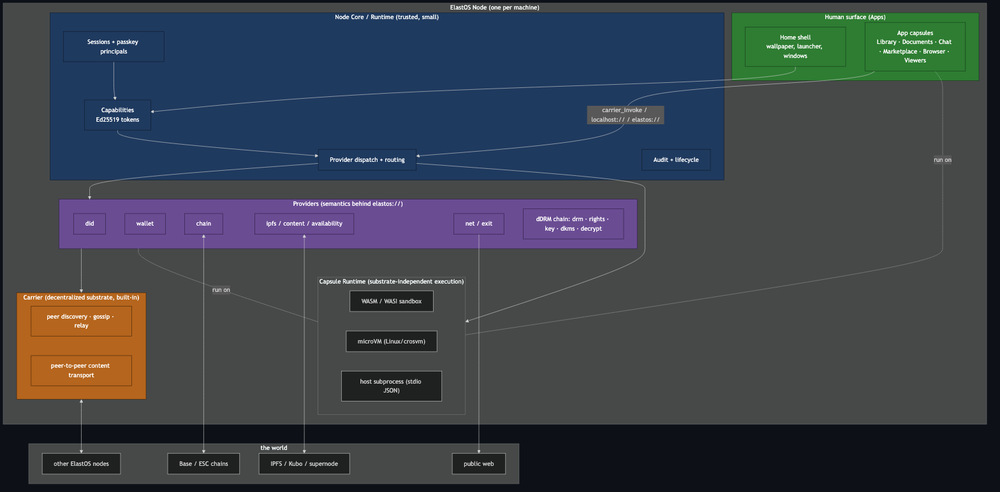
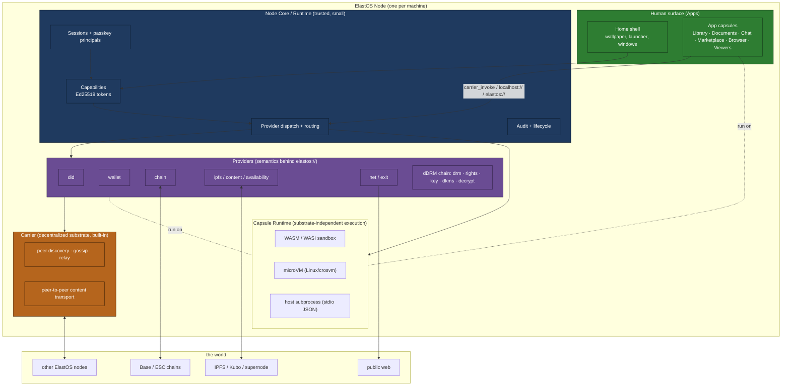
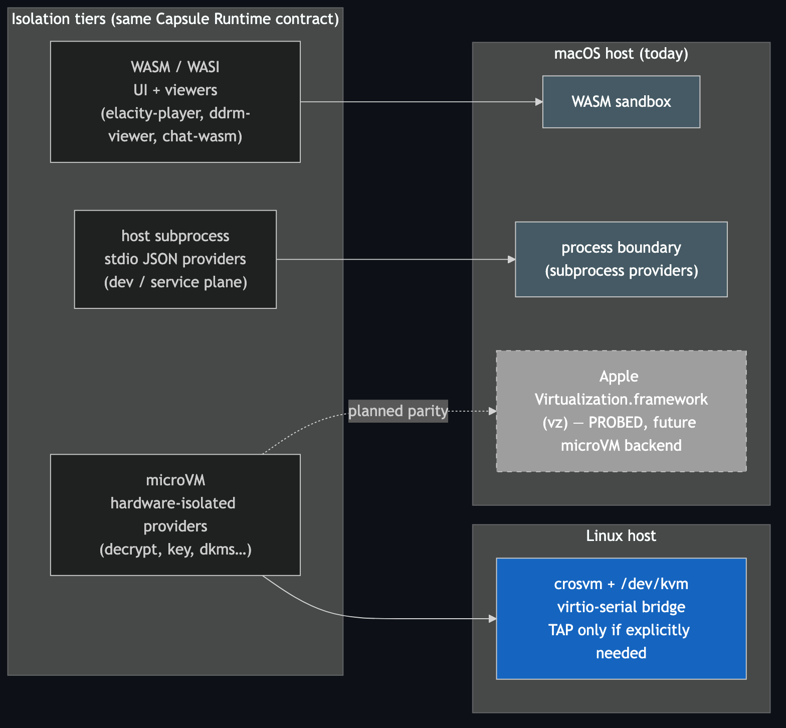
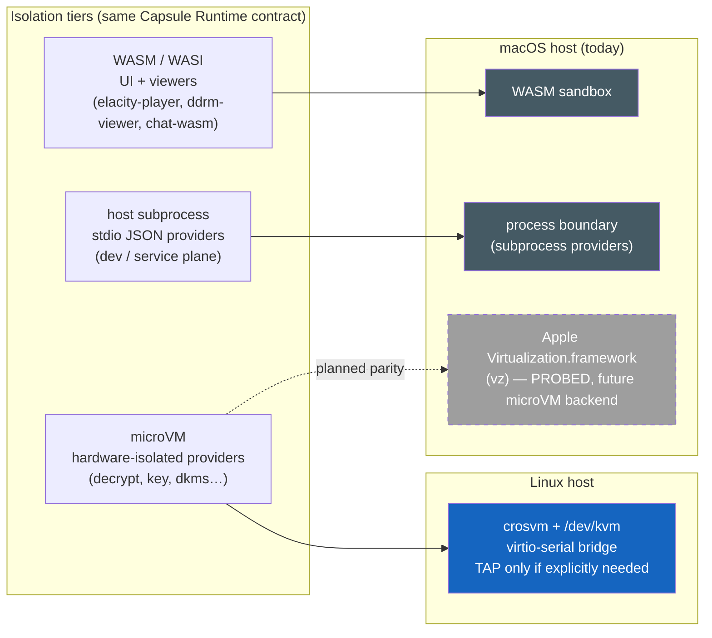
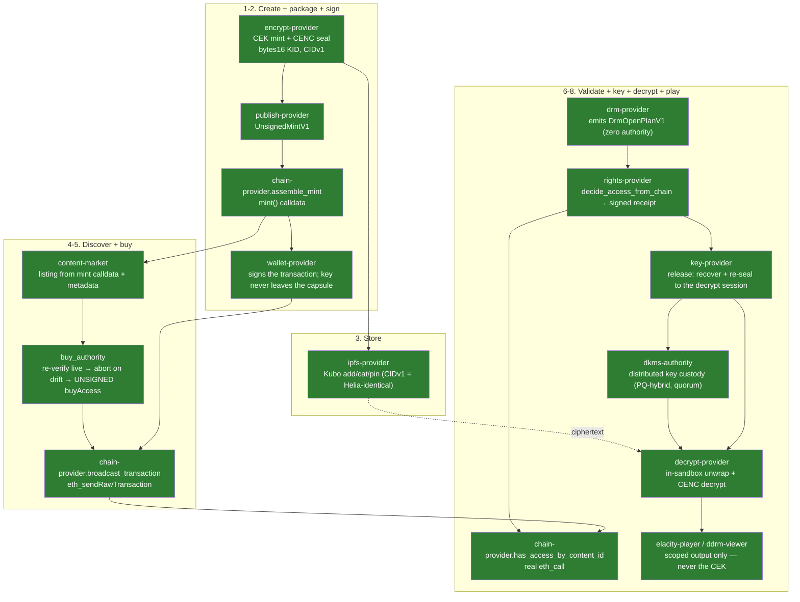
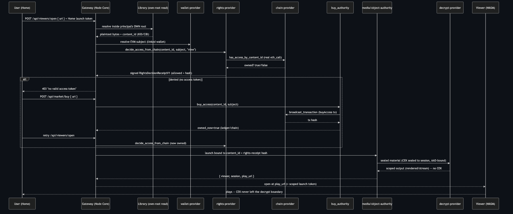
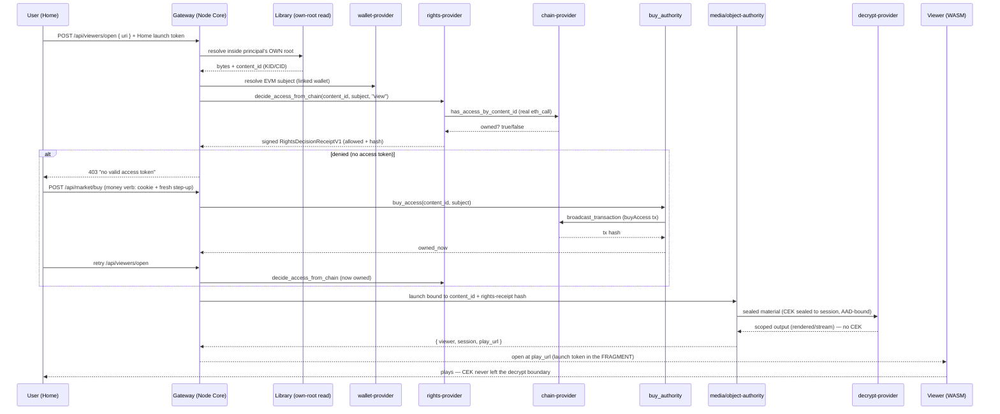

# dKMS / dDRM architecture

The structural map: the planes, the isolation substrates, the full content journey, the
capsule inventory, and how the wiring conforms to `PRINCIPLES.md`. Start at
[README.md](README.md) if you have not read it.

Diagrams are Mermaid with pre-rendered PNGs next to them in [`diagrams/`](diagrams/) —
GitHub and most Markdown viewers render the inline source directly; the PNGs are for
exports that do not.

---

## 1. The one-paragraph mental model

ElastOS is a **capability-secure node**: a small trusted core hosts everything, **capsules**
are sandboxed software roles (apps, viewers, providers) that never hold ambient authority,
and they reach each other and the world through one **Carrier-shaped capability plane** —
not raw sockets or host routes. Objects are named by **stable identity**
(`localhost://…`, `elastos://…`, CIDs), not transport. The dDRM vertical is the flagship: an
owned asset travels creator → chain → content plane → buyer, and only a capability-checked
provider chain (`drm → rights → key/dKMS → decrypt`) can turn ciphertext into pixels — the
key never reaches the app.

---

## 2. Birds-eye: the whole node



<details>
<summary>Mermaid source</summary>



</details>

**Reading it:** an app never talks to the chain, the content network, or another capsule
directly. It emits *intent* (a `carrier_invoke` call or a `localhost://` / `elastos://`
URI). The core checks the capability, routes to the right **provider**, and the provider
uses Carrier or a backend underneath. Moving a target from same-process to LAN to a remote
peer changes **none** of the capsule code.

## 2.1 The four planes (keep these distinct)

| Plane | What it is | In code |
|---|---|---|
| **Node Core / Runtime** | trusted control plane: capabilities, sessions, dispatch, audit, lifecycle | `elastos-server`, `elastos-runtime`, `elastos-identity` |
| **Carrier** | decentralized peer + content substrate (iroh today) | `elastos-server/src/carrier.rs` |
| **Capsule Runtime** | substrate-independent execution surface (one capsule, many backends) | `elastos-guest`, `elastos-compute` (WASM), `elastos-crosvm` (microVM) |
| **Digital Capsule** | the portable, signed software/content package | `capsules/*` |

The golden rule (`PRINCIPLES.md` #4 + [`../CAPSULE_MODEL.md`](../CAPSULE_MODEL.md)):
**capsules know only Carrier-shaped capability calls.** Loopback HTTP, stdio,
`postMessage`, vsock, in-process calls — all of those are *host adapters below* the capsule
contract, not the contract itself.

---

## 3. Isolation substrates — macOS-vz vs Linux-crosvm

A capsule's behavior, wire format, and capability semantics are identical across
substrates. Only the **host isolation primitive** differs.



<details>
<summary>Mermaid source</summary>



</details>

| Concern | **Linux** | **macOS (today)** | Why it is still the same contract |
|---|---|---|---|
| Hardware-isolated provider | `crosvm` microVM on `/dev/kvm` | not available — `crosvm::is_supported()` is `false`, microVM launch **fails closed** | the runtime never silently downgrades; it picks WASM/subprocess explicitly |
| dDRM providers | microVM capsules over the provider rail | spawned as host subprocesses over stdio JSON (a legitimate host adapter) | the contract — typed request → typed receipt, CEK never escapes — is identical |
| UI / viewers | WASM | WASM | identical |
| Guest networking | Linux TAP (host-only), opt-in | n/a (subprocess uses no guest NIC) | Carrier-only-by-default holds on both |
| Future | crosvm stays canonical | `vz` (Apple Virtualization.framework) becomes the macOS microVM backend | `scripts/dev/mac-vz-feature-check` is the feasibility probe |

**Bottom line:** Linux gives the strongest isolation (microVM) now; macOS reaches the same
security invariants through the WASM sandbox plus a process boundary today, and the `vz`
work is the path to microVM parity. Because the Capsule Runtime contract is
substrate-independent, **the decrypt invariant (the CEK stays in the sandbox) holds on
both** — the box around the key just has a different wall material.

> **Honest conformance note.** On macOS the Home gateway currently *spawns provider
> binaries directly* (`chain-provider`, `rights-provider`, `ddrm-media-authority`,
> `decrypt-provider`) rather than routing through the full microVM provider rail. Per
> [`../CARRIER.md`](../CARRIER.md) that is an allowed host adapter and the typed
> request/receipt contract is preserved — but the production target is provider dispatch
> through the capability plane. This is a transport gap, not a contract gap.

---

## 4. The full pipeline


<details>
<summary>Mermaid source</summary>



</details>

**The crown-jewel invariant:** the CEK only ever exists in clear *inside* the decrypt
sandbox; the app/viewer receives `rendered`, `stream`, or `working_copy` — never
`raw_cek`, `raw_plaintext`, wallet RPC, or chain RPC. Both `key-provider` and
`decrypt-provider` advertise a `blocked_authority` list enforcing this.

---

## 5. How an owned asset opens (and the buy loop)



<details>
<summary>Mermaid source</summary>



</details>

Each call **re-authorizes from scratch** (re-resolves object, subject, rights) — the UI is
an orchestration request, never an authority (`PRINCIPLES.md` #16). The `denied → buy →
retry` loop is Home-driven, and the buy leg is a money verb with its own confirmation and
step-up (see [README.md](README.md) §3 and [COMMERCE.md](COMMERCE.md)).

---

## 6. Capsule inventory

| Capsule / crate | Role | Tier |
|---|---|---|
| `encrypt-provider` | CEK mint + CENC seal → `SealedObjectV1`; threshold escrow to the quorum | microVM / subprocess |
| `cenc-core` | shared CENC cipher core | lib |
| `ddrm-media` | shared dDRM media prep / seal | lib |
| `ddrm-envelope` | shared crypto envelope, transcript→AAD binding, access grants | lib |
| `publish-provider` | `UnsignedMintV1` (mint intent) | microVM / subprocess |
| `chain-provider` | typed EVM reads (`has_access_by_content_id`), `assemble_mint`, `broadcast_transaction`, `resolve_token_id` — the **sole RPC declarant** | microVM / subprocess |
| `content-market` | listing decode from mint calldata + event + metadata enrichment | microVM / subprocess |
| `wallet-provider` | accounts, proofs, EIP-155 signing — the **sole signer**; the key never leaves | microVM / subprocess |
| `drm-provider` | emits `DrmOpenPlanV1`; holds zero authority | microVM / subprocess |
| `ddrm-plan-runner` | walks the plan, threads binding edges, fail-closed; `DrmHost` is the composition root | Node Core |
| `rights-provider` | `decide_access_from_chain` → signed `RightsDecisionReceiptV1` | microVM / subprocess |
| `key-provider` | `release`: recover the escrowed CEK and re-seal it to the decrypt session | microVM / subprocess |
| `dkms-authority` | secret-holding node daemon: holds one share, recovers + re-seals in its own boundary | node daemon |
| `dkms-keygen` | operator console keygen for operator + caller identities | tool |
| `decrypt-provider` | in-sandbox session-key mint, unwrap, CENC decrypt, multi-segment + threshold rails | **microVM** |
| `elacity-player` | media viewer (MSE segment streaming) | WASM |
| `ddrm-viewer` | non-media viewer (documents, images) | WASM |
| `object-provider` / `library` | the buyer's Library; the `Acquire` op (buy → pin) | Node Core / capsule |
| `ipfs-provider`, `availability-provider` | content add/cat/pin + availability receipts | microVM / subprocess |
| `marketplace-content` | the storefront shell; holds no signer, token, CEK, or RPC | data (browser) |
| `marketplace` | the app-store storefront (to fold in as the "Apps" fulfillment) | data (browser) |

Gateway-side modules (in the trusted core, `elastos/crates/elastos-server/src/api/`):
`buy_authority`, `trade_authority`, `mint_authority`, `chain_tx`, `market_reads`,
`content_index`, `gateway_marketplace`, `rights_authority`, `viewer_open`, `viewer_media`,
`viewer_object`, `media_authority`, `object_authority`, `access_grant`,
`session_lifecycle`, `wallet_signer`, `capsule_watchdog`.

---

## 7. Principle conformance — the dDRM + commerce slice

| Principle | How the wiring conforms |
|---|---|
| **3. No ambient authority** | buy + open require a Home launch token; the object is resolved inside the principal's *own* root; chain modes fail closed with no linked wallet |
| **4. Carrier plane** | capsules speak typed request/receipt; the dKMS node is reached by an `endpoint` descriptor (`unix:` / `tcp:` / `carrier:did:key:…`), so local↔LAN↔remote is a config change with no capsule code change |
| **5. Small trusted core** | the *decision* lives in `rights-provider`, the *broadcast* in `chain-provider`, the *key* in `key-provider`/`dkms-authority` — the gateway only orchestrates |
| **10. One canonical path** | buy reuses the exact object-resolve + subject + rights path as open, so a purchase is keyed on the identifier the gate reads back |
| **11. Fail closed, then explain** | denied → 403; no wallet → 403; live buy without a signer → 409 plus the unsigned tx; missing binaries → explicit error; a mismatched quorum/rights rail names the mismatch |
| **15. Trust travels with signed content** | the rights-receipt hash is welded into the decrypt AAD; `content_id` = bytes16 KID; selectors are pinned config, never guessed |
| **16. UI is not authority** | Home's `denied → buy → retry` is an orchestration request; every call re-authorizes from scratch; the storefront shell holds no signer, token, CEK, or RPC |

---

## 8. Regenerating the diagram images

```bash
cd docs/dkms/diagrams
for f in 01-birdseye 02-substrates 03-ddrm-pipeline 04-open-buy-sequence; do
  npx -y @mermaid-js/mermaid-cli@latest -i "$f.mmd" -o "$f.png" -t dark -b "#0d1117" -s 2 -p puppeteer.json
done
```

---

For the line-referenced, day-by-day record of how this was built — including the PC2
stage-by-stage comparison and the per-day status ladder — see
[history/SYSTEM_ARCHITECTURE_MAP.md](history/SYSTEM_ARCHITECTURE_MAP.md) and
[history/CONVERGENCE_AUDIT.md](history/CONVERGENCE_AUDIT.md). Those are snapshots, not
current status.
