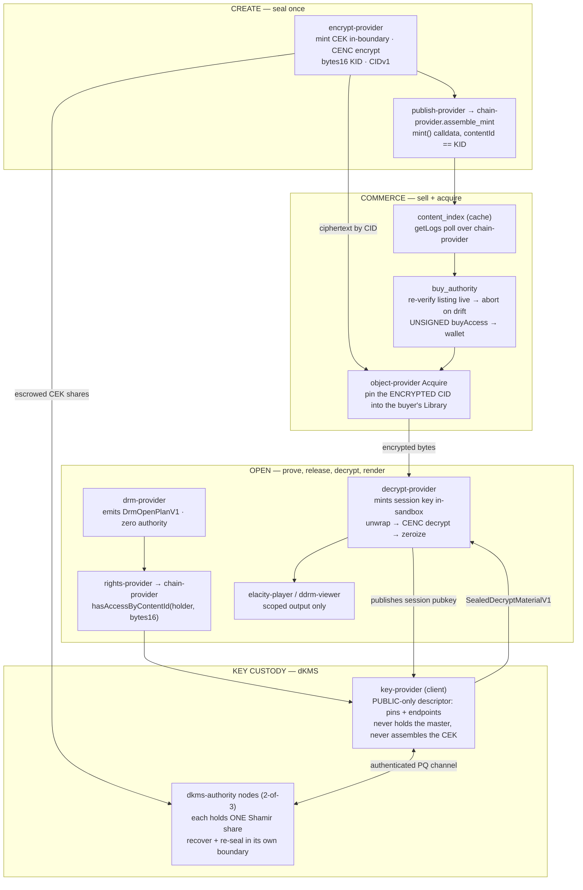

# dKMS / dDRM / commerce — start here

This is the onboarding entry for the protected-content system: **decentralized key
custody (dKMS)**, **content protection (dDRM)**, and the **commerce rail** that sells
access to it. One product, three rails. Read this page top to bottom, run the
quickstart, then follow the reading path at the bottom into the deep dives.

Everything on this page is grounded in code on this branch. Where an older document
disagreed with the code, the code won.

---

## 1. What the system is, in one paragraph

A creator seals an asset once: a Content Encryption Key (CEK) is minted **inside** a
sandbox, the asset is CENC-encrypted, the ciphertext is content-addressed and published,
and the CEK is escrowed — split — to a quorum of key-custody nodes. A buyer acquires an
on-chain **access right**, and the encrypted file is pinned into their own Library. When
they open it, a capability-scoped provider chain asks the chain whether they own it,
recovers the CEK from the quorum, re-seals it to a key the decrypt boundary minted in
its own sandbox, decrypts there, and hands the viewer **scoped output** — counts,
metadata, decrypted segments — never the key. The CEK exists in clear in exactly one
place, for the duration of one decrypt, and is zeroized.

---

## 2. The three rails

| Rail | Owns | Principal components |
|---|---|---|
| **Key custody (dKMS)** | who can recover a CEK, and where the secret lives | `key-provider` (client, public-only descriptor) · `dkms-authority` node daemons (secret holders) · `dkms-keygen` · `ddrm-envelope` (shared crypto) |
| **Content protection (dDRM)** | turning plaintext into ciphertext and back, without ever exposing the key | `encrypt-provider` · `cenc-core` · `ddrm-media` · `drm-provider` (plans) · `ddrm-plan-runner` (executes) · `rights-provider` · `decrypt-provider` · `elacity-player` / `ddrm-viewer` |
| **Commerce** | discovery, the money verbs, and getting the bought bytes into your Library | `content-market` (decoder) · `content_index` (cache) · `buy_authority` / `trade_authority` / `mint_authority` · `object-provider` `Acquire` · `marketplace-content` shell |

Underneath all three: `chain-provider` (the only RPC declarant), `wallet-provider` (the
only signer), `ipfs-provider` + the `content/*` plane (content addressing), and Carrier
(the transport the dKMS nodes are reached over).



---

## 3. The security model, in brief

Four properties carry the whole system. Each has a page that proves it.

**The CEK never exists whole outside a sandbox.** The producer escrows it sealed and
split; on a threshold rail no single node holds it and `key-provider` never assembles it;
it reconstructs only inside the decrypt boundary, in `Zeroizing`, and is scrubbed. The
viewer receives `rendered` / `stream` / `working_copy` — never key material.
→ [SECURITY_MODEL.md](SECURITY_MODEL.md)

**Every release is bound to its whole transcript.** The sealed material binds principal,
session, object CID and content hash, action, viewer interface, output kind, expiry, the
release-receipt hash, the boundary's own published session public key, the algorithm
suite, the node-set id, and (for multi-segment assets) the ordered per-segment digests —
as AEAD AAD *and* under the signature. A validly-sealed CEK replayed against a different
session, object, or fragment set fails closed before a byte is decrypted.
→ [MEDIA_PIPELINE.md](MEDIA_PIPELINE.md)

**Money verbs need a confirmed intent, not a session.** `POST /api/market/buy` and
`POST /api/create/mint` are the two node-signed money verbs. Both pass
`authorize_money_verb` (`elastos/crates/elastos-server/src/api/viewer_open.rs`), which
demands (a) a Home-hosted, proof-bound launch presented as the `home-session` cookie
(`HttpOnly; SameSite=Strict`, browser-origin-pinned) *and* (b) a fresh, single-use
passkey step-up bound to the exact intent — the request body verbatim minus
`step_up_token`, so altering any term after the ceremony rejects the replay. The window
is 180 s. Every refusal is a 403 from a closed set of three messages. Home shows its own
spend confirmation (`capsules/home/browser/home-spend-prompt.js`, "Confirm purchase" /
"Confirm mint", every field rendered as text) **before** the ceremony, so a declined
spend never touches the authenticator. A standing Home session is authentication, not
authorization to spend.
→ [COMMERCE.md](COMMERCE.md), [COMMERCE_API.md](COMMERCE_API.md)

**Viewer sessions are bearer-scoped and fail-closed.** Launch tokens ride the URL
**fragment**, never the query — a fragment is never transmitted to a server, so the token
stays out of `Referer`, access logs, and proxies. `viewer_route_with_launch_token`
(`api/mod.rs`) is the only builder, and a source-walking test fails the build if any file
under `src/api` ever assembles `?home_token=` or `&home_token=`. An open refusal is not
an existence oracle: an asset you have not acquired and an asset that does not exist
return byte-identical 404s.
→ [VIEWER_SESSIONS.md](VIEWER_SESSIONS.md)

---

## 4. Run it locally

### The 60-second proof (no chain, no IPFS daemon, no node deployment)

```bash
scripts/ddrm-consumer-smoke.sh     # drm/open → rights → key → decrypt, end to end
scripts/ddrm-producer-smoke.sh     # a CEK minted, escrowed, recovered, re-sealed, and used — in one run
```

Both build the real capsule binaries and drive them cross-process. Prerequisites: the
pinned Rust toolchain (`rust-toolchain.toml` — 1.89.0, target `wasm32-wasip1`).
`scripts/ddrm-chain-smoke.sh` additionally needs `wasmtime`.

### The full operator path

```bash
./scripts/dev/run-creator-gateway.sh
# then open http://localhost:8090/apps/home/
```

Use `localhost`, **not** `127.0.0.1` — WebAuthn rejects bare IPs. The script checks
external tools, builds every provider binary with its canonical feature set, provisions a
persistent local 2-of-3 dKMS quorum, exports the `ELASTOS_*_BIN` dev overrides (so the
gateway trusts locally built capsules without an installed signed manifest), and launches
the gateway.

### A real 3-node quorum on one machine

```bash
cd scripts/dev/dkms-docker && ./up.sh
```

Three isolated containers, each a full quorum node (`dkms-authority` + a
`dkms-carrier-node` iroh bridge) with its own private master-seed volume. It prints the
four exports that point a runtime at the result. `./up.sh down` keeps the seeds;
`./up.sh destroy` deletes them.

### Dev-mode caveats — read before you trust a local result

- **`ELASTOS_DDRM_SUBJECT` is a dev-build pin, and a release binary handed it refuses to
  boot.** It forces *every* principal's on-chain rights check to one operator-chosen
  wallet, so aiming it at a wallet holding the access token unlocks the asset for the
  whole node. The read is `#[cfg(feature = "dev-modes")]`; the release guard is
  `enforce_release_build_rights_safety` in `api/rights_authority.rs`, called at boot from
  `gateway_cmd.rs`. The same guard rejects `ELASTOS_DDRM_RIGHTS=dev|chain-mock` in a
  release build.
- **The managed-account autosign path (`ELASTOS_DDRM_BUY_SIGN=wallet`) is `dev-modes`
  only.** A release build never self-signs a buy; it hands back the unsigned transaction
  for an external wallet.
- **`dev-modes` is off by default** (`default = []` in `elastos-server/Cargo.toml`), so a
  plain `cargo build --release` is secure by construction.
- **Rights mode must match how the asset was minted, and the quorum rail must match where
  it was sealed.** A mismatch fails closed — it never silently downgrades. The
  symptom→cause table is in [../DKMS_OVER_CARRIER.md](../DKMS_OVER_CARRIER.md).

Full harness inventory, env surfaces and smoke-script index: [DEV_SETUP.md](DEV_SETUP.md).

---

## 5. Reading path

**Newcomer, in order:**

1. This page.
2. [ARCHITECTURE.md](ARCHITECTURE.md) — the planes, the isolation substrates, the full
   pipeline diagram, and where each capsule sits.
3. [SECURITY_MODEL.md](SECURITY_MODEL.md) — boundaries, the two invariants, the threat
   model, and the invariant→test table.
4. [RUN_E2E.md](RUN_E2E.md) — the operator runbook: publish an owned asset and open it
   against real secret-holding nodes.

**Then, by what you are touching:**

| You are working on | Read |
|---|---|
| encrypt, CENC, envelopes, packaging, the decrypt rail | [MEDIA_PIPELINE.md](MEDIA_PIPELINE.md) |
| viewers, session lifecycle, launch tokens, the open path | [VIEWER_SESSIONS.md](VIEWER_SESSIONS.md) |
| discovery, buy, acquire, resale, the Library handoff | [COMMERCE.md](COMMERCE.md) |
| the `/api/market/*` seam between shell and gateway | [COMMERCE_API.md](COMMERCE_API.md) |
| selectors, addresses, ABIs on Base | [COMMERCE_CONTRACTS.md](COMMERCE_CONTRACTS.md) |
| standing up or operating quorum nodes | [deploy/README.md](deploy/README.md), [../DKMS_NODE_PROVISIONING.md](../DKMS_NODE_PROVISIONING.md), [../DKMS_OVER_CARRIER.md](../DKMS_OVER_CARRIER.md) |
| local harnesses, smoke scripts, gates | [DEV_SETUP.md](DEV_SETUP.md) |
| the agent-payment rail that buys DRM assets under a mandate | [../DRM_MARKETPLACE_RAIL.md](../DRM_MARKETPLACE_RAIL.md), [../LIVE_BUY_RUNBOOK.md](../LIVE_BUY_RUNBOOK.md) |

**Provider contracts** stay in the main docs index alongside the other provider
contracts, because they are the runtime's normative interface, not dKMS narrative:
[../PROTECTED_CONTENT.md](../PROTECTED_CONTENT.md) (sealed-object access sequence),
[../RIGHTS_PROVIDER.md](../RIGHTS_PROVIDER.md), [../KEY_PROVIDER.md](../KEY_PROVIDER.md),
[../DECRYPT_PROVIDER.md](../DECRYPT_PROVIDER.md), [../CHAIN_PROVIDER.md](../CHAIN_PROVIDER.md),
[../WALLET_PROVIDER.md](../WALLET_PROVIDER.md), [../ASSET_TIERS.md](../ASSET_TIERS.md).

**History.** [history/](history/README.md) holds the convergence-era working notes and
superseded plans. They carry rationale worth keeping — why the decrypt boundary is shaped
the way it is, what PC2 did and what we deliberately did not port — but they are day-logged
snapshots, not current status. Do not read them for "where are we now"; read them for
"why is it like this".

---

## 6. Honest bounds — never overclaim

- The key custody is an **operator-curated quorum**: "keys used, never owned", not "fully
  decentralized" and not "uncopyable".
- The discovery index is **centralized-but-verifiable** — every row is re-derivable from
  calldata and the money path re-verifies live at point of use. It is the trust *shape* of
  a subgraph, not "no chokepoint". Freshness is bounded by polling; state the SLO, never
  imply real-time.
- Buying pins the **encrypted** file. Pinning grants no decryption; keys are gated at open.
- The marketplace **mints nothing and plays nothing**. Minting is the creator app; playback
  is the runtime's viewers.
- The pure on-chain rights model has **no revocation or takedown story**. That is a real
  product and legal gap, not an oversight.
