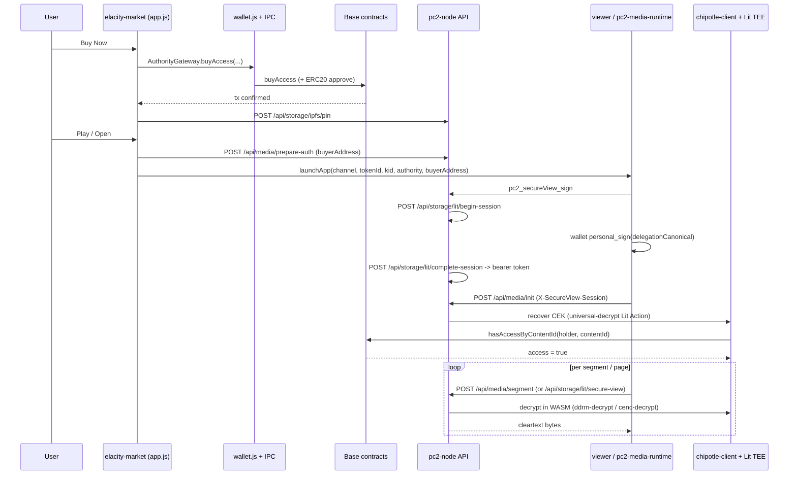

# LEGACY — dDRM Marketplace Contract & ABI Reference (superseded)

> Preserved verbatim from `docs/ELACITY_MARKETPLACE_CONTRACTS.md` on the retired
> `feat/ddrm-hardening-and-creator-parity` branch (2026-07-03 consolidation).
> The CURRENT reference is `docs/marketplace/CONTRACTS.md` (live-verified 2026-06-23);
> this legacy copy is kept for its ABI appendix + Lit/smart-account infra notes.

# Elacity dDRM Marketplace — Contract & Connectivity Reference

> Single source of truth for building a marketplace app against the Elacity dDRM
> protocol on **Base mainnet**. Consolidated from the live `pc2.net` implementation
> (the `elacity-market` / `elacity-creator` iframe dApps + the `pc2-node` backend).
>
> **Provenance:** addresses/chain config come from `pc2-node/src/sdk/config.ts`
> (the repo's documented SSOT), `pc2-node/config/default.json`, and the two dApps'
> hardcoded constants. ABI fragments are extracted verbatim from
> `elacity-market/wallet.js` and `elacity-creator/app.js`. These were **not**
> independently verified on BaseScan — see "Caveats".
>
> Last consolidated: 2026-06-22.

---

## 1. Base network configuration

| Field | Value |
|-------|-------|
| Network | Base mainnet |
| chainId | `8453` (hex `0x2105`) |
| Explorer | `https://basescan.org` |
| Lit network | `chipotle` |
| Indexer deploy block | `43892000` |
| Elacity API (GraphQL/REST) | `https://base.ela.city/api` (GraphQL: `https://base.ela.city/api/2.0/graphql`) |
| IPFS gateway | `https://ipfs.ela.city/ipfs` |

**RPC pool (fallback order):**

```
https://base-rpc.publicnode.com
https://base.drpc.org
https://mainnet.base.org
https://base-mainnet.public.blastapi.io
https://base.meowrpc.com
https://1rpc.io/base
```

**Base Sepolia (chainId `84532`)** is scaffolded in `config.ts` but all contract
addresses are empty strings — there is **no committed testnet deployment**. Treat
mainnet (8453) as the only live target.

---

## 2. V3 core contract addresses (Base 8453) — canonical

These are the active production contracts. Source: `pc2-node/src/sdk/config.ts`
(`CONTRACTS.base`), mirrored in `pc2-node/config/default.json` and the dApps.

| Contract | Address | Role |
|----------|---------|------|
| **CentralStorage** | `0x0C1EeA2A3361B80AC0e42179335dB536A951760b` | Global fees (`mediaCreationFee`, `channelCreationFee`), royalty-offer storage (`offers`, `offerersOf`) |
| **AuthorityGateway** | `0x09dBe796f40ECEffEAccf243c3d758C4c1d8D87D` | Access-token commerce (`buyAccess`/`sellAccess`/`withdrawListing`) **and** the on-chain access gate the Lit Action calls at decrypt (`hasAccessByContentId`) |
| **ChannelFactory** | `0xE1365ed47353De2F8A6a69E271e36650A9EE368F` | `createChannel` |
| **RoyaltyTradeGateway** (a.k.a. `TradeGateway`) | `0xd02451BCE627EF476B8ee52Cf131C426f67dbcB2` | Royalty-share order book (`sellToken`/`buyToken`/`createOffer`/`acceptOffer`/`cancelOffer`/`withdrawListing`) |
| **AssetFactory** | `0x4c80A6209F16437f0dc4a98E3D43f08aeBF57765` | Asset/operative deployment |
| **EventHub** | `0x5a694A6d988354dca491fe0F6db7a6ef46b656c2` | Canonical event source for the indexer |
| **SubscriptionManager** | `0xb00456b57598006ef11d1F1678DcE68713eC897D` | Subscription registry |

**Extended factories** (from `docs/core/LIT_CHIPOTLE_MIGRATION.md`; not hardcoded in the dApps):

| Factory | Address |
|---------|---------|
| PublicChannelFactory | `0xfcDffDd1cb844Fb3AC8c5d3477dF227E6E94ff8c` |
| PrivateChannelFactory | `0x6d0369f5AE83528CC8723027e5F219380d2F26A8` |
| MultiChannelFactory | `0x2E8B108a60189af117F428A6827B3Bfb2e830931` |
| BuyableOperativeFactory | `0xFbf39a097aa5577666e30de499e72120C8B3E82a` |
| BuyableSellableOperativeFactory | `0xd4FE224a71bF3C0c8F3075C4e5FB638C30517DfE` |

---

## 3. Per-asset (dynamic) contracts

These are deployed per channel/asset and discovered from mint events / the indexer
/ asset metadata (`metadata.properties.authority`, `operative.address`):

- **Channel** — an ERC-721 `DigitalAsset` contract that is *also* the subscription
  module. Holds the collection; `mint()` is called on it; `subscribePlan`,
  `bulkUpdatePlans`, `configureTokenOwnershipAccess`, `getPlans`, `tokenURI` live here.
- **Operative** — an ERC-1155 contract holding the three token classes:

  | Token ID | Constant | Meaning |
  |----------|----------|---------|
  | `1` | `TOKEN_ID_ACCESS` | Access token (what a buyer receives) |
  | `2` | `TOKEN_ID_ROYALTY_SHARE` | Tradable royalty share |
  | `3` | `TOKEN_ID_DISTRIBUTION` | Distribution right |

  Resolve the operative for a given `(channel, tokenId)` via
  `AuthorityGateway.operative(channel, tokenId)`.

**Op types** (passed to `mint`): `FREE = 0`, `BUY_ONCE = 1`, `BUY_AND_RESELL = 2`.
**Channel scope:** `PUBLIC = 1`, `PRIVATE = 2`. **Channel type:** `STANDARD = 1`, `MULTI = 2`.

---

## 4. Payment tokens & platform addresses (Base 8453)

| Token | Address | Decimals |
|-------|---------|----------|
| USDC | `0x833589fCD6eDb6E08f4c7C32D4f71b54bdA02913` | 6 |
| USDT | `0xfde4C96c8593536E31F229EA8f37b2ADa2699bb2` | 6 |
| DAI | `0x50c5725949A6F0c72E6C4a641F24049A917DB0Cb` | 18 |
| WETH | `0x4200000000000000000000000000000000000006` | 18 |
| Native ETH | `0x0000000000000000000000000000000000000000` (sentinel) | 18 |

| Platform address | Value |
|------------------|-------|
| Elacity asset royalty recipient | `0x0917Aa260359670F7855a5454c630993ce40C52D` (default 5%) |
| Elacity channel royalty recipient | `0xCE4639Aa1E47E400683F49d95025475D5F50192d` |
| Default public channel | `0x2fb53d4ab93112a6c0a1e54ffcd7199c6fd37412` |

---

## 5. dDRM / Lit + smart-account infrastructure

| Item | Value |
|------|-------|
| Lit network | `chipotle` |
| Lit access-check contract | AuthorityGateway `0x09dBe796f40ECEffEAccf243c3d758C4c1d8D87D` |
| Lit PKP ID | `0x68dcf3dc3c38d726e8a7cdca8ab318f49552c05d` |
| Lit RLI (capacity credits) | `0xd3DEC8965Aa9676a6AfB4e4D05DA14E28D8f11e8` |
| Particle Smart Account Factory (Base) | `0xb3f15a44f91a08a93a11c6fbf6a4933c623275fe` |
| Particle Smart Account EntryPoint (Base) | `0xba418fa699622de824b258c61eb150ed7a13967b` |

The content-encryption key (CEK) is escrowed as a Lit PKP ciphertext at publish time
and is **never** returned to the client. At decrypt it is recovered inside the Lit
TEE and used in a WASM session; it does not cross into JS.

---

## 6. Action -> contract function -> backend touchpoints

Write path for every on-chain action: dApp builds calldata with ethers, then
`postMessage` IPC -> `WalletService` -> Particle Universal Account (smart-account
batch) or EOA -> Base.

| Action | On-chain call | Backend touchpoints |
|--------|---------------|---------------------|
| Buy access (native ETH) | `AuthorityGateway.buyAccess(seller, ledger, tokenId, quantity, pricePerToken)` `{value}` | after success: `POST /api/storage/ipfs/pin` |
| Buy access (ERC-20) | `ERC20.approve(paymentProcessor, amount)` + `AuthorityGateway.buyAccess(seller, ledger, tokenId, quantity, pricePerToken, payToken)` | as above |
| List access for resale | `Operative.setApprovalForAll(AuthorityGateway, true)` + `AuthorityGateway.sellAccess(ledger, tokenId, quantity, pricePerToken, payToken)` | — |
| Cancel access listing | `AuthorityGateway.withdrawListing(operative, tokenId, quantity)` | — |
| List royalty shares | `Operative.setApprovalForAll(TradeGateway, true)` + `TradeGateway.sellToken(operative, 2, quantity, pricePerToken, payToken)` | — |
| Buy royalty shares | (`approve` if ERC-20) + `TradeGateway.buyToken(seller, operative, 2, quantity)` `{value?}` | — |
| Cancel royalty listing | `TradeGateway.withdrawListing(operative, 2, quantity)` | — |
| Create royalty offer (bid) | (`approve`) + `TradeGateway.createOffer(operative, 2, quantity, pricePerToken, payToken)` | — |
| Accept royalty offer | `Operative.setApprovalForAll(TradeGateway, true)` + `TradeGateway.acceptOffer(from, operative, 2, quantity)` | — |
| Cancel royalty offer | `TradeGateway.cancelOffer(operative, 2)` | — |
| Transfer channel NFT | `ERC721.safeTransferFrom(from, to, tokenId)` (channel/ledger address) | — |
| Transfer royalty shares | `Operative.safeTransferFrom(from, to, 2, amount, 0x)` | — |
| Withdraw rewards | `Operative.withdrawRewards(payToken)` or `Operative.multicall([...])` | reads `GET /api/catalog/earnings/:address` |
| Subscribe (paid plan) | (`approve` if ERC-20) + `Channel.subscribePlan(planId, 0x)` `{value?}` | — |
| Manage plans (owner) | `Channel.bulkUpdatePlans([(actionType, args)...])` (actionType 1=ADD,2=UPDATE,3=REMOVE) | best-effort GraphQL `updateSubscriptionPlan` for metadata |
| Token-gate channel | `Channel.configureTokenOwnershipAccess([(tokenAddress, threshold)...])` (threshold in base units) | — |
| Create channel | `ChannelFactory.createChannel(channelType, scope, name, tokenURI, configData)` `{value=channelCreationFee}` | `POST /api/storage/ipfs/*` for tokenURI |
| Mint / publish asset | `DigitalAsset.mint(uri, opType, opRawData, sellRawData)` `{value=mediaCreationFee}` (`opRawData` embeds `contentId = kidToContentId(kid)`) | encrypt: `POST /api/media/encode` (media) or `POST /api/storage/lit/encrypt` (non-media); then `POST /api/catalog/reindex` |
| Grant minter role | `Channel.grantRole(MINTER_ROLE, account)` | — |
| Follow (free channel) | none (social only) | GraphQL `subscribeChannel` / `unsubscribeChannel` |

`paymentProcessor` for ERC-20 approvals is read from the operative/channel
(`Operative.paymentProcessor()`), not assumed to be the gateway.

---

## 7. View functions used to populate the UI

| Function | Contract | Use |
|----------|----------|-----|
| `mediaCreationFee()` / `channelCreationFee()` | CentralStorage | Creator fee display |
| `operative(channel, tokenId)` | AuthorityGateway | Resolve operative after mint |
| `sellersOf(operative, tokenId)` / `listings(operative, tokenId, seller)` | AuthorityGateway / TradeGateway | Listing discovery + price/qty/payToken |
| `cstore()` | TradeGateway | Resolve CentralStorage for offers |
| `offers(op, tokenId, owner)` / `offerersOf(op, tokenId)` | CentralStorage | Active royalty offers |
| `balanceOf(account, id)` | Operative | Access (1), royalty (2), distribution (3) balances / ownership |
| `OP_TYPE()` / `resellerCut()` | Operative | Buy-once vs resell badge, reseller % |
| `rewardsOf(user, payToken)` | Operative | Pending royalty rewards |
| `hasTradeAccess(account, tokenId)` | Operative | Royalty-trading permission |
| `paymentProcessor()` | Operative / Channel | ERC-20 approval target |
| `getPlans()` / `tokenURI(tokenId)` | Channel | Subscription plans / metadata |
| `authority()` / `totalSupply()` | Channel (DigitalAsset) | Gateway lookup / token id after mint |
| `hasRole(MINTER_ROLE, addr)` | Channel (AccessControl) | Pre-mint grant check |
| `allowance / balanceOf / decimals` | ERC-20 | Approval + balance checks |
| `name / symbol / decimals / supportsInterface` | Token introspect | Token-gate validation |

Note: `AuthorityGateway.hasAccess(accessor, ledger, tokenId)` exists in the ABI but
the marketplace UI does **not** call it; decrypt-time ownership uses
`hasAccessByContentId(holder, bytes16 contentId)` inside the Lit Action.
`Channel.hasActiveSubscription` is present but stubbed in the dApp — subscription
status comes from GraphQL `checkChannelAccess`.

---

## 8. Read / data tiers (no TheGraph)

1. **Local on-chain indexer** (preferred for browse) — `ContentIndexerService`
   scans Base events into SQLite, exposed via:
   - `GET /api/catalog` (feed/listings; supports `?channel=`)
   - `GET /api/catalog/asset/:address/:tokenId`
   - `GET /api/catalog/channels`, `GET /api/catalog/channel/:address`
   - `GET /api/catalog/owned/:address`
   - `GET /api/catalog/operatives`
   - `GET /api/catalog/earnings/:address`
   - `GET /api/catalog/indexer-status`
2. **Elacity GraphQL** (auth + fallback reads + social) — client calls
   `POST /api/elacity/graphql` which proxies to `https://base.ela.city/api/2.0/graphql`
   (Bearer JWT, optional `X-ETH-Signer`). Used for SIWE login (`getNonce`/`userLogin`),
   item/channel fallback reads, likes/playlists/follows, activity feeds, unpublish,
   channel metadata.
3. **Direct Base `eth_call`** (live commerce truth) — the view functions in §7.

---

## 9. dDRM publish -> buy -> decrypt flow

**Publish (creator):** encrypt (CEK escrowed as Lit ciphertext, never returned) ->
upload encrypted asset + metadata to IPFS -> `DigitalAsset.mint(uri, opType, opRawData,
sellRawData)` with `contentId = kidToContentId(kid)` embedded in `opRawData` ->
`Operative.setApprovalForAll(AuthorityGateway, true)` -> `POST /api/catalog/reindex`.

**Buy (market):** pick listing (`sellersOf` + `listings`, or GraphQL price) ->
`AuthorityGateway.buyAccess(...)` mints ERC-1155 ACCESS (id=1) (+ DISTRIBUTION id=3)
to the buyer -> client builds a local `.ddrm` descriptor and pins via
`POST /api/storage/ipfs/pin`.

**Decrypt / play (post-purchase):** mandatory secure-view session, then per-content
decrypt in the TEE/WASM (CEK never reaches JS):



**Two viewer paths:**
- Media (video/audio DASH): `pc2-media-runtime` -> `POST /api/media/init` then repeated
  `POST /api/media/segment`.
- Non-media (PDF/image/ebook): `ddrm-viewer` -> `POST /api/storage/lit/secure-view`
  (WASM renderer emits pixels only).

**Secure-view session lifecycle** (parent frame `pc2-secure-view.js`):
`/api/storage/lit/begin-session` -> wallet `personal_sign(delegationCanonical)` ->
`/api/storage/lit/complete-session` -> bearer token in IndexedDB -> sent as
`X-SecureView-Session` on every decrypt call (validated by
`requireSecureViewSession` middleware). On `401 session_token_invalid` the client
re-signs with `{ refresh: true }` (flag must propagate through every hop).

---

## 10. Caveats (read before building)

1. **V2 is deprecated.** Old Base addresses still appear in docs and stale compiled
   `.js` files — do **not** use them:
   - CoreStorage `0xc8F50Bf1A6b765460621f861a64a5d333Bc7f575`
   - AuthorityGateway (V2) `0x8fe6bf9877B78BF0126819ff2593235E54Ee1E29`
   - ChannelCore `0x6a3f7780C54cb66291f8f1bE609047C2f664Dbf6`
   - TradeGateway (V2) `0x9eC53758b698f9F68C0654DDd9159173a159a459`
2. **No standalone `Marketplace`/`Auction` contract** on Base — trading is
   AuthorityGateway (access) + RoyaltyTradeGateway (royalty shares).
3. **Buy authority address:** prefer the per-asset `metadata.properties.authority`
   over a hardcoded gateway constant (the dApp is inconsistent here).
4. **ABIs are inline** ethers human-readable fragments (no JSON ABI files in
   `pc2.net`). The canonical TS implementation lives in the external `elacity-web`
   repo (`src/lib/drm/...`, `src/lib/web3/executable/tx.ts`).
5. **On-chain verification TODO:** addresses here come from repo config, not a
   BaseScan check. Verify before mainnet writes.

---

## 11. Appendix — ABI fragments (ethers human-readable)

Extracted verbatim from `elacity-market/wallet.js` and `elacity-creator/app.js`.

### AuthorityGateway

```solidity
function buyAccess(address seller, address ledger, uint256 tokenId, uint256 _quantity, uint256 _pricePerToken) payable
function buyAccess(address seller, address ledger, uint256 tokenId, uint256 _quantity, uint256 _pricePerToken, address _payToken)
function sellAccess(address ledger, uint256 tokenId, uint256 quantity, uint256 pricePerToken, address payToken)
function withdrawListing(address operative, uint256 tokenId, uint256 quantity)
function operative(address channel, uint256 tokenId) view returns (address)
function sellersOf(address operative, uint256 tokenId) view returns (address[])
function listings(address operative, uint256 tokenId, address seller) view returns (uint256, uint256, address)
function hasAccess(address accessor, address ledger, uint256 tokenId) view returns (bool)
```

### RoyaltyTradeGateway (TradeGateway)

```solidity
function sellToken(address operative, uint256 tokenId, uint256 quantity, uint256 pricePerToken, address payToken)
function buyToken(address seller, address operative, uint256 tokenId, uint256 quantity) payable
function withdrawListing(address operative, uint256 tokenId, uint256 quantity)
function createOffer(address operative, uint256 tokenId, uint256 quantity, uint256 pricePerToken, address payToken)
function acceptOffer(address from, address operative, uint256 tokenId, uint256 quantity)
function cancelOffer(address operative, uint256 tokenId)
function sellersOf(address operative, uint256 tokenId) view returns (address[])
function listings(address operative, uint256 tokenId, address seller) view returns (uint256, uint256, address)
function cstore() view returns (address)
```

### CentralStorage

```solidity
function mediaCreationFee() view returns (uint256 fee, address token)
function channelCreationFee() view returns (uint256 fee, address token)
function offers(address op, uint256 tokenId, address owner) returns (uint256, uint256, address)
function offerersOf(address op, uint256 tokenId) returns (address[])
```

### ChannelFactory

```solidity
function createChannel(uint8 _channelType, uint8 _scope, string _name, string _tokenURI, bytes data) payable
event ChannelCreated(uint8 indexed channelType, uint8 indexed scope, address indexed creator, address channel, address factoryAddr)
```

### DigitalAsset (Channel / ERC-721)

```solidity
function mint(string _uri, uint16 opType, bytes opRawData, bytes sellRawData) payable
function authority() view returns (address)
function totalSupply() view returns (uint256)
function safeTransferFrom(address from, address to, uint256 tokenId)
event AssetCreated(address indexed _to, address indexed _channel, uint256 _tokenId, string _tokenUri, uint16 _opType, address indexed opContract)
```

### Operative (ERC-1155)

```solidity
function paymentProcessor() view returns (address)
function setApprovalForAll(address operator, bool approved)
function isApprovedForAll(address account, address operator) view returns (bool)
function balanceOf(address account, uint256 id) view returns (uint256)
function OP_TYPE() view returns (uint16)
function resellerCut() view returns (uint16)
function rewardsOf(address user, address payToken) view returns (uint256)
function hasTradeAccess(address account, uint256 tokenId) view returns (bool)
function withdrawRewards(address paymentToken)
function multicall(bytes[] data)
function safeTransferFrom(address from, address to, uint256 id, uint256 amount, bytes data)
function royaltyInfo(uint256 salePrice) view returns (tuple(address receiver, uint256 amount)[])
```

### SubscriptionModule (on the Channel; V3, base-network-updates)

```solidity
function bulkUpdatePlans(tuple(uint8 actionType, bytes args)[] actions) // actionType: 1=ADD, 2=UPDATE, 3=REMOVE
function subscribePlan(uint8 planId, bytes args) payable               // args = ABI-encoded metadata CID, or 0x
function configureTokenOwnershipAccess(tuple(address tokenAddress, uint256 threshold)[] thresholds) // threshold in base units
function getPlans() view returns (tuple(uint8 planId, address payToken, uint256 price, uint256 duration, bool active)[])
function plans(uint8 planId) view returns (uint8 planId, address payToken, uint256 price, uint256 duration, bool active)
function hasActiveSubscription(address subscriber) view returns (bool) // present but stubbed in dApp; use GraphQL
function tokenURI(uint256 tokenId) view returns (string)
function paymentProcessor() view returns (address)
```

`bulkUpdatePlans` arg encoding (per action):
- ADD: `(address payToken, uint256 priceWei, uint256 durationSecs, string planURI)`
- UPDATE: `(uint8 planId, address payToken, uint256 priceWei, uint256 durationSecs, string planURI)`
- REMOVE: `(uint8 planId)`

### AccessControl (on the Channel)

```solidity
function grantRole(bytes32 role, address account)
function hasRole(bytes32 role, address account) view returns (bool)
```

### ERC-20

```solidity
function approve(address spender, uint256 amount) returns (bool)
function allowance(address owner, address spender) view returns (uint256)
function balanceOf(address account) view returns (uint256)
function decimals() view returns (uint8)
```

### Token introspection (token-gating)

```solidity
function name() view returns (string)
function symbol() view returns (string)
function decimals() view returns (uint8)
function supportsInterface(bytes4 interfaceId) view returns (bool)
```

---

## 12. Source file index (in `pc2.net`)

| Path | Role |
|------|------|
| `pc2-node/src/sdk/config.ts` | SSOT: networks, V3 contracts, tokens, platform, Lit, smart account |
| `pc2-node/config/default.json` | Runtime blockchain + indexer config + RPC pool |
| `pc2-node/data/test-apps/elacity-market/wallet.js` | All marketplace ABIs + write/read encoding + addresses |
| `pc2-node/data/test-apps/elacity-market/app.js` | Buy flow, play/Lit auth, subscription, detail view |
| `pc2-node/data/test-apps/elacity-market/app-features.js` | Resell, royalty order book, offers, plans, token gates |
| `pc2-node/data/test-apps/elacity-market/api.js` | Catalog + GraphQL read/auth layer |
| `pc2-node/data/test-apps/elacity-creator/app.js` | createChannel, mint, encrypt orchestration, ABIs |
| `src/gui/src/IPC.js` | Wallet IPC bridge (postMessage -> WalletService) |
| `src/gui/src/services/WalletService.js` | Particle / Universal Account execution |
| `pc2-node/src/api/media.ts` | `prepare-auth`, `init`, `segment` |
| `pc2-node/src/api/chipotle-client.ts` | Lit Chipotle session + CEK recovery |
| `pc2-node/src/api/storage.ts` | `lit/encrypt`, `lit/secure-view`, sessions |
| `pc2-node/src/api/middleware/secureViewSession.ts` | Bearer session validation |
| `pc2-node/data/lit-actions/universal-decrypt-chipotle.js` | TEE access check (`hasAccessByContentId`) + decrypt |
