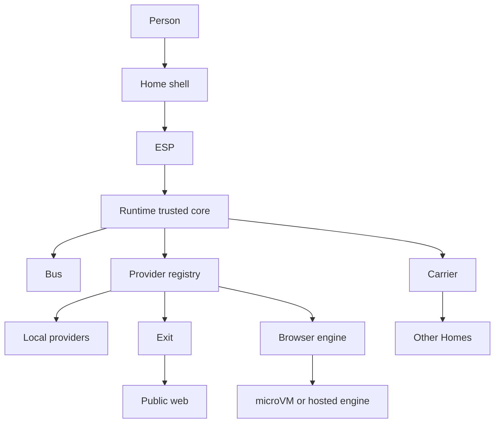

# Tree map

Where the code lives. Capsule list matches GitHub `review/collaboration-candidate` @ `b07160c` and the local branch @ `1e035af`. Working tree also has the unpublished local-Home docs commit `d1800ce`.

Trusted core is the `elastos` binary and its crates. Everything under `capsules/` is untrusted until Runtime grants it something.

```text
Home / System / Wallet / Browser / Chat Room
        |
     ESP / launch token
        |
     Runtime  (elastos-runtime + elastos-server)
        |-- Bus          elastos/wit/elastos-bus-v1.wit
        |-- Providers    elastos-runtime/src/provider/registry.rs
        |-- Carrier      elastos-server/src/carrier.rs
        |-- Exit / Net   capsules/exit-provider, capsules/net-provider
        `-- Engine       capsules/browser-engine-adapter
```



## Repo root

| Path | What it is |
|---|---|
| `PRINCIPLES.md` | Law |
| `state.md` | What is actually shipped |
| `TASKS.md` | Operator checklist |
| `AGENTS.md` | Existing agent notes (thinner than `agent-gates.md`) |
| `components.json` | Install set |
| `capsules/` | First-party capsules |
| `elastos/` | Trusted workspace |
| `docs/` | Contracts and longer notes |
| `scripts/` | Operator and Browser smokes |
| `deploy/` | Hosted Browser/Selkies image bits |
| `elastos/esp/` | ESP TypeScript contract |
| `elastos/wit/elastos-bus-v1.wit` | Bus ABI |
| `elastos/tools/` | Browser supervisor, local Exit, stream bridge, VM relay |

## Trusted crates (`elastos/crates`)

| Crate | Role |
|---|---|
| `elastos-runtime` | Core security: capability, session, provider registry, invoke |
| `elastos-server` | Binary, HTTP gateway, CLI, Carrier, collaboration, Home routes |
| `elastos-common` | Shared types |
| `elastos-auth` | Proof-bound sessions |
| `elastos-identity` | WebAuthn / passkey |
| `elastos-namespace` | Content-addressed names |
| `elastos-storage` | Storage abstraction |
| `elastos-compute` | Substrate abstraction |
| `elastos-crosvm` | Linux KVM microVM |
| `elastos-vz` | Mac Virtualization.framework microVM |
| `elastos-guest` | Capsule SDK, including Bus |
| `elastos-tls` | TLS helpers |
| `elastos-wallet-contract` | Wallet Bus v2 schema |

Also in the workspace, not trusted-core product Apps: `elastos/capsules/shell` and `elastos/capsules/localhost-provider` (the install-set WASM/native pair named `shell` and `localhost-provider` in `components.json`).

## Where the layers actually are

| Layer | Path |
|---|---|
| Carrier | `elastos/crates/elastos-server/src/carrier.rs` (plus `carrier_service.rs`, `collaboration_carrier.rs`) |
| Provider registry | `elastos/crates/elastos-runtime/src/provider/registry.rs` |
| Invoke | `elastos/crates/elastos-runtime/src/invoke/` |
| Home gateway | `elastos/crates/elastos-server/src/gateway_entry.rs`, `home_cmd.rs`, `api/` |
| Supervisor | `elastos-server/src/supervisor.rs` attaches the provider registry |
| ESP | `elastos/esp/`, `docs/ESP_V0.md`, `docs/HOME_SHELL_HOST_CONTRACT.md` |
| Bus | `elastos/wit/elastos-bus-v1.wit`, `elastos-guest/src/bus.rs` |
| Collaboration | `elastos-server/src/collaboration_*.rs` |
| Browser open | `elastos-server/src/api/gateway_browser_stream.rs`, `browser_app_hosts.rs` |

## Install set (`components.json`)

`capsules` keys (the expected node set):

`shell`, `localhost-provider`, `did-provider`, `chain-provider`, `net-provider`, `exit-provider`, `browser-engine-adapter`, `wallet-provider`, `object-provider`, `wallet-walletconnect`, `content-block-graph-provider`, `drm-provider`, `rights-provider`, `key-provider`, `decrypt-provider`, `ipfs-provider`, `availability-provider`, `ai-provider`, `llama-provider`, `tunnel-provider`.

No `chat` or `agent` in this file. Product Chat is `chat-room` (it is in `external`, not in `capsules`).

`profiles`: `minimal`, `home`, `demo`, `operator`, `blockchain`, `agent-local-ai`, `public-gateway`, `full`.

Host binaries in `external`: `crosvm`, `vmlinux`, `kubo`, `cloudflared`, `llama-server`, plus Browser helpers (`browser-engine-supervisor`, `browser-native-proxy-engine`, `browser-stream-bridge`, `browser-local-exit`) and model blobs.

## Capsules (`capsules/`)

Roles from each `capsule.json`. Descriptions shortened from the manifest.

### Shells

| Capsule | Role | Runs as | One line |
|---|---|---|
| `home-gui` | shell | wasm | Desktop Home |
| `home-cli` | shell | wasm | Terminal Home |

### Apps people open

| Capsule | Role | Runs as | One line |
|---|---|---|
| `home` | app | wasm | Chooses a Home view |
| `browser` | app | wasm | Web through Engine + Exit. Unstable/slow on Mac. See `known-issues.md` |
| `chat-room` | app | wasm | Product Chat |
| `inbox` | app | wasm | Approvals |
| `library` | app | wasm | Objects and published content |
| `people` | app | wasm | Profile and contacts |
| `system` | app | wasm | Account, security, apps, device |
| `wallet` | app | wasm | Accounts and approvals |
| `marketplace` | app | wasm | Browse installable things |
| `services` | app | wasm | Browser Engine and Exit access |
| `wallet-metamask` | app | wasm | MetaMask approval method |
| `wallet-unisat` | app | wasm | UniSat approval method |
| `wallet-walletconnect` | app | wasm | WalletConnect approval method |

### Viewers and content

| Capsule | Role | Runs as | One line |
|---|---|---|
| `documents` | viewer | wasm | Markdown |
| `archive-manager` | viewer | wasm | Archives through Library |
| `gba-emulator` | viewer | wasm | GBA |
| `gba-ucity` | content | data | Sample GBA city builder |

### Providers

| Capsule | Role | Runs as | One line |
|---|---|---|
| `object-provider` | provider | microVM | Principal-root objects for Library |
| `webspace-provider` | provider | microVM | `localhost://WebSpaces/...` resolver |
| `did-provider` | provider | microVM | Device `did:key` |
| `wallet-provider` | provider | microVM | Proof, link, typed signing |
| `chain-provider` | provider | microVM | Elastos, Base, Bitcoin |
| `net-provider` | provider | microVM | Browser/Net boundary. Does not dial out |
| `exit-provider` | provider | microVM | Egress contract. The public DNS/TCP dialer is `browser-local-exit` |
| `browser-engine-adapter` | provider | microVM | Attaches a real engine to a Runtime stream |
| `drm-provider` | provider | microVM | Protected-content open |
| `rights-provider` | provider | microVM | Rights check |
| `key-provider` | provider | microVM | CEK release boundary |
| `decrypt-provider` | provider | microVM | Decrypt/render session |
| `availability-provider` | provider | microVM | Replication adapter |
| `ipfs-provider` | provider | microVM | Low-level Kubo |
| `content-block-graph-provider` | provider | microVM | Repair graph import/export |
| `ai-provider` | provider | microVM | LLM routing |
| `llama-provider` | provider | microVM | Local llama-server |
| `tunnel-provider` | provider | microVM | `elastos://tunnel/` via cloudflared |
| `operator-drive-adapter` | provider | microVM | Operator WebSpace test adapter |

### Present, no `capsule.json`

`chat-room-ui` (UI bits for chat-room). `site-provider` (in `external`, no `capsule.json`; host-path leak risk). `_shared`.

## Browser / Exit / no-KVM

```text
Browser app
  -> Runtime
  -> net-provider          (validate, no dial)
  -> exit-provider         (egress, local or remote-carrier)
  -> browser-engine-adapter
  -> engine
       Linux: crosvm/KVM
       Mac:   elastos-vz
       Seed:  no /dev/kvm. Point ELASTOS_BROWSER_VM_CONTROL_SOCKET
              at an engine hosted elsewhere. Do not pretend local crosvm.
```

Helpers (not capsules): `elastos/tools/browser-engine-supervisor`, `browser-local-exit`, `browser-stream-bridge`, `browser-native-proxy-engine`, `browser-vm-runtime-relay`.

## Docs that matter

Read with `READ-ORDER.md`. The usual traps: `docs/CARRIER.md` still draws retired chat/agent gossip. `docs/GLOSSARY.md` is long and still missing Home, Seed, ESP, CEK, PeerDid, Bus, loopback, Exit. `docs/BROWSER_CAPSULE.md` is the architecture target, not shipped truth.
