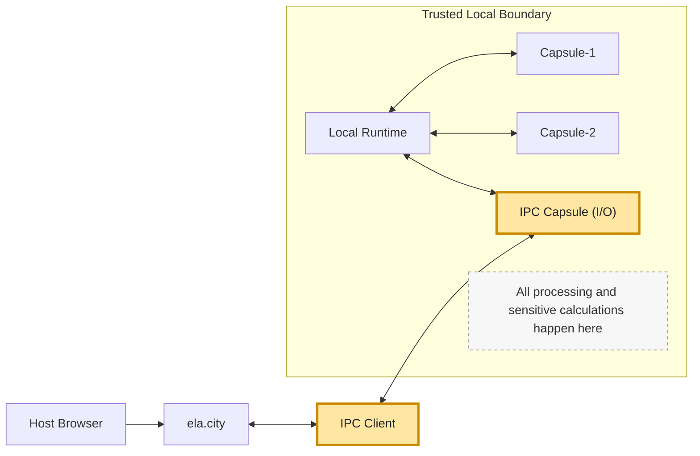
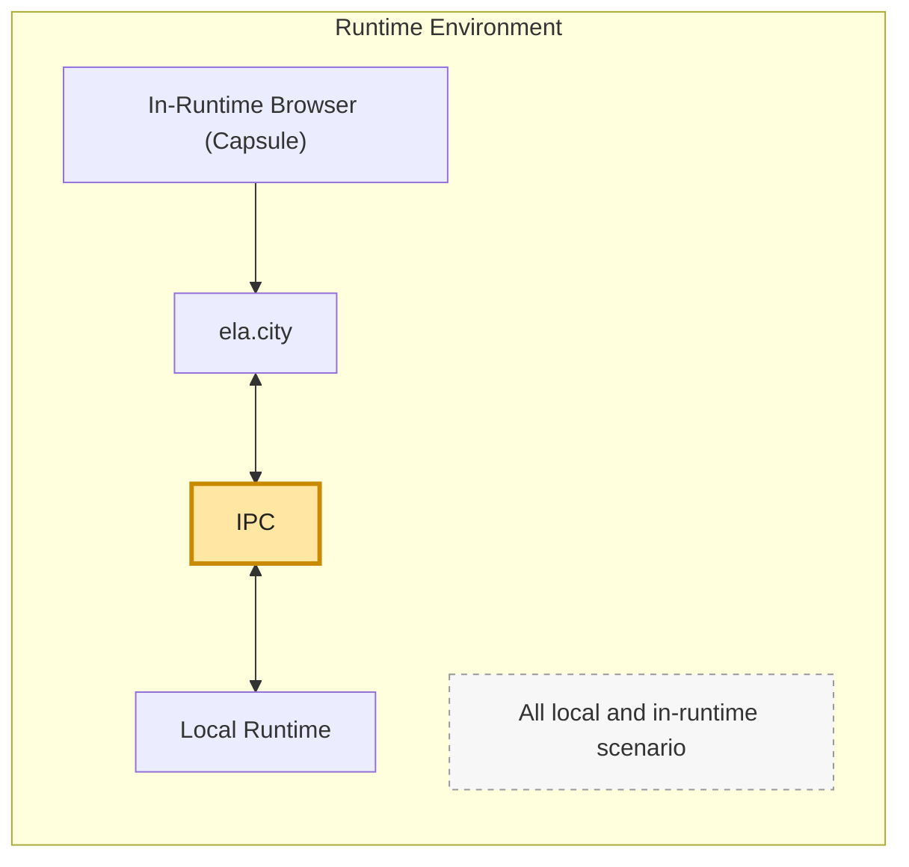
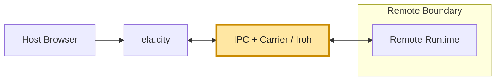

# dKMS — Initial Context (state of understanding, 2026-07-11)

> Working notes assembled from a code walkthrough of the dKMS provider stack.
> Purpose: shared baseline context for planned improvements. Everything here was
> verified against the code on branch `feature/cenc-core-decouple` and against the
> live artifacts on this machine — file:line references point at the ground truth.

## 1. What the dKMS is, in one sentence

The dKMS (decentralized Key Management System) keeps a dDRM asset's content
encryption key (CEK) **never stored whole anywhere**: it is Shamir-split 2-of-3
across three independent "authority" nodes, so minting needs zero network calls
and opening needs any 2 of the 3 nodes to cooperate.

## 2. The cast

| Component                         | Role                                                                                                                                                                                                                                                                                         |
| --------------------------------- | -------------------------------------------------------------------------------------------------------------------------------------------------------------------------------------------------------------------------------------------------------------------------------------------- |
| `capsules/dkms-authority`         | The **node daemon** — one per quorum member. Holds ONE secret: a 32-byte master seed. Everything else (ML-DSA signing key, escrow recipient key, channel KEM key, reshare/DKG seeds) is derived deterministically from it ([main.rs:505-514](../../../capsules/dkms-authority/src/main.rs)). |
| `capsules/key-provider`           | The **runtime-side client**. On open, fans out to the nodes and runs the 2-of-3 recover. Owns key-release validation; capsules never see raw CEKs (`docs/KEY_PROVIDER.md`).                                                                                                                  |
| `capsules/encrypt-provider`       | The **mint side**. Splits + seals the CEK to the quorum — pure local crypto, no node contacted.                                                                                                                                                                                              |
| `capsules/dkms-keygen`            | Helper: derives the caller verifying key from a seed (`derive-vk --seed-b64`) so nodes can allow-list a runtime.                                                                                                                                                                             |
| `capsules/ddrm-envelope`          | The shared crypto crate: hybrid KEM (X25519 ‖ ML-KEM-768), Shamir split/combine, AAD/domain definitions (`ESCROW_AAD_LABEL`, `DKMS_RECOVER_DOMAIN`). Single source of truth so client and node cannot drift within one build.                                                                |
| `scripts/dev/dkms-carrier-node`   | Node-side Carrier bridge: iroh ALPN `elastos/dkms-authority/1` → node's TCP listener. Prints its `did:key` on boot (identity = persisted 32-byte iroh seed, independent of the PQ quorum identity). TCP targets only.                                                                        |
| `scripts/dev/dkms-carrier-client` | Runtime-side Carrier sidecar: `key-provider` dials it on loopback with a one-line did preamble; it resolves the did (pkarr/mDNS) and relays raw bytes. Untrusted transport — sees only ciphertext.                                                                                           |

## 3. How a quorum is formed

There is **no election, no gossip, no DKG ceremony** in the shipped path. A quorum
is: three independently-provisioned node identities listed in one JSON descriptor
with `t=2, n=3`. Nodes never talk to each other; all coordination is client-side.

- A node's identity **is** the master seed in its store (`node-N.store.json`,
  schema `elastos.dkms_node.master_seed/v1`). Any `dkms-authority` process pointed
  at that store _is_ that node.
- Provisioning = one-shot `init` op per node (creates the seed on first run,
  idempotent afterwards) — see `scripts/dev/ddrm-provision-quorum.sh`.
- DKG/resharing machinery exists in the node ( `dkg_seed`, `reshare_seed`,
  [main.rs:486-495](../../../capsules/dkms-authority/src/main.rs)) but the product
  mint path uses producer-side split, not DKG.

### Local vs remote

- **LOCAL (default `run-creator-gateway.sh`)**: 3 daemons on this machine,
  Unix sockets `<data>/dkms/node-{0,1,2}.sock`.
- **REMOTE (`--remote` / `--carrier`)**: the 3 live geo nodes (InterServer /
  Contabo supernodes). `--carrier` reaches them by `did:key` over Carrier/iroh
  (production path); bare `--remote` uses the deprecated WireGuard `dkms0` mesh.
  Descriptor: `~/.elastos-dkms/dkms-authority.carrier.json` (+ caller seed
  `~/.elastos-dkms/secrets/caller.seed`).

Distribution is trivial by construction: each node is standalone (own store, own
listener, own allow-list), the descriptor stitches them. Endpoint schemes are
parsed **per node** ([key-provider/src/main.rs:746-811](../../../capsules/key-provider/src/main.rs)):
`carrier:did:key:…` → sidecar, `tcp:HOST:PORT` → direct, otherwise a Unix-socket
path — mixed transports in one descriptor work.

## 4. The artifacts on disk

`<data_dir>/dkms/` (macOS: `~/Library/Application Support/elastos/dkms`):

| File                                    | What                                                                                                                                                                       | Created by             |
| --------------------------------------- | -------------------------------------------------------------------------------------------------------------------------------------------------------------------------- | ---------------------- |
| `node-{0,1,2}.store.json`               | **The only real secrets** — each node's master seed. Deleting one permanently orphans every asset sealed to that quorum.                                                   | provision script, once |
| `quorum.json`                           | PUBLIC descriptor (`elastos.dkms.quorum_descriptor/v1`): `t=2,n=3` + per-node `verifying_key_b64` + `recipient_pub_b64`. What the Create portal seals to. Safe to publish. | provision script       |
| `quorum-nodes.json`                     | Operator-private sidecar: store path + endpoint per node (paths, not secrets), so restarted daemons come back with the same identities.                                    | provision script       |
| `quorum-open.json`                      | v2 OPEN descriptor (`elastos.dkms.authority/v2`): identities + live endpoints, reassembled at **every** gateway launch. What `key-provider` recovers against.              | each launch            |
| `node-{0,1,2}.sock`                     | The daemons' Unix listeners.                                                                                                                                               | each launch            |
| `key-provider.sock`                     | The warm long-lived key-provider daemon (reuses node sessions across opens).                                                                                               | each launch            |
| `daemon.log`, `key-provider-daemon.out` | Logs.                                                                                                                                                                      | each launch            |
| `av-bias.master`                        | NOT dKMS — persistent forensic-watermarking bias master (must be stable and shared mint↔serve).                                                                            | first launch           |

`~/.elastos-dkms/`: the remote/carrier-rail config home — carrier descriptor,
`secrets/caller.seed` (+ `caller.vk`), bridge seeds, and (on this machine) a
separately-provisioned quorum of its own.

## 5. Mint (seal) — 100% local, zero node contact

```
Create portal → encrypt-provider:
  1. mint CEK + KID, CENC-encrypt content
  2. Shamir 2-of-3 split (ddrm-envelope::split_cek_shamir2; x rides INSIDE the
     sealed payload as `x ‖ p(x)`, authenticated)
  3. read quorum.json (public keys only)
  4. seal share_i to node_i's recipient key — hybrid KEM X25519 ‖ ML-KEM-768 → AEAD,
     AAD = ESCROW_AAD_LABEL ‖ scheme ‖ kid ‖ recipient_pub  (welds share to asset+node)
  5. store the 3 sealed escrows in the asset's protections; CEK dropped
```

Consequence: a million sovereign minters hit the quorum **zero** times. Nodes
store nothing per-asset — escrows travel with the asset and are presented back
at recover time.

### Metadata ↔ descriptor invariant

`protections.shares[i].verifying_key_b64` is a **copy of**
`quorum.json → threshold.nodes[i].verifying_key_b64`, stamped at seal time.
At open it must match, string-for-string, a node in the open descriptor — that's
both the routing key and (via AAD + hello attestation) the security binding.
Mismatch ⇒ sealed to a different quorum ⇒ fail closed ("foreign escrow").
**Seal rail = open rail, always.**

## 6. Open (recover) — the CEK resurrection, precisely

1. **Routing.** `key-provider` loads the open descriptor, matches each share's
   `verifying_key_b64` to a node → endpoint.
2. **Per node, in parallel (any 2 of 3 suffice):**
   - `hello` — node attests its master-derived ML-DSA identity + channel KEM key;
     client verifies against the descriptor pin; PQ-hybrid encrypted channel from
     here on. Impostor node fails here.
   - `session` — client authenticates under the caller seed (vk allow-listed via
     `DKMS_AUTHORITY_ALLOWED_CALLERS`) → session token.
   - `recover` — client sends: that node's `wrapped_share_b64`, KID/scheme
     context, a possession proof signed under `DKMS_RECOVER_DOMAIN`, the
     authorization (chain mode: wallet-signed `AccessGrantV1` — the node verifies
     the signature AND does its own Base `hasAccessByContentId` eth_call), and a
     **one-time decrypt-session public key**.
3. **Node side:** derive recipient secret from master seed → open the escrow →
   check AAD (wrong asset/node = "foreign escrow") → **re-seal the share to the
   decrypt-session key** and sign the re-seal. Plaintext share never leaves.
4. **Threshold met:** `key-provider` takes the first 2 re-sealed shares
   (threshold-with-grace timing so one dead node can't stall the release), merges
   them into one material blob **without combining** — key-provider can never see
   the CEK.
5. **Combine, in the decrypt sandbox:** `decrypt-provider` unwraps both shares
   with the one-time session secret, reads inner x's, Lagrange-interpolates at 0
   (`combine_cek_shamir2`) → CEK, in-VM only, used for CENC decrypt, dropped.

Security invariants: 1 share = information-theoretically nothing; each escrow
opens only on its named node; each node authorizes independently; nothing between
the nodes and the decrypt sandbox holds a readable share or the CEK.

### Protocol compatibility (hard rule)

The recover possession-proof preimage (`recover_proof_message`,
`DKMS_RECOVER_DOMAIN` in `ddrm-envelope`) is a **deployed protocol**. The geo
nodes are not redeployed with the runtime; a client-only change fails closed at
all nodes (`0 of N served` → 502, looks like an open bug). Land proof-format
changes nodes-first or simultaneously — never client-only. See
`docs/DKMS_OVER_CARRIER.md` §"Protocol compatibility invariant".

## 7. Carrier rail

```
key-provider ─loopback─▶ dkms-carrier-client ─iroh (ALPN elastos/dkms-authority/1)─▶ dkms-carrier-node ─tcp─▶ dkms-authority
        └────────────── PQ-hybrid channel end-to-end (bridges see ciphertext only) ──────────────┘
```

- The `carrier:did:key:…` endpoints **cannot be fabricated from quorum files**:
  each DID is a running bridge's identity, printed on boot, derived from a
  persisted iroh seed. Migrating a descriptor to Carrier rewrites ONLY
  `authority_endpoint` (`scripts/dev/dkms-make-carrier-descriptor.py`); PQ pins
  are untouched.
- Bridges dial **TCP only** — daemons fronted by a bridge must listen on
  `tcp:`, not a Unix socket. Identity is unaffected (it lives in the store).
- Local end-to-end recipe exists: `scripts/dev/dkms-local-carrier-up.sh`
  (added during this walkthrough) — starts 3 daemons on `tcp:127.0.0.1:19471-3`
  from existing stores + 3 bridges with persistent seeds, emits
  `~/.elastos-dkms/dkms-authority.carrier.json`, `down` to stop. Reference proof:
  `scripts/dev/ddrm-producer-smoke/live-producer-carrier-verify.sh`.

## 8. Process topology — who spawns what

The `elastos gateway` binary **never** spawns dKMS nodes, bridges, or the carrier
sidecar. It only consumes env (`ELASTOS_DDRM_QUORUM_OPEN_DESCRIPTOR`,
`ELASTOS_DDRM_KEY_PROVIDER_BIN/SOCKET`, `ELASTOS_DKMS_QUORUM_DESCRIPTOR`) and
fails closed (503) when unset ([viewer_open.rs:1169-1178](../../../elastos/crates/elastos-server/src/api/viewer_open.rs)).

| Process                                                                       | Spawned by                            |
| ----------------------------------------------------------------------------- | ------------------------------------- |
| gateway, provider capsules, `elastos serve`, `shell`, per-open `key-provider` | gateway (except itself)               |
| 3× `dkms-authority` (unix socks) + warm `key-provider`                        | `run-creator-gateway.sh` (LOCAL mode) |
| `dkms-carrier-client` sidecar                                                 | `run-creator-gateway.sh --carrier`    |
| 3× `dkms-authority` (tcp) + 3× `dkms-carrier-node`                            | `dkms-local-carrier-up.sh`            |

A "node" is the seed in its store, not a process — two daemons reading the same
store are the same quorum member on two transports (harmless, no shared runtime
state). In production: exactly one daemon per node per server, bridge beside it.

## 9. Threshold shape — current limits

- Mint path is **pinned to exactly 3 nodes, t=2**: `encrypt-provider` rejects
  otherwise ([main.rs:571](../../../capsules/encrypt-provider/src/main.rs)),
  gateway mint calls only `seal_inline_threshold` / `seal_segments_threshold`
  (creator.rs), key-provider's quorum rail expects the 3-node block.
- `key-provider` also retains a **single-node rail** (descriptor with no
  `threshold` block or `t==1`: whole CEK escrowed to one node — dev/legacy; that
  node is then a full custodian) and a 2-of-2 XOR rail.
- General t-of-n Shamir (e.g. 5-of-12) already exists in `ddrm-envelope`
  (`split_cek_shamir`) per the SCALING roadmap, but is **not wired** into
  seal/recover product paths.
- Algorithm policy (KEY_PROVIDER.md): AES-256-GCM/ChaCha20-Poly1305; KEM = both
  x25519 AND ml-kem-768; sigs ed25519 + (ml-dsa-65 | slh-dsa-sha2-256s);
  shamir-t-of-n. FROST is NOT a dKMS root.

## 10. State of THIS machine (as of 2026-07-11)

Three distinct quorums exist locally — a recurring source of "foreign escrow"
confusion:

| Location                                      | Identities (vk[:16])      | What it is                                                                            |
| --------------------------------------------- | ------------------------- | ------------------------------------------------------------------------------------- |
| `~/Library/Application Support/elastos/dkms/` | `dWI6…`, `sQbj…`, `fouk…` | The ORIGINAL June-25 quorum, restored into place. Existing assets are sealed to this. |
| `…/elastos/dkms.ter/`                         | `l7fl…`, `zVNN…`, `f0BH…` | A quorum re-provisioned 2026-07-10, parked aside.                                     |
| `~/.elastos-dkms/`                            | `VflS…`, `xG6g…`, `Jvpk…` | A third set provisioned 2026-07-10 in the remote-config home.                         |

`~/.elastos-dkms/dkms-authority.carrier.json` currently pins the **`dkms/`
(original) quorum** with `carrier:did:key` endpoints served by the local bridges
from `dkms-local-carrier-up.sh` (bridge seeds `~/.elastos-dkms/bridge-{0,1,2}.seed`
keep the DIDs stable). An asset only opens against the quorum whose vks its
`protections.shares[].verifying_key_b64` carry.

## 11. Improvement hooks

### 11.0 — P0 BUG (CONFIRMED, REPRODUCED): the mint drops the CEK commitment, so the 2-of-3 quorum has NO fault tolerance

**Status: root-caused 2026-07-13 from live logs. Not a candidate — a confirmed defect.
Fix is small and well-contained; it restores the core promise of the whole design.**

**Symptom.** A freshly minted, on-chain-owned asset intermittently fails to open against
the live geo quorum ("need 2 reloads to make it work"). Gateway logs show
`decrypt-provider` denying with a coarse `reason: "decrypt_failed"`, surfaced upstream as
`capsule exited before answering` → `dKMS quorum open attempt N/3 failed` → 502. Rights,
grant, delegation, channel, and recover are all **fine**.

**The tell.** In one session the correlation was exact:

| key-provider recover outcome | open result    |
| ---------------------------- | -------------- |
| `2/3 served` (×9)            | FAILED (×9)    |
| `3/3 served` (×2)            | SUCCEEDED (×2) |

Every recover _succeeded_. The open only works when **all three** nodes answer in time —
i.e. the "any 2 of 3" guarantee does not exist in production.

**Root cause.** The 32-byte published CEK commitment
(`ddrm_envelope::cek_commitment(node_set_id, cek)`) is produced, expected, and consumed
everywhere EXCEPT the one place that must publish it — the gateway's mint spine:

| Component                                   | State                                                                                                                                                                                                                                  |
| ------------------------------------------- | -------------------------------------------------------------------------------------------------------------------------------------------------------------------------------------------------------------------------------------- |
| `encrypt-provider` (mint)                   | ✅ computes + returns `cek_commitment_b64` ([main.rs:631](../../../capsules/encrypt-provider/src/main.rs), [:803](../../../capsules/encrypt-provider/src/main.rs))                                                                     |
| **`elastos-server` gateway (`creator.rs`)** | ❌ **DROPS IT.** Both mint paths pull `kid_hex`/`content_id_hex`/`node_set_id_b64`/`producer_verifying_key_b64`/`shares` and never read `cek_commitment_b64`. `grep -r cek_commitment elastos/crates/elastos-server/` → **zero hits.** |
| published `protections`                     | ❌ no `cek_commitment_b64` (verified on the live IPFS asset)                                                                                                                                                                           |
| `ddrm-media-authority` (open)               | ✅ ready — reads it from the capsule's protections ([quorum.rs:280](../../../scripts/dev/ddrm-media-authority/src/quorum.rs))                                                                                                          |
| `key-provider`                              | ✅ ready — welds it into the merged material ([main.rs:2629](../../../capsules/key-provider/src/main.rs))                                                                                                                              |
| `decrypt-provider`                          | ✅ **REQUIRES it for a 2-share open**                                                                                                                                                                                                  |

With `commitment: None`, [rail_shim.rs:291-304](../../../capsules/decrypt-provider/src/rail_shim.rs)
does the only safe thing:

```rust
let cek = if points.len() >= 3 {
    combine_cek_shamir2_checked(&points)?   // 3 shares: cheater detection — no commitment needed
} else if commitment.is_some() {
    combine_cek_shamir2(...)?               // 2 shares: allowed ONLY with a commitment
} else {
    return Err("degraded quorum: only two shares served and no CEK commitment was \
                published — refusing an integrity-unchecked open (fail closed)");
};
```

The fail-closed logic is CORRECT — 2 shares admit no cross-check, so without the
commitment there is no integrity backstop and it must refuse. The defect is upstream: the
commitment was never published, so the degraded path can never be taken.

**Why tests missed it.** The producer smoke harness (`ddrm-producer-smoke`) DOES thread the
commitment, so the full mint→escrow→2-of-3→decrypt vertical passes. Only the real gateway
mint path drops it. A green smoke run therefore proves the protocol, not the product spine.

**Impact.** Any single geo node being slow/flaky (which the Carrier path does — see the
retry-loop comment in [viewer_open.rs:1299](../../../elastos/crates/elastos-server/src/api/viewer_open.rs))
turns into a hard open failure. The 3-attempt retry loop cannot help: it re-runs the same
2-share path. Fault tolerance is nominal only.

**Fix.** In [creator.rs](../../../elastos/crates/elastos-server/src/api/creator.rs): extract
`cek_commitment_b64` from the seal response in BOTH mint paths (`seal_inline_threshold`
~:1411, `seal_segments_threshold` ~:1908) and carry it through the builder into
`dkms_protection(...)` (~:2195, ~:2658) so it lands in the published protections (capsule +
metadata).

**Migration caveat.** This fixes NEW mints only. Assets already minted (including the live
ones) carry no commitment and will still require 3/3 to open. They cannot be retrofitted
without re-publishing, since the commitment derives from the CEK — which itself needs a
successful (3/3) open to recover. Options: accept 3/3-only for legacy assets, or backfill by
opening at 3/3, computing the commitment, and re-publishing the metadata (new CID).

**Follow-on hardening (separate):** `decrypt_failed` is deliberately coarse, which is why
this took a log correlation to find. Consider an operator-visible (non-client) reason code
so "degraded quorum + no commitment" is self-diagnosing.

### 11.1 — P1 BUG (CONFIRMED): owned/self-minted assets unretrievable over IPFS, behind a misleading `_files.json` error

**Status: root-caused 2026-07-13. Reproduced on more than one asset.**

**Symptom.** Opening an asset the user OWNS and MINTED fails at the DASH fetch:

```text
quorum media open: DASH fetch failed: {"code":"ls_failed","message":
"local Elastos IPFS gateway -> http://127.0.0.1:61496/ipfs/<CID>/_files.json:
 status code 404 for <CID>/_files.json. No HTTP fallback is allowed."}
```

**Three compounding defects, in order of what to fix first:**

**(a) The `_files.json` fallback is a DEAD END for media dirs — and it hijacks the error message.**
`ipfs-provider::ls` ([main.rs:685-712](../../../capsules/ipfs-provider/src/main.rs)) tries the
Kubo API (`/api/v0/ls`) first, then falls back to fetching `<cid>/_files.json` from the local
gateway. But **nothing in the runtime ever writes `_files.json` for a media/DASH directory** —
the only writer is [`shares.rs:240`](../../../elastos/crates/elastos-server/src/shares.rs), for
share bundles. Verified against the PUBLIC gateway: for the failing CID, the root dir returns
**200** while `_files.json` returns **404**. The real DASH layout is
`{_elastos_object.json, av-variants.json, stream.mpd}` — no `_files.json`, no `manifest.mpd`.
So whenever the Kubo `ls` fails for ANY reason, the fallback 404s **100% of the time** and the
surfaced error blames `_files.json` — misattributing an availability failure as a missing-file
failure. This is why the bug reads as "asset not published" when the asset IS published.

**(b) The REAL cause: the local Kubo cannot list/retrieve a CID the runtime itself minted.**
The content demonstrably exists on the network (public gateway serves the dir root: HTTP 200),
but the local node has no pin/blocks for it, so `ls` needs a cold DHT provider lookup + bitswap
fetch, which fails or exceeds `HTTP_TIMEOUT` (30 s,
[main.rs:21](../../../capsules/ipfs-provider/src/main.rs)). `pin/add` exists
([main.rs:222](../../../capsules/ipfs-provider/src/main.rs)) but is described as a "slow DHT
prefetch" that interactive callers SKIP. Net: **the mint does not durably pin + provide
(announce) the published DAG on the local node**, so re-opening your own asset depends on
re-fetching it from strangers.

**(c) `No HTTP fallback is allowed` removes the safety net.** A deliberate sovereignty posture
(never silently depend on a public HTTP gateway) — correct in principle, but it converts any
local-retrieval gap from "degraded" into "hard failure", even though the bytes are sitting at
`ipfs.ela.city`. Keep the posture; make (a) and (b) unnecessary.

**Fixes, smallest first:**

1. Drop (or correct) the `_files.json` fallback for media dirs, and make `ls_failed` name the
   ACTUAL cause ("CID not retrievable locally: no local pin, no provider found in N s") instead
   of a 404 on a file that never exists. Pure diagnostics — but it is what made this bug opaque.
2. **Pin + provide at mint.** The publishing runtime must `pin/add` the DAG it just created and
   announce it to the DHT, so the minter can always serve/read its own asset without a network
   round trip. This is the substantive fix.
3. Consider a bounded, explicit retry/backoff for a genuinely cold fetch (first access to a CID
   published by someone else), distinct from the "we minted it, it must be local" path.

**Relationship to §11.0:** independent bug, same failure signature to a user ("I own it, I
minted it, it won't open"). §11.0 breaks the KEY path (2-of-3 recover); this breaks the DATA
path (ciphertext retrieval). Both must be fixed for an open to be reliable.

### 11.2 — Candidate directions (not yet decided)

- Wire general t-of-n (`split_cek_shamir`) through encrypt/key/decrypt + descriptors.
- Retire the bespoke carrier ALPN + sidecars into the carrier-provider-plane
  (`elastos.provider.invocation/v1`) — stated end-state in DKMS_OVER_CARRIER.md.
- The staged "bind re-seal AAD into recover proof" hardening (ships only with a
  coordinated geo-node redeploy).
- Anonymous-caller posture (drop allow-list as anything but a DoS gate) — already
  the stated scale posture; local tooling still wires allow-lists.
- Quorum lifecycle UX: the three-quorums-on-one-machine mess above is what
  provisioning/rail-mismatch tooling should make impossible (or at least loudly
  diagnosable — the fail-closed errors are correct but late).

## 12. Security posture — what the threshold protects, and against whom

### The property the 2-of-3 split actually buys

Splitting the CEK into 3 shares enforces "no single party can rebuild the key alone
— you need ≥2 shares." That guarantee is only meaningful when the 3 shares live in
**3 separate trust domains** (3 machines / operators / jurisdictions). "Single party"
is defined by **who can read the three `node-*.store.json` seed files**, not by how
many processes run: each seed deterministically yields that node's escrow-opening
recipient secret ([dkms-authority `from_master` main.rs:502-509](../../../capsules/dkms-authority/src/main.rs),
recipient secret = `derive_seed(master, "key-authority/recipient/v1")`). So anyone
who can read all three seed files can, **fully offline and with no daemon running**,
derive the three recipient secrets, open ≥2 escrowed shares straight from an asset's
public `protections`, and Shamir-combine them into the CEK.

Crucially, the authorization (wallet-signed `AccessGrantV1`, on-chain
`hasAccessByContentId`, allow-list) is a **policy gate in the daemon's `recover`
path** ([`authorize` main.rs:1876](../../../capsules/dkms-authority/src/main.rs)),
NOT a cryptographic condition on the sealed share. The raw share-opening primitive
([`recover_escrowed_cek` main.rs:581-596](../../../capsules/dkms-authority/src/main.rs))
takes only public inputs + the master-derived recipient secret — no grant, no chain
handle. An attacker with the seed files never calls `authorize()`; they call the
crypto directly. The doorman only stops callers _forced through the daemon_;
filesystem access removes that constraint.

**Consequence:** all 3 nodes on one machine (the default `run-creator-gateway.sh`
LOCAL quorum) = one trust domain = the threshold provides **no** custody protection
against that machine's owner. Fine for dev; unacceptable as a production custody model.

### Concern A — the authorization bypass IS fenced to dev by the code ✓

The dev-only _authorization relaxations_ — the legacy unsigned-receipt path, honoring
the caller's clock, and falling back to a caller-declared node-set id — are gated by
the `dev-modes` / `legacy-receipt-authz` cargo features, and a **hard compile guard**
([main.rs:47-52](../../../capsules/dkms-authority/src/main.rs)) makes a _release_
build fail to compile if either is enabled. CI asserts both directions. So a
production `dkms-authority` binary is _structurally_ forced to demand a real
wallet-signed grant + do its own on-chain check (node-set pin
`DKMS_AUTHORITY_NODE_SET_ID_B64` also becomes mandatory). This is genuinely
code-enforced, not convention. `run-creator-gateway.sh` builds the LOCAL node with
`--features dev-modes` and the release/CARRIER path without it — same secure posture
the production build ships.

### Concern B — trust-domain separation (no co-location) is NOT code-enforced

**Noted as a potential threat, not a planned improvement.** There is **no check
anywhere** (searched dkms-authority + key-provider + elastos-server) that the 3 nodes
run in separate trust domains — no same-host / all-loopback detection. Separation is
an **operational/deployment property, not a code-enforced one**.

**The live deployment DOES satisfy it** (PO confirmation 2026-07-12, and
[DKMS_NODE_PROVISIONING.md §0](../../DKMS_NODE_PROVISIONING.md)): the production quorum
is three geo-distributed Linux servers (US / EU / Asia), each running `dkms-authority`
bare as a systemd service — three real trust domains, so the co-location risk does not
apply to the official quorum. Two further facts keep this a non-urgent threat rather
than a live hole: (1) in production the runtime holds no node seeds at all — it is a
pure client, seeds live on the geo servers, so the shipped product does not co-locate
by itself; (2) a single node _cannot_ detect co-location anyway — it is deliberately
blind to its peers. The residual risk is purely a **future third-party operator** who
(once node-running is opened beyond the founding team, §11) deploys their share of the
quorum co-located "to save a server": everything keeps working and **nothing warns**
that the custody guarantee is degraded.

Low-priority guard idea (simple, client-side, if we ever want a tripwire rather than
silence): in a non-`dev-modes` build, have the mint side (`encrypt-provider` /
gateway `creator.rs`) and the open side (`key-provider`) **refuse a quorum whose
node endpoints are all local** (every `authority_endpoint` a unix socket or a
loopback `tcp:127.0.0.1`/`::1`). That converts "silently insecure" into "fails closed
with a clear message unless you're explicitly in dev." It does not prove real
geographic separation (a lint, not an attestation), but it catches the honest
misconfiguration cheaply. True separation attestation (per-node TEE / distinct
hardware identity) is a much larger effort and out of scope here.

## 13. The live quorum & how to reach it (PO update, 2026-07-12)

Full detail: [DKMS_NODE_PROVISIONING.md](../../DKMS_NODE_PROVISIONING.md) (read §0, §1
first). Key points digested here:

### Live node anatomy

The `run-creator-gateway.sh` LOCAL quorum (3 daemons, one machine, unix sockets) is the
**offline dev default** — a proof-of-protocol convenience, NOT the production shape. The
live quorum is **three geo-distributed Linux servers (US / EU / Asia)**, each running
exactly two dKMS processes + durable state:

| Piece               | Live layout                                                                                                                                                                                                                          |
| ------------------- | ------------------------------------------------------------------------------------------------------------------------------------------------------------------------------------------------------------------------------------ |
| `dkms-authority`    | systemd service, unprivileged `dkms` user, binary `/opt/elastos/bin/dkms-authority`. TCP listener `:9443` reachable **only** on a private inter-node mesh (firewalled default-deny, never public).                                   |
| `master.seed`       | THE secret. `/var/lib/elastos/dkms/master.seed` (0600). First `init` mints it; every boot re-derives the published identity from it. Backed up encrypted, offline. Loss = loss of that node's shares.                                |
| node env            | `/etc/elastos/dkms-authority.env` — listen addr, store path, `DKMS_AUTHORITY_ALLOWED_CALLERS`, `DKMS_AUTHORITY_OPERATOR_VK`, and a pinned read-only `DKMS_CHAIN_RPC_POOL` for the node's own trustless `hasAccessByContentId` check. |
| `dkms-carrier-node` | Second process/unit; exposes a stable `did:key`, relays ciphertext to the daemon's socket. UNTRUSTED transport (PQ channel is end-to-end). Its `carrier.seed` only pins the bridge address.                                          |

Secret vs public: `master.seed`, `carrier.seed`, `caller.seed`, operator seed are
SECRET. `dkms-authority.carrier.json` (verifying keys + recipient keys + `carrier:did`
endpoints) is **public by design** — exactly what a client must pin, nothing abusable.

### How a runtime consumes the live quorum

Four env vars (the runtime is a pure client — it dials three `did:key`s, holds no node
seeds):

```bash
export ELASTOS_DKMS_REMOTE=1
export ELASTOS_DKMS_CARRIER=1
export ELASTOS_DKMS_REMOTE_DESCRIPTOR=<path to dkms-authority.carrier.json>
export ELASTOS_DKMS_REMOTE_CALLER_SEED=<path to caller.seed>   # credential, handed over separately
./scripts/dev/run-creator-gateway.sh
```

The public descriptor may be shared freely; the **caller seed is a credential** the
operator delivers out-of-band (not in chat). The caller's VK must be allow-listed on
every node.

### The Docker simulation (`scripts/dev/dkms-docker/`)

Three isolated containers = three stand-in "servers", each with its own process tree,
filesystem, and network identity (the isolation you can't get from one home dir). Same
binaries / env / seed layout / descriptor flow as production — Docker only replaces
"three physical servers". `./up.sh` builds one image (secure default build, **no
`dev-modes`**), inits each node's master seed in a private volume, runs daemon +
bridge, mints + allow-lists one caller identity, and assembles
`shared/dkms-authority.carrier.json` (3 distinct identities enforced) + `shared/caller.seed`,
then prints the four exports above.

- `./up.sh down` — stop, **keep** volumes (nodes reboot with the SAME identities, like
  real servers).
- `./up.sh destroy` — delete volumes = a brand-new quorum (new descriptor required).
- Behavior checks: stop ONE container mid-recover → 2-of-3 still opens; stop TWO → must
  fail closed.
- No-Docker fallback that proves the protocol (not the deployment shape):
  `scripts/dev/ddrm-producer-smoke/live-producer-carrier-verify.sh`.

> ⚠️ **Untested on a Docker host — we are the first to run `up.sh`.** Expect possible
> rough edges; capture `up.sh` output + `docker compose logs` on any failure. Our
> `scripts/dev/dkms-local-carrier-up.sh` (section 7) remains the no-Docker same-host
> equivalent for quick loops.

### Governance

Node-running is currently **gated/federated**: nodes are operator-provisioned and the
runtime caller is allow-listed. Opening it to partners/stakers and growing to e.g.
5-of-7 is a **descriptor + re-share operation on the same protocol**, not a redesign —
which is where the unwired general t-of-n machinery (section 9 / §11) becomes relevant.

### Confirmed: the sample IPFS asset is a LIVE-quorum asset

The live descriptor now on disk pins node0 vk `hkjD65Ye…`, which **matches the first
share of** `QmRMcfAn8…/metadata.json` (`asset.protections[0].shares[0].verifying_key_b64`
= `hkjD65Ye…`). So that asset was minted against the live geo quorum and opens from
**any** machine that has: the public descriptor + an allow-listed caller seed + a wallet
holding its on-chain rights. No node seed ever touches the opening machine — it is a
client. (This is the concrete data point for the pending Q2 "recover from machine B"
analysis.)

## Related docs

`docs/DKMS_NODE_PROVISIONING.md` · `docs/KEY_PROVIDER.md` · `docs/DKMS_OVER_CARRIER.md` · `docs/DECRYPT_PROVIDER.md`
· `docs/PROTECTED_CONTENT.md` · `scripts/dev/ddrm-provision-quorum.sh` (header)
· `scripts/dev/run-creator-gateway.sh` (header)

## Additional artifacts in the improvement context

3 scenario

### Host browser + local runtime



### In-App browser (capsule) + local runtime



### Browser + Remote runtime


