# C4 model

This is the layered architecture map for ElastOS. It uses the
[C4 model](https://c4model.com/) zoom levels, with small diagrams that each
answer one question. The diagrams use standard Mermaid flowcharts and sequence
diagrams so they render in GitHub and can be copied one at a time into Mermaid
Live.

This file is a navigation projection, not release evidence. Stable constraints
come from [`PRINCIPLES.md`](../../PRINCIPLES.md) and
[`ARCHITECTURE.md`](../ARCHITECTURE.md). Current implementation and proof posture
come from [`state.md`](../../state.md). Open work comes from
[`TASKS.md`](../../TASKS.md).

The [interactive viewer](viewer.html) is a navigable projection of this file,
not a second model. Its source hash is checked by
`node scripts/system-map-check.mjs` whenever either representation changes.

## How to read the model

C4 zooms into one element at a time:

1. **Level 1: System context:** people and other software systems around one
   ElastOS node.
2. **Level 2: Containers:** the runnable applications, processes, capsule
   families, and data store inside that node.
3. **Level 3: Components:** the main responsibilities inside a selected
   container. This map expands the Runtime host, Home, and collaboration.

Dynamic, trust-boundary, identity, deployment, and code-ownership views support
those three levels. They are not additional zoom levels. The code-ownership
view is a path map, not a C4 Level 4 claim.

### Readiness labels

The diagrams mark an element **candidate** or **target** only when that
distinction prevents a false current-product claim. They do not define a second
readiness vocabulary. All implementation and product-proof status comes from
`state.md`; source presence or an unlabeled diagram element is not acceptance
evidence.

### Implementation evidence

The diagrams describe ownership. Adapter differences, deployment capabilities
and verification results belong in [state.md](../../state.md), with the exact
source and target evidence for each claim.

Capsule membership is intentionally not repeated here. Use
[`components.json`](../../components.json) for the component catalog and install
profiles, and [the code and product tree](tree.md) to locate implementations.

## Level 1: System context

**Question:** Who uses an ElastOS node, and which external systems can it reach?

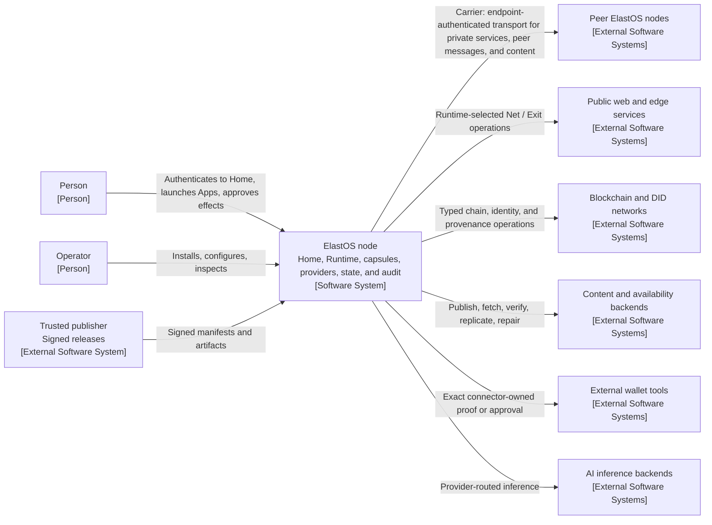

The node is the only ElastOS software system at Level 1. Carrier is not another
top-level system and `elastos://` is not Carrier. The line to peer nodes is the
off-box Carrier relationship; ordinary Apps never receive that transport
authority.

Exit is a typed egress service. Carrier is peer transport. Runtime may reach a
remote Exit over Carrier, but the two responsibilities do not collapse. The
content and key paths carry encrypted objects, sealed key material, and bounded
receipts. A live CEK remains inside reviewed key-release and decrypt custody; it
never enters Runtime, Carrier, or an ordinary App.

## Level 2: Containers

**Question:** What runs inside one ElastOS node, and which container owns each
kind of responsibility?

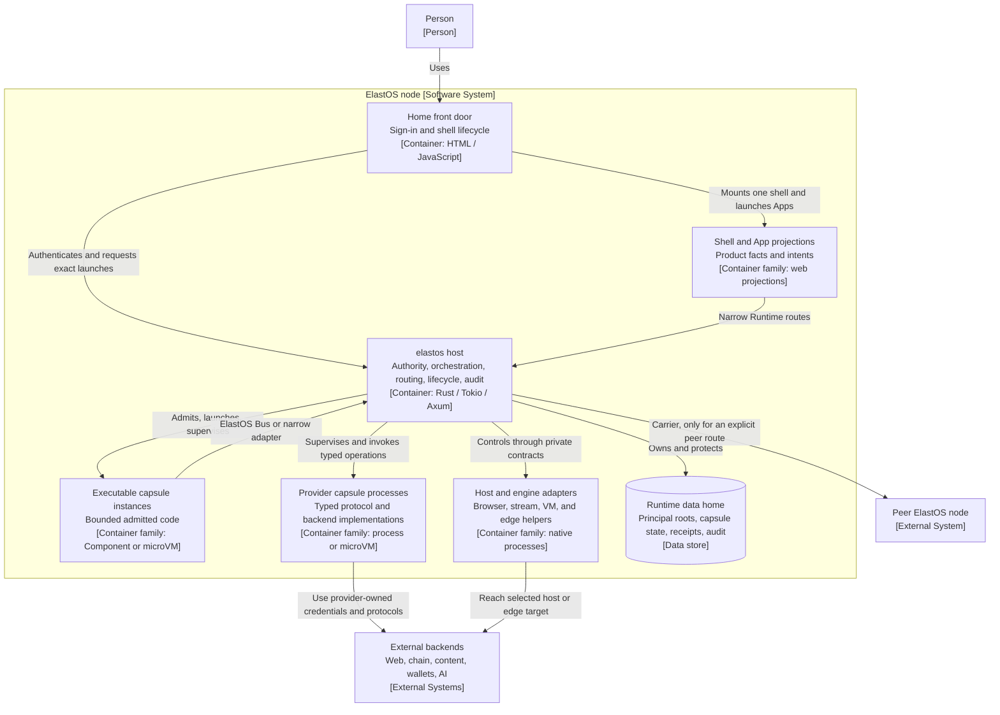

"Container family" groups instances that share one architectural role. It does
not claim they all use the same process or execution substrate. Provider
capsules are containers beside the host, not components inside it. The built-in
Carrier integration is expanded as a host component at Level 3.

Current web projections can reach Runtime through live host adapters such as
`POST /api/provider/:scheme/:op`. That route is an implementation adapter, not
the capsule ABI shown by the `ElastOS Bus or narrow adapter` relationship.

## Level 3: Runtime host components

**Question:** How does the trusted host turn an intent into an authorized local
operation, provider call, or explicit peer route?

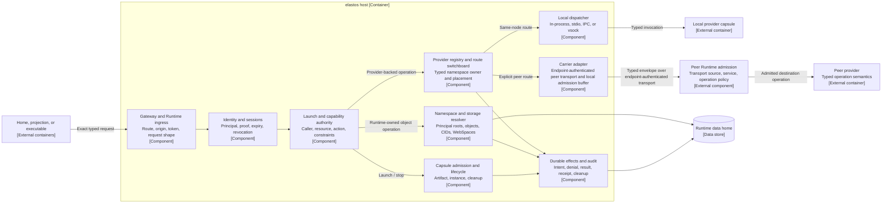

The switchboard owns the fork. A capsule asks for a typed resource and does not
choose a host path, backend, peer, "local," or "Carrier." Local dispatch and an
off-box Carrier route are alternatives. They are not mandatory consecutive
hops.

Source-side authorization does not transfer authority to the peer. The
receiving Runtime separately admits the transport source, target service,
operation, and any application signature, delegation, freshness, or replay
contract required by that provider. Carrier endpoint authentication is one
input to that decision, not application authorship or capability policy.

The collaboration candidate also uses Carrier's authenticated admission path
for a same-endpoint route. Direct messages and Profile updates loop back through
the local registry without opening a network connection. Direct delivery keeps
the same signed envelope and signed acceptance receipt as the remote contract.
This is an implementation detail inside the Runtime boundary, not a
capsule-to-Carrier contract. It is separate from a shared-room `local_only`
buffer, which reports that no remote peer received the item.

## Level 3: Home components

**Question:** What does Home own before an intent reaches Runtime?

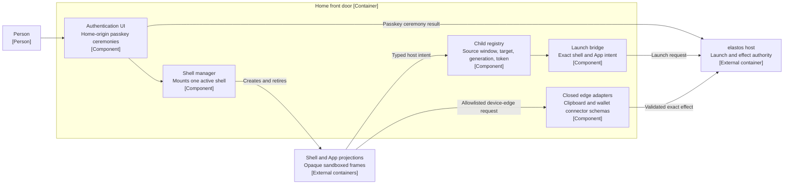

Home can present facts, collect human intent, and perform narrowly allowlisted
device-edge work. It cannot mint its own capabilities, turn a role label into
authority, or pass ambient Home access to a child frame.

## Level 3: Collaboration candidate

**Question:** How do People, Inbox, and Chat share one Runtime-owned Profile and
delivery authority without seeing Carrier topology?

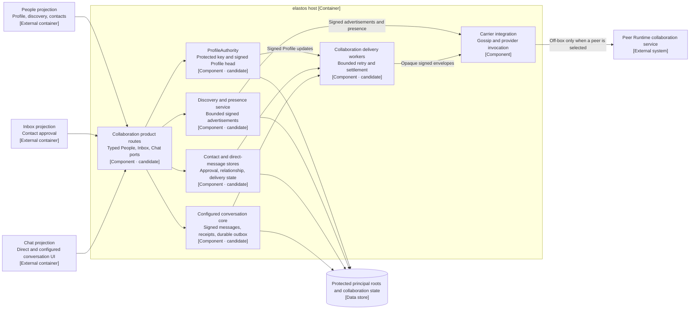

The Profile DID represents the person or contact in collaboration. The Device
DID identifies a delivery endpoint. The collaboration-network signer configures
bootstrap and a bounded default-conversation grant; it is not person, contact,
or message authority. Product projections receive typed facts and outcomes,
never tickets, topics, raw sockets, or endpoint credentials.

## Level 3: Agent Host target

**Question:** Where would an agent harness live without creating a second
authority system?

Every element in this view is **target** unless the surrounding Runtime or
provider already exists independently.

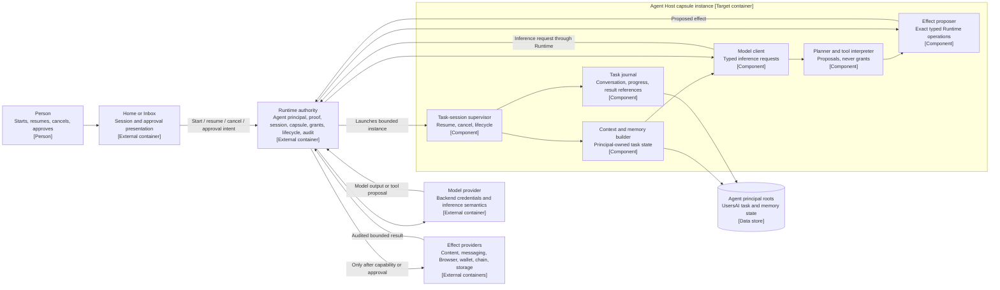

The model, planner, and harness cannot authorize their own effects. Interactive
approval and a future mandate both resolve to Runtime capabilities. Model and
provider credentials remain behind their provider contracts. The complete
Agent Host, public agent identity, private persona and model configuration,
durable approval recovery, and mandate path are not shipped claims;
[the human and agent architecture](../AGENT_ARCHITECTURE.md) owns the session
and authority contract. The [model provider contract](../MODEL_PROVIDER.md)
owns selection, streaming, cancellation, and terminal inference behavior.

## Supporting view: trusted host code ownership

**Question:** Which Rust crates and code areas implement the Level 3 host
responsibilities?

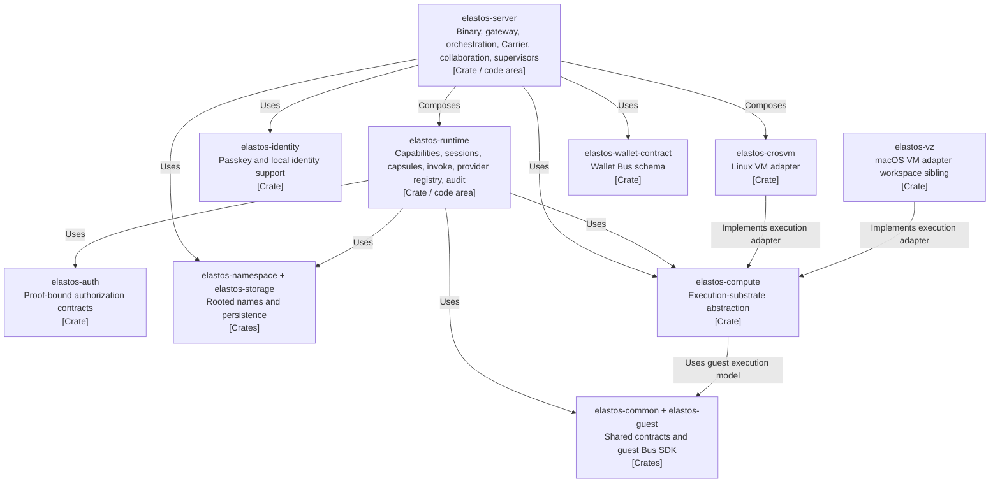

This supporting view stops at crate granularity and does not claim to be a C4
Level 4 code diagram. [The code and product tree](tree.md) locates the relevant
modules; the crate manifests define the exact dependency graph.

## Trust-boundary view

**Question:** Which boundary changes an untrusted intent into an admitted
effect?

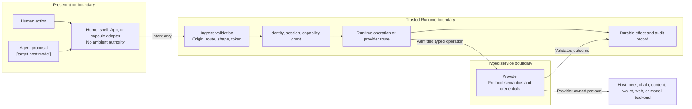

A model, harness, projection, approval card, discovery record, or provider can
propose or carry an operation. Runtime remains the enforcement point. A provider
owns protocol behavior only after Runtime admits the exact caller and operation.

## Identity overlay

**Question:** Which identifiers name authority subjects, people, endpoints,
software, and immutable bytes?

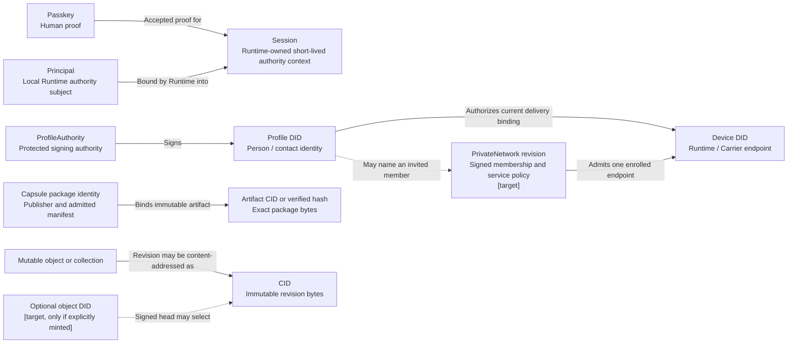

These labels must not be collapsed:

- a passkey is not a DID;
- the human actor, local principal, signed Profile, and Device DID remain
  separate even when one person controls all four;
- a principal is bound into a Runtime-owned session; it does not mint or own
  session authority;
- a Profile DID is not a Device DID or Carrier peer;
- a PrivateNetwork revision uses separate protected policy authority. It may
  name a Profile or Device DID but is not part of ProfileAuthority;
- a CID names immutable bytes, not a person or a live mutable collection;
- a CID does not need its own DID by default;
- "every object has a DID" is not current architecture. An object DID is an
  optional target for a mutable object identity with a signed head;
- no global `@alias` or Contacts-as-DNS authority is shown because this branch
  does not define or verify one.

## Dynamic view: launch

**Question:** How does one launch cross the same authority path for a web
projection, Component, or microVM?

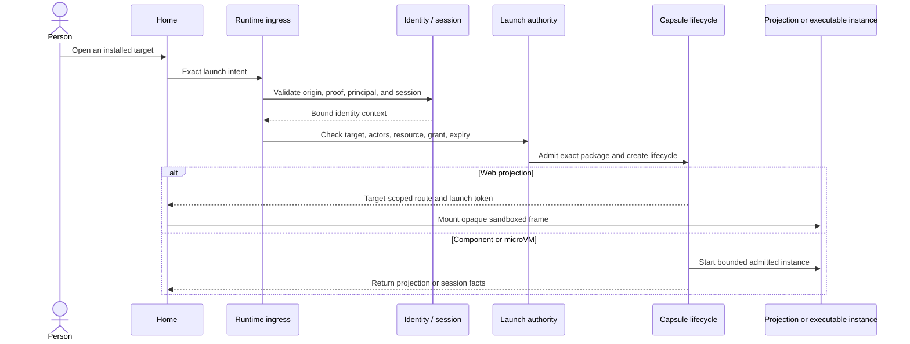

The substrate changes how the target runs, not who grants authority. Source
presence of the Component path does not imply that the first-party UI Apps have
migrated from web projections.

## Dynamic view: typed effect and route choice

**Question:** Where is the local-versus-Carrier decision made?

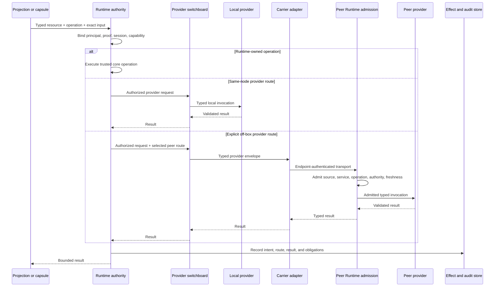

There is no `Caller → Carrier` edge. The caller cannot select a host path,
backend, peer, ticket, socket, or transport. Same-endpoint Carrier loopback,
where a contract requires Carrier admission semantics, stays inside `Router`
and `Carrier` and does not open an off-box connection. For a remote route, the
destination Runtime performs its own admission; the source capability and
authenticated Carrier connection do not silently authorize the destination
provider.

## Dynamic view: configured conversation send

**Question:** How does the collaboration candidate send one message without
exposing Carrier details to Chat?

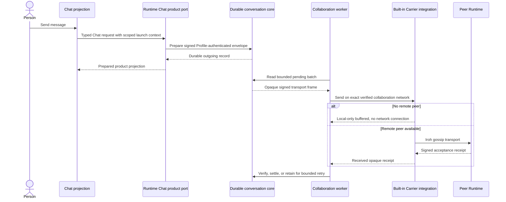

This sequence is the configured shared-conversation path. Direct messages,
contact changes, Profile updates, and discovery have different signed artifacts
and stores, but share Runtime-owned validation, bounded delivery, and settlement
principles.

## Dynamic view: wallet transaction effect

**Question:** Which component coordinates prepare, sign, broadcast, and
reconciliation?

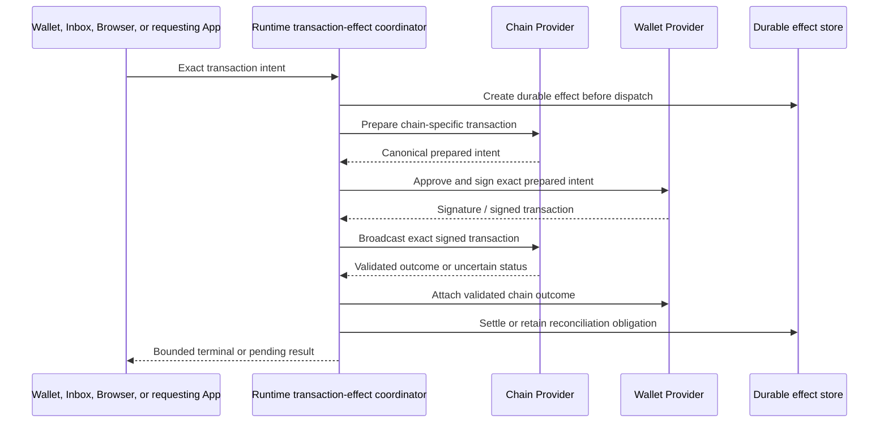

Wallet Provider never calls Chain Provider directly. Runtime owns the durable
transaction effect and coordinates both typed provider contracts.

## Deployment view: one node and one peer

**Question:** Where do the Level 2 containers run on a local installation?

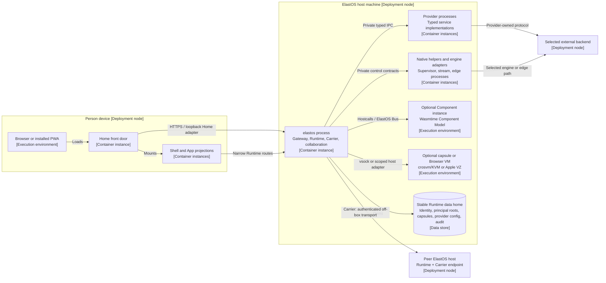

Execution-environment presence is not support evidence. Platform readiness,
installed artifact parity, Browser media/input behavior, and cleanup proof stay
in `state.md` and the target-specific verification documents.

This is a generic deployment view. Assign each target only the roles supported
by its verified host capabilities. A gateway may consume a remote Browser
engine without hosting a local Browser VM.

## Traceability

| View | Canonical evidence and detail |
| --- | --- |
| System context and containers | [`PRINCIPLES.md`](../../PRINCIPLES.md), [`ARCHITECTURE.md`](../ARCHITECTURE.md), [`components.json`](../../components.json) |
| Runtime host | [`elastos-runtime`](../../elastos/crates/elastos-runtime), [`elastos-server`](../../elastos/crates/elastos-server), [Carrier](../CARRIER.md) |
| Home | [Home shell host contract](../HOME_SHELL_HOST_CONTRACT.md), [`capsules/home`](../../capsules/home) |
| Collaboration | [People and conversations](../PEOPLE_CONVERSATIONS.md), [current truth](../../state.md), `elastos-server/src/collaboration_*` |
| Identity | [Glossary](../GLOSSARY.md), [Architecture: identity and object claims](../ARCHITECTURE.md#identity-and-object-claims) |
| Private network and remote services | [Private network](../PRIVATE_NETWORK.md), [Carrier](../CARRIER.md), [Browser capsule](../BROWSER_CAPSULE.md) |
| Agent and model lifecycle | [Human and agent architecture](../AGENT_ARCHITECTURE.md), [Model provider](../MODEL_PROVIDER.md) |
| Protected content and dKMS | [Protected content](../PROTECTED_CONTENT.md), [Carrier](../CARRIER.md), [Principle 15](../../PRINCIPLES.md#15-trust-and-access-must-travel-with-signed-content) |
| Launch and effects | [Capsule model](../CAPSULE_MODEL.md), [Capsule interface contract](../CAPSULE_INTERFACE_CONTRACT.md), [Consequence-aware effects](../CONSEQUENCE_AWARE_EFFECTS.md), [ElastOS Bus WIT](../../elastos/wit/elastos-bus-v1.wit) |
| Wallet effect | [Wallet provider contract](../WALLET_PROVIDER.md), `gateway_transaction_effects.rs` |
| Deployment | [Install guide](../INSTALL.md), [Browser capsule](../BROWSER_CAPSULE.md), [current truth](../../state.md) |
