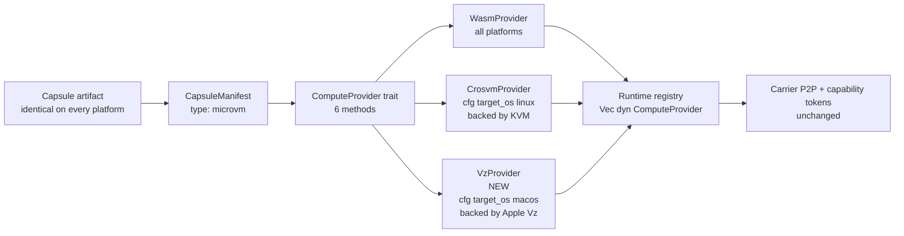

# Apple Virtualization.framework Backend for elastos-runtime

> **Canonical plan document.** This file is the repo-resident copy of the
> Apple Virtualization.framework backend plan. The truthful current macOS
> status lives in [docs/MAC.md](../MAC.md); the support boundary in
> [state.md](../../state.md); the binding principles in
> [PRINCIPLES.md](../../PRINCIPLES.md).


## Why this plan exists

ElastOS's central security thesis is *every capsule in its own hardware-isolated microVM, communicating only through Carrier with explicit capability tokens*. Today that thesis is true on Linux (via KVM + crosvm) and only **partially** true on macOS — Slice B (commit `a02045e`) shipped four "MicroVM" capsules as plain host-binary subprocesses on Mac, which is a quiet downgrade of the isolation contract and a violation of [`PRINCIPLES.md`](../../PRINCIPLES.md) #10 (*One Canonical Path*) and #11 (*Fail Closed, Then Explain*).

Apple's `Virtualization.framework` ("Vz") is the supported native primitive that gives Mac the **same kind** of hardware-enforced isolation Linux has via KVM. Wiring it in as a second `ComputeProvider` backend is the only path that lets Mac become a first-class ElastOS host **without** faking parity ([`state.md` L88, L92–94](../../state.md)).

## Principle anchors this plan must obey

- [`PRINCIPLES.md` #10 *One Canonical Path*](../../PRINCIPLES.md) — Mac gets **one** substrate for `type: microvm` capsules: Vz. No parallel "host-binary on Mac" pseudo-substrate.
- [`PRINCIPLES.md` #11 *Fail Closed, Then Explain*](../../PRINCIPLES.md) — Until Vz lands, MicroVM capsules on Mac must **fail to install** with a clear error pointing at the roadmap, not silently downgrade.
- [`PRINCIPLES.md` #12 *Docs, Code, Tests, and Ops Must Agree*](../../PRINCIPLES.md) — [`components.json`](../../components.json), [`state.md`](../../state.md), `docs/MAC.md`, the `setup --list` output, and the smoke scripts must all tell the same story at every step.
- [`state.md` L92–94](../../state.md) — *"macOS is not yet a truthful full runtime target on this branch... that is the condition for macOS to become a first-class front-door target later without faking Linux parity."* This plan is the named "later."
- [`SECURITY.md`](../../SECURITY.md) — *"Capsules run sandboxed (WASM or microVM) with zero ambient authority."* Vz preserves the microVM substrate label as truthful on Mac.

## Current architecture (audited)

The runtime already abstracts execution substrates through a single trait, so adding a Mac backend is *additive*, not invasive.

The trait surface a Vz backend must implement, in full:

```27:45:elastos/crates/elastos-compute/src/traits.rs
pub trait ComputeProvider: Send + Sync {
    /// Load a capsule from a directory path
    async fn load(&self, path: &Path, manifest: CapsuleManifest) -> Result<CapsuleHandle>;

    /// Start a loaded capsule
    async fn start(&self, handle: &CapsuleHandle) -> Result<()>;

    /// Stop a running capsule
    async fn stop(&self, handle: &CapsuleHandle) -> Result<()>;

    /// Get capsule status
    async fn status(&self, handle: &CapsuleHandle) -> Result<CapsuleStatus>;

    /// Get capsule info
    async fn info(&self, handle: &CapsuleHandle) -> Result<CapsuleInfo>;

    /// Check if this provider supports the capsule type
    fn supports(&self, capsule_type: &CapsuleType) -> bool;
}
```

The current single backend, `CrosvmProvider`, implements those six methods against KVM via crosvm:

```71:79:elastos/crates/elastos-crosvm/src/provider.rs
#[async_trait]
impl ComputeProvider for CrosvmProvider {
    async fn load(&self, path: &Path, manifest: CapsuleManifest) -> Result<CapsuleHandle> {
        if manifest.capsule_type != CapsuleType::MicroVM {
            return Err(ElastosError::Compute(format!(
                "CrosvmProvider only supports MicroVM capsules, got: {:?}",
                manifest.capsule_type
            )));
        }
```

Providers are registered into the runtime as a polymorphic `Vec<Arc<dyn ComputeProvider>>`, with `CrosvmProvider` gated by a platform predicate:

```1857:1876:elastos/crates/elastos-server/src/main.rs
    // Build list of compute providers: WASM + crosvm
    let wasm_provider = Arc::new(WasmProvider::new());
    let base_provider: Arc<dyn ComputeProvider> = wasm_provider.clone();
    let mut compute_providers: Vec<Arc<dyn ComputeProvider>> = vec![base_provider];

    // Add crosvm provider if KVM is available
    if elastos_crosvm::is_supported() {
        match CrosvmProvider::new(CrosvmConfig::default()) {
            Ok(provider) => {
                if let Err(e) = provider.init().await {
                    tracing::warn!("Failed to initialize crosvm provider: {}", e);
                } else {
                    tracing::info!("crosvm provider enabled (KVM available)");
                    compute_providers.push(Arc::new(provider));
                }
            }
```

`is_supported()` is exactly five lines and the only platform-specific dispatch in the crate:

```50:54:elastos/crates/elastos-crosvm/src/lib.rs
/// Check if the system supports crosvm (has KVM).
/// If this returns false, capsule launch will fail hard.
pub fn is_supported() -> bool {
    std::path::Path::new("/dev/kvm").exists()
}
```

The supervisor fails closed when the substrate is missing — exactly the behaviour we want Mac to keep until Vz lands:

```930:933:elastos/crates/elastos-server/src/supervisor.rs
        // VM path — hard require KVM
        if !elastos_crosvm::is_supported() {
            bail!("/dev/kvm not available — crosvm requires KVM. Cannot launch capsule '{name}'.");
        }
```

The `VmConfig` struct that captures everything a launch needs maps cleanly to Vz device classes:

| `VmConfig` field | Apple Vz API |
|---|---|
| `kernel_path` + `boot_args` | `VZLinuxBootLoader` |
| `rootfs_path`, `data_disk_path` | `VZVirtioBlockDeviceConfiguration` |
| `mem_size_mib`, `vcpu_count` | `VZVirtualMachineConfiguration.memorySize` / `.cpuCount` |
| `vsock_cid` | `VZVirtioSocketDeviceConfiguration` |
| `carrier_socket_path` (virtio-console) | `VZVirtioConsoleDeviceConfiguration` |
| `network` (TAP) | `VZNATNetworkDeviceAttachment` / `VZBridgedNetworkDeviceAttachment` |
| `interactive_stdio` | `VZSerialPortConfiguration` |

There is **no field that lacks a Vz equivalent**. That's the architectural permission to proceed.

## Target architecture



Diff vs. today:

- **Add:** `elastos/crates/elastos-vz/` crate (new, `cfg(target_os = "macos")` for all functional code; on Linux it compiles to a stub that mirrors the public surface and reports `is_supported() == false`, matching the same shape `elastos-crosvm` already uses for non-Linux hosts).
- **Add (sibling, cfg-gated):** a second registration block in [`main.rs`](../../elastos/crates/elastos-server/src/main.rs) after L1876, gated by `#[cfg(target_os = "macos")]`. The existing crosvm block at L1862–L1876 is untouched. Linux compiles and runs the same instructions it does today.
- **Add (sibling, cfg-gated):** the bail at [`supervisor.rs:931`](../../elastos/crates/elastos-server/src/supervisor.rs) is wrapped in `#[cfg(target_os = "linux")]` and a parallel `#[cfg(target_os = "macos")]` arm is added checking `elastos_vz::is_supported()`. On Linux the message and behaviour are byte-identical to today's code. No edit to Anders' Linux execution path.
- **Unchanged on Linux:** every capsule, `Carrier`, the capability-token plane, the `ComputeProvider` trait, the runtime API surface, `home`/`system`/`chat-room`/etc., all of [`elastos-runtime`](../../elastos/crates/elastos-runtime/src), the gateway, the trusted source, the install flow. *And* the entire body of [`elastos/crates/elastos-crosvm/`](../../elastos/crates/elastos-crosvm/) — not one line touched. The Linux microVM substrate ships exactly as Anders wrote it.

## Linux untouched: explicit guarantees

This is the constraint the rest of the plan must respect:

1. **No edits to [`elastos/crates/elastos-crosvm/`](../../elastos/crates/elastos-crosvm/)** — neither `vm.rs`, `provider.rs`, `config.rs`, `network.rs`, `rootfs.rs`, `proxy.rs`, nor `lib.rs`. The Linux substrate is preserved as-is.
2. **No edits to the [`ComputeProvider` trait](../../elastos/crates/elastos-compute/src/traits.rs)** — the abstraction is already shaped right. If Phase 0 finds it needs a small extension, that extension is additive (default-implemented methods only) and explicitly re-justified.
3. **All Mac-side dispatch is `cfg(target_os = "macos")` gated.** On a Linux build, `cargo expand` should show no change in the runtime's generated code outside of one new `use` statement for the (stub) `elastos-vz` crate. Phase 1's Linux test deliverable is *"running `cargo test -p elastos-server` on Linux produces byte-identical output to the pre-change commit, modulo build timestamps."*
4. **CI proves it.** A Linux job runs `git diff main -- elastos/crates/elastos-crosvm/ elastos/crates/elastos-runtime/ elastos/crates/elastos-common/ elastos/crates/elastos-compute/` and fails if any of those crates show modifications across the Phase 1–5 work.
5. **No new run-time decision logic on Linux.** The provider registry on Linux still contains exactly `[WasmProvider, CrosvmProvider]`. The Vz crate is not even compiled into the Linux binary (`cfg`-gated dependency in `elastos-server/Cargo.toml`).

If at any phase a change to Linux code is genuinely required, the work stops and the plan is re-reviewed. This is a hard gate, not a guideline.

## Hypervisor trust delta: honest disclosure

For [`PRINCIPLES.md` #11](../../PRINCIPLES.md) — *"no pretending a feature is supported when it is only half-implemented"* — there is one honest delta between the Linux and macOS isolation stories that this plan does not erase:

| | Linux today | macOS after Vz backend |
|---|---|---|
| Hardware isolation primitive | CPU virt extensions (VT-x / SVM / ARM EL2) | CPU virt extensions (Apple Silicon EL2) |
| Hypervisor in the trust boundary | `crosvm` — open source, auditable, vendored | Apple `Virtualization.framework` — closed source, signed and shipped as part of macOS |
| What the runtime trusts | Linux kernel KVM + crosvm code paths | macOS kernel + Apple Vz code paths |
| Code-signing / integrity verification of the hypervisor | Implicit (whatever the user's distro packaging guarantees) | Apple System Integrity Protection + binary signing |

**Net effect:** hardware-level isolation parity is full. The trust *source* differs: on Linux we audit crosvm; on Mac we trust Apple. This is the same trade-off Docker Desktop, OrbStack, and every Mac-targeting VMM accepts. `docs/MAC.md` must disclose this honestly. We do not claim auditable-source parity; we do claim functional isolation parity backed by Apple's documented hypervisor.

This delta does *not* affect:

- The capability-token plane (validation runs in the runtime, identical on both platforms)
- The Carrier transport (identical wire protocol)
- The capsule artifact (bit-identical guest image)
- The fail-closed semantics ([`PRINCIPLES.md` #11](../../PRINCIPLES.md))

## Sequencing

### Pre-Work — Truth restoration (1–2 days, must land before any Vz code)

Required by [`PRINCIPLES.md` #10 + #11 + #12](../../PRINCIPLES.md). The current repo claims something it doesn't ship.

- Revert the darwin entries I added in commit `a02045e` from [`components.json`](../../components.json) for `shell`, `localhost-provider`, `did-provider`, `webspace-provider` — in the `external` section (`darwin-amd64`, `darwin-arm64`) and the `capsules` section (`x86_64-darwin`, `aarch64-darwin`) where present. `webspace-provider` is only in `external`; the other three are in both. These tell the install system *"this MicroVM capsule runs natively on Mac"* when Slice B actually runs them as host-binary subprocesses without microVM isolation — exactly the silent downgrade #11 forbids.
- Add `docs/MAC.md` stating the current truthful Mac story: *the runtime daemon code compiles on Mac for development; MicroVM capsules require Linux today; native Mac host support is the Apple Vz backend project tracked in this plan.*
- Update [`state.md`](../../state.md) *Support boundary* section (L90–95) to reference `docs/MAC.md` and this plan.
- Update [`docs/PC2_CONVERGENCE.md`](../PC2_CONVERGENCE.md) Slice C/D to point at this plan as the named Vz backend project (replaces the bullet *"An Apple Hypervisor.framework substrate. Out of scope here; tracked separately"*).
- **Keep** all other Slice B work — `pid_is_alive` portable check ([`runtime_control.rs`](../../elastos/crates/elastos-server/src/runtime_control.rs); the `kill(pid, 0)` form is strictly better on Linux too, not a regression), `ELASTOS_DATA_DIR` env override ([`sources.rs`](../../elastos/crates/elastos-server/src/sources.rs); used only when explicitly set), bash 3.2 portability in [`scripts/local-carrier-setup-smoke.sh`](../../scripts/local-carrier-setup-smoke.sh), `elastos-crosvm` workspace-compiles-on-Mac patches (the `network_stub.rs` for non-Linux mirrors the public surface only and fails closed if invoked), the `darwin-arm64` platform identity in [`setup.rs`](../../elastos/crates/elastos-server/src/setup.rs) (more honest than the previous `unknown-arm64`), and the universal-platform demo-capsule installs (`chat-room`, `gba-emulator`, `gba-ucity`) which are `platforms: ["*"]` WASM/data capsules and have never relied on a microVM substrate. None of these touch Anders' Linux microVM code path.

Deliverable: PR titled *"Restore Mac substrate truth in components.json + add MAC.md"* — green CI, no behaviour change on Linux, MicroVM capsules on Mac now fail-closed at install rather than silently degrading.

---

### Phase 0 — Scope confirmation (1 week, gated)

Goal: end the phase with a written scope doc that picks the FFI strategy, confirms feature parity, and lists residual unknowns. **No production code in this phase.**

Concretely:

1. **FFI strategy survey.** Pick exactly one of:
   - Existing crate `apple-vz` (if maturity allows)
   - Direct bindings via `objc2` + `objc2-virtualization` (latest)
   - Internal pattern lifted from `tart` (Swift) or `lima` (Go) translated into Rust
2. **Vz feature coverage check.** Confirm with a 50-line throwaway binary that Apple Vz exposes:
   - `VZVirtioSocketDevice` with the same semantics our guest agent needs (the runtime-side bridge in [`carrier_bridge.rs`](../../elastos/crates/elastos-server/src/carrier_bridge.rs) expects vsock-style framing)
   - `VZVirtioConsoleDevice` for the existing virtio-console Carrier socket pattern ([`vm.rs:carrier_socket_path`](../../elastos/crates/elastos-crosvm/src/vm.rs))
   - Linux guest boot via `VZLinuxBootLoader` from our existing `vmlinux` artifact
3. **Kernel-config audit.** Confirm the `vmlinux` artifact we ship boots on Vz on Apple Silicon; identify the minimum config delta if any (e.g., `CONFIG_HYPERV_GUEST` toggles, console=hvc vs ttyS).
4. **Existing-project read.** One-day study of how Tart/Lima implement Linux-guest microVM lifecycle on Vz; capture any non-obvious pitfalls.

Deliverable: `docs/vz-backend/PHASE_0_SCOPE.md` — FFI choice, feature-coverage table, kernel delta list, risk register update, go/no-go recommendation for Phases 1–6.

Phase 0 gate: if any deal-breaker emerges (Vz lacks vsock equivalents, kernel needs full rebuild, FFI bindings absent and 3-month build), this is when the plan stops, scope-creep avoided.

---

### Phase 1 — Scaffold (1 week)

Goal: a new crate compiles, exposes the same public surface as `elastos-crosvm`, is wired into the runtime via cfg-gated additive registration, and runs all six trait methods as stubs. **Nothing in `elastos-crosvm` or any Linux execution path changes.** Nothing boots on Mac yet.

- Create [`elastos/crates/elastos-vz/`](../../elastos/crates/elastos-vz/) crate with `cfg(target_os = "macos")` gating all functional code and the same module shape as `elastos-crosvm` (`config.rs`, `provider.rs`, `vm.rs`, `network.rs` with a `network_stub.rs` for non-macOS — `is_supported() == false` everywhere off-mac, mirroring the pattern already used in [`elastos-crosvm/src/network_stub.rs`](../../elastos/crates/elastos-crosvm/src/network_stub.rs)).
- Mirror the public types: `VzConfig`, `VzProvider`, `RunningVm`, `VmConfig`, `NetworkConfig`, `pub fn is_supported() -> bool`.
- `VzProvider::supports` returns `matches!(capsule_type, CapsuleType::MicroVM)` (same as Crosvm).
- Wire registration into [`main.rs`](../../elastos/crates/elastos-server/src/main.rs) as a **sibling** block after L1876, gated by `#[cfg(target_os = "macos")]`. The existing crosvm block at L1862–L1876 is not touched. Reads as: "Linux compiles crosvm registration; Mac compiles Vz registration; nothing else changes."
- Wrap the [`supervisor.rs:931`](../../elastos/crates/elastos-server/src/supervisor.rs) bail in `#[cfg(target_os = "linux")]` (unchanged behaviour and identical message on Linux) and add a sibling `#[cfg(target_os = "macos")]` arm pointing at `elastos_vz::is_supported()`.
- Existing Linux tests must remain green; a new Linux CI gate diffs the touched-file set against `elastos-crosvm/`, `elastos-runtime/`, `elastos-common/`, `elastos-compute/` and fails if anything in those crates was modified.

Deliverable: `cargo test -p elastos-vz` and the existing Linux suite both green; `cargo build --target aarch64-apple-darwin` succeeds; runtime starts on Mac and logs `"vz provider enabled (Apple Virtualization.framework available)"` but rejects every MicroVM launch with *"vz backend not yet implemented (Phase N)"*. The Linux binary's behaviour is byte-equivalent to the pre-change commit.

---

### Phase 2 — First guest boot (1–2 weeks)

Goal: boot a Linux kernel inside Apple Vz from the runtime, and capture serial console output back into the runtime's tracing layer.

- Implement `VmConfig` → `VZVirtualMachineConfiguration` translation: kernel, command-line, memory, vCPUs, rootfs as `VZVirtioBlockDeviceConfiguration`.
- Implement `RunningVm::start` against Vz instead of spawning `crosvm` (compare [`vm.rs:52–183`](../../elastos/crates/elastos-crosvm/src/vm.rs)).
- Wire serial console output to the same `tracing` target `vm_console` used by Crosvm ([`vm.rs:147–168`](../../elastos/crates/elastos-crosvm/src/vm.rs)) so Mac and Linux logs read identically.
- Reuse the existing `vmlinux` and a minimal rootfs from `~/.local/share/elastos/bin/`.

Deliverable: a new helper command `elastos vm-debug boot --rootfs <path>` boots a Linux guest on Vz, kernel log lines appear in the runtime's tracing output; `kill` reliably stops it.

Risk: kernel config mismatch. Fallback: ship a small Mac-specific arm64 kernel built from the same config + the Vz-relevant toggles identified in Phase 0.

---

### Phase 3 — Virtio plumbing: vsock + console + net + blk (1–2 weeks)

**Status as of `73cd293 + Day-7 commit`**: Phase 3 Day 7 complete. `guest_network: true` capsules now route through a Security.framework-driven entitlement check. New `elastos-vz/src/ffi/entitlement.rs` calls `SecTaskCopyValueForEntitlement` against `com.apple.vm.networking` on the current process, with the result cached in a `OnceLock<bool>` and an `EntitlementOverrideGuard` thread-local for tests. The Vz FFI builder (`elastos-vz/src/ffi/builder.rs`) branches on the check: `vm.network = None` keeps the Day-2 NAT path byte-identical; `vm.network = Some(_)` + entitlement granted attaches a `VZBridgedNetworkDeviceAttachment` with a deterministic MAC from `NetworkConfig.guest_mac`; `vm.network = Some(_)` + entitlement absent surfaces a typed `ElastosError::Compute` naming `com.apple.vm.networking` and `guest_network` and pointing at `docs/MAC.md`. The unconditional bail in `start_capsule_vm_macos` is replaced with `vm_config.network = Some(NetworkConfig::new(&vm_id))` when `manifest.permissions.guest_network` is `true`, mirroring the Linux flow at L1123. Eight new tests cover the surface: entitlement check returns `false` on the unsigned dev binary, override guard round-trips and is RAII; builder produces typed errors on entitlement-absent paths, attaches bridged on entitlement-present paths, and ignores entitlement on NAT-only paths; supervisor populates `vm_config.network` for `guest_network: true` capsules and leaves it `None` otherwise. Linux launch path byte-identical (no protected-crate diff). Outcome log in [`PHASE_3_DAY_7_NOTES.md`](PHASE_3_DAY_7_NOTES.md). Phase 3 closes its core promise: Mac substrate parity with Linux for both NAT-only AND bridged-network capsules (subject to entitlement availability for the latter).

Goal: a guest VM under Vz can speak the same wire protocols a guest under Crosvm speaks. Default networking mode requires **no Apple entitlements** so a normal Mac dev build works out of the box.

- **virtio-vsock**: implement the host side of `VZVirtioSocketDevice`. Validate that the Carrier-bridge protocol used in [`carrier_bridge.rs`](../../elastos/crates/elastos-server/src/carrier_bridge.rs) flows guest↔host without changes to the bridge code.
- **virtio-console**: implement the carrier_socket_path equivalent for the existing virtio-console bridge.
- **virtio-net**: default to `VZNATNetworkDeviceAttachment` (no entitlement required). `VZBridgedNetworkDeviceAttachment` is documented but deferred — it requires the `com.apple.vm.networking` entitlement, which is granted only to apps signed with a Developer ID and a special Apple request. We do *not* depend on bridged mode for the core capsule isolation guarantees; Carrier vsock plumbing carries everything the runtime needs.
- **Carrier port allocation inside Vz NAT**: verify that the runtime's existing Carrier port assignment ([`carrier.rs`](../../elastos/crates/elastos-server/src/carrier.rs)) plays correctly with Vz's NAT range and does not collide with the guest's view of the network. Document the allowed port range in `docs/MAC.md`.
- **virtio-blk**: persistent data disk per [`provider.rs:109–121`](../../elastos/crates/elastos-crosvm/src/provider.rs).

Deliverable: an `elastos-guest`-built test capsule starts under Vz, opens a vsock connection back to the host runtime, exchanges a capability token, makes a `localhost://` storage call, gets the expected response. End-to-end the guest is indistinguishable from a guest under Crosvm.

Risk: vsock semantic deltas (port allocation, half-close behaviour). Fallback: small shim layer in `elastos-vz`'s vsock wrapper.

---

### Phase 4 — First real capsule end-to-end (1 week)

**Status as of `<Phase-4-Day-8 commit>`**: ✅ **Phase 4 complete.** Day 8 closed the final operator-facing observability gap: the typed `VzError` Day 7 plumbed onto `RunningVm::last_vz_error` is now readable via a dedicated supervisor RPC. A new `SupervisorRequest::CapsuleVzError { handle }` variant (`op = "capsule_vz_error"`) returns the structured [`elastos_vz::VzErrorReport`] — a `serde`-derived JSON projection of every `VzError` variant. The report carries `kind_label` (stable telemetry label, e.g. `"vz_internal"` / `"vz_timed_out"` / `"vz_unknown"`) and a human-readable `description` for every variant, plus variant-specific structured fields: `domain` + `code` for `Unknown` (so future / unmodelled Apple variants don't require a binding update to be filterable), and `vm_id` + `budget_secs` for `TimedOut` (so dashboards can size the fleet-wide `VzConfig::stop_timeout` directly). Every optional field is `#[serde(skip_serializing_if = "Option::is_none")]` so legacy dashboards keep working and field presence becomes a typed signal. The dispatcher's `CapsuleVzError` arm uses a three-state outcome enum (`CapsuleVzErrorOutcome::{Found(None), Found(Some(report)), NotFound}`) — `NotFound` maps to `status: "not_found"` (same shape `capsule_status` uses), `Found(None)` to `status: "ok"` with `vz_error` skip-serialised (no cached error / non-Vz backend / pre-stop), and `Found(Some(report))` to `status: "ok"` with the full typed surface. `capsule_status` was also enriched to surface both `last_exit_reason` (Day 7) AND `vz_error` (Day 8) in a single round-trip for stopped Vz capsules — single-query observability. A new `#[doc(hidden)] pub fn set_last_vz_error_for_testing(&mut self, err: VzError)` test hook on `RunningVm` (matching the Day 7 hook pattern) lets supervisor unit tests inject every `VzError` variant without provoking real Apple `NSError`s. 11 new tests: 4 in `error.rs` cover every variant's `to_report` projection + the full serde round-trip with skip-serialise guarantees; 6 in `supervisor.rs` exercise the supervisor method directly (per-variant round-trips, unknown handle, non-Vz / pre-stop) plus the dispatcher end to end through `handle_request(CapsuleVzError)` for `Internal` and `TimedOut` and the `capsule_status` enrichment carrying both Day-7 + Day-8 fields; 1 new test in `vz_shutdown_semantics.rs` pins the JSON wire format for every variant family, asserting per-variant skip-serialise rules + outer `vz_error: None` skip-serialise. The Day-7 wire-format test's struct literals gained the new `vz_error: None` field (struct extension is backward-compatible at the JSON level). Quality gates: `cargo fmt` / `cargo clippy --workspace --all-targets -- -D warnings` clean on Mac and Linux; all tests pass under both `RUST_TEST_THREADS=1` and `=4`; `scripts/check-linux-untouched.sh bcf5a0a` green (the new `VzErrorReport` lives in `elastos-vz`, `ElastosError` in protected `elastos-common` is untouched). With Day 8, the Mac substrate has full feature parity with Linux's per-capsule introspection surface: structured per-capsule error readback, telemetry labels for every terminal state, and stable JSON wire formats for both the alert path (`last_exit_reason`) and the triage path (`vz_error`). Operator runbook + full schema in [`PHASE_4_DAY_8_NOTES.md`](PHASE_4_DAY_8_NOTES.md).

**Status as of `<Phase-4-Day-7 commit>`**: Phase 4 Day 7 complete — the Vz substrate's failure-mode surface is now *structurally typed*, closing the observability-fidelity gap the Day 5 audit flagged. A new public `VzError` enum in `elastos-vz/src/error.rs` mirrors Apple's `VZErrorCode` (mapping the codes Day 5's failure-mode matrix called out — `Internal`, `InvalidConfiguration`, `InvalidState`, `InvalidStateTransition`, `NetworkError`, `OperationCancelled`, `NotSupported`) plus our own synthetic `TimedOut { vm_id, budget }` for Day 6's stop-timeout, plus a forward-compatible `Unknown { domain, code, description }` so codes Apple adds in future macOS revisions surface with the original code preserved (no information loss before the enum learns about them). A `VzError::from_ns_error_parts(domain, code, description)` pure helper does the classification and is unit-tested against every variant. The companion `VzExitReason` enum (`GuestCleanStop` / `HostInitiatedStop` / `StoppedWithError` / `ForcedAfterTimeout`) replaces the FFI-internal `DelegateExit::exit_code()` as the canonical exit-code + telemetry-label source of truth (`exit_code` 0 / 0 / 1 / 137; labels `guest_clean_stop` / `host_initiated_stop` / `stopped_with_error` / `forced_after_timeout`). `VzMachineHandle::start` / `stop` now return `Result<(), VzError>` directly; `run_completion_handler_on_queue` reads `NSError.domain` + `.code` + `.localizedDescription` at the FFI boundary and routes the typed variant through. `RunningVm` caches `last_vz_error: Option<VzError>` and `last_exit_reason: Option<VzExitReason>` on every stop/wait so the supervisor can read structured telemetry without re-parsing strings. `SupervisorResponse` gains an optional `last_exit_reason: Option<String>` field (`#[serde(skip_serializing_if = "Option::is_none")]` so legacy dashboards keep working unchanged); `Supervisor::stop_capsule` returns `Result<Option<String>>` and the dispatcher's `StopCapsule` arm surfaces the label via the new `SupervisorResponse::ok_with_exit_reason` constructor. `capsule_status` populates the same field for stopped Vz capsules still in the `running` map. Six new supervisor unit tests pin the contract: synthetic-capsule injection of every `VzExitReason` variant round-trips through `capsule_status`; `forced_after_timeout` surfaces correctly via `handle_request(StopCapsule)`; `not_found` and not-yet-stopped Vz capsules omit the field. Five new `VzError` unit tests cover the `from_ns_error_parts` classifier (documented variants, unknown codes, non-Vz domains, case-insensitive domain matching, `TimedOut` description contract). One new `delegate_exit_to_reason` unit test (in `lifecycle.rs`) guards the FFI→public mapping. One new integration test in `vz_shutdown_semantics.rs` pins the JSON wire-format contract (skip-serialise on `None` for backward compatibility; every canonical label round-trips). Linux launch path byte-identical (`scripts/check-linux-untouched.sh bcf5a0a` green; `elastos-common::ElastosError` untouched — the typed Vz surface lives in `elastos-vz` and the supervisor reads `RunningVm::last_exit_reason()` directly, no protected-crate change required). Outcome log in [`PHASE_4_DAY_7_NOTES.md`](PHASE_4_DAY_7_NOTES.md).

**Status as of `<Phase-4-Day-6 commit>`**: Phase 4 Day 6 complete — the two specific weak spots the Day 5 audit deferred are now closed. `VzMachineHandle::stop` wraps Apple's `stopWithCompletionHandler:` await with a `tokio::time::timeout` keyed off the new `VzConfig::stop_timeout` field (default 30 s, plumbed through `VzMachineHandle::new`); on timeout the call returns a typed error whose message names the budget, the vm_id, and points at the [Day 6 runbook](PHASE_4_DAY_6_NOTES.md), and the delegate's shared exit channel is signalled with a new `DelegateExit::ForcedAfterTimeout` variant (exit code 137 — matches Linux's `128 + SIGKILL(9)` convention) so any concurrent `wait_for_exit` waiter resolves rather than hangs forever. `BridgeContext::on_terminate: Option<Arc<tokio::sync::Notify>>` gives the supervisor a deterministic teardown observer: `run_carrier_bridge_loop` fires `notify_waiters()` on every loop-exit path (EOF, read/write error, oversized-line teardown) before returning; the Mac supervisor mints a fresh `Arc<Notify>` per capsule, embeds it in the `BridgeContext`, stashes the clone on `RunningCapsule::bridge_terminated`, and `stop_capsule` awaits `notify.notified()` with a 10 s budget after `vm.stop()` resolves (clean exit logs `debug`, missed notify logs `warn` and continues with best-effort cleanup). Best-effort cleanup posture: overlay removal, provider-route unregistration and bridge wait all run regardless of whether `vm.stop()` succeeded — `stop_capsule` returns the typed error after local state is consistent so the next `launch_capsule` of the same name is never blocked by stale on-disk artifacts. Three new lib tests (`drive_stop_with_timeout_*` in `elastos-vz` — pure-future unit coverage of the timeout helper, using `tokio::test(start_paused = true)` for sub-2 s wall-clock), two new supervisor unit tests (`stop_capsule_proceeds_immediately_when_bridge_termination_notify_fires` and `stop_capsule_does_not_block_when_bridge_terminated_is_none`), and two new integration tests (`bridge_on_terminate_notify_*` in `vz_shutdown_semantics.rs`) prove every contract. Linux launch path byte-identical (`scripts/check-linux-untouched.sh bcf5a0a` green; the four protected crates untouched). Outcome log in [`PHASE_4_DAY_6_NOTES.md`](PHASE_4_DAY_6_NOTES.md).

**Status as of `<Phase-4-Day-5 commit>`**: Phase 4 Day 5 complete — the Mac substrate now has documented, tested shutdown semantics and a crash-recovery posture that matches the cooperative single-process nature of `Virtualization.framework`. The shutdown sequence walk in [`PHASE_4_DAY_5_NOTES.md`](PHASE_4_DAY_5_NOTES.md) traces all five teardown layers (`Supervisor::stop_capsule` → `RunningVm::stop` → `VzMachineHandle::stop` → drop chain → bridge task exit) and pins the surface deltas vs Linux: Mac is cooperative-only (no `kill -9` equivalent on a Vz VM), has a small pipe-release race window between `VZVirtualMachine.stop:` resolving and the NSFileHandle config releasing the carrier pipe, and has no zombie-process risk (Vz instances die with the owning process — verified by inspection of Apple's framework headers). Two new integration tests in `elastos-server/tests/vz_shutdown_semantics.rs` prove the graceful-failure surface: (a) an in-flight cross-VM RPC issued against a stalled provider VM that subsequently stops surfaces a typed `ProviderError` (`unhealthy`, `closed`, or `timed out`) within a 30 s budget — never a silent `Ok`, never an infinite block, never a panic; (b) closing the host side of a Carrier socket terminates the `tokio::spawn`ed `run_carrier_bridge_loop` task and a fresh bridge becomes responsive on a new socketpair in <1 s (proves the detached-spawn model has no sticky state). Two new unit tests cover the orphan-detection helper `Supervisor::prune_stale_mac_artifacts` (Mac-only, opt-in, idempotent): it removes orphaned `*.ext4` overlays and `*-carrier.sock` / `*.sock` files from a prior crashed process, preserves unrelated files in the same directories, and a fresh `Supervisor` does not falsely report stale on-disk artifacts as running capsules. The Vz teardown failure-mode matrix documents which `VZErrorCode` values can fire on stop (`VZErrorInternal`, `VZErrorVirtualMachineGuestPaniced`, `VZErrorOperationCancelled`) and how each one is surfaced today (typed `ElastosError::Compute`, no panic). Linux launch path byte-identical (`scripts/check-linux-untouched.sh bcf5a0a` green). Outcome log in [`PHASE_4_DAY_5_NOTES.md`](PHASE_4_DAY_5_NOTES.md).

**Status as of `<Phase-4-Day-4 commit>`**: Phase 4 Day 4 complete — the supervisor's manifest → `VmConfig` plumbing on Mac is now audited at parity with the Linux path, with one Mac-specific fail-closed guard added (oversized memory: a manifest requesting more RAM than the host can satisfy is rejected with an actionable error pointing at `docs/MAC.md`, before any handle is minted or rootfs is copied). The audit table in [`PHASE_4_DAY_4_NOTES.md`](PHASE_4_DAY_4_NOTES.md) records each manifest field's Linux behaviour, Mac behaviour, and decision; only `persistent_storage_mb` remains unhonoured by both supervisor paths (tracked as a workspace-wide ticket, not a Mac-specific gap). A new auto-discovering, visibly-skipping integration test (`elastos-server/tests/vz_supervisor_smoke.rs`) drives the production launch pipeline against a real installed capsule: `SupervisorRequest::LaunchCapsule` → `start_capsule_vm_macos` → `VzProvider::load_with_vm_config` → `CapsuleStatus { handle }` reports running within 30 s → optional `provider_registry.send_raw(scheme, {"op":"ping"})` round-trip → `StopCapsule { handle }` removes the entry within 10 s. CI without an installed capsule visibly-skips with a clear `eprintln!` reason. Linux launch path byte-identical (`scripts/check-linux-untouched.sh bcf5a0a` green). Outcome log in [`PHASE_4_DAY_4_NOTES.md`](PHASE_4_DAY_4_NOTES.md).

**Status as of `<Phase-4-Day-3 commit>`**: Phase 4 Day 3 complete — the capability-bridge dispatch path is now audited under N concurrent microVMs. The cross-VM RPC pipeline from `run_carrier_bridge_loop → handle_request → ProviderRegistry::send_raw → VmCapsuleProvider::send_raw → VmRawBridge::send_raw_blocking` has exactly one shared-state touch per layer: the registry takes a brief read lock and drops it before await; the per-`VmCapsuleProvider` `Mutex<Option<VmIo>>` serializes requests against ONE provider VM but allows full parallelism across DIFFERENT provider VMs. Key audit finding: the host bridge has NO request-id allocator — pairing is by strict order over the per-VM Mutex-protected connection, which is correct precisely because the Mutex enforces single-in-flight per VM. Three new tests prove the composition: (a) two synthetic provider VMs + three consumer tasks issuing 60 RPCs total see every nonce paired with the right provider and the right consumer (no cross-talk, no losses); (b) 100 parallel `PendingRequestStore::create_request` + half-grant / half-deny calls end with exactly 50 Granted + 50 Denied; (c) 1000 parallel `CapabilityManager::validate` calls finish in <5s wall-clock on multi-threaded Tokio (proves the verify path's locks remain read-mostly under load). Zero `elastos-runtime` edits; the audit lives in `elastos-server` tests. Linux launch path byte-identical (`scripts/check-linux-untouched.sh bcf5a0a` green). Outcome log in [`PHASE_4_DAY_3_NOTES.md`](PHASE_4_DAY_3_NOTES.md).

**Status as of `<Phase-4-Day-2 commit>`**: Phase 4 Day 2 complete — the real-kernel multi-VM boot test is promoted from `#[ignore]` to an auto-discovering visible-skip (`ELASTOS_VZ_TEST_KERNEL` / `ELASTOS_VZ_TEST_ROOTFS` env overrides; fallback to `~/.local/share/elastos/bin/vmlinux` and `~/.local/share/elastos/capsules/*/rootfs.ext4`; clear `eprintln!` skip when neither is present, so CI logs every skip rather than silently passing). The Carrier-bridge audit found the detached-`tokio::spawn` model correct for N>1 bridges: each bridge owns its own `UnixStream`, the shared `Arc<ProviderRegistry>` / `Arc<CapabilityManager>` / `Arc<PendingRequestStore>` carry their own internal locking, and bridges never touch the supervisor's `running` RwLock. Three new tests (two in `carrier_bridge.rs`, one in `supervisor.rs`) prove: (a) three bridges sharing one registry isolate per-bridge ping/pong without request-id contamination, (b) dropping one guest endpoint terminates only that bridge's dispatch loop (the other two keep serving), (c) `reap_dead_capsules` does not starve a held-read-lock reader and the reader's snapshot stays stable under the lock. Linux launch path byte-identical (`scripts/check-linux-untouched.sh bcf5a0a` green). Outcome log in [`PHASE_4_DAY_2_NOTES.md`](PHASE_4_DAY_2_NOTES.md).

**Status as of `14dedb9`**: Phase 4 Day 1 complete — N-concurrent Vz VM launches now have audited dispatch-queue ownership. The GCD serial queue moved from `VzProvider` to `VzMachineHandle::new`, so every `VZVirtualMachine` runs on its own per-VM serial queue labelled `elastos-vz.vm.<vm_id>`. This eliminates the only shared-queue contention surface the multi-microVM launch graph would have hit and aligns with Apple's per-VM threading recommendation. The supervisor's `next_cid` allocator is now exposed via a private `allocate_next_cid()` helper and exercised by a 100-parallel-caller uniqueness test on both single- and multi-threaded Tokio runtimes. New `elastos-vz/tests/concurrent_launch.rs` proves three concurrent `load_with_vm_config` calls against ONE provider isolate their errors per VM (no cross-VM state); the opt-in `#[ignore]`d real-kernel variant is the dev escape hatch for end-to-end multi-VM boot. Supervisor-level coverage: three parallel `build_vm_config_for_mac` calls yield distinct CIDs and handles; `reap_dead_capsules` removes only the `is_running() == false` `VzVm` entries (proven with three synthetic capsules in mixed Running/Stopped states). Linux launch path byte-identical (`scripts/check-linux-untouched.sh bcf5a0a` green). Outcome log in [`PHASE_4_DAY_1_NOTES.md`](PHASE_4_DAY_1_NOTES.md).

Goal: a real first-party MicroVM capsule (start with the smallest — `notepad` or `agent`) runs unmodified on Mac via Vz, speaks Carrier to a peer, and satisfies the capability checks. Architecture-preservation milestone.

- Take the existing capsule rootfs artifact (no rebuilds, no manifest edits).
- Boot it through `VzProvider::load → start`.
- Run it through the smoke flow from [`scripts/local-carrier-setup-smoke.sh`](../../scripts/local-carrier-setup-smoke.sh) extended to Mac.
- Validate: capability tokens validate end-to-end, Carrier message round-trips to a Linux peer.

Deliverable: short demo capture showing an unmodified ElastOS MicroVM capsule running in real Vz isolation on a Mac, talking via Carrier to a Linux peer. This is the "architecture parity proved" milestone.

---

### Phase 5 — Hardening + Linux smoke parity on Mac (1–2 weeks)

Goal: the Mac substrate is as reliable as the Linux substrate for the same workloads.

- Clean shutdown via `VZVirtualMachine.stop` (compare `RunningVm::stop` [`vm.rs:186–254`](../../elastos/crates/elastos-crosvm/src/vm.rs)). SIGKILL fallback equivalent.
- Crash recovery: orphaned VM detection on runtime restart.
- Resource limits, vsock-CID allocation correctness across multiple concurrent VMs.
- Port the Linux smoke suite to Mac: `local-carrier-setup-smoke`, `home-frontdoor-smoke`, `chat-wasm-native-interop-smoke`. Each runs end-to-end on Mac with the Vz backend; each is `green` in CI on an Apple-Silicon GitHub Actions runner.
- Performance baseline document: boot latency, throughput vs Linux; declare honest deltas in `docs/MAC.md`.

Deliverable: `just verify` ([`state.md` L31](../../state.md)) and the public-install smoke set ([`state.md` L40–42](../../state.md)) green on macOS, with a one-pager of perf/feature deltas vs Linux.

---

### Phase 6 — Ship (1 week)

Goal: restore the manifests honestly, code-sign + notarize the macOS binary, update docs, ship the release.

- **Code-sign and notarize the macOS binary.** Apple requires Developer ID code signing + notarization for any binary that uses `Virtualization.framework` in production (the runtime entitlement chain depends on it). Add a `just release-mac` recipe that signs with the project's Developer ID Application certificate, includes the hardened runtime, the `com.apple.security.virtualization` entitlement, and submits for notarization via `notarytool`. This is a release-pipeline change only, not a runtime code change.
- **Declare the supported macOS minimum version** in `Info.plist` / build settings. Phase 0 confirms the exact floor; expected `macOS 12.0+` for Apple Silicon (`Virtualization.framework` Linux-guest support matured here). Older macOS = `is_supported()` returns false; capsule launch fails closed with the standard message.
- **Apple Silicon first.** Ship `darwin-arm64` in Phase 6. `darwin-amd64` (Intel Mac via Vz) is documented as a future deliverable; not in initial scope.
- **Restore the darwin entries** in [`components.json`](../../components.json) — this time *truthfully*, because the capsules now run inside real microVMs. Includes `darwin-arm64` (and `darwin-amd64` only when Intel Mac is added) for every MicroVM-typed capsule whose Linux artifact boots on Vz.
- Update [`state.md`](../../state.md) *Support boundary* to add macOS (`aarch64-apple-darwin`) as a truthful full-runtime target.
- Update [`docs/PC2_CONVERGENCE.md`](../PC2_CONVERGENCE.md) — close out Slice C/D for macOS platform identity.
- Release notes: *"ElastOS on macOS now runs every MicroVM capsule in hardware-isolated microVMs via Apple Virtualization.framework. Architecture parity with Linux: same capsules, same Carrier, same capability tokens, same isolation guarantees. Honest delta documented: hypervisor trust source differs (Apple-signed Vz vs vendored crosvm)."*
- Add a [`PRINCIPLES.md` #10](../../PRINCIPLES.md) audit line: "MicroVM substrate is now `crosvm + KVM` on Linux, `Apple Vz` on macOS — one canonical path per platform, no soft alternates."

Deliverable: tagged release; signed and notarized Mac binary; smoke green; docs match code.

## Risk register

| Risk | Severity | Detected in phase | Fallback |
|---|---|---|---|
| Vz lacks an API equivalent for some virtio device we depend on | High | Phase 0 | Stop here; do not proceed. Revisit only when Apple ships the equivalent. |
| Existing `vmlinux` arm64 kernel doesn't boot on Vz unmodified | Medium | Phase 0–2 | Build a small Mac-targeted arm64 kernel with the minimum config delta. |
| Rust↔ObjC FFI maturity gaps (missing `objc2` bindings) | Medium | Phase 0 | Either contribute upstream or hand-write thin Swift shim with C ABI. |
| Vsock semantic deltas vs Linux (no public CID API on Vz; host-side connection per-VM) | Low (reclassified from Medium after Phase 0 — see [`PHASE_0_SCOPE.md`](PHASE_0_SCOPE.md) §D pitfall #5) | Phase 3 | Shim layer in `elastos-vz`; `cfg(target_os = "macos")` arm in `elastos-server/src/vm_provider.rs` opens a `VZVirtioSocketConnection` instead of `AF_VSOCK`. Linux path at L177 byte-identical. |
| No content-addressed `darwin-arm64` vmlinux artifact today (`linux-arm64` uses host-kernel-copy strategy per `components.json`) | Medium | Phase 6 | Phase 2 prototypes with Ubuntu cloud arm64 kernel; Phase 6 picks one of {build same 6.1.59 source for arm64; pin Ubuntu LTS arm64 checksum}. See [`PHASE_0_SCOPE.md`](PHASE_0_SCOPE.md) §C.3. |
| Initrd compression compatibility (Vz dislikes zstd; LZ4 and gzip work) | Low | Phase 2 / future capsules | Detect compression magic before boot; reject zstd with a clear error. Current microVM capsules are direct-rootfs without initrd. |
| `elastos-server/src/vm_provider.rs` uses Linux-only `AF_VSOCK` — adding a Mac arm expands Phase 3 surface by ~80 LOC; file is outside the protected-crate list so the Linux-untouched gate still holds, but it is a real edit | Medium | Phase 3 | Plan accommodates: `cfg(target_os = "macos")` arm at L81–85 calls into `elastos-vz`'s `VsockTransport` adapter; Linux arm at L177 stays byte-identical. |
| Apple-Silicon-only initially (no x86 Mac) | Low | Phase 0 | Ship `darwin-arm64` first; x86 is small follow-up. |
| Perf delta materially worse than Linux | Low | Phase 5 | Document honestly per principle #12; accept; revisit later. |
| Phase 0 reveals 12+ week scope, not 6–10 | Low | Phase 0 | Replan or defer; sunk cost = 1 week. |
| Apple Developer ID / notarization credentials not available to the team | Medium | Phase 6 | Block release-binary path until credentials secured; dev builds work locally without signing. |
| `com.apple.vm.networking` entitlement needed for some future bridged-network use case | Low | Phase 3 / future | Defer bridged mode; document. Core capsule isolation does not depend on it. |
| Linux-untouched gate trips because a phase legitimately needs to extend `ComputeProvider` | Medium | Any phase | Stop, re-review plan; any trait extension is default-implemented and re-justified before being merged. |

## Files: created vs modified

**Created**

- `elastos/crates/elastos-vz/Cargo.toml`
- `elastos/crates/elastos-vz/src/lib.rs`
- `elastos/crates/elastos-vz/src/config.rs`
- `elastos/crates/elastos-vz/src/provider.rs`
- `elastos/crates/elastos-vz/src/vm.rs`
- `elastos/crates/elastos-vz/src/network.rs` + `network_stub.rs`
- `elastos/crates/elastos-vz/src/ffi/` (per Phase 0 choice)
- `docs/MAC.md`
- `docs/vz-backend/PHASE_0_SCOPE.md` (Phase 0 deliverable)
- `scripts/mac-vz-smoke.sh` (Phase 5)

**Modified**

- [`components.json`](../../components.json) — Pre-Work removes false darwin entries; Phase 6 restores truthful ones.
- [`elastos/Cargo.toml`](../../elastos/Cargo.toml) — add `elastos-vz` to workspace members.
- [`elastos/crates/elastos-server/Cargo.toml`](../../elastos/crates/elastos-server/Cargo.toml) — add `elastos-vz` as optional/platform-conditional dep.
- [`elastos/crates/elastos-server/src/main.rs`](../../elastos/crates/elastos-server/src/main.rs) (~10 lines at L1862) — sibling registration block for Vz.
- [`elastos/crates/elastos-server/src/supervisor.rs`](../../elastos/crates/elastos-server/src/supervisor.rs) (L931) — generalize bail message.
- [`state.md`](../../state.md) — Support boundary section.
- [`docs/PC2_CONVERGENCE.md`](../PC2_CONVERGENCE.md) — close Slice C/D, link to this plan.
- [`ROADMAP.md`](../../ROADMAP.md) and [`TASKS.md`](../../TASKS.md) — track this work.
- The Linux smoke scripts in [`scripts/`](../../scripts/) — make Mac targets parallel to Linux ones.

**Unchanged**

- Every capsule under [`capsules/`](../../capsules/).
- All of [`elastos/crates/elastos-runtime/`](../../elastos/crates/elastos-runtime/), [`elastos/crates/elastos-common/`](../../elastos/crates/elastos-common/), [`elastos/crates/elastos-compute/`](../../elastos/crates/elastos-compute/) (excepting any small `traits.rs` improvements that fall out of Phase 0).
- All of [`elastos/crates/elastos-crosvm/`](../../elastos/crates/elastos-crosvm/).
- The Carrier transport, the capability-token machinery, the gateway, the trusted source.

## Success criteria

1. [`just verify`](../../state.md) green on `aarch64-apple-darwin`.
2. Every smoke listed under *What is proven* in [`state.md`](../../state.md) (L29–50) has a passing Mac variant.
3. The same `chat`, `notepad`, `agent`, `did-provider`, `localhost-provider`, `webspace-provider`, `shell` artifacts run on Mac and Linux **with identical isolation guarantees**, no platform-specific manifest entries beyond `release_path`.
4. [`components.json`](../../components.json) `darwin-arm64` entries are truthful — they refer to capsules that run in real microVMs via Vz, not host-binary subprocess workarounds.
5. [`docs/MAC.md`](../MAC.md), [`state.md`](../../state.md), and the runtime's `setup --list` output agree on the Mac story.

## What I'm asking you to confirm before any work starts

1. **Pre-Work is non-optional and lands first.** This is the principled fix to the Slice B compromise. Even if Phase 0+ is deferred indefinitely, Pre-Work should land within days because the current `components.json` violates principles #10 and #11 today.
2. **Phase 0 is funded as one focused week of research.** Its only artifact is `docs/vz-backend/PHASE_0_SCOPE.md`. After it lands you can decide Phases 1–6 with eyes open.
3. **Phases 1–6 are a real 6–10 week project** — staffed when you're ready. Not a side-of-desk effort.